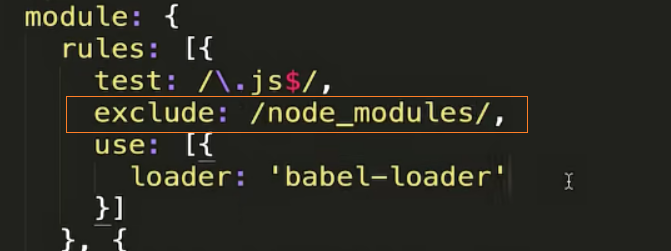

# webpack 实战
## webpack 性能优化 
### 提升 webpack 打包速度
1. `webpack` 版本越新，打包的效果肯定更好

2. 尽可能让 `loader` 的作用范围少

**exclude & include**
1. `exclude`：不需要处理的文件
2. `include`：需要处理的文件

降低 `loader` 被频发去执行的频率, 在转化或编译的过程被更少量的执行 `loader`

3. `Plugin` 尽可能精简并确保可靠
可以使用 `css-minimizer-webpack-plugin`这个插件对 CSS 文件进行代码的压缩，效果包括压缩、去重

其实这个插件只在生产环境有用, 在开发环境下我们是不需要对代码进行压缩的, 因为在开发环境代码只需要我一个人用

4. 使用 `DllPlugin` 提到打包速度

