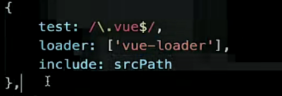

<!-- # webpack 实战
## webpack 性能优化 
### 提升 webpack 打包速度
1. `webpack` 版本越新，打包的效果肯定更好

2. 尽可能让 `loader` 的作用范围少

**exclude & include**
1. `exclude`：不需要处理的文件
2. `include`：需要处理的文件


降低 `loader` 被频发去执行的频率, 在转化或编译的过程被更少量的执行 `loader`

3. `Plugin` 尽可能精简并确保可靠
可以使用 `css-minimizer-webpack-plugin`这个插件对 CSS 文件进行代码的压缩，效果包括压缩、去重

其实这个插件只在生产环境有用, 在开发环境下我们是不需要对代码进行压缩的, 因为在开发环境代码只需要我一个人用

4. 使用 `DllPlugin` 提到打包速度 -->

## webpack 性能优化
### 
优化思路: 
* 当前构建速度如何? 
* 如果慢, 是哪里慢?
 * `webpack` 多个环节如何分析 ?

`spaed=measure-webpack-plugin` 插件

### 构建速度优化 - 利用计算机多核优化构建
* js 是单线程, 是串行
* 电脑是多核, 是并行(更快)

`thread-loader`: 把 `loader` 以**多线程**的方式运行

```shell
npm install thread-loader -D
```

具体写在某一个构建耗时比较大的 `loader` 的后面

`webpack.config.js`
```js{9-14}
module.exports={
  ...
  module:{
    rules:[
      {
        test:/.js$/,
        exclude: /node_modules/
        use:[
          {
            loader:'thread-loader',
            options:{
              workers: 4 // 启动 4 核
            }
          },
          {
            loader:'babel-loader'
            ...
          }
        ]
      }
    ]
  }
}
```
那么多进程一定快吗? 
* 多进程启动时间大约 `600ms`
* 进程通信额外耗时

所以使用在对耗时比较大的 `loader` 作用比较明显

### 构建速度优化 - 使用缓存提升二次构建速度
注意是二次, 因为第一次缓存是没有的

缓存原理:
* 当文件变化时, 只针对**变化的依赖**进行编译


**缓存配置:**
* 缓存模式: `memory`, `filesystem`
* 禁用缓存: `cache: false`
```js
module.exports={
  ...
  cache:false
}
```
* memory : 只在开发者模式生效, 开发者模式**默认生效**


**缓存配置 - `filesystem`** 持久化缓存
* `type`: 缓存类型
```js
module.exports={
  ...
  cache:{
    type:'filesystem' // 改成持久化缓存
  }
}
```
* `buildDependencies`: 构建额外依赖代码, 推荐 `config:[__filename]`
```js
module.exports={
  ...
  cache:{
    type:'filesystem', // 改成持久化缓存
    config:[__filename]
  }
}
```
* `cacheDirectory`: 缓存目录, 默认 `node_modules/.cache/webpack`
* `name`: 缓存名称, 创建隔离独立的缓存
```js
module.exports={
  ...
  cache:{
    type:'filesystem', // 改成持久化缓存
    config:[__filename],
    name: 'index'
  }
}
```
* `version`: 缓存版本, 不同的版本不能使用
```js
module.exports={
  ...
  cache:{
    type:'filesystem', // 改成持久化缓存
    config:[__filename],
    name: 'index',
    version:'index_1'
  }
}
```



