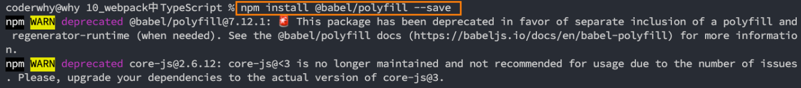
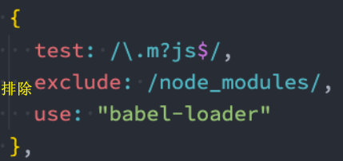

# webpack 入门
`webpack` 是一个**模块打包工具** ,当 `webpack` 处理应用程序时，它会在内部从一个或多个入口点构建一个 **依赖图**(dependency graph)，然后将你项目中所需的每一个模块组合成一个或多个 `bundles`，它们均为静态资源，用于展示你的内容

## 搭建 webpack 环境
1. `npm init` 初始化项目, 生成 `package.json` 文件
2. 创建 `src/index.js` 入口文件
3. 创建 `public/index.html`
4. 创建 `webpack.config.js` 配置文件填入配置
5. 执行 `npm install  webpack webpack-cli` **安装 webpack**
6. `package.json` 文件的 `scripts` 配置项 配置 `build` 命令, `webpack`
7. 执行 `npm run build` 进行打包构建

#### 核心概念
* `entry` : 入口模块文件路径
* `output` : 输出 bundle 文件路径
* `module` : 模块, webpack 构建对象
* `bundle` : 输出文件 webpack的构建产物
* `chunk` :  中间件, webpack 构建的中间产物(不是直接引入,比如`import './test.js'`, 而是使用 `import('./test.js')` 的方式异步引入..
* `loader` : 文件转化器  (比如通过 vue-loader 把 .vue 文件转换成浏览器认识的 .js 文件)
* `plugin` : 插件, 在 webpack 生命周期执行特定任务

#### 配置文件 *
`webpack.config.js` 配置文件, 编写具体的配置内容
```js
const path = require('path')
module.exports = {
  entry:'./src/index.js', // 入口文件路径
  output:{                // 输出 bundle 文件路径
    path: path.resolve(__dirname, 'dist'), // 必须 绝对路径
    filename:'bundle.js' // 文件名称
  }
}
```

如果配置文件的名字不是 `webpack.config.js`, 该如何打包? 
* 命令: `webpack --config xxxx`


默认的 `mode` 是 `production`, 打包出的文件会被压缩。但如果 `mode` 设置成 `development`的时候,  那么打包出的 `bundle.js`是一段没有被压缩的代码


## Loader
`loader` 就是一个打包的方案, `webpack` 知道对于 `js` 文件应该如何进行打包, webpack 不能识别非js结尾的文件后缀模块, 那本身 `webpack` 是不知道对于其他文件是该如何处理的, 但是 `loader` 知道, 所以 `webpack` 可以去求助 `loader` 就可以了

所以只要看到引入的模块结尾呢不是 `.js`文件, 这个时候要想到使用 `loader`了, 可以这么理解

* **module.rules 的配置如下：**

### 用下 file-loader
`src/index.js`
```js
const avatar = require('./avatar.jpg') 
// 引入了 .jpg 文件, 但 webpack 无法打包非.js后缀名的文件, 所以需要配置一下对应的 loader
// 可以求助 file-loader 帮助 webpack 进行打包
const image = new Image()
image.src = avatar
const root = document.getElementById('root')
root.appendChild(image)
```

`webpack.config.js`
```js
module.exports = {
  ...
  module:{
    rules:[
      {
        test:/\.jpg$/,
        use:{
          loader:'file-loader'
        }
      }
    ]
  }
}
```
安装 `file-loader` : `npm install file-loader -D`

最后执行 `npm run build` 进行打包 


结果: 图片文件被输出到打包后 `dist` 文件夹中

### 使用 Loader 打包静态资源 (图片篇)
续上面的内容, 之前使用 file-loader 打包出的图片文件, 名字非常的乱, 有一套随机的字符串组成

现在使用 **`placeholder` 占位符**, 对打包后的图片资源的文件名做一些处理

`webpack.config.js`
```js{9-11}
module.exports = {
  ...,
  module:{
    rules:[
      {
        test: /\.jpg}png|gif$/,
        use:{
          loader: 'file-loader',
          options:{
            // placeholder 占位符
            name:'[name]_[hash].[ext]' // 原来的文件名.原来的后罪名
          }
        }
      }
    ]
  }
}
```

又想让图片打包到一个叫 `images` 的文件夹里面
```js{9-11}
module.exports = {
  ...,
  module:{
    rules:[
      {
        test: /\.jpg}png|gif$/,
        use:{
          loader: 'file-loader',
          options:{
            // placeholder 占位符
            name:'[name]_[hash].[ext]', // 原来的文件名.原来的后罪名
            outputPath: 'images/'  // 打包到 images 文件夹下面
          }
        }
      }
    ]
  }
}
```
### url-loader
`url-loader` 跟 `file-loader` 不一样, 他会把我们的图片转化成一个 `base64` 的字符串然后直接放到我们的 `bundle.js` 里面, 而不是直接生成一个文件

实际的作用: 
* 因为直接打包到 `js` 文件里面, 那么实际上只要加载对应的 `js` 文件图片就可以出来了, 他不用在额外请求一个图片的地址了, 生了一次 `http` 请求, 但如果这个图片文件特别的大, 那么打包出来的 `js` 文件也会特别的大, 那么加载这个 `js` 文件的时间就会很长, 所以有可能一开始很长的时间里面页面上什么东西都显示不出来, 所以这个 `url-loader` 最佳的使用方式是什么呢? 

* 如果一个图片非常的小, 比如 1,2 KB, 那么这个图片以 `base6`4 的形式打包到 js 文件里面, 是一个非常好的选择, 没必要让这些图片再发一个 http 的请求, 浪费资源
但如果这个图片很大, 那么可以把图片打包到 dist 目录下, 不要打包到 bundle.js 文件里面, 这样更合适, 因为可以让bundle.js 快速的加载完, 页面可以快速的显示出来,  不然的话 bundle.js 会一下子变得很大, 那加载它时间很长, 页面很久才能显示出来

使用方式: 
`webpack.config.js`
```js{9-11}
module.exports = {
  ...,
  module:{
    rules:[
      {
        test: /\.jpg}png|gif$/,
        use:{
          loader: 'url-loader',
          options:{
            name:'[name]_[hash].[ext]', 
            outputPath: 'images/', 
            limit : 2048 
            // 如果图片小于 2048 字节即小于 2kb 的时候, 那么这些图片就会直接以 base64 的形式打包到 bundle.js 文件里面
            // 否则会在 dist 目录下生成一个图片文件
          }
        }
      }
    ]
  }
}
```

### 使用 Loader 打包静态资源 (样式篇)
想要打包 .css 文件, 需要用到两个 loader : `style-loader` , `css-loader`

`webpack.config.js`
```js{16-19}
-module.exports = {
   ...,
  module:{
    rules:[
      {
        test: /\.jpg}png|gif$/,
        use:{
          loader: 'url-loader',
          options:{
            name:'[name]_[hash].[ext]', 
            outputPath: 'images/', 
            limit : 2048 
          }
        }
      },
      {
        test:/\.css$/,
        use:['style-loader','css-loader']  
      }
    ]
  }
}
```

安装
```shell
npm install css-loader style-loader -D
```

`css-loader` 的作用:
* `css-loader` 会帮我们解析出几个 `css` 文件之间的关系, 最终把这些 `css` 文件**合并成**一段 `css`

`style-loader` 的作用: 
* 将 `css-loader` 合并出 `css` 之后, `style-loader` 会把这段内容**通过 `style` 标签挂载到页面的 `head` 部分**


### sass-loader 
`sass-loader` 加载 Sass/SCSS 文件并将他们编译为 CSS

[sass-loader 官网 https://webpack.docschina.org/loaders/sass-loader/](https://webpack.docschina.org/loaders/sass-loader/)

安装 `sass-loader`和 `sass`
```shell
npm install sass-loader sass --save-dev
```

webpack.config.js
```js
-module.exports = {
   ...,
  module:{
    rules:[
      ...,
      {
        test:/\.scss$/,
        use:['style-loader','css-loader', 'scss-loader']  
      }
    ]
  }
}
```

**注意** : loader 的执行顺序是**从下到上(或者 从有到左)**, 所以咱们需要先使用 `sass-loader` 把 `scss` 翻译成 `css` 代码之后,  给到 `css-loader`, 然后都处理好了再给 `style-loader`挂载到页面上

### postcss-loader + autoprefixer 兼容浏览器前缀
作用: 可以添加一些浏览器前缀 , 配合 `autoprefixer` 插件自动补齐 CSS3 前缀


[postcss-loader 官方文档](https://webpack.docschina.org/loaders/postcss-loader/)

为了使用本 loader，你需要安装 `postcss-loader 和 postcss`：
```shell
npm install  postcss-loader postcss -D
```

还需要安装过 `autoprefixer` 插件
```shell
npm install autoprefixer -D
```

```js
module.exports = {
   ...,
  module:{
    rules:[
      ...,
      {
        test:/\.css$/,
        use:[
          'style-loader',
          'css-loader',
          {   // <- 开始看
            loader: 'postcss-loader',
            options:{
              postcssOptions:{
                plugins: [
                  [
                    'autoprefixer',
                    {
                      // 选项
                    }
                  ]
                ]
              }
            }
          }  // 看到这儿
        ]  
      }
    ]
  }
}
```

并且必须需要在 `package.json` 去配置 `browserslist` 选项(哪些浏览器要支持): 
```json
{
  ...
  ...
  "browserslist":[
    "last 10 Chrome versions", 
    "last 5 Firefox versions",
    "Safari >= 6",
    "ie> 8"
  ]
}
```
如果想要配置在 `webpack.config.js` 里面 
```js
module.exports = {
   ...,
  module:{
    rules:[
      ...,
      {
        test:/\.css$/,
        use:[
          'style-loader',
          'css-loader',
          {   // <- 开始看
            loader: 'postcss-loader',
            options:{
              postcssOptions:{
                plugins: [
                  [
                    'autoprefixer',
                    {                     //  <- 名字要写成 browsers, 一定要切记注意
                      "browsers":[
                        "last 10 Chrome versions", 
                        "last 5 Firefox versions",
                        "Safari >= 6",
                        "ie> 8"
                      ]
                    }
                  ]
                ]
              }
            }
          }  // 看到这儿
        ]  
      }
    ]
  }
}
```
<!-- 或者 创建 `postcss.config.js`配置文件
```js
module.exports = {
  plugins:[
    require('autoprefixer')
  ]
}
``` -->


### css-loader 补充
1. `css-loader` 的配置项 : `importLoaders`

`webpack.config.js`
```js{13}
module.exports = {
   ...,
  module:{
    rules:[
      ...,
      {
        test:/\.scss$/,
        use:[
          'style-loader',
          {
            loader: 'css-loader',
            options:{
              importLoaders: 2
              // 通过 @import 引入的 sass 文件 , 引入之前呢也要去走2个loader , 也就是 postcss-loader 和 sass-loader
              // 这样可以保证无论是在js 里面直接引入 sass 这种文件, 还是在 sass 文件里面再去用 @import 引入了其他的 sass 文件, 都会有从下到上引入所有的 loader
            }
          }
          'scss-loader',
          'postcss-loader'
          ]  
      }
    ]
  }
}
```

2. **模块化的 `css`**
`webpack.config.js`
```js{14}
module.exports = {
   ...,
  module:{
    rules:[
      ...,
      {
        test:/\.scss$/,
        use:[
          'style-loader',
          {
            loader: 'css-loader',
            options:{
              importLoaders: 2,
              modules: true  
            }
          }
          'scss-loader',
          'postcss-loader'
          ]  
      }
    ]
  }
}
```

那么可以使用这种语法, 让样式独立

### 打包字体文件
`webpack.config.js`
```js
module.exports = {
   ...,
  module:{
    rules:[
      ...,
      {
        test:/\.(eot|ttf|svg|woff)$/,
        use:[
          'file-loader'  
        ]
      }
    ]
  }
}
```

## Plugins
可以在 `webpack` 运行到某一时刻(生命周期)的时候, 帮我们做一些事情
### HtmlWebpackPlugin
`HtmlWebpackPlugin` 这个插件会在打包结束后, 自动生成一个 `HTML` 文件, 并把打包生成的 `js` 文件自动引入到这个 `html` 文件中 

[HtmlWebpackPlugin 官方文档](https://webpack.docschina.org/plugins/html-webpack-plugin/)

安装
```shell
npm install --save-dev html-webpack-plugin
```

```js
const HtmlWebpackPlugin = require('html-webpack-plugin');
const path = require('path');

module.exports = {
  entry: 'index.js',
  output: {
    path: path.resolve(__dirname, './dist'),
    filename: 'bundle.js',
  },
  ...
  plugins: [new HtmlWebpackPlugin()]
};
```

但需要做一些配置 , 配置基本的 `html` 模板
```js
const HtmlWebpackPlugin = require('html-webpack-plugin')

module.exports = {
  ...,
  plugins:[
    new HtmlWebpackPlugin({
      template: './src/index.html'  // 以它为模板创建 html
    })
  ]
}
```

### cleanWebpackPlugin
现在希望当我们重新打包的时候, 先把 `dist` 目录清除, 然后呢再进行打包

新版本的 `cleanWebpackPlugin` 需要用**解构**的形式导入 , 也**不需要传入参数**

安装 
```shell
npm install cleanWebpackPlugin -D
```

`webpack.config.js`
```js{10}
const HtmlWebpackPlugin = require('html-webpack-plugin')
const { CleanWebpackPlugin }= require('clean-webpack-plugin')

module.exports = {
  ...,
  plugins:[
    new HtmlWebpackPlugin({
      template:'src/index.html'
    }),
    new CleanWebpackPlugin() // 打包之前会删除 dist 目录下的所有东西。 新版本的插件没必要传入参数
  ]
}
```

## Entry 和 output 的基础配置
### entry 入口文件
[单个入口（简写）语法](https://webpack.docschina.org/concepts/entry-points#root)
[对象语法](https://webpack.docschina.org/concepts/entry-points#object-syntax)
现在调整配置。我们将在 `entry` 里添加 `./src/test.js` 作为新的入口起点（test），然后修改 `output`，以便根据入口起点定义的名称，动态地产生 `bundle` 名称：
```js
 const path = require('path');

 module.exports = {
  entry: {
    index: './src/index.js',
      test:'./src/test.js'
  },
   output: {
    filename: '[name]_[hash].js', 
    path: path.resolve(__dirname, 'dist'),
   },
   plugins:[...]
 };
```
重新打包后看看, 会生成 2个 `js` 文件


### output 构建产物输出

**产物输出**
* `path` : 产物输出路径 (必须绝对路径)
```js
module.exports = {
  output:{
    path: path.resolve(__dirname, 'dist')
    ...
  }
}
```
* `publicPath` : 按需加载或外部资源的真实路径, 默认为绝对路径
打包后的 `index.html` 中的 `js`文件希望前面多一个域名 ,例如静态资源都放入到 `cdn` 的情况下:  比如 `http://cdn.com.cn/main.js` 

可以在 `output` 中添加 `publicPath`
```js{2}
module.exports = {
  output: {
    publicPath:'http://cdn.com.cn'
    filename: '[name].js', 
    path: path.resolve(__dirname, 'dist'),
  },
}
```

**文件名称相关**
* `filename`: 产物输出名称
```js
module.exports = {
  output:{
    path: path.resolve(__dirname, 'dist'),
    filename: '[name]_[hash].js'
  }
}
```
* `assetModuleFilename` : 静态资源输出名称 (Webpack5 新特性: `Asset Modules`)
* `chunkFilename`: 非初始 `chunk` 文件名称, 比如异步引入的文件


## source-map 的配置
[devtool 官方文档](https://webpack.docschina.org/configuration/devtool/)

`source-map` 作用: 
当我们打包生成的代码出错的时候, 如果不用 `source-map`, 只能知道打包之后的代码第几行出错了, 我们并不知道对应的源代码是哪里出错了, 所提我们需要使用这个 `source-map`,
帮我们生成一个源代码和打包后的代码的一个**映射关系**

 
* 先在知道打包后的的 `dist` 目录下 `main.js`  96行出错了
* `source-map` 它是一个**映射关系**, 他知道 `dist` 目录下 `main.js` 96行 实际上对应的是 `src` 目录下的 `index.js` 文件第一行
* 经过映射的转化之后知道, 当前其实是 `index.js` 中第一行代码出错了

1. 可以配置 `devtool`属性改为 `source-map`, 会生成一个`xxx.js.map` 的映射的对应关系文件  

2. 如果配置成 `inline-source-map`, 那么 `xxx.js.map` 文件会变成 `base64` 的字符串被放到 `main.js` 的底部, 直接打包到 `js` 文件里面(合并到对应的 `js`文件中)

3. `inline-cheap-source-map`: 其实如果报错信息精确哪一行, 哪一列, 哪个字符, 这样做实际上会比较耗费性能, 代码出错了我们只希望知道哪一行出错了就行了, 具体哪一行的第几列出错了没必要告诉我, 如果只加了 `cheap`, 那么可以只告诉我具体哪一行出错了,  打包的性能会有提升。 不加 `module` 只会关心自己的业务代码 

4. `cheap-module-source-map`: `module` 的作用 - 我不仅关自己业务代码的错误, 我还要管一些其他的 `loader 或 第三方模块的错误`, 就是这么一个区别 

5. `eval`: 打包速度最快, 只用 `eval` 的语句形成因涉恶关系, 但如果代码比较复杂, 提示会有可能不全面


#### 总结: 
* **开发时**: 建议使用 `eval-cheap-module-source-map`, 提示出来的错误比较全, 打包速度比较快
```js
  mode:'development',
  devtool:'eval-cheap-module-source-map'
```
* **上线后**:
```js
  mode:'production',
  devtool:'cheap-module-source-map'
```

## webpackDevServer 
启动一个 `web` 服务器, 监听到文件发生了改变重新帮我们打包, 自动地重新刷新浏览器

打包之后生成的文件不会放入到 `dist` 目录例, 而是会放到**内存**里面, 可以有效提升打包的速度

安装
```shell
npm install webpack-dev-server -D
```

`package.json`
```json
"scripts":{
  "start": "webpack-dev-server"
}
```

`webpack.config.js`
```js
module.exports={
  ...
  devServer:{
    contentBase:'./dist', 
    open:true,  // 当 devServer 启动时, 自动打开浏览器, 自动访问服务器地址
    port:8080  // 默认端口
  }
}
```

Vue , React 脚手架都会开启一个服务器, 通过 `devServer` 开启的

[dev-server 配置项官方文档](https://webpack.docschina.org/configuration/dev-server/)

**常用配置:**
1. `client`: 设置用户端展示相关
* `overlay` : 全屏覆盖报错信息, 设置 `false` 就不会显示
* `progress`: 在浏览器中以百分比显示编译进度
```js
  ...
 devServer: {
    client: {
      overlay: false, // 关闭全屏的代码遮罩层
      progress: true // 半分比显示编译进度
    }
  }
```
2. `compress`: 是否启用 `gzip` , 默认 `true`
```js
module.exports = {
  //...
  devServer: {
    compress: true, // 开启 gzip 压缩
  },
};
```
3. `hot`: 启用 webpack 的 **热模块替换** 特性, 默认 `true`, 可设置为 `only
4. `open`: 是否自动打开浏览器
5. `port`: 端口, `webpack5` 可以设置 `auto` 自动更换端口
6. `proxy`: 设置代理
```js
module.exports = {
  //...
  devServer: {
    proxy: {
      '/api': {
        target: 'http://localhost:3000',
        changeOrigin: true,
        pathRewrite: { '^/api': '' },
      },
    },
  },
};
```


## Hot Module Replacement 热模块更新
模块热替换(HMR - hot module replacement)功能会在应用程序运行过程中，替换、添加或删除 模块，而**无需重新加载整个页面**

需要更新 `webpack-dev-server`配置， 然后使用 `webpack` 内置的 `HMR` 插件 -  `HotModuleReplacementPlugin`

`webpack.config.js`
```js{9,10,14}
const webpack = require('webpack')

module.exports={
  ...
  devServer:{ 
    contentBase:'./dist', 
    open:true,  // 当 devServer 启动时, 自动打开浏览器, 自动访问服务器地址
    port:8080,  // 默认端口
    hot: true,
    hotOnly: true
  },
  plugins:[
    ...,
    new webpack.HotModuleReplacementPlugin()  // 还要配置插件
  ]
}
```
重启命令

**`js` 文件里面使用 `HMR`: `module.hot.accept`**

当 ./number 文件发生改变时, 执行后面的回调


其实 `css-loader` 已经帮我们实现了这种代码, 所以 `css` 就没必要写这样的代码

`vue-loader` 也帮我们自动实现了这种功能, 所以之前用框架开发就没必要写这些代码


## Babel 处理 ES6 语法
在`src/index.js` 使用一些 `ES6` 语法
```js
const arr = [
  new Promise(()=>{}),
  new Promise(()=>{})
]

arr.map((item)=>{
  console.log(item)
})
```
如果打包之后如果把这些 `ES6` 的语法都转为所有浏览器都可以识别的 `ES5` 语法那就更好了, 这样就不会有问题

那么可以求助 `Babel` , `Babel`可以把 `ES6` 的语法转换为 `ES5`

安装 `babel-loader` 和 `@babel/core`
```shell
npm install --save-dev babel-loader @babel/core
```

`webpack.config.js`
```js
module.exports ={
  ...,
  module: {
    rules: [
      {
        test: /\.m?js$/,
        exclude: /node_modules/, // 排除第三方的文件
        use: {
          loader: "babel-loader",
          options: {
            presets: ['@babel/preset-env']
          }
        }
      }
    ]
  }
}
```

然后需要再安装 `@babel/preset-env` 这个模块, 昂我们使用 `babel-loader`处理 `js`文件的时候, `babel-loader`只是 `webpack`和 `babel`做通信的一个桥梁, 用了它它们俩就打通, 但实际上 `babe-loader`不会把 ES6 转为 ES5, 还需要借助一些其他的模块

`@babel/preset-env` 它里面头所有 `ES6` 转 `ES5` 的语法规则

安装 `@babel/preset-env`
```shell
npm install @babel/preset-env --save-dev
```

`webpack.config.js`
```js{11}
module.exports ={
  ...,
  module: {
    rules: [
      {
        test: /\.m?js$/,
        exclude: /node_modules/, // 排除第三方的文件
        use: {
          loader: "babel-loader",
          options: {
            presets: ['@babel/preset-env']
          }
        }
      }
    ]
  }
}
```

## 认识 polyfill
**Polyfill** 是什么呢？
* 作用: **会弥补低版本浏览器不存在的一些内容**

什么时候会用到 `polyfill` 呢？
* 比如我们使用了一些语法特性（例如：Promise, Generator, Symbol等以及实例方法例如 Array.prototype.includes 等）
* 但是某些浏览器压根不认识这些特性，必然会报错；
* 可以使用 `polyfill` 来填充或者说打一个补丁，那么就会包含该特性了
### 如何使用 polyfill？
`babel7.4.0` 之前，可以使用 `@babel/polyfill` 的包，但是该包现在已经不推荐使用了：

`babel7.4.0`之后，可以通过单独引入`core-js和regenerator-runtime`来完成 polyfill 的使用：
```shell
npm install core-js regenerator-runtime --save
```

### 配置 babel.config.js
我们需要在 `babel.config.js` 文件中进行配置，给 `preset-env` 配置一些属性：
* `useBuiltIns`：设置以什么样的方式来使用 polyfill；
* `corejs`：设置corejs的版本，目前使用较多的是 3.x 的版本，比如我使用的是 3.8.x 的版本；
   * 另外 corejs 可以设置是否对提议阶段的特性进行支持；
   * 设置 proposals 属性为 true 即可
### useBuiltIns 属性设置
**`useBuiltIns`** 属性有 **三个** 常见的值

第一个值：`false`
* 打包后的文件不使用 polyfill 来进行适配；
* 并且这个时候是不需要设置 corejs 属性的；

第二个值：`usage`

引入打包后的 `main.js` 会变得非常大, 因为没有用到的所有语法转换规则都打包到了 `main.js`, 所以需要配置一下

* 会根据源代码中出现的语言特性，自动检测所需要的 polyfill；
* 这样可以确保最终包里的 polyfill 数量的最小化，**打包的包相对会小一些**；
* 可以设置 corejs 属性来确定使用的 corejs 的版本


`babel.config.js`
```js{11}
module.exports ={
    presets: [
      ['@babel/preset-env',{  // 中括号- 第一个参数: preset的名字, 第二个参数: 配置参数 
          useBuiltIns: 'usage' // 不是把所有的特性都加进来 , 根据我的业务代码决定要加什么
      }]
    ]
}
```
第三个值：`entry`
* 如果我们依赖的某一个库本身使用了某些 polyfill 的特性，但是因为我们使用的是 usage ，所以之后用户浏览器
可能会报错；
* 所以，如果你担心出现这种情况，可以使用 entry；
* 并且需要在 **入口文件 中添加** `import 'core-js/stable'; import 'regenerator-runtime/runtime'`;
* 这样做会根据 browserslist 目标导入所有的 polyfill，但是对应的包也会变大


