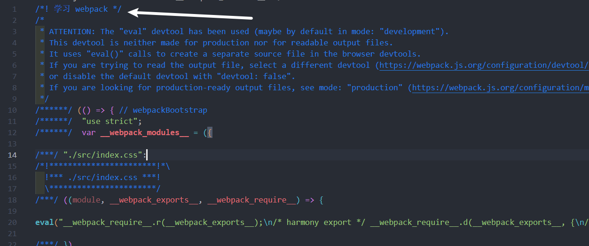

# Webpack
## 核心概念
* `entry` : 入口模块文件路径
* `output` : 输出 bundle 文件路径
* `module` : 模块, webpack 构建对象
* `bundle` : 输出文件 webpack的构建产物
* `chunk` :  中间件, webpack 构建的中间产物
* `loader` : 文件转化器  (比如通过 vue-loader 把 .vue 文件转换成浏览器认识的 .js 文件)
* `plugin` : 插件, 在 webpack 生命周期执行特定任务

标准的 `webpack` 初始化项目流程

1. `npm init` 初始化项目
2. 创建 `src/index.js`
3. 创建 `public/index.html`
4. 创建 `webpack.config.js` 填入配置
5. 执行 `npm install  webpack webpack-cli`
6. 配置 `build` 命令, `webpack`
7. 执行 `npm run build` 进行打包构建


webpack.config.js
```js
const path = require('path')

module.exports = {
  entry: './src/index.js',
  output: {
    filename: 'bundle.js', 
    path:path.resolve(__dirname, './dist') // 绝对路径
  }
}
```
## loader 入门
将除了 `js` 文件以外的其他资源转换成 `js`

1. 创建 `index.css`
2. 在 `src/index.js` (entry) 中引用 `import './index.css'`
3. 重新执行 `npm run build` 会报错

```
ERROR in ./src/index.css 1:0
Module parse failed: Unexpected token (1:0)
You may need an appropriate loader to handle this file type, currently no loaders are configured to process this file. See https://webpack.js.org/concepts#loaders
> .test {
|   width:100px;
|   height:100px;
 @ ./src/index.js 1:0-20
```

安装 css-loader
```shell
npm install -D css-loader
```

配置 `webpack.config.js`
```js{9-18}
const path = require('path')
module.exports = {
  mode:'development',
  entry: './src/index.js',
  output: {
    path: path.join(__dirname, './dist'),
    filename:'bundle.js'
  },
  module: {
    rules: [
      {
        test: /.css$/,
        use: [
          'css-loader'
        ]
      }
    ]
  }
}
```
还需要安装 `style-loader`

`style-loader` 的作用 : `head` 中添加 `style` 标签, 通过 `style` 标签将所有的 `css` 代码写入到 `style` 标签当中, 将 `js 和 css` 结合

```shell
npm install -D style-loader
```

webpack.config.js
```js
module.exports = {
  ...
   module: {
    rules: [
      {
        test: /\.css$/,
        use: [
          'style-loader','css-loader'
        ]
      }
    ]
  }
}
```
#### loader 执行顺序
`loader` **从右到左(或 从下到上)** 地运行 , 比如先争取顺序是 `1. css-loader -> 2. style-loader`
## plugin 入门
`Plugin` 可以扩展 `webpack` 的功能，让 `webpack` 具有更多的灵活性。 在 `Webpack` 运行的生命周期中会广播出许多事件，`Plugin` 可以监听这些事件，在合适的时机通过 `Webpack` 提供的 `API` 改变输出结果

#### hooks
* [compiler 钩子](https://webpack.docschina.org/api/compiler-hooks/)
* [compiler 钩子](https://webpack.docschina.org/api/compliation-hooks/)

[BannerPlugin](https://webpack.docschina.org/plugins/banner-plugin/) : 为每个 `chunk` 文件头部添加 `banner`

尝试使用 webpack 的 `BannerPlugin` 插件
webpack.config.js
```js{2,22-25}
const path = require('path')
const webpack = require('webpack')
module.exports = {
  mode:'development',
  entry: './src/index.js',
  output: {
    path: path.join(__dirname, './dist'),
    filename:'bundle.js'
  },
  module: {
    rules: [
      { 
        test: /\.css$/,
        use: [
          'style-loader',
          'css-loader'
        ]
      }
    ]
  },
  plugins: [
    new webpack.BannerPlugin({
      banner:'学习 webpack'
    })
  ]
}
```
运行 `npm run build` , 打包会后的文件上面出现我们设置的注释




