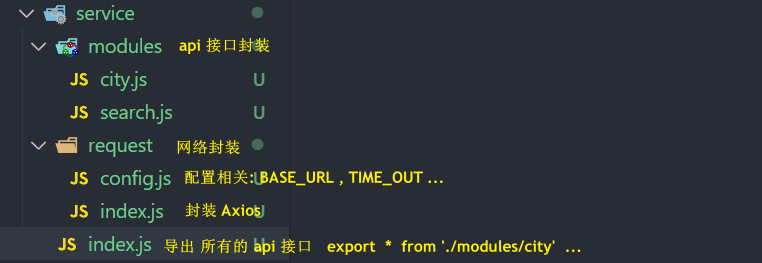

# 网络封装封装
service 文件夹目录结构: 


service/request/config.js **config 配置项**
```js
export const BASE_URL = 'http://123.207.32.32:1888/api'
export const TIME_OUT = 10000
```
service/request/index.js **axios封装 (简洁版)** 
```js
import axios from 'axios'
import { BASE_URL, TIME_OUT } from './config'

class HyRequest {
  constructor(baseURL,timeout) {
    this.instance = axios.create({
      baseURL,
      timeout
    })
  }
  request(config) {
    return new Promise((resolve, reject) => {
      this.instance.request(config).then(res => {
        resolve(res.data)
      }).catch(err => {
        reject(err)
      })
    })
  }
  get(config) {
    return this.request({...config , method:'get'})
  }
  post(config) {
    return this.request({ ...config, method: 'post' })
  }
}

export default new HyRequest(BASE_URL, TIME_OUT)
```
service/modules/city.js  **封装一些 api 接口**
```js
import hyRequest from '../request'

export function getCityAll() {
  return hyRequest.get({
    url: '/city/all',
  })
}
```

service/index.js **总入口文件统一导出**
```js
export * from './modules/city'
```
