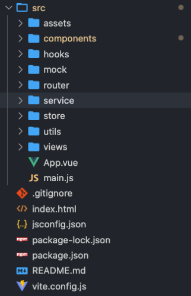
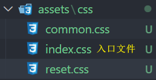
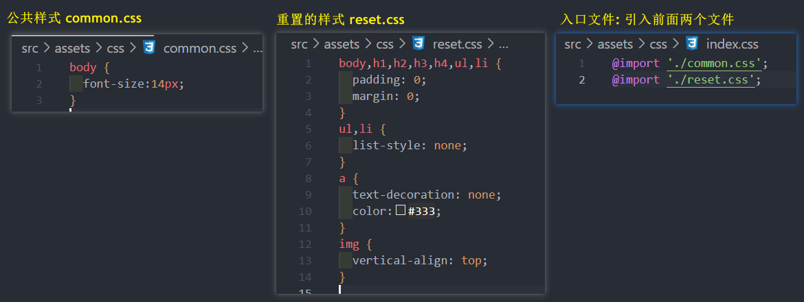
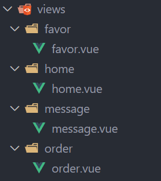
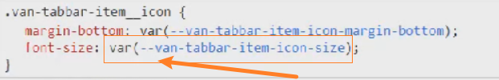

# 搭建
## 创建 Vue 项目
方式一 : Vue Cli
* 基于 webpack 工具
* 命令: `vue create`

方式二: create-vue
* 基于 Vite 工具
* 命令: `npm init vue@latest`

**此项目使用第二种方式 , Vite 搭建了项目**

* 项目配置:
1. 配置 项目的icon
2. 配置 项目的标题
3. 配置 jsconfig.json (使vscode代码提示更友好)
```json
{
  "compilerOptions": {
    // "target": "es5",
    "module": "esnext",
    "baseUrl": "./",
    "moduleResolution": "node",
    "paths": {
      "@/*": [
        "src/*"
      ]
    },
    "lib": [
      "esnext",
      "dom",
      "dom.iterable",
      "scripthost"
    ]
  }
}
```
## 项目目录结构划分

## CSS样式的重置
对默认CSS样式进行重置:
1. **normalize.css** 重置样式

[normalize.css](https://github.com/necolas/normalize.css)
```shell
npm install --save normalize.css
```
并在 main.js 引入形成依赖
```
import 'normalize.css'
```
2. **reset.css** 自定义配置重置样式

目录结构:



比如: 


然后在 main.js 引入并形成依赖
```js
import './assets/css/index.css'
```
## 全家桶 - Vue Router 路由配置
先安装 Vue Router
```shell
npm install vue-router@4
```

基本页面都最好**写成文件夹**, 因为这些基本页面有可能有它们自己的其他页面



router/index.js
```js
import { createRouter, createWebHashHistory } from 'vue-router';
const router = createRouter({
  history: createWebHashHistory(),
  // 映射关系 path -> component
  routes: [
    {
      path: '/',
      redirect:'/home'
    },
    {
      path: '/home',
      component:() =>import('@/views/home/home.vue')
    },
    {
      path: '/favor',
      component:() =>import('@/views/favor/favor.vue')
    },
    {
      path: '/order',
      component:() =>import('@/views/order/order.vue')
    },
    {
      path: '/message',
      component:() =>import('@/views/message/message.vue')
    }
  ]
})
export default router 
```

main.js **引入 router 实例**
```js
import { createApp } from 'vue'
import App from './App.vue'
import 'normalize.css'
import './assets/css/index.css'
import router from './router'

createApp(App).use(router).mount('#app')
```

并**且不能忘记, 在 App.vue, 要添加 `<router-view />` 标签**

## 全家桶 - Pinia 状态管理
[Pinia 中文文档](https://pinia.web3doc.top/getting-started.html)
```vue
npm install pinia
```


store/index.js
```js
import { createPinia } from 'pinia'

const pinia = createPinia()

export default pinia
```

main.js 引入 pinia 实例
```js
import { createApp } from 'vue'
import App from './App.vue'
import 'normalize.css'
import './assets/css/index.css'
import router from './router'
import pinia from './store'

createApp(App).use(router).use(pinia).mount('#app')
```
## 引入 Vant 组件
[npm 安装](https://vant-contrib.gitee.io/vant/#/zh-CN/quickstart#tong-guo-npm-an-zhuang)

[按需引入组件](https://vant-contrib.gitee.io/vant/#/zh-CN/quickstart#fang-fa-er.-an-xu-yin-ru-zu-jian-yang-shi)
### * 修改组件库样式方案 *
* **方案一 : 全局覆盖**

因为它们组件库样式是通过**变量**来控制的,如下


所以可以做全局的覆盖, 如:

assets/css/common.css
```css{3}
:root {
  --primary-color:#ff9854;
  --van-tabbar-item-icon-size:30px !important;
}
```
* **方案二 : 局部覆盖**

可以在**组件内部单独覆盖变量的值**

```vue
<style lang="less" scoped>
.tabBar {
  // 组件内部, 局部定义的变量, 只在当前组件内部生效
  --van-tabbar-item-icon-size:30px !important;
}
</style>
```

* **方案三 : `:deep(选择器)`**
```vue
<style lang="less" scoped>
.tabBar {
  // :deep(选择器) 可以找到子组件的类, 并直接该css属性
  :deep(.van-tabbar-item__icon) {
    font-size:30px;
  }
}
</style>
```
