# 业务
## tabBar 标签栏
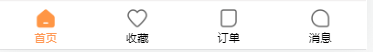
```vue
<template>
  <div class="tabBar-container">
    <template v-for="item,index in tabBarData" :key="index">
      <div class="tabBar-item" @click="itemClick(index)">
        
        
        <span class="tabBar-item-text" :class="{active:currentIndex === index}">{{item.text}}</span>
      </div>
    </template>
  </div>
</template>
<script setup>
import {ref} from 'vue'
import { useRouter } from 'vue-router';
// tabBar 数据
const tabBarData = [
  {
    text: '首页',
    image: 'tab_home.png',
    imageActive: 'tab_home_active.png',
    path:'/home'
  },
  {
    text: '收藏',
    image: 'tab_favor.png',
    imageActive: 'tab_favor_active.png',
    path:'/favor'
  },
  {
    text: '订单',
    image: 'tab_order.png',
    imageActive: 'tab_order_active.png',
    path:'/order'
  },
  {
    text: '消息',
    image: 'tab_message.png',
    imageActive: 'tab_message.png',
    path:'/message'
  }
]
// 获取图片的正确路径
function getAssetUrl(image) {
  // new Url()
  // 参数一 : 相对路径
  // 参数二 : 当前路径 -> 可以使用 import.meta.url 获取到
  return new URL(`../../assets/img/tabBar/${image}`, import.meta.url).href
}
const router = useRouter()
// 当前 导航页index
const currentIndex = ref(0)
// 点击 某一个导航栏
const itemClick = (index) => {
  currentIndex.value = index
  // 跳转
  router.push(item.path)
}

</script>
<style lang="less" scoped>
.tabBar-container{
  position:fixed;
  bottom:0;
  left:0;
  right:0;
  height:50px;
  display: flex;
  align-items: center;
  border-top:1px solid #e3e0e0;
  .tabBar-item {
    display: flex;
    justify-content: center;
    align-items:center;
    flex-grow:1;
    flex-direction: column;
    img {width:35px;}
    &-text {
      font-size:12px;
      &.active {
        color:var(--primary-color);
      }
    }
  }
}
</style>
```
其实上面代码中的 **tabBarData 导航栏数据** 和 **getAssetUrl 工具函数**可以单独抽离出来, 所以这里还是要抽一下

`utils/get-asset-url.js` 获取图片路径函数

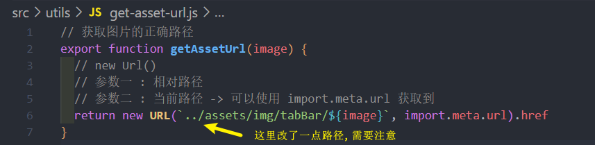
`assets/data/tabBar.js` tabBar静态数据

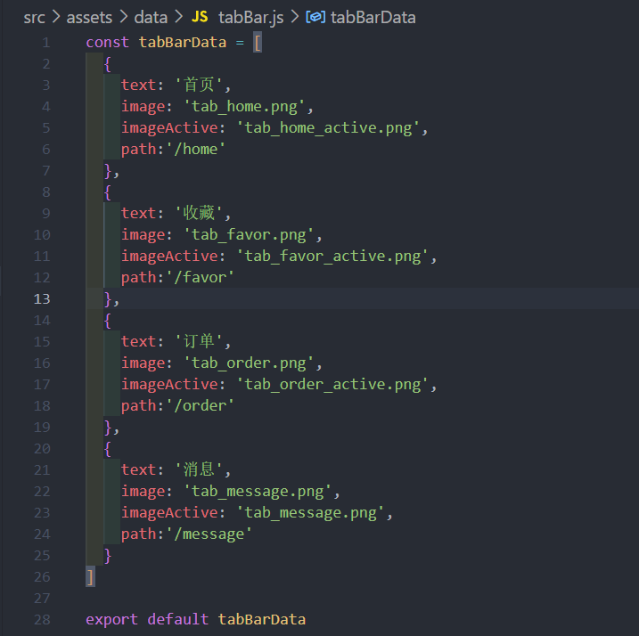

`components/tabBar/tabBar.vue`  把一些代码抽出去, 变得非常清爽了
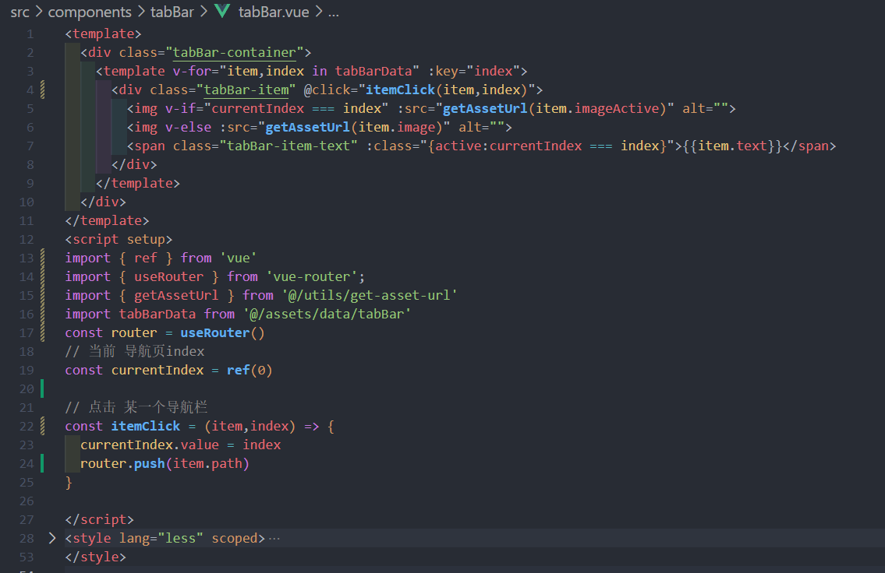

## navBar 导航栏
需求:

* 文字(左, 中, 有) 要通过 props 传递(`left-text`, `title` , `right-text` )
* icon 图标 通过插槽让用户自定义
* 并且点击左则区域 / 右侧区域触发点击事件, 组件监听的事件名为 `@click-left` 和 `@click-right`

实现需要注意细节:
* 组件实现思路借鉴了Vant UI 的 [navBar 组件](https://vant-contrib.gitee.io/vant/#/zh-CN/nav-bar)
* 点击时需要触发事件, 所以需要适当扩大区域面积给用户使用(利用的是一个css小技巧 绝对定位: left,top,bottom:0 沾满整个区域)
```vue
<template>
  <div class="eren-navBar-content">
    <!--左侧区域-->
    <div class="eren-navBar-left" @click="clickLeft">
      <span class="eren-navBar-left-icon">
        <slot name="leftIcon"></slot>
      </span>
      <span class="eren-navBar-left-text" v-if="leftText">
        {{ leftText }}
      </span>
    </div>
    <!--中间标题-->
    <span class="eren-navBar-title" v-if="title">{{ title }}</span>
    <!--右侧区域-->
    <div class="eren-navBar-right" @click="clickRight">
      <span class="eren-navBar-left-text" v-if="rightText">
        {{ rightText }}
      </span>
      <span class="eren-navBar-right-icon">
        <slot name="rightIcon"></slot>
      </span>
    </div>
  </div>
</template>
<script  setup>
const props = defineProps({
  leftText: {
    type:String
  },
  title: {
    type:String
  },
  rightText:String
})

const emits = defineEmits(['clickLeft','clickRight'])
// 点击左侧区域
const clickLeft = () => {
  emits('clickLeft')
}
// 点击右侧区域
const clickRight = () => {
  emits('clickRight')
}
</script>
<style lang="less" scoped>
.eren-navBar-content {
  width:100%;
  color:var(--primary-color);
  position:relative;
  display: flex;
  justify-content: center;
  align-items: center;
  height:46px;
  border-bottom:1px solid rgb(228, 225, 225);
  .eren-navBar-left{
    position:absolute;
    // 使用 绝对定位 撑满区域(下面三行), 并加上 左右padding 增加区域宽度
    left: 0;
    top: 0;
    bottom: 0;
    padding:0 16px;
    display: flex;
    justify-content: center;
    align-items: center;
    &-icon {
      margin-right:4px;
    }
    &-text {
      
    }
  }
  .eren-navBar-title{
    
  }
  .eren-navBar-right{
    position:absolute;
    // 使用 绝对定位 撑满区域(下面三行), 并加上 左右padding 增加区域宽度
    right:0;
    top: 0;
    bottom: 0;
    padding:0 16px;
    display: flex;
    justify-content: center;
    align-items: center;
    &-icon {
      margin-left:4px;
    }
    &-text {

    }
  }
}
</style>
```
## home-search-box 主页搜索器
### 获取地理位置功能(PC端都是err)
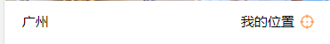
```vue
<template>
  <div class="home-search-box">
    <div class="location">
    <div class="city">广州</div>
    <div class="position" @click="positionClick">
      <span class="text">我的位置</span>
      
    </div>
  </div>
  </div>
</template>
<script setup>
function getPosition() {
        if(navigator.geolocation){
            //navigator.geolocation.getCurrentPosition这个方法里面有三个参数
            //这个会在界面拉出一个消息框，让用户确认是否允许获取位置,不过pc端我试了都是err，
            //参1，成功后执行的函数
            //参2，失败时执行的函数
            //参3，选项配置，下面是在3000毫秒内结束请求
            navigator.geolocation.getCurrentPosition(
                position => {
                    var latitude = position.coords.latitude;//纬度
                    var longitude = position.coords.longitude;//经度
                    console.log("Latitude : " + latitude + " Longitude: " + longitude);
                    console.log(position)
                },
                function (err) {
                    console.log("您的浏览器不支持此项技术")
                },
                {timeout : 3000}
            )
        }
}
// 点击获取位置信息
const positionClick = () =>{
  getPosition();
}
</script>
<style lang="less" scoped>
...
</style>
```
### 跳转到城市 和 隐藏tabBar
首先需要 city 页面
```
...
{
  path:'/city',
  component:()=>import()
}
```

跳转到选择城市页面**后** ,需要**隐藏**底部的 tabBar 标签栏, 实现这种效果有两种方案: 

* **方案一 : 利用 meta**
```js
  ...
  {
    path: '/city',
    component: () => import('@/views/city/city.vue'),
    meta: {
      hideTabBar:true
    }
  }
```

App.vue **因为 tabBar 是在 App.vue 使用的, 所以 `v-if` 做一下判断**
```vue{3,9}
<template>
  <router-view />
  <tab-bar v-if="!route.meta.hideTabBar" />
</template>

<script setup>
import tabBar from '@/components/tabBar/tabBar.vue'
import { useRoute } from 'vue-router';
// route 是响应式的
const route = useRoute()
</script>
<style scoped>
</style>
```
* **方案二: 使用 css 配置溢出**
```vue{9-15}
<template >
  <div class="city">
    city
  </div>
</template>
<script setup>
</script>
<style lang="less" scoped>
  .city {
    height:100vh;
    position:relative;
    z-index:9;
    background-color: white;
    overflow-y: auto;
  }
</style>
```
并且可以把这些属性**单独抽到公共代码**中, 供给多个需要的组件使用

### 城市页面 - search 搜索框
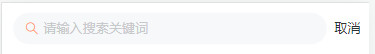

[Search 搜索组件](https://vant-contrib.gitee.io/vant/#/zh-CN/search)
```vue
<template>
  <div class="city">
    <form action="/">
      <van-search
        v-model="searchValue"
        show-action
        shape="round"
        placeholder="请输入搜索关键词"
        @search="onSearch"
        @cancel="onCancel"
      />
    </form>
  </div>
</template>
<script setup>
import { ref } from 'vue'
import { useRouter } from 'vue-router';
// 搜索值
const searchValue = ref('')
const router = useRouter()
// 搜索
const onSearch = () => {
  console.log('搜索')
}
// 点击取消
const onCancel = () => {
  console.log('取消')
  router.back()
}
</script>
```

并且搜索框左侧图标颜色需要自定义, 所以可以在**全局修改**对应的样式变量

assets/css/common.css
```css{4}
:root {
  --primary-color:#ff9854;
  /*搜索框左侧 icon 颜色*/
  --van-search-left-icon-color:var(--primary-color) !important;
}
```
### 城市页面 - tabs 标签页
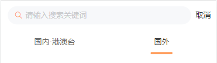

[tab 标签页](https://vant-contrib.gitee.io/vant/#/zh-CN/tab)

先不填写内容 ..
```vue
<template>
    ...
    <!--标签页-->
    <van-tabs v-model:active="tabActive" color="#ff9854">
      <van-tab title="国内·港澳台"></van-tab>
      <van-tab title="国外"></van-tab>
    </van-tabs>
  </div>
</template>
<script setup>
import { ref } from "vue";
...
// 激活的标签页索引
const tabActive = ref(0)
</script>
```
### 城市页面 - 城市数据的 '状态管理' 与 标签展示 
**在组件内部发送很多网络请求**有**2个缺点**:

1. 如果网络请求太多, 那么页面组件中就包含大量的对于网络请求和数据的处理逻辑
2. 如果页面封装了很多的子组件, 子组件需要这些数据, 所以必须一步步将数据传递过去(props), 非常麻烦 

**所以关于网络的最终架构设计 -> 就是放到 Pinia !**

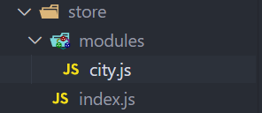
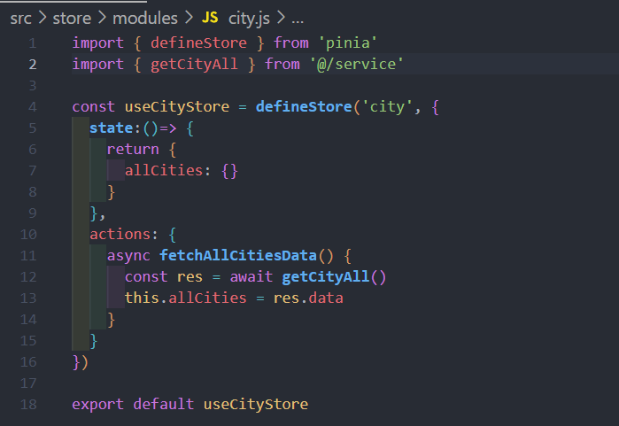

city.vue 
```vue
<template>
  <div class="city">
    ...
    ...
    <!--标签页-->
    <van-tabs v-model:active="tabActive" color="#ff9854">
      <template v-for="value,key,index in allCities" :key="key">
        <van-tab :title="value.title"></van-tab>
      </template>
    </van-tabs>
  </div>
</template>
<script setup>
...
import useCityStore from '@/store/modules/city'
import { storeToRefs } from 'pinia';
...

// pinia 城市数据
const cityStore = useCityStore()
cityStore.fetchAllCitiesData() // 调用action 发起网络请求
const { allCities } = storeToRefs(cityStore) // storeToRefs 解构state数据
</script>
```
### 城市页面 - 动态数据 cityGroup 的切换管理
这里需要实现一个需求: **上面搜索框 和 标签页 需要在上面固定**

一般有**2种**实现方案: 

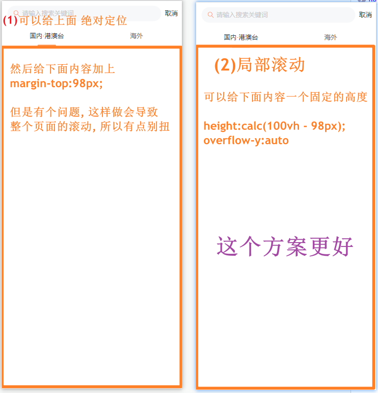

city.vue 
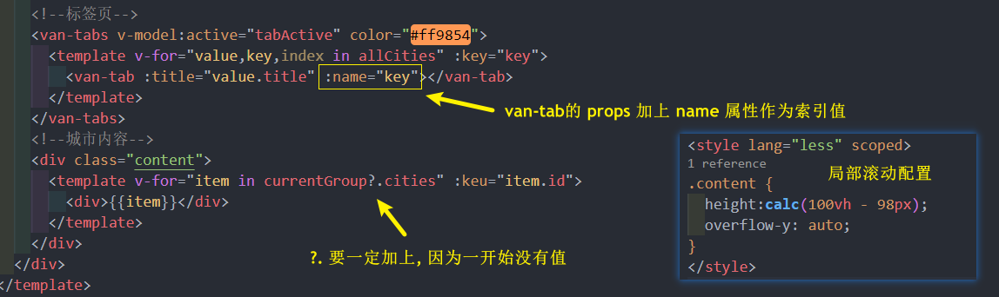
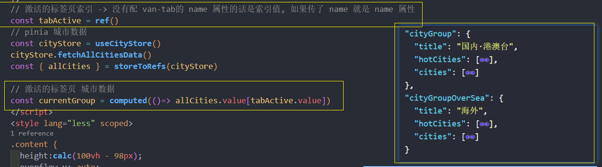

最后 currentGroup 要使用**计算属性**进行处理
### 城市页面 - 城市页面分组列表数据展示 并`优化`!!
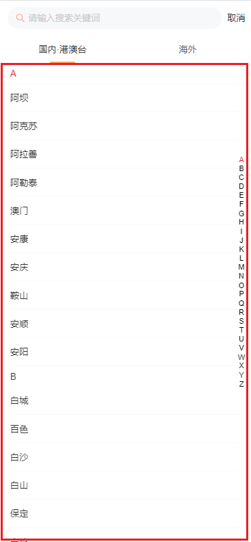

[indexBar 索引栏](https://vant-contrib.gitee.io/vant/#/zh-CN/index-bar)

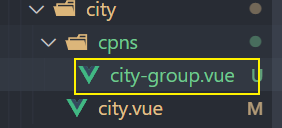
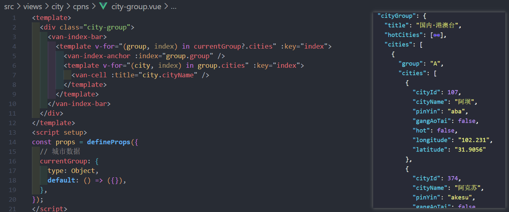

在 `city.vue` 使用该组件并传入城市数据
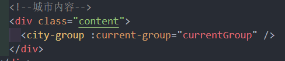

#### 优化
**但是这样子传数据每次 currentGroup 城市数据每次都会重新加载并渲染一遍, 并且标签页的切换有延迟**

**所以这里使用使用 2个 组件, 通过 `v-show` 进行切换, 做一下优化**
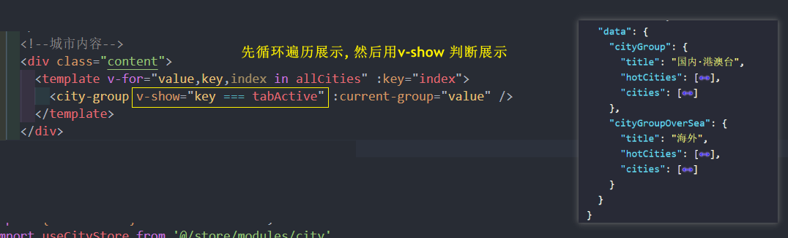

目前为止的 city.vue 代码 , 细品
```vue
<template>
  <div class="city">
    <div class="city-top">
      <!--搜索框-->
      <form action="/">
        <van-search
          v-model="searchValue"
          show-action
          shape="round"
          placeholder="请输入搜索关键词"
          @search="onSearch"
          @cancel="onCancel"
        />
      </form>
      <!--标签页-->
      <van-tabs v-model:active="tabActive" color="#ff9854">
        <template v-for="value,key,index in allCities" :key="key">
          <van-tab :title="value.title" :name="key"></van-tab>
        </template>
      </van-tabs>
    </div>
    <!--城市内容-->
    <div class="content">
      <template v-for="value,key,index in allCities" :key="index">
        <city-group v-show="key === tabActive" :current-group="value" />
      </template>
    </div>
  </div>
</template>
<script setup>
import { ref ,computed} from "vue";
import { useRouter } from "vue-router";
import useCityStore from '@/store/modules/city'
import { storeToRefs } from 'pinia';
import cityGroup from './cpns/city-group.vue';
// 搜索值
const searchValue = ref("");
const router = useRouter();
// 搜索
const onSearch = () => {
  console.log("搜索");
};
// 点击取消
const onCancel = () => {
  console.log("取消");
  router.back();
}; 
// 激活的标签页索引 -> 没有配 van-tab的 name 属性的话是索引值, 如果传了 name 就是 name 属性
const tabActive = ref()
// pinia 城市数据
const cityStore = useCityStore()
cityStore.fetchAllCitiesData()
const { allCities } = storeToRefs(cityStore)

// 激活的标签页 城市数据
// const currentGroup = computed(()=> allCities.value[tabActive.value])
</script>
<style lang="less" scoped>
.content {
  height:calc(100vh - 98px);
  overflow-y: auto;
}
.city-top {
  position:relative;
  z-index:9;
}
</style>
```
### 城市页面 - 列表数据添加热门城市标签(索引动态映射)
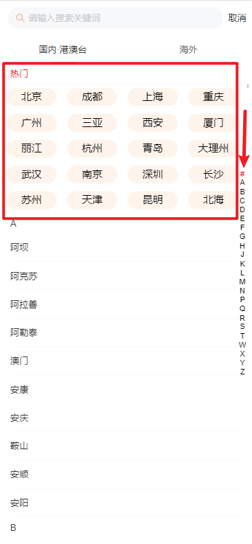

热门标签的索引值在这里设为 `#`

city-group.vue
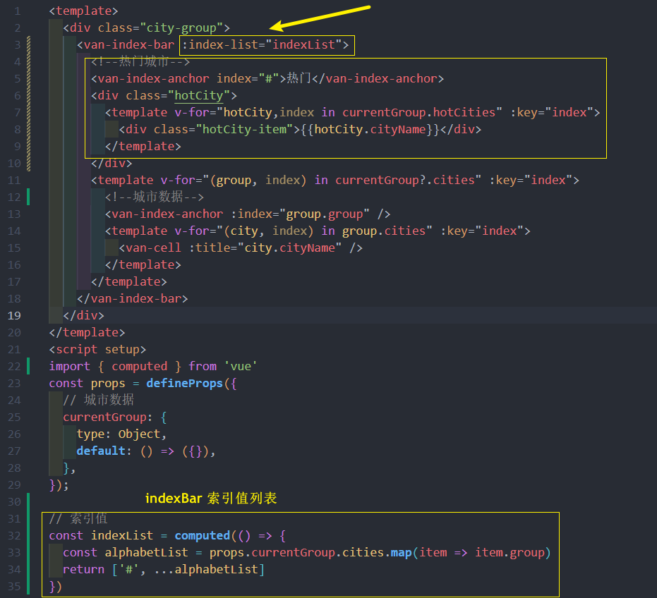
### 城市页面 - 点击城市回退并回显效果

像 **城市** 这类数据用户选择完之后大概率在别的组件或者页面中**经常会被使用**

所以这里就使用 **Pinia**  保存当前用户所选城市

store/modules/city.js  **先在 Pinia 中添加当前城市的默认数据**
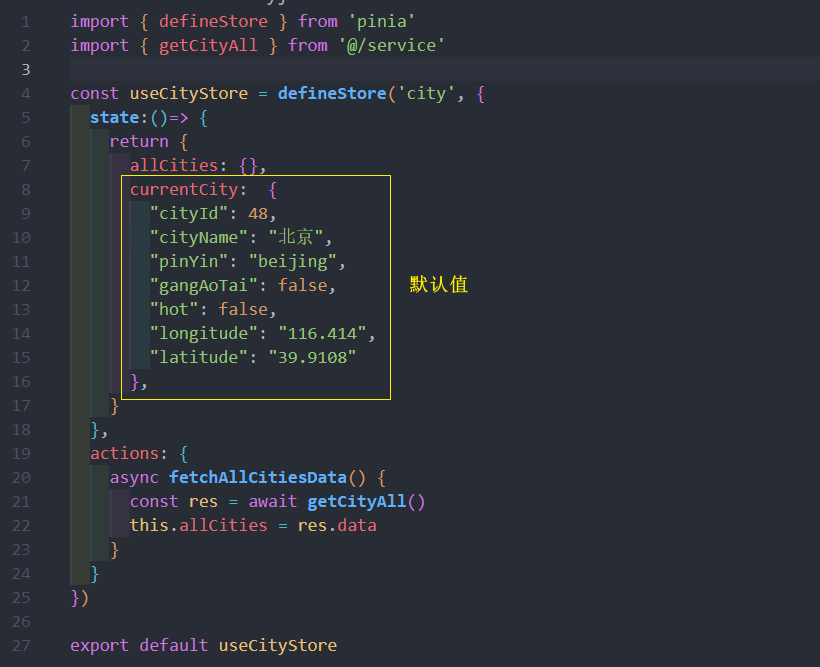

city-group.vue **点击城市时在 Pinia 保存数据, 并且回退**
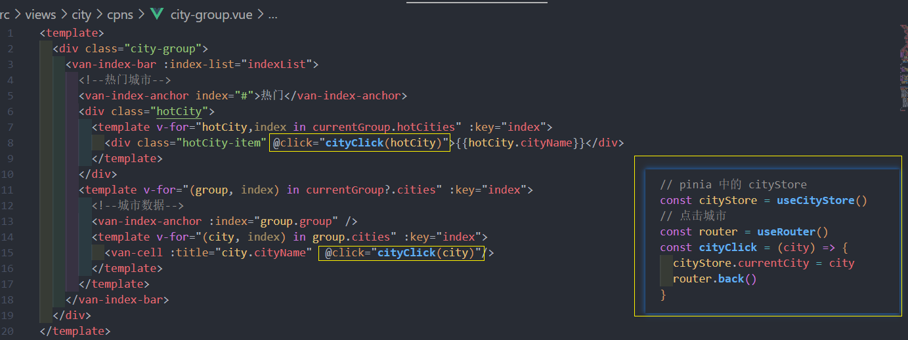

**然后在首页中缺数据并回显**
### 最终代码
city-group.vue 最终代码
```vue
<template>
  <div class="city-group">
    <van-index-bar :index-list="indexList">
      <!--热门城市-->
      <van-index-anchor index="#">热门</van-index-anchor>
      <div class="hotCity">
        <template v-for="hotCity,index in currentGroup.hotCities" :key="index">
          <div class="hotCity-item" @click="cityClick(hotCity)">{{hotCity.cityName}}</div>
        </template>
      </div>
      <template v-for="(group, index) in currentGroup?.cities" :key="index">
        <!--城市数据-->
        <van-index-anchor :index="group.group" />
        <template v-for="(city, index) in group.cities" :key="index">
          <van-cell :title="city.cityName"  @click="cityClick(city)"/>
        </template>
      </template>
    </van-index-bar>
  </div>
</template>
<script setup>
import { computed } from 'vue'
import  useCityStore from "@/store/modules/city"
import { useRouter } from 'vue-router';
const props = defineProps({
  // 城市数据
  currentGroup: {
    type: Object,
    default: () => ({}),
  },
});

// 索引值
const indexList = computed(() => {
  const alphabetList = props.currentGroup.cities.map(item => item.group)
  return ['#', ...alphabetList] 
})

// pinia 中的 cityStore
const cityStore = useCityStore()
// 点击城市
const router = useRouter()
const cityClick = (city) => {
  cityStore.currentCity = city
  router.back()
}

</script>
<style lang="less" scoped>
.hotCity {
  display: flex;
  flex-wrap: wrap;
  justify-content: space-between;
  padding:0 10px;
  padding-right: 20px;
  &-item {
    width:78px;
    margin:6px 0;
    height:28px;
    text-align: center;
    line-height: 28px;
    background-color: #fff4ec;
    border-radius:16px;
  }
}
</style>
```

**city.vue**

```vue
<template>
  <div class="city">
    <div class="city-top">
      <!--搜索框-->
    <form action="/">
      <van-search
        v-model="searchValue"
        show-action
        shape="round"
        placeholder="请输入搜索关键词"
        @search="onSearch"
        @cancel="onCancel"
      />
    </form>
    <!--标签页-->
    <van-tabs v-model:active="tabActive" color="#ff9854">
      <template v-for="value,key,index in allCities" :key="key">
        <van-tab :title="value.title" :name="key"></van-tab>
      </template>
    </van-tabs>
    </div>
    <!--城市内容-->
    <div class="content">
      <template v-for="value,key,index in allCities" :key="index">
        <city-group v-show="key === tabActive" :current-group="value" />
      </template>
    </div>
  </div>
</template>
<script setup>
import { ref } from "vue";
import { useRouter } from "vue-router";
import useCityStore from '@/store/modules/city'
import { storeToRefs } from 'pinia';
import cityGroup from './cpns/city-group.vue';
// 搜索值
const searchValue = ref("");
const router = useRouter();
// 搜索
const onSearch = () => {
  console.log("搜索");
};
// 点击取消
const onCancel = () => {
  console.log("取消");
  router.back();
}; 
// 激活的标签页索引 -> 没有配 van-tab的 name 属性的话是索引值, 如果传了 name 就是 name 属性
const tabActive = ref()
// pinia 城市数据
const cityStore = useCityStore()
cityStore.fetchAllCitiesData()
const { allCities } = storeToRefs(cityStore)

// 激活的标签页 城市数据
// const currentGroup = computed(()=> allCities.value[tabActive.value])
</script>
<style lang="less" scoped>
.content {
  height:calc(100vh - 98px);
  overflow-y: auto;
}
.city-top {
  position:relative;
  z-index:9;
}
</style>
```

### 选择日期范围
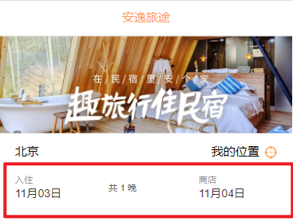

[Calendar 日历](https://vant-contrib.gitee.io/vant/#/zh-CN/calendar) 组件

**utils/format-date.js** **封装日期处理工具函数**
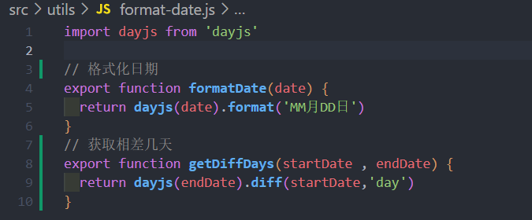

```vue
<template>
   ...
  <!--选择日期范围-->
  <div class="section item date-range" @click="calendarVisible = true">
      <div class="start">
        <div class="date">
          <span class="tip">入住</span>
          <span class="time">{{startDate}}</span>
        </div>
        <div class="stay">共 {{diffDays}} 晚</div>
      </div>
      <div class="end">
        <div class="date">
          <span class="tip">离店</span>
          <span class="time">{{endDate}}</span>
        </div>
      </div>
    </div>
    <van-calendar 
      v-model:show="calendarVisible" 
      @confirm="onConfirm" 
      color="#ff9854"
      type="range" 
      :round="false"
    />
  </div>
</template>
<script setup>
...
import { formatDate,getDiffDays } from '@/utils/format-date';
...
import { ref } from 'vue'

...
// 日期范围 
const nowDate = new Date()
const newDate = new Date().setDate((new Date().getDate() + 1))
const startDate = ref(formatDate(nowDate))
const endDate = ref(formatDate(newDate))
// 相差的天数
const diffDays = ref(getDiffDays(nowDate, newDate))

// 日历显示/隐藏
const calendarVisible = ref(false)
// 日历点击了确定
const onConfirm = (value) => {
  startDate.value = formatDate(value[0])
  endDate.value = formatDate(value[1])

  calendarVisible.value = false

  diffDays.value = getDiffDays(value[0],value[1])
}

</script>
```
### 热门搜索建议 - 数据请求和展示 (Pinia)
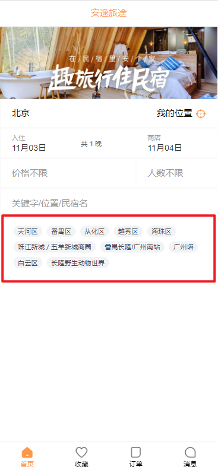

网络请求的话**不建议**在单独的组件里面去调 , 所以就使用 **Pinia** 做状态管理实现分层结构

**service/modules/home.js  先封装api接口**
```js
import hyRequest from '@/service/request'

// 获取热门搜素建议 
export  function getHotSuggest(){
  return hyRequest.get({
    url:'/home/hotSuggests'
  })
}
```

**store/modules/home.js  Pinia 状态管理: useHomeStore**
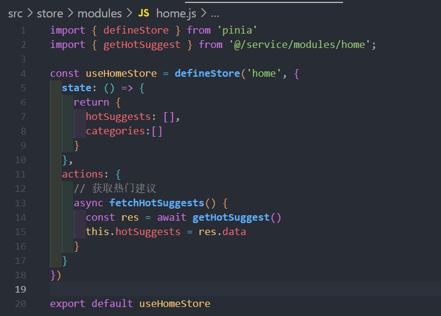

home.vue **然后在首页, 也就是 home.vue , 在进入页面的时候就性需要发起网络请求, 所以调用 action**

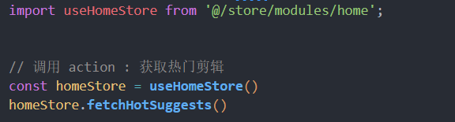

home-search-box.vue **然后进行模板展示**
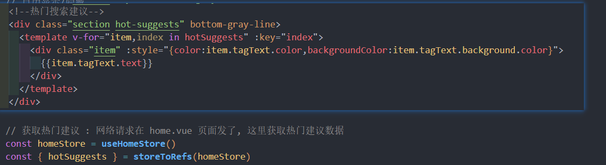
### 点击搜索按钮 -> 跳转搜索页面, 携带参数
点击搜索按钮后, 要跳转到另一个搜索页面

想要**跳转页面时,** 如果还**有一些参数要携带的话**, 那么可以在 **`$route` 的 `query` 属性**上面携带这些参数苏

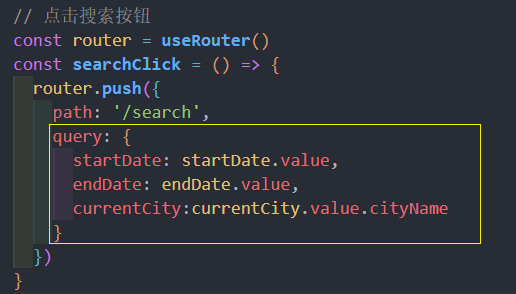

## 分类列表组件 home-categories
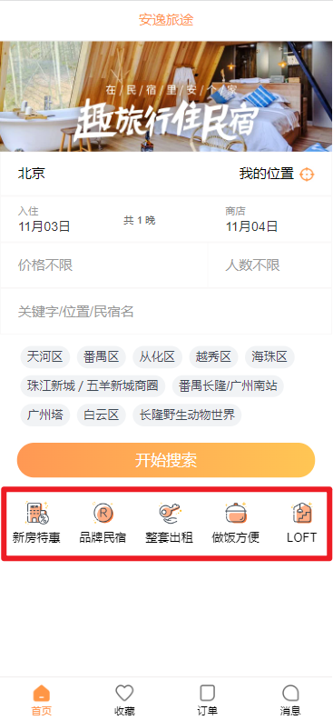

具体数据都要发请求得到, 所以**也使用 Pinia**

service/modules/home.js  **api接口**
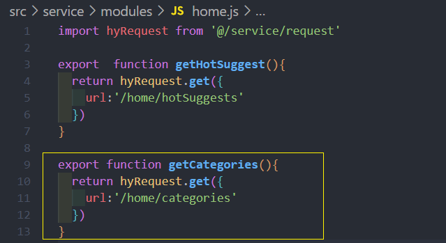

store/modules/home.js  **pinia 封装 action 动作**
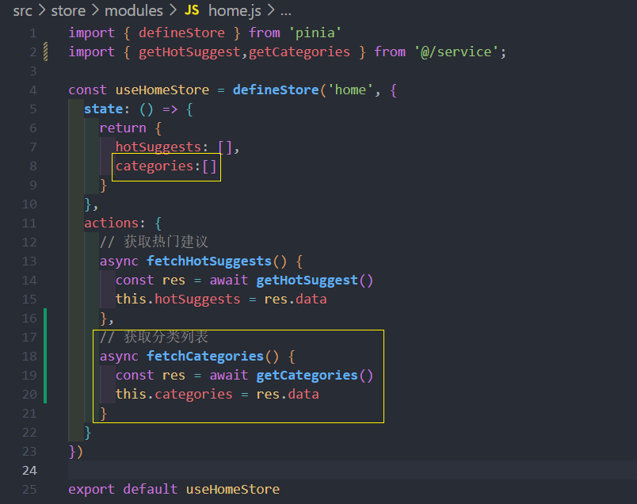

home.vue **一进首页时, 调用 action 发起网络请求**
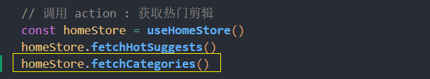

**封装成组件**

* **小技巧: 隐藏滚动条 ->  `.el::-webkit-scrollbar { width: 0 !important }`**

home-categories.vue 
```vue
<template>
  <div class="home-categories">
    <template v-for="item in categories" :key="item.id">
      <div class="home-categories-item">
        
        <span class="text">{{item.title}}</span>
      </div>
    </template>
  </div>
</template>
<script setup>
import useHomeStore from '@/store/modules/home';
import { storeToRefs } from 'pinia';

const homeStore = useHomeStore()
const { categories } = storeToRefs(homeStore)

</script>
<style lang="less" scoped>
.home-categories {
  display: flex;
  overflow-x: auto;
  padding:16px 4px;
  &::-webkit-scrollbar { width: 0 !important }
  &-item {
    width:70px;
    display: flex;
    flex-direction: column; 
    flex-shrink: 0;
    justify-content: center;
    align-items: center;
    padding:4px;
    img{
      width:30px;
    }
    .text{
      margin-top:6px;
      font-size: 14px;
    }
  }
}
</style>
```


