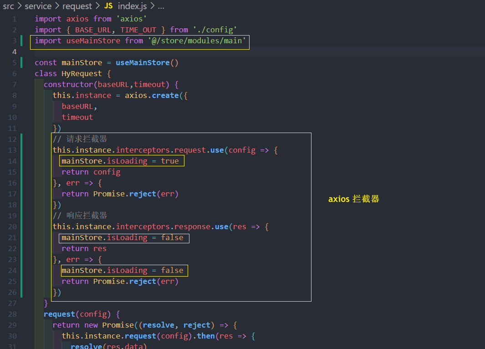

# 业务 (2)

## 主页房屋列表模块组件封装
### 请求数据
**这里数据请求也是要在 Pinia 里封装**

service/modules/home.js **api 接口**


store/modules/home.js **Pinia 封装请求 action**


home.vue 一进入主页, 就发起网络请求


### 房屋信息的两种显示方式 -  v9 和 v3


home-house-list.vue

```vue
<template>
  <div class="house-list">
    <template v-for="item in houseList" :key="item.data.houseId">
      <house-item-v9
        v-if="item.discoveryContentType === 9"
        :item-data="item.data"
      />
      <house-item-v3
        v-if="item.discoveryContentType === 3"
        :item-data="item.data"
      />
    </template>
  </div>
  <button @click="moreListClick">加载更多</button>
</template>
<script setup>
import useHomeStore from "@/store/modules/home";
import { storeToRefs } from "pinia";
import houseItemV9 from "@/components/house-item-v9/house-item-v9.vue";
import houseItemV3 from "@/components/house-item-v3/house-item-v3.vue";
// 房屋列表 : Pinia 里获取
const homeStore = useHomeStore();
const { houseList } = storeToRefs(homeStore);

// 记载更多按钮
const moreListClick = () => {
  homeStore.fetchHouseList();
};
</script>
<style lang="less" scoped>
.house-list {
  padding: 6px;
  display: flex;
  flex-wrap: wrap;
}
</style>
```


渲染模板, 布局...

### 到达底部自动加载更多  

先要分清楚什么在滚动?

- windows 页面在滚动
- 还是某一个元素在滚动 (一般会设置一个固定的高度, overflow-y:auto ;)

**但是 home 页面他实际滚动的是 windows 整个页面** ,所以**监听 window 的滚动**


### 监听滚动的 Hooks 函数的抽取 -  useScroll

续 上一节 :

1. **当我们离开页面时 , 需要移除 window 上的监听, 避免影响到其他页面**
2. **如果别的页面也会实现类似的功能, 会产生重复的代码**

**所以抽取逻辑代码, 封装成一个 useScroll 的 Hooks**

Hooks/useScroll.js 需要一些细节, 比如: **(1)在 onUnmounted 移除监听器, (2)缓存组件的生命周期也要同样处理..**
```js
// 监听是否到达了页面的底部
import { ref,onMounted, onUnmounted ,onActivated,onDeactivated} from 'vue';
export default function useScroll() {
// 是否到达底部
const isReachBottom = ref(false)

const scrollListener = () => {
const scrollHeight = document.documentElement.scrollHeight
const clientHeight = document.documentElement.clientHeight
const scrollTop = document.documentElement.scrollTop
if (scrollHeight <= clientHeight + scrollTop) {
isReachBottom.value = true
}
}

onMounted(() => {
window.addEventListener('scroll', scrollListener)
})
onActivated(() => {
window.addEventListener('scroll', scrollListener)
})
// 取消监听
onUnmounted(() => {
window.removeEventListener('scroll', scrollListener)
})
onDeactivated(() => {
window.removeEventListener('scroll', scrollListener)
})

return {
  isReachBottom
  }
}
```
**其实在这个Hooks 里面返回了一个叫 `isReachBottom` 的响应式变量, 但为什么不直接传递了具体的回调呢?**

* 答 : 因为如果在 Hooks 里面传入很多个回调的话, 维护起来它们非常麻烦 , 所以在 hooks 里面直接声明一个变量, 他会判断是否到达了页面的底部
所以当我们使用这个 hooks 的时候 , 可以获取到这个变量, 在组件内部根据变量的值做条件判断执行一些属于他们自己的回调的话, 那么就更合理一些了

比如:


### 页面滚动到一定的高度时, 显示搜索栏 - scrollTop
同样也要监听页面的滚动高度 , 但这个功能已经在 useScroll Hooks 里面实现过, **但怎么导出 scrollTop 变量?**


```html  
<div v-if="searchVisible">搜索栏</div
```
```js
// 搜索栏 先手/隐藏
const searchVisible = ref(false)
// Hooks 里获取滚动的高度, watch 监听
const { scrollTop } = useScroll()
watch(scrollTop , (newValue)=>{
  if(newValue > 100) {
    searchVisible.value = true
  } else {
    searchVisible.value = false
  }
})
```

**或者** 可以使用**计算属性**

```js
const { scrollTop } = useScroll()

const searchVisible = computed(()=>{
  return scrollTop.value >= 200
})
```
### 节流的处理
```shell
npm install underscore
```


## search-bar 搜索框的封装和展示 


如图 , 日期在很多组件都会用到, 所以这里创建一个新的 store 叫做 **useMainStore**

之前做的关于日期的处理, 数据在 mainStore 中保存


需要重构之前的 home-search-box.vue 里的日期选择逻辑代码, 从 mainStore 读取日期并重新设置日期 ... 

**在回到 search-bar.vue**

## Loading 组件的封装 (Axios 拦截器)
loading 组件是通过 `v-if` 显示或者隐藏, 这里**把 isLoading 变量放到的 mainStore 中**, 方便管理 
```vue
<template>
  <div class="loading" v-if="mainStore.isLoading" @click="loadingClick">
    <div class="bg">
      
      <span class="text">加载中...</span>
    </div>
  </div>
</template>
<script setup>
import useMainStore from '@/store/modules/main';
const mainStore = useMainStore()
// 点击了遮罩层的某一位置
const loadingClick = () => {
  useMainStore.isLoading = false
}
</script>
<style lang="less" scoped>
  .loading {
    background-color: rgba(0,0,0,0.5);
    position: fixed;
    left: 0;
    right: 0;
    top: 0;
    bottom: 0;
    z-index:999;
    display: flex;
    justify-content: center;
    align-items: center;
    .bg {
      width:104px;
      height:104px;
      background: url(@/assets/img/home/loading-bg.png) 0 0 / 100% 100%;
      display: flex;
      justify-content: center;
      align-items: center;
      flex-direction: column;
      position:relative;
      img {
        width:70px;
        height:70px;
        margin-bottom:8px;
      }
      .text {
        position:absolute;
        bottom:20%;
        transform:translateX(10%);
        color: rgb(103, 101, 101);
      }
    }
  }
</style>
```
至于什么时候显示, 什么时候关闭 -> 在 **Axios 拦截器统一实现**




还有需要注意的是 loading 组件本身要存在, 所以把**它默认创建在 App.vue 页面里面**

