# 业务 (3)
##  详情页
### 点击 item 跳转到详情页
home-house-list.vue
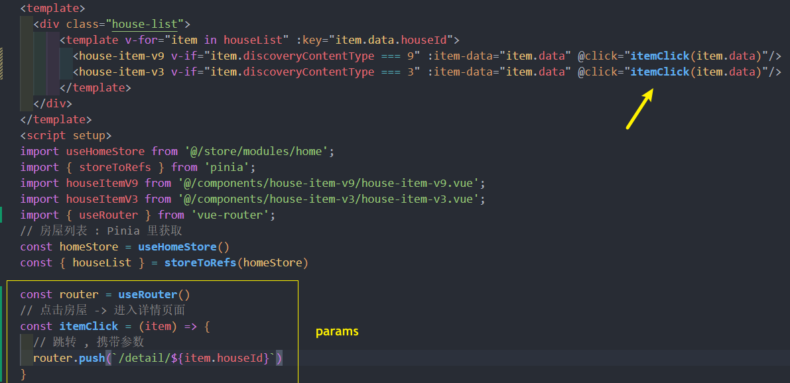

那么必须新创建一个详情页的路由 router/index,js
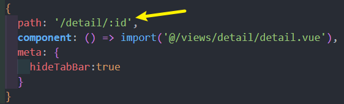


### 轮播图
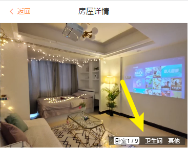

**难点在于 : 自定义轮播图的指示器**

detail-01-swipe.vue 
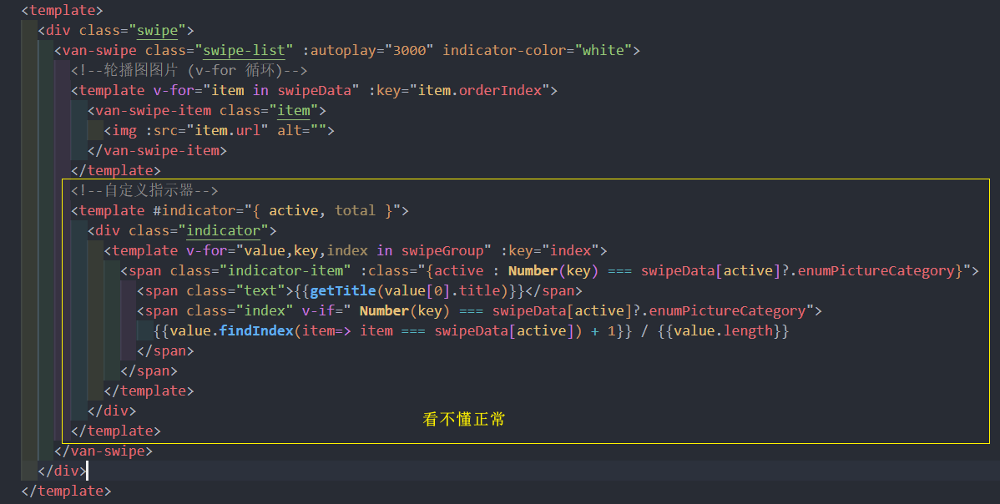
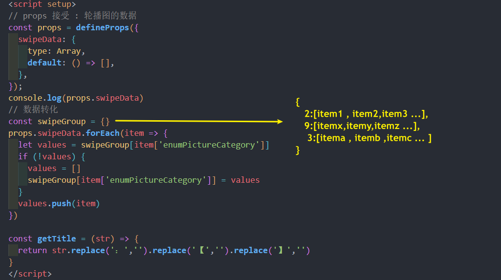
### 百度地图

地图这种东西如何嵌入到前端项目里面? 这取决于你要用的是什么地图

API 不需要记, 直接看文档就 ok
[百度地图 开发文档](https://lbsyun.baidu.com/index.php?title=jspopularGL/guide/show)

[添加锚点](https://lbsyun.baidu.com/index.php?title=jspopularGL/guide/addOverlay)

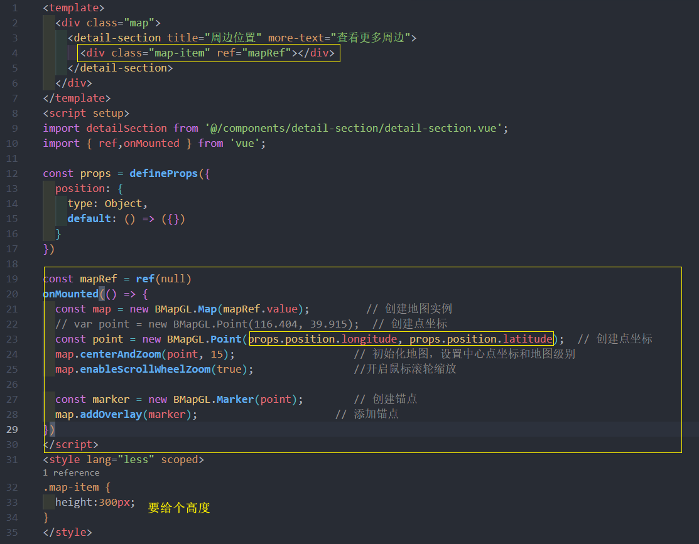

### TabControl 的展示与 监听元素的滚动 - useScroll 重构

**之前封装 useSCroll hooks 的时候只是监听了 windows 的滚动, 但如果是需要监听其他某一个元素在滚动的话需要单独处理**

**useScroll.js**
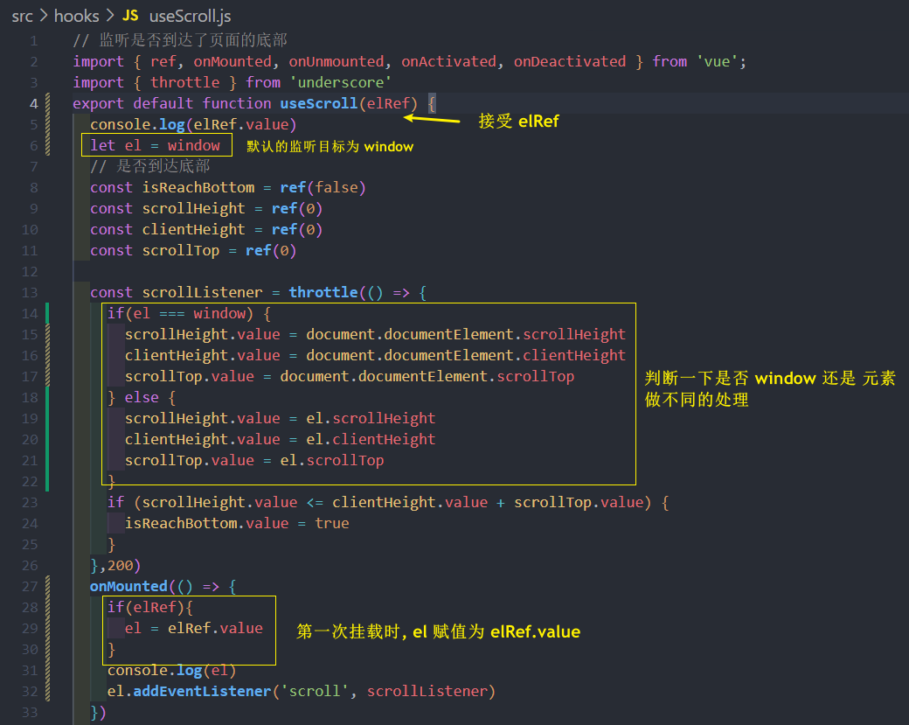
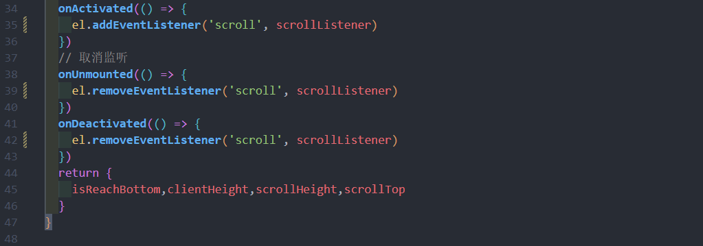

### 点击 TabControl 某一项时, 滚动到对应的位置
又难又麻烦

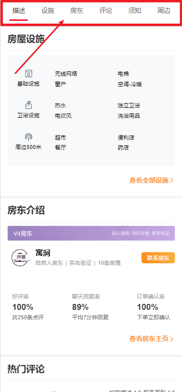

大体是这样:
1. 监听滚动 到一定距离时, 显示 tab 标签页(tab使用的是Vant组件)
2. 点击某一项 , 平滑到对应内容区域
   * 需要拿到每个组件到顶部的高度
   * 点击时 scrollTo() 平滑

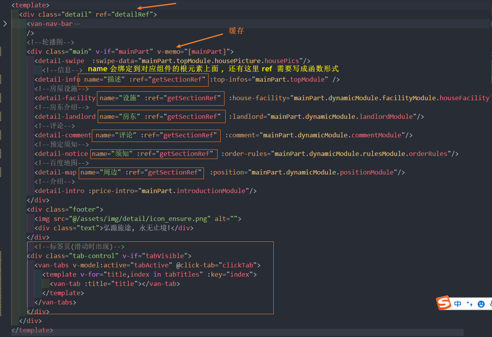
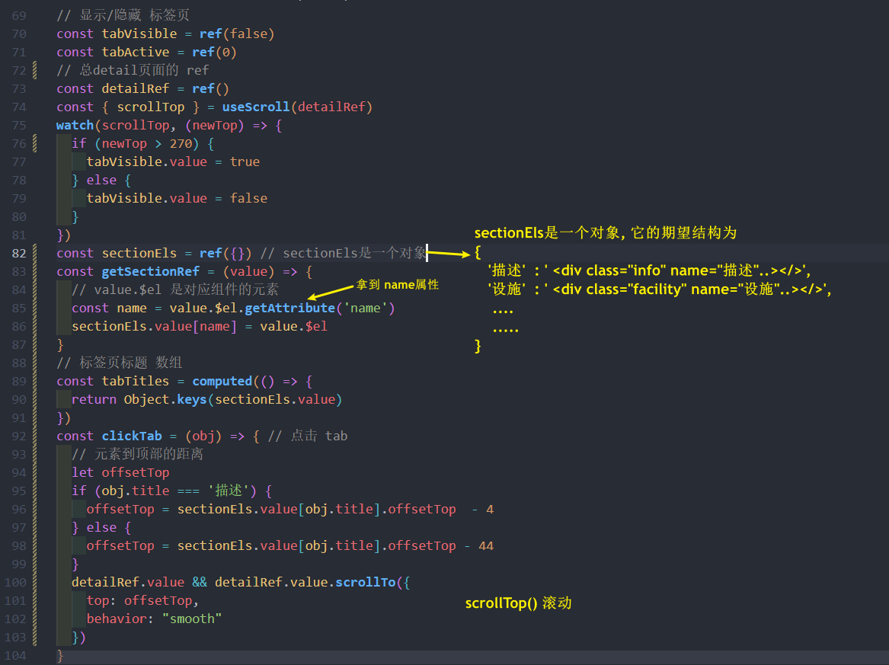


## 首页做 keep-alive 缓存

home.vue **因为 setup 语法中无法定义组件的 name**, 所以做如下处理

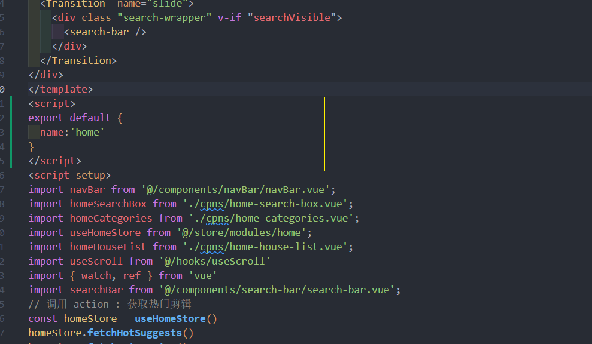

App.vue
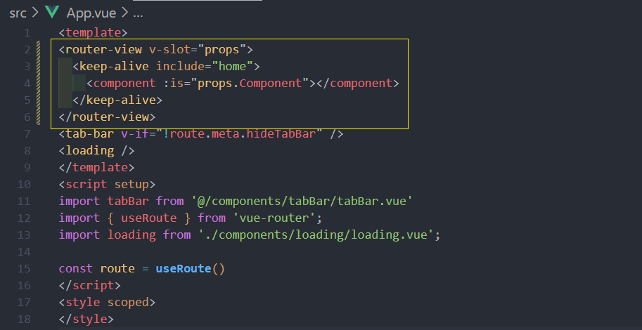

## 视口设置 和 px -> vw 单位的转换
1. **让页面禁止缩放**

```html
<meta name="viewport" content="width=device-width, initial-scale=1.0 maximum-scale=1.0,minimum-scale=1.0, user-scalable=no" />
```

2. **px -> vw 单位的转换**

**postcss 工具 -> plugins -> postcss-px-to-viewport 插件**

[Vant 浏览器适配](https://vant-contrib.gitee.io/vant/#/zh-CN/advanced-usage#liu-lan-qi-gua-pei)

```shell
npm install postcss-px-to-viewport -D
```

**postcss.config.js**
```js
module.exports = {
  plugins: {
    'postcss-px-to-viewport': {
      // 设计稿是口的一个大小 viewportWidth
      viewportWidth:375
    }
  }
}
```


