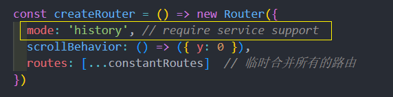
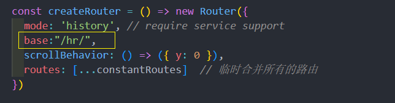
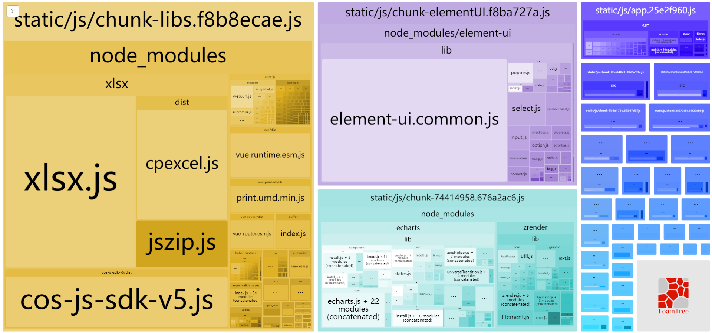
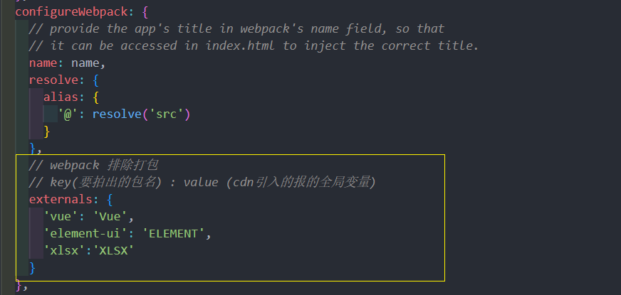
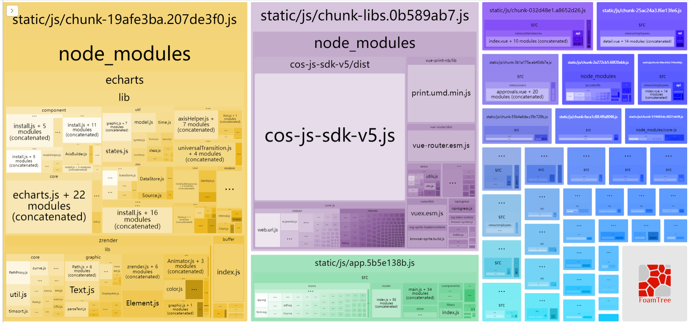
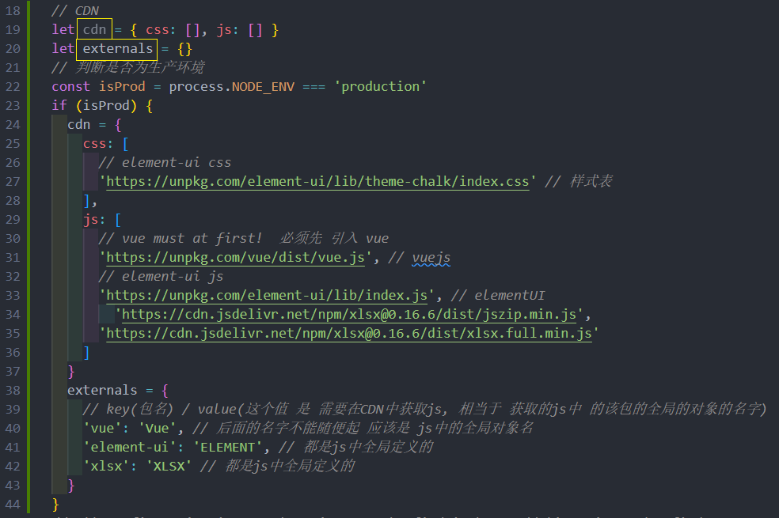
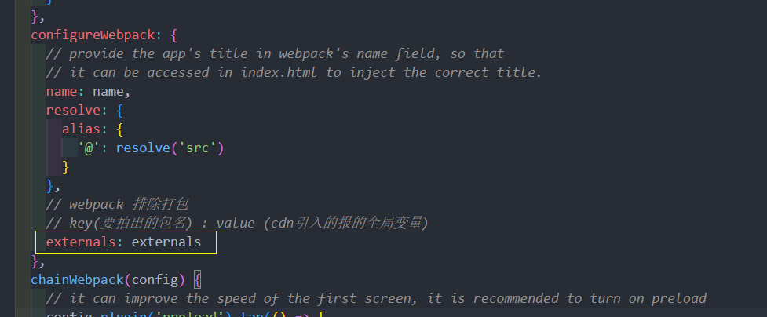
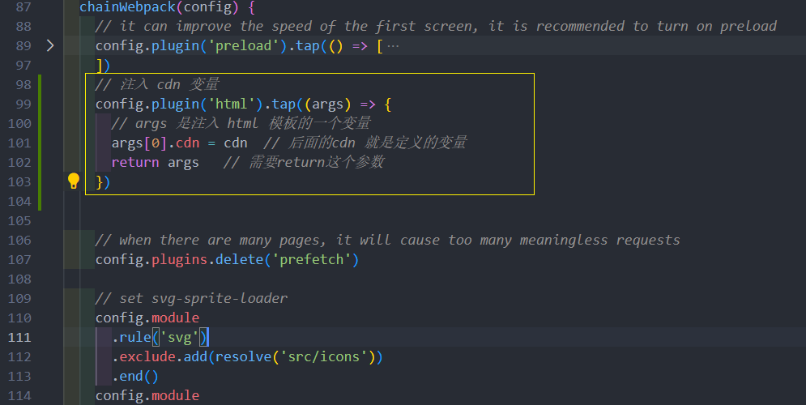
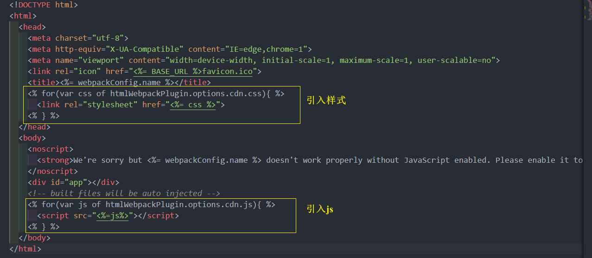

# 部署
## 两种路由模式
* **hash模式** :  #后面是路由路径 ,特点是前端访问 , #后面的变化不会经过服务器(不会重新刷新页面), 页面的控制都是由前端来做的
* **history模式** :  没有# , 只是 / , 特点是后端访问 , 任意地址的变化都会访问服务器

这个项目一直用的是 hash模式 , 打包尝试使用 history 模式


可以配置一个base属性，配置为hr


## 性能分析和 cdn 应用
### 性能分析
> 集成了 功能，写了很多组件，最终都会打包成一堆文件，那么真实运行的性能如何 ? 

可以使用vue-cli本身提供的性能分析工具，对我们开发的所有功能进行打包分析

```sh 
npm run preview -- --report
```

这个命令会从我们的 **`入口main.js`** 进行依赖分析，分析出最大的包，方便我们进行观察和优化

如图所以，方块越大，说明该文件占用的文件越大，文件越大，对于网络带宽和访问速度的要求就越高，这也就是优化的方向

### webpack 排除打包
CDN是一个比较好的方式

> 文件不是大吗？就不要把这些大的文件和那些小的文件打包到一起了，像这种xlsx,element这种功能性很全的插件，我们可以放到CDN服务器上，一来 ，减轻整体包的大小，二来CDN的加速服务可以加快我们对于插件的访问速度

使用方式: 

先找到 `vue.config.js`， 添加 `externals` 让 `webpack` 不打包`vue` ,  `xlsx` 和 `element` 

**vue.config.js**

在运行 npm run preview -- --report 看一看发现 xlsx 和 elementui, 没了

发现包的大小已经大幅减小
### CDN 文件配置
> 但是，没有被打包的几个模块怎么处理？

可以采用 CDN 的方式，在页面模板中预先引入

**vue.config.js**
```js
const cdn = {
  css: [
    // element-ui css
    'https://unpkg.com/element-ui/lib/theme-chalk/index.css' // 样式表
  ],
  js: [
    // vue must at first!
    'https://unpkg.com/vue/dist/vue.js', // vuejs
    // element-ui js
    'https://unpkg.com/element-ui/lib/index.js', // elementUI
      'https://cdn.jsdelivr.net/npm/xlsx@0.16.6/dist/jszip.min.js',
    'https://cdn.jsdelivr.net/npm/xlsx@0.16.6/dist/xlsx.full.min.js'
  ]
}
```
但是要注意，这时的配置实际上是对开发环境和生产环境都生效的，**在开发环境时，没有必要使用CDN**，此时可以使用环境变量来进行区分开发环境和生产环境




### 注入 CDN 文件到模板
之后通过 `html-webpack-plugin` 注入到 `index.html`之中:

找到 `public/index.html`。通过你配置的`CDN Config` 依次注入 css 和 js

```
npm run build:prod
```
## 在 nodejs 环境中应用并代理跨域
### 使用 koa 框架部署项目
已经完成了一个前端工程师的开发流程，按照常规的做法，此时，运维会将代码部署到阿里云的ngix服务上，但对于我而言,我可以将其部署到本机的 nodejs 环境中


第一步，建立web服务文件夹  **`hrServer`**

```bash 
$ mkdir hrServer #建立hrServer文件夹 
```

第二步，在该文件夹下，初始化npm

```bash
$ npm init -y
```

第三步，安装服务端框架koa(也可以采用express或者egg)

```bash
$ npm i koa koa-static
```

第四步，拷贝打包的 dist 目录到 **`hrServer/public`**下

第五步，在根目录下创建app.js，代码如下
```
const Koa  = require('koa')
const serve = require('koa-static');

const app = new Koa();
app.use(serve(__dirname + "/public")); //将public下的代码静态化
app.listen(3333, () => {
     console.log('人资项目启动')
})
```
运行 node app 访问 http://localhost:3333
### 解决history页面访问问题

但是，此时存在两个问题，

1. **当我们刷新页面，发现404**

> 这是因为采用了history的模式，地址的变化会引起服务器的刷新，只需要在 app.js 对所有的地址进行一下处理即可

安装 koa中间件 

```bash 
$ npm i koa2-connect-history-api-fallback #专门处理history模式的中间件
```

**注册中间件**

```js
const Koa  = require('koa')
const serve = require('koa-static');
const  { historyApiFallback } = require('koa2-connect-history-api-fallback');
const path = require('path')
const app = new Koa();
// 这句话 的意思是除接口之外所有的请求都发送给了 index.html
app.use(historyApiFallback({ 
     whiteList: ['/prod-api']
 }));  // 这里的whiteList是 白名单的意思
app.use(serve(__dirname + "/public")); //将public下的代码静态化

app.listen(3333, () => {
     console.log('人资项目启动')
})
```

### 解决生产环境跨域问题

1. 当点击登录时，发现接口 404

> 前vue-cli的代理只存在于开发期，当我们上线到node环境或者ngix环境时，需要再次在环境中代理

在nodejs中代理

安装跨域代理中间件

```bash
$ npm i koa2-proxy-middleware
```

配置跨越代理

```js{7-20}
const Koa  = require('koa')
const serve = require('koa-static');
const  { historyApiFallback } = require('koa2-connect-history-api-fallback');
const path = require('path')
const app = new Koa();

const proxy = require('koa2-proxy-middleware')
app.use(proxy({
  targets: {
    // (.*) means anything
    // 代理那个地址 , 代理以/prod-api 为开头的地址
    '/prod-api/(.*)': {
        target: 'http://ihrm-java.itheima.net/api', //将 /prod-api 为开头的内容代理到改地址
        changeOrigin: true,
        pathRewrite: { 	
            '/prod-api': ""
        }
    }
  }
}))

// 这句话 的意思是除接口之外所有的请求都发送给了 index.html
app.use(historyApiFallback({ 
    whiteList: ['/prod-api']
 }));  // 这里的whiteList是 白名单的意思
app.use(serve(__dirname + "/public")); //将public下的代码静态化

app.listen(3333, () => {
    console.log('人资项目启动')
})
```

注意：这里之所以用了**pathRewrite**，是因为生产环境的请求基础地址是 **/prod-api**，需要将该地址去掉