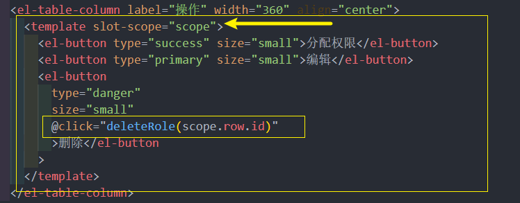

# 公司和角色
## 建立公司角色页面的基本结构


## 读取公司角色信息
封装公司角色请求，读取公司角色信息
### 读取角色列表数据
首先，封装读取角色的信息的请求 **src/api/setting.js**

> params 是查询参数，里面需要携带分页信息


然后，在页面created()中调用接口获取数据，绑定表格数据 **src/views/setting/index.vue**

####  **绑定表格数据**

#### **绑定分页数据**


### 读取 公司信息 数据
> 第二个tab页，同样需要读取数据
封装读取公司信息的api  **src/api/setting.js**


#### 初始化时调用接口
> 请求中的companyId来自哪里？它来自我们登录成功之后的用户资料，所以需要在该组件中使用vuex数据
```
  companyId: state => state.user.userInfo.companyId // 建立对于user模块的companyId的快捷访问
  computed: {
    ...mapGetters(['companyId'])
  },
```


#### 绑定公司表单数据


## 删除角色功能
实现删除角色的功能

**封装删除角色的api**  src/api/setting.js


#### 删除功能实现 


或 使用 async 


#### 删除按钮注册事

## 编辑角色功能
**目标**： 实现编辑角色的功能

### 封装编辑接口，新建编辑弹层
**封装编辑角色的功能 api**


#### 定义编辑弹层数据

#### 编辑弹层结构

### 实现编辑功能，为新增功能留口
#### 编辑功能实现（为新增功能留口）

#### 编辑按钮注册事件

## 新增角色功能
实现新增角色功能
#### 封装新增角色功能api

#### 新增功能实现和编辑功能合并（处理关闭）

#### 按钮注册事件
el-dialog  **@close事件** 绑定 btnCancel()方法

