# 登录模块
## 设置固定的本地访问端口
先将项目的**本地端口**和**网站名称**进行一下调整

**本地服务端口**:  在 **`vue.config.js`** 中进行设置

**vue.config.js** 就是vue项目相关的编译，配置，打包，启动服务相关的配置文件，它的核心在于**webpack**，但是又不同于webpack，相当于改良版的webpack， [文档地址](https://cli.vuejs.org/zh/)
 

**`.env.development`** 和 **`.env.production`** 两个文件

* 当我们运行**npm run dev**进行开发调试的时候,此时会加载执行 **`.env.development`** 文件内容
* 当我们运行**npm run build:prod**进行生产环境打包的时候,会加载执行 **`.env.production`** 文件内容

所以,如果想要设置开发环境的接口,直接在 **`.env.development`** 中写入对于 port 变量的赋值即可
```
# 设置端口号
port = 8888
```
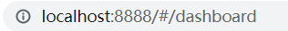

**网站名称**
## 登录表单校验
### el-form 的表单先决条件

### 手机号和密码的检验
view/login/index.js
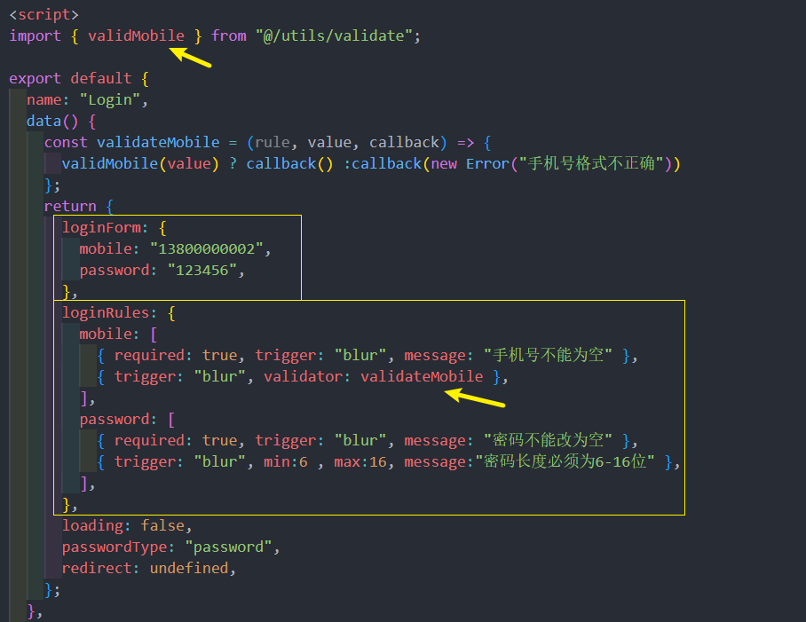
**utils/validate.js** 中, 增加了一个校验手机号的方法
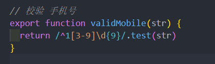
### 修饰符
事件的几个修饰符 **`@keyup.enter.native`** 和 **`@click.native.prevent`** 

@keyup.enter 属于按键修饰符，如果我们想监听在按回车键的时候触发，可以如下编写

```
<input v-on:keyup.enter="submit">
```

@keyup.enter.native 表示监听组件的原生事件，比如 keyup 就是于input的原生事件，这里写 native 表示 keyup 是一个原生事件

## Vue-Cli配置跨域代理

### 为什么会出现跨域？
当下,最流行的就是**前后分离**项目,前端项目和后端接口并不在一个域名之下，那么前端项目访问后端接口必然存在**跨域**的行为
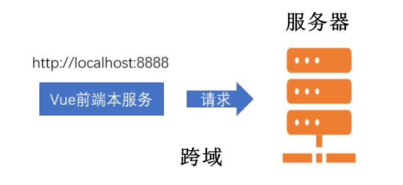

> 怎么解决这种跨域 ？

*开发时所遇到的这种跨域是位于**开发环境**的，真正部署上线时的跨域是**生产环境**的*
### 解决开发环境的跨域问题
vue-cli为我们在本地 **开启了一个服务**,可以通过这个服务帮我们 **代理请求** ,解决跨域问题

这就是 vue-cli 配置**webpack 的反向代理**
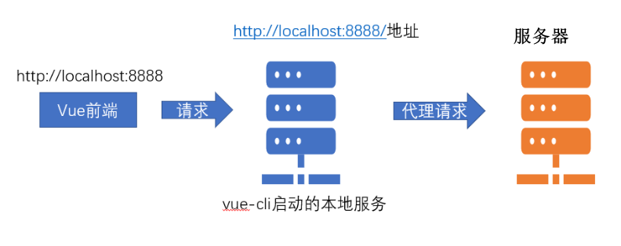

* **采用 vue-cli 的代理配置**

vue-cli 的配置文件即**vue.config.js**,这里有我们需要的 [代理选项](https://cli.vuejs.org/zh/config/#devserver-proxy)
```js 
module.exports = {
  devServer: {
   // 代理配置
    proxy: {
        // 这里的api 表示如果我们的请求地址有/api的时候,就出触发代理机制
        // localhost:8888/api/abc  => 代理给另一个服务器
        // 本地的前端  =》 本地的后端  =》 代理我们向另一个服务器发请求 （行得通）
        // 本地的前端  =》 另外一个服务器发请求 （跨域 行不通）
        '/api': {
        target: 'www.baidu.com', // 我们要代理的地址
        changeOrigin: true, // 是否跨域 需要设置此值为true 才可以让本地服务代理我们发出请求
         // 路径重写
        pathRewrite: {
            // 重新路由  localhost:8888/api/login  => www.baidu.com/api/login
            '^/api': '' // 假设我们想把 localhost:8888/api/login 变成www.baidu.com/login 就需要这么做 
        }
      },
    }
  }
}
```
在这个项目里面 : 
```js
 // 代理跨域的配置
    proxy: {
       // 当我们的本地的请求 有/api的时候，就会代理我们的请求地址向另外一个服务器发出请求
      '/api': {
        target: 'http://ihrm-java.itheima.net/', // 跨域请求的地址
        changeOrigin: true // 只有这个值为 true 的情况下 才表示开启跨域
      }
    }
```
**注意**: 并没有进行**pathRewrite**,因为后端接口就是`ihrm-java.itheima.net/api`这种格式,所以不需要重写

## 封装单独的登录接口
查阅接口文档中的登录接口

api/user.js 登录接口
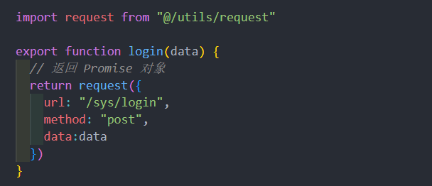

不需要加 '/api' , 因为所有的接口都要跨域 表示所有的接口都带 /api

## 封装Vuex中的登录Action并处理token
在vuex中封装登录的action,并处理token
### 在 Vuex 中对 token 进行管理
在传统模式中，我们登录的逻辑很简单，如图

上图中，组件直接和接口打交道，这并没有什么问题，但是对于用户 token 这一高频使用的**钥匙**，我们需要让 Vuex 来介入，将用户的 token 状态共享，更方便的读取，如图
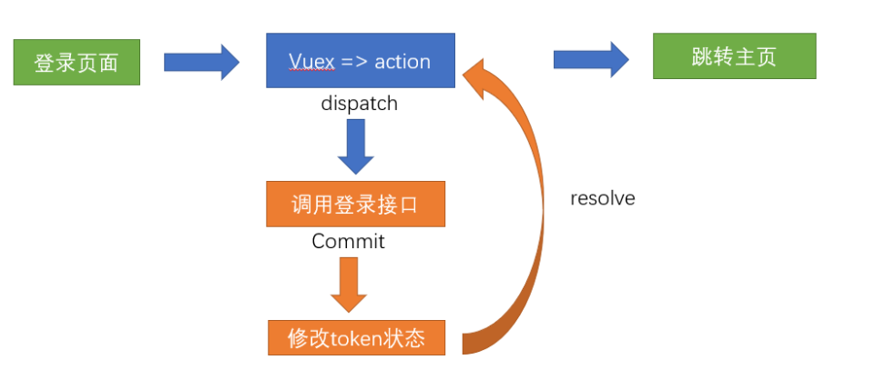
 
#### 实现store/modules/user.js基本配置
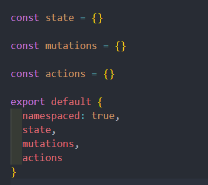
#### 设置 token 的共享状态
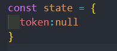

需要知道,**钥匙**不能每次都通过登录获取, 可以将 token 放置到本地的缓存中

在**utils/auth.js**中, 基础模板已经为我们提供了**`获取token`**,**`设置token`**,**`删除token`**的方法, 可以直接使用

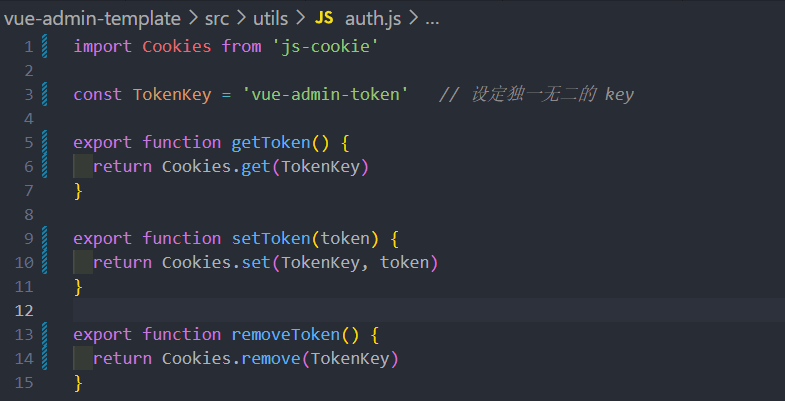
#### 初始化 token 状态 - store/modules/user.js
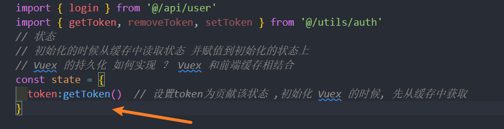
#### 提供能修改 token 的 mutations
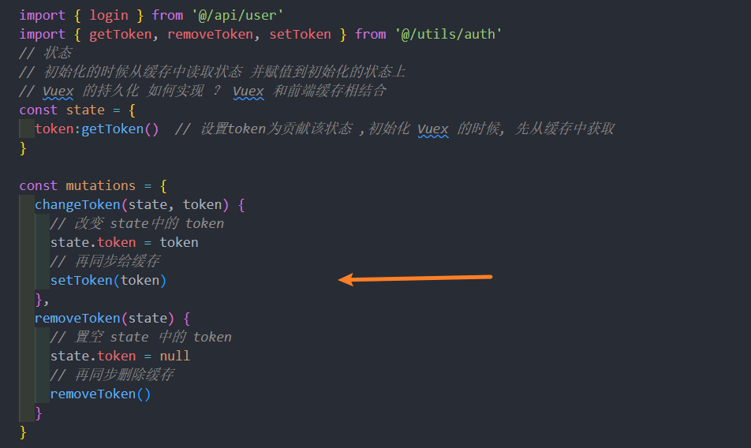

### 封装登录的 Action
登录的 action 其实就是要给组件调用的

登录 action 要做的事情 : **调用登录接口**,**成功后设置 token 到 vuex**, **失败则返回失败**
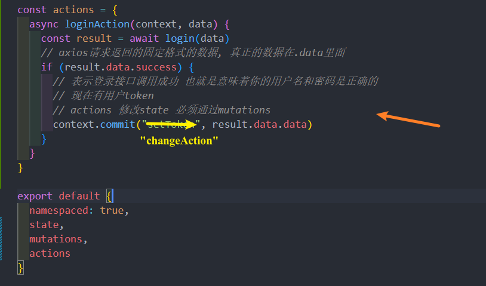

除此之外，为了**更好的让其他模块和组件更好的获取 token 数据**，我们可以在**`store/getters.js`**中将 token 值作为公共的访问属性放出
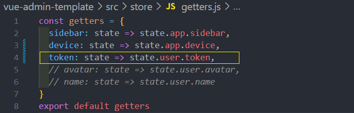

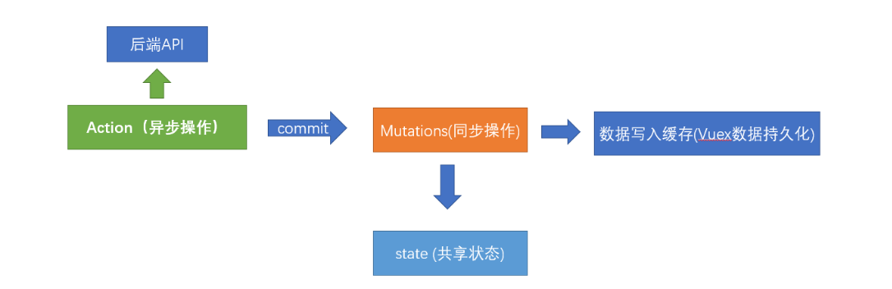
## request 中环境变量和异常的处理
### 区分 axios 在不同环境中的请求基础地址
为什么会有环境变量之分?
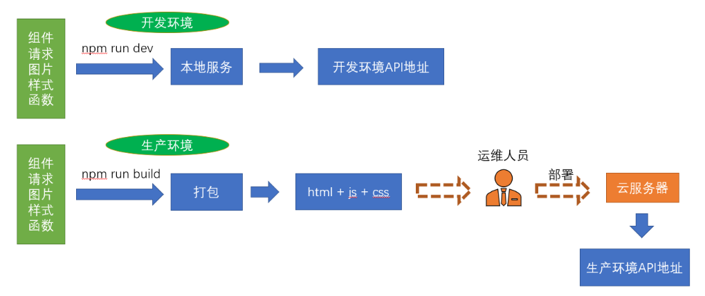

开发环境实际上就是在自己的本地开发或者要求不那么高的环境，但是一旦进入生产，就是**真实的数据**。 拿银行作比喻，如果在开发环境拿生产环境的接口做测试，银行系统就会发生很大的风险

前端主要区分两个环境 , **开发环境**,**生产环境**

#### 环境变量
```
process.env.NODE_ENV // 当为 production 时为生产环境 为 development 时为开发环境
```
#### 环境文件
可以在**`.env.development`**和**`.env.production`**定义变量，变量自动就为当前环境的值
 
基础模板在以上文件定义了变量**`VUE_APP_BASE_API`**，该变量可以作为 axios 请求的**baseURL**

在基础模板中,两个值分别为**`/dev-api`**和**`/prod-api`**

但是我们的**开发环境代理**是**/api**，所以要统一下

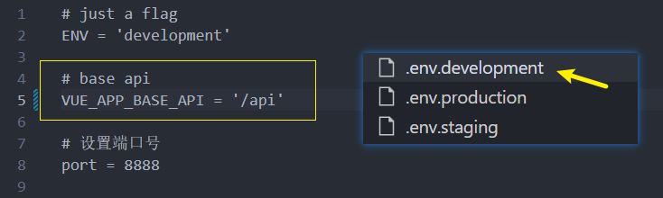

#### 在request中设置baseURL
utils/request.js 
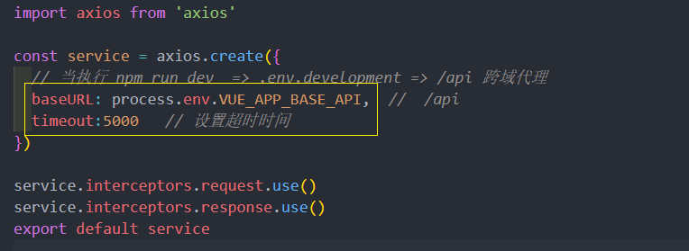
### 处理 axios 的响应拦截器
axios 返回的数据中默认增加了一层**data 的包裹**, 需要在这里处理下

并且,人资项目的接口, 如果执行失败,只是设置了**success**为**`false`**，并没有 reject，所以也需要一并处理下

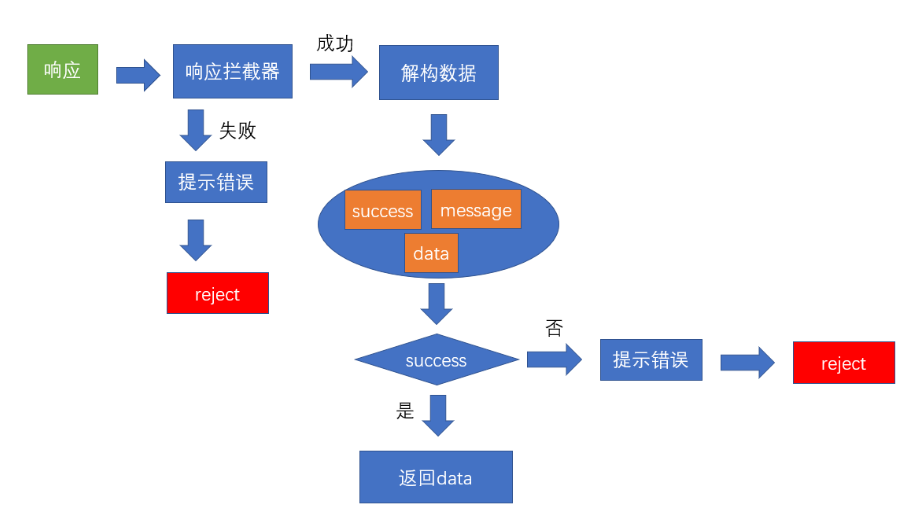
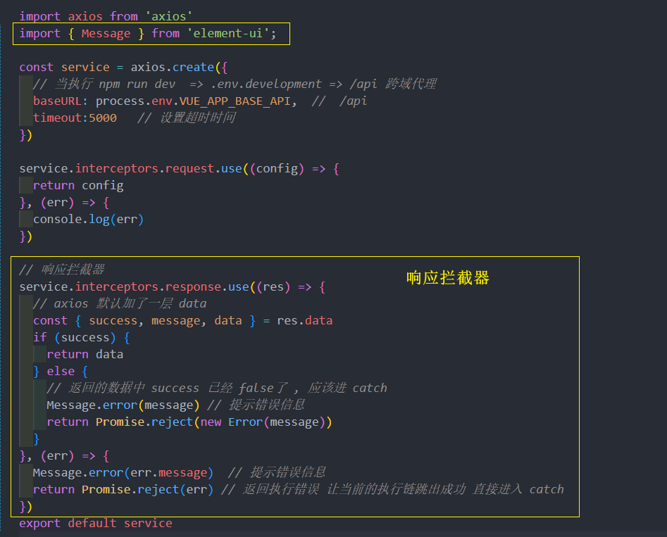
既然在 request 中已经默认去除了一层 data 的外衣，所以也将上一次 login 的 action 进行一下改动
#### 处理登录的返回结构问题
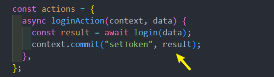

## 登录页面调用登录 action, 处理异常 (细节多)
目标 : 调用 vuex 中的登录 action ,并跳转到主页
 
#### 组件内引入 actions 辅助函数

#### 引入action方法
这里采用直接引入模块 action 的方式，后面要采用分模块的引用方式
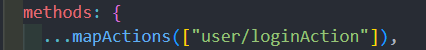
#### 调用登录
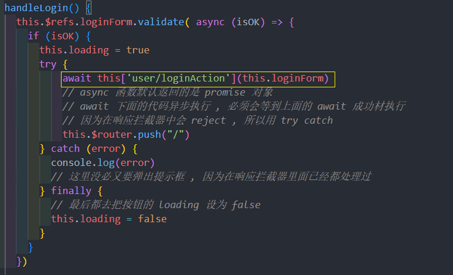
不论执行try 还是catch  都去关闭转圈 , 在 finally 里面 loading 设为 false

调用的是Vuex中子模块的 action，该模块我们进行了namespaced: true，所以引用 action 时需要带上**user/**, 并且在使用该方法时，直接使用 **`this['user/login']`**, 使用 this.user/login 语法是错误的
