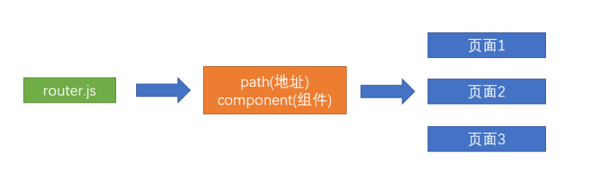
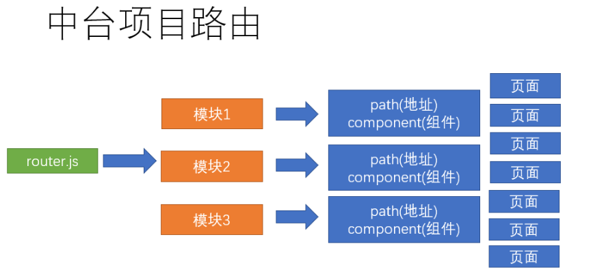
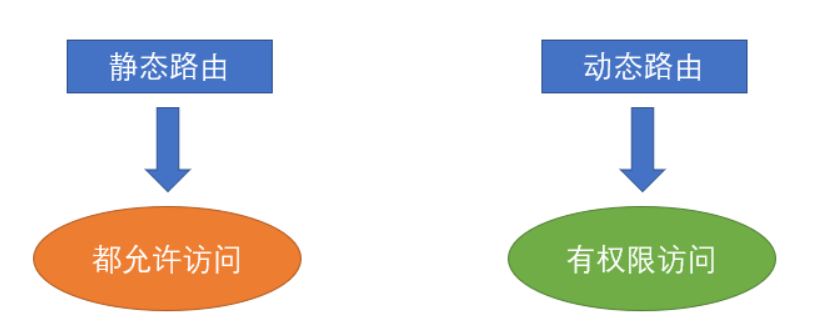
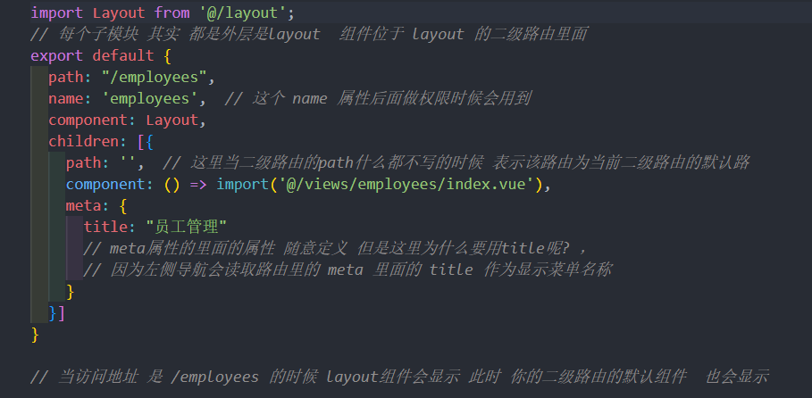
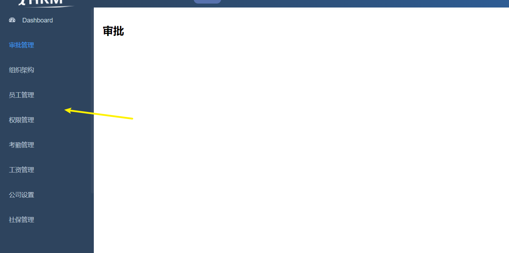
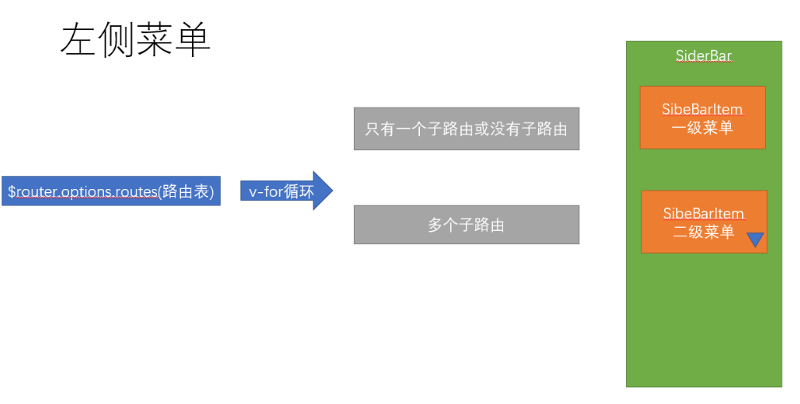
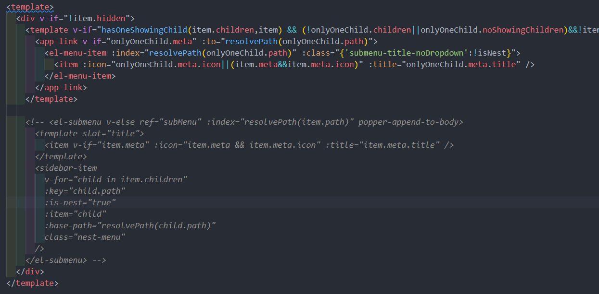
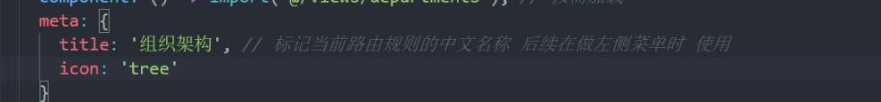

# 路由和页面
首先，需要知道类似大型中台项目的页面路由是如何设置的
#### 简单项目

#### 当前项目结构

> 为什么要拆成若干个路由模块呢？ 

因为复杂中台项目的页面众多，不可能把所有的业务都集中在一个文件上进行管理和维护，并且还有最重要的，前端的页面中主要分为两部分，一部分是所有人都可以访问的， 一部分是只有有权限的人才可以访问的，拆分多个模块便于更好的控制
#### 静态路由和动态路由

#### 静态路由表
```js
export const constantRoutes = [
  {
    path: '/login',
    component: () => import('@/views/login/index'),
    hidden: true
  },

  {
    path: '/404',
    component: () => import('@/views/404'),
    hidden: true
  },

  {
    path: '/',
    component: Layout,
    redirect: '/dashboard',
    children: [{
      path: 'dashboard',
      name: 'Dashboard',
      component: () => import('@/views/dashboard/index'),
      meta: { title: 'Dashboard', icon: 'dashboard' }
    }]
  },

  // 404 page must be placed at the end !!!
  { path: '*', redirect: '/404', hidden: true }
]
```

## 业务模块页面的快速搭建
快速搭建人资项目的常规业务模块
### 新建模块的页面和路由文件
```
├── dashboard           # 首页
├── login               # 登录
├── 404                 # 404
├── departments         # 组织架构
├── employees           # 员工
├── setting             # 公司设置
├── salarys             # 工资
├── social              # 社保
├── attendances         # 考勤
├── approvals           # 审批
├── permission          # 权限管理
```
在 views 目录下，建立对应的目录，给每个模块新建一个**`index.vue`**，作为每个模块的主页
#### 快速新建文件夹
```sh
mkdir departments employees setting salarys social attendances approvals permission
```
每个模块的内容，可以先按照标准的模板建立
```vue
<template>
  <div class="dashboard-container">
    <div class="app-container">
      <h2>
        员工
      </h2>
    </div>
  </div>
</template>

<script>
export default {

}
</script>

<style>

</style>
```
根据以上的标准建立好对应页面之后，接下来建立每个模块的路由规则

路由模块目录结构
```
├── router               # 路由目录
 ├── index.js            # 路由主文件
 ├── modules             # 模块目录
  ├── departments.js     # 组织架构
  ├── employees.js       # 员工 
  ├── setting.js         # 公司设置
  ├── salarys.js         # 工资
  ├── social.js          # 社保
  ├── attendances.js     # 考勤
  ├── approvals.js       # 审批
  ├── permission.js      # 权限管理
```
快速创建命令
```sh
touch departments.js employees.js setting.js salarys.js salarys.js social.js attendances.js approvals.js permission.js
```
### 设置每个模块的路由规则
> 每个模块导出的内容表示该模块下的路由规则

如员工 **employees.js**

上述代码中，我们用到了meta属性，该属性为一个对象，里面可放置自定义属性，主要用于读取一些配置和参数，并且值得 **注意** 的是：meta写了二级默认路由上面，而不是一级路由，因为当存在二级路由的时候，访问当前路由信息访问的就是 **`二级默认路由`**

## 静态路由和动态路由临时合并，形成左侧菜单
将静态路由和动态路由的路由表进行临时合并

> 为啥先临时合并 ?
态路由是需要权限进行访问的，但是权限的动态路由访问是很复杂的，稍后在进行总结，所以为了更好地看到效果，可以先将 静态路由和动态路由进行合并

#### 路由主文件 **src/router/index.js**
```js
// 引入多个模块的规则
import approvalsRouter from './modules/approvals'
import departmentsRouter from './modules/departments'
import employeesRouter from './modules/employees'
import permissionRouter from './modules/permission'
import attendancesRouter from './modules/attendances'
import salarysRouter from './modules/salarys'
import settingRouter from './modules/setting'
import socialRouter from './modules/social'

// 动态路由
export const asyncRoutes = [
  approvalsRouter,
  departmentsRouter,
  employeesRouter,
  permissionRouter,
  attendancesRouter,
  salarysRouter,
  settingRouter,
  socialRouter
]
const createRouter = () => new Router({
  // mode: 'history', // require service support
  scrollBehavior: () => ({ y: 0 }), // 管理滚动行为 如果出现滚动 切换就让 让页面回到顶部
  routes: [...constantRoutes, ...asyncRoutes] // 临时合并所有的路由
})
```

当合并权限完成，我们惊奇的发现页面效果已经左侧的导航菜单 =》 路由页面

## 左侧菜单的显示逻辑 ，设置菜单图标
分析左侧菜单的显示逻辑，  设置左侧导航菜单的图标内容
> 上面集成了路由，菜单就显示内容了，这是为什么 ？


项目不需要二级菜单的显示，所以对代码进行一下处理，只保留一级菜单路由

通过代码发现，当路由中的属性 **hidden** 为true时，表示该路由不显示在左侧菜单中

#### **模块对应icon**
```
├── dashboard           # dashboard
├── departments         # tree
├── employees           # people
├── setting             # setting
├── salarys             # money
├── social              # table
├── attendances         # skill
├── approvals           # tree-table
├── permission          # lock
```

按照对应的 icon 设置图标