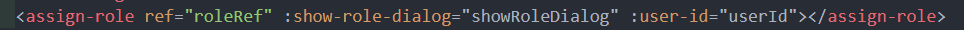
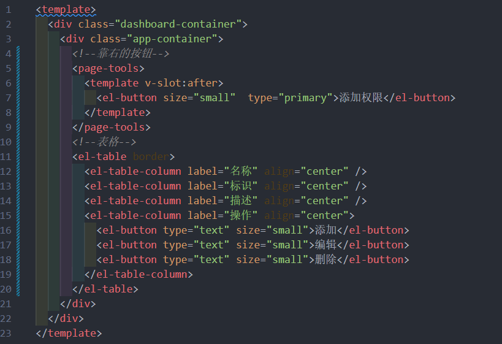
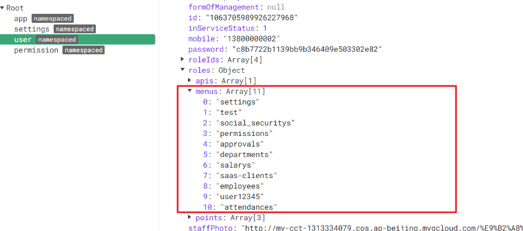

# 权限
## 1. 权限设计-RBAC的权限设计思想
> 了解下什么是传统的权限设计


从上面的图中，可以发现，传统的权限设计是对每个人进行单独的权限设置，但这种方式已经不适合目前企业的高效管控权限的发展需求，因为每个人都要单独去设置权限

> 基于此，RBAC的权限模型就应运而生了，RBAC(Role-Based Access control) ，也就是基于角色的权限分配解决方案，相对于传统方案，RBAC提供了中间层Role（角色），其权限模式如下


RBAC 实现了用户和权限点的分离，想对某个用户设置权限，只需要对该用户设置相应的角色即可，而该角色就拥有了对应的权限，这样一来，权限的分配和设计就做到了极简，高效，当想对用户收回权限时，只需要收回角色即可，

## 2. 给分配员工角色
在员工管理页面，分配角色
### 2.1 新建分配角色窗体
> 在之前, 员工管理的角色功能，并没有实现，此章节我们实现给员工分配角色


从上图中，可以看出，用户和角色是 **`1对多`** 的关系，即一个用户可以拥有多个角色，比如公司的董事长可以拥有总经理和系统管理员一样的角色

首先，新建分配角色弹窗组件 **`assign-role.vue`** 	


### 2.2 获取角色列表和当前用户角色
#### 获取所有角色列表

并显示多选框

#### 获取用户的当前所属角色


#### 点击角色弹出层  index.vue 



### 2.3 给员工分配角色 确定-取消

**分配角色接口**  **`api/employees.js`**


**确定保存 - 取消**  **`assign-role.vue`**


**绑定事件**


## 3. 权限点管理页面开发
完成权限点页面的开发和管理
### 3.1 新建权限点管理页面
> 人已经有了角色， 那么权限是什么

在企业服务中，权限一般分割为 **页面访问权限**，**按钮操作权限**，**API访问权限**

> API权限多见于在后端进行拦截，所以我们这一版本只做**`页面访问`**和**`按钮操作授权`/**

由此，可以根据业务需求设计权限管理页面

**完成权限页面结构** **`src/views/permission/index.vue`**

封装权限管理的增删改查请求  **`src/api/permisson.js`**


### 3.2 获取权限数据并转化树形
el-table 展示属性数据


需要注意的是， 如果需要树表， 需要给**el-table**配置**row-key**属性 id , [el-table 树形数据展示](https://element.eleme.io/#/zh-CN/component/table#shu-xing-shu-ju-yu-lan-jia-zai)

> 当type为 1时为访问权限，type为2时为功能权限

> 下面还需要完成 新增权限 / 删除权限 / 编辑权限

### 3.3 新增编辑权限的弹层
新增权限/编辑权限弹层


### 3.4 新增，编辑，删除权限点 (细节多)

新增/ 删除/ 编辑 逻辑 


绑定


## 4. 给角色分配权限
 完成给角色分配权限的业务

### 4.1 新建分配权限弹出层
封装分配权限的api  **`src/api/setting.js`**

**给角色分配权限弹出层**

**定义数据**

**点击分配权限**


### 4.2 给角色分配权限


##  5. 权限应用 - 页面访问和菜单
在当前项目应用用户的页面访问权限
### 5.1 权限受控的主体思路
在上面，已经给用户分配了角色， 给角色分配了权限，那么在用户登录获取资料的时候，会自动查出该用户拥有哪些权限，这个权限需要和我们的菜单还有路由有效结合起来

> 动态权限其实就是根据用户的实际权限来访问的，接下来操作一下


在权限管理页面中，设置了一个**标识**， 这个标识可以和我们的路由模块进行关联，也就是说，如果用户拥有这个标识，那么用户就可以**拥有这个路由模块**，如果没有这个标识，就不能**访问路由模块**

> 用什么来实现？

vue-router 提供了一个叫做[addRoutes](https://router.vuejs.org/zh/api/#router-addroutes)的API方法，这个方法的含义是**动态添加路由规则**

思路如下


### 5.2 新建 Vuex 中管理权限的模块
可以在vuex中新增一个permission模块
> 为什么用Vuex ?  最后面有必要用 state里的 routes 加载左侧的菜单, 还有下面原因

**`src/store/modules/permission.js`**


在 Vuex 管理模块中引入 permisson 模块


### 5.3 Vuex 筛选权限路由
> 将用户的标识和权限进行关联


访问权限的数据在用户属性 **`menus`** 中

> 可以将路由模块的根节点**`name`**属性命名和权限标识一致，这样只要标识能对上，就说明用户拥有了该权限


**接下来， vuex的permission中提供一个action，进行关联**


### 5.4 权限拦截出调用筛选权限Action


在拦截的位置，调用关联action， 获取新增 routes，并且 **addRoutes**


### 5.5 静态路由动态路由解除合并
**注意**： 这里有个非常容易出问题的位置，当我们判断用户是否已经添加路由的前后，不能都是用**next()**，

在添加路由之后应该使用 **next(to.path)**， 否则会使刷新页面之后 权限消失，这属于一个vue-router的**已知缺陷**

同时，不要忘记，将原来的静态路由 + 动态路由合体的模式 改成 只有静态路由  **`src/router/index.js`**


此时，已经完成了权限设置的一半， 此时发现左侧菜单失去了内容，这是因为左侧菜单读取的是固定的路由，我们要把它换成实时的最新路由

在 **`src/store/getters.js`** 配置导出routes


## 6. 登出时，重置路由权限 和 404问题
> 在上面，看似完成了访问权限的功能，实则不然，因为当我登出操作之后，虽然看不到菜单，但是用户实际上可以访问页面，直接在地址栏输入地址就能访问

这是怎么回事？

> 这是因为前面在**addRoutes**的时候，一直都是在**加**，登出的时候，我们并没有删，也没有重置，也就是说，之前加的路由在登出之后一直在，这怎么处理？

去留意**router/index.js**文件，发现一个重置路由方法


这个方法就是将路由重新实例化，相当于换了一个新的路由，之前 **`加的路由`** 自然不存在了 ，**只需要在登出的时候**， 处理一下即可

user模块中: 


除此之外，发现在页面刷新的时候，本来应该拥有权限的页面出现了404，这是因为 404 的匹配权限放在了静态路由，而动态路由在没有addRoutes之前，找不到对应的地址，就会显示404，所以**需要将404放置到动态路由的最后**


如上图不能放在静态路由最后面(直接删掉) , 需要放在动态路由后面 

**src/permission.js**


## 7. 功能权限应用
## 7.1 功能权限的受控思路
> 上面，当拥有了一个模块，一个页面的访问权限之后，页面中的某些功能，用户可能有，也可能没有，这就是功能权限

这就是查询出来的数据中的 **`points`**
 
> 比如，想对员工管理的删除功能做个权限怎么做？

首先需要在员工管理的权限点下， 新增一个删除权限点，启用


> 现在要做的就是看看用户，是否拥有**page-user-delete**这个point，有就可以让删除能用，没有就隐藏或者禁用

## 7.2 使用Mixin技术将检查方法注入
所以，可以采用一个新的技术 [mixin(混入)](https://cn.vuejs.org/v2/guide/mixins.html)来让所有的组件可以拥有一个公共的方法

**`src/mixin/checkPermission.js`**


main.js
```js
import CheckPermission from "@/mixin/checkPermission.js"
Vue.mixin(CheckPermission)
```

在员工组件中检查权限点
```html
<el-button :disabled="!checkPermission('POINT-USER-UPDATE')" type="text" size="small" @click="$router.push(`/employees/detail/${obj.row.id}`)">查看</el-button>
```
