# 主页 
## 1. 首页显示用户资料
> 直接获取Vuex的用户资料即可

createNamespacedHelpers 
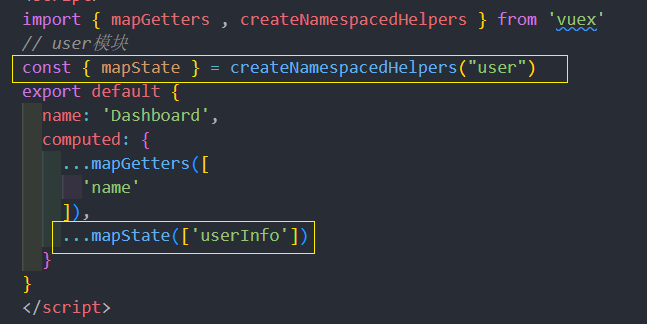

在 vue视图中绑定
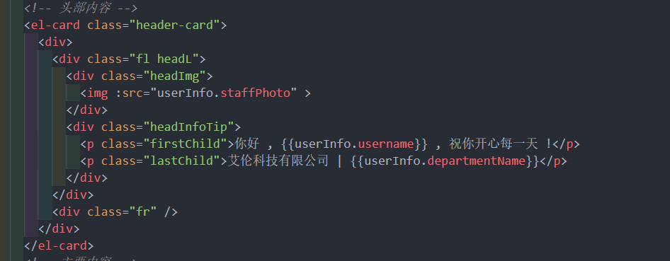

## 2. 工作日历组件封装
### 2.1 新建工作日历组件结构
> 工作日历的要求很简单，显示每个月的日期，可以设定日期的范围

可以基于Element组件[el-calendar](https://element.eleme.cn/#/zh-CN/component/calendar)进行封装
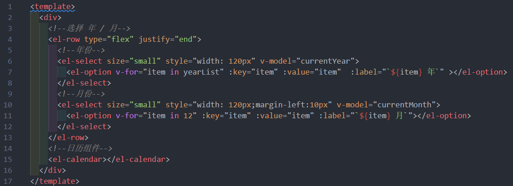
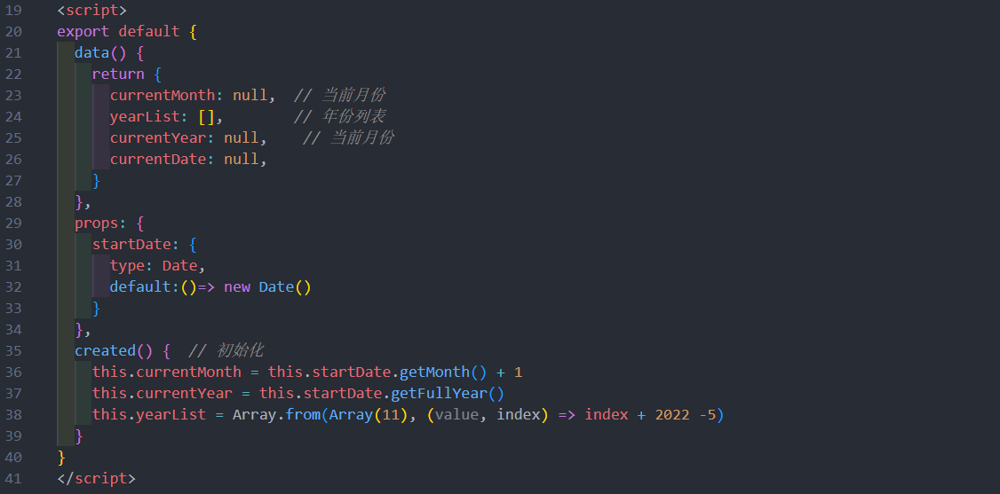
### 2.2 实现工作日历逻辑
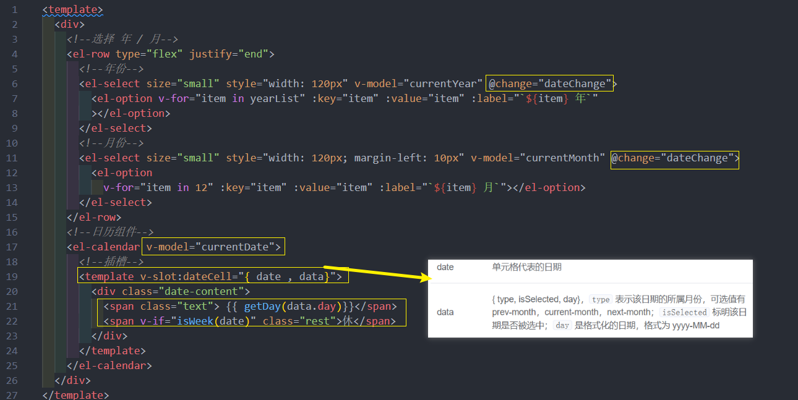
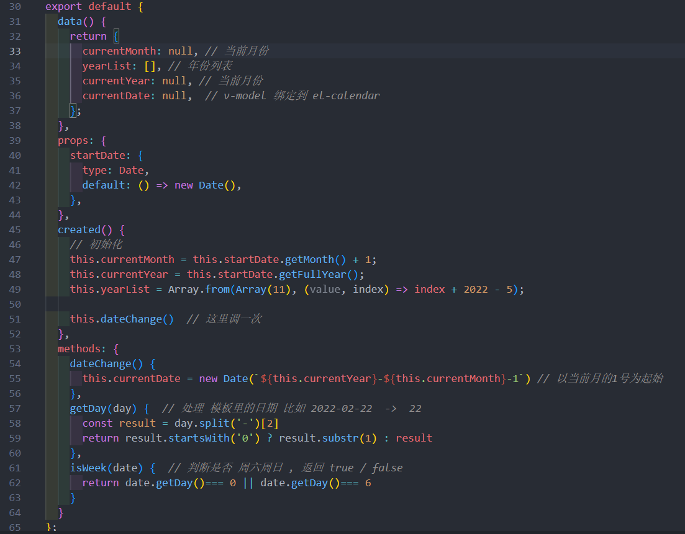

完整代码 : 
```vue
<template>
  <div>
    <!--选择 年 / 月-->
    <el-row type="flex" justify="end">
      <!--年份-->
      <el-select size="small" style="width: 120px" v-model="currentYear" @change="dateChange">
        <el-option v-for="item in yearList" :key="item" :value="item" :label="`${item} 年`"
        ></el-option>
      </el-select>
      <!--月份-->
      <el-select size="small" style="width: 120px; margin-left: 10px" v-model="currentMonth" @change="dateChange">
        <el-option
          v-for="item in 12" :key="item" :value="item" :label="`${item} 月`"></el-option>
      </el-select>
    </el-row>
    <!--日历组件-->
    <el-calendar v-model="currentDate">
      <!--插槽-->
      <template v-slot:dateCell="{ date , data}">
        <div class="date-content">
          <span class="text"> {{ getDay(data.day)}}</span>
          <span v-if="isWeek(date)" class="rest">休</span>
        </div>
      </template>
    </el-calendar>
  </div>
</template>

<script>
export default {
  data() {
    return {
      currentMonth: null, // 当前月份
      yearList: [], // 年份列表
      currentYear: null, // 当前月份
      currentDate: null,  // v-model 绑定到 el-calendar
    };
  },
  props: {
    startDate: {
      type: Date,
      default: () => new Date(),
    },
  },
  created() {
    // 初始化
    this.currentMonth = this.startDate.getMonth() + 1;
    this.currentYear = this.startDate.getFullYear();
    this.yearList = Array.from(Array(11), (value, index) => index + 2022 - 5);

    this.dateChange()  // 这里调一次
  },
  methods: {
    dateChange() {
      this.currentDate = new Date(`${this.currentYear}-${this.currentMonth}-1`) // 以当前月的1号为起始
    },
    getDay(day) {  // 处理 模板里的日期 比如 2022-02-22  ->  22
      const result = day.split('-')[2]
      return result.startsWith('0') ? result.substr(1) : result
    },
    isWeek(date) {  // 判断是否 周六周日 , 返回 true / false
      return date.getDay()=== 0 || date.getDay()=== 6
    }
  }
};
</script>

<style scoped>
/deep/ .el-calendar-day {
  height: auto;
}
/deep/ .el-calendar-table__row td,
/deep/ .el-calendar-table tr td:first-child,
/deep/ .el-calendar-table__row td.prev {
  border: none;
}
.date-content {
  height: 40px;
  text-align: center;
  line-height: 40px;
  font-size: 14px;
}
.date-content .rest {
  color: #fff;
  border-radius: 50%;
  background: rgb(250, 124, 77);
  width: 20px;
  height: 20px;
  line-height: 20px;
  display: inline-block;
  font-size: 12px;
  margin-left: 10px;
}
.date-content .text {
  width: 20px;
  height: 20px;
  line-height: 20px;
  display: inline-block;
}
/deep/ .el-calendar-table td.is-selected .text {
  background: #409eff;
  color: #fff;
  border-radius: 50%;
}
/deep/ .el-calendar__header {
  display: none;
}
</style>
```
## 3. 封装雷达图显示在首页
###  3.1 封装雷达图插件
```vue
<template>
  <div ref="radarRef" :style="{ width: '500px', height: '300px' }"></div>
</template>

<script>
// 引入 echarts 核心模块，核心模块提供了 echarts 使用必须要的接口。
import * as echarts from 'echarts/core';
// 引入柱状图图表，图表后缀都为 Chart
import { RadarChart } from 'echarts/charts';
// 引入提示框，标题，直角坐标系，数据集，内置数据转换器组件，组件后缀都为 Component
import {
  TitleComponent,
  TooltipComponent,
  GridComponent,
  DatasetComponent,
  TransformComponent
} from 'echarts/components';
// 标签自动布局，全局过渡动画等特性
import { LabelLayout, UniversalTransition } from 'echarts/features';
// 引入 Canvas 渲染器，注意引入 CanvasRenderer 或者 SVGRenderer 是必须的一步
import { CanvasRenderer } from 'echarts/renderers';

// 注册必须的组件
echarts.use([
  TitleComponent,
  TooltipComponent,
  GridComponent,
  DatasetComponent,
  TransformComponent,
  RadarChart,
  LabelLayout,
  UniversalTransition,
  CanvasRenderer
]);

export default {
  mounted() {
    const echartsInstance = echarts.init(this.$refs.radarRef);
    const option = {
    title: {
        text: '基础雷达图'
      },
      tooltip: {},
      radar: {
        // shape: 'circle',
        name: {
          textStyle: {
            color: '#fff',
            backgroundColor: '#999',
            borderRadius: 3,
            padding: [3, 5]
          }
        },
        // 每个区域的最高值
        indicator: [
          { name: '工作效率', max: 100 },
          { name: '考勤', max: 100 },
          { name: '积极性', max: 100 },
          { name: '帮助同事', max: 100 },
          { name: '自主学习', max: 100 },
          { name: '正确率', max: 100 }
        ]
      },
      series: [{
        name: '预算 vs 开销（Budget vs spending）',
        type: 'radar',
        // areaStyle: {normal: {}},
        data: [
          {
            value: [90, 80, 80, 58, 80, 50],
            name: '张三'
          },
          {
            value: [40, 60, 70, 50, 50, 70],
            name: '李四'
          }
        ]
      }]
    };
    echartsInstance.setOption(option)
    window.addEventListener('resize', () => {
      echartsInstance.resize()
    })
  },
};
</script>
```
## 3. 审批流程业务的基本介绍

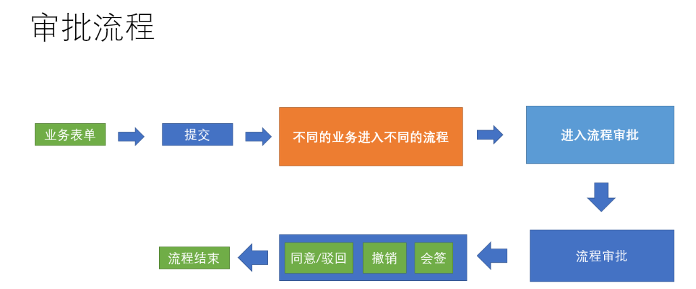
## 4. 提交一个 离职 审批
提交一个离职的审批，并完成业务流转
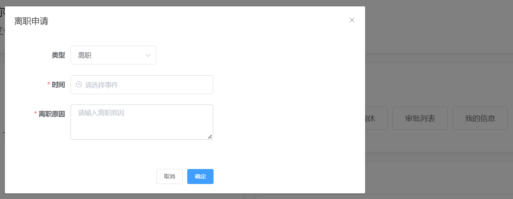
#### 离职弹层
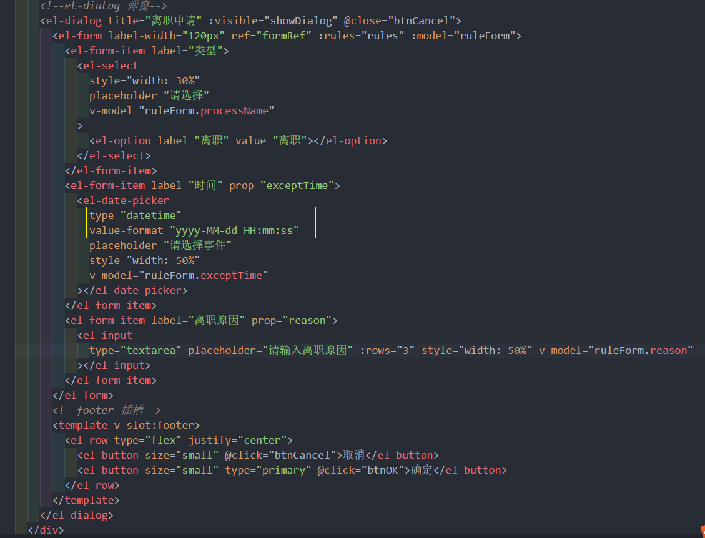
#### 显示弹层

#### 数据及校验
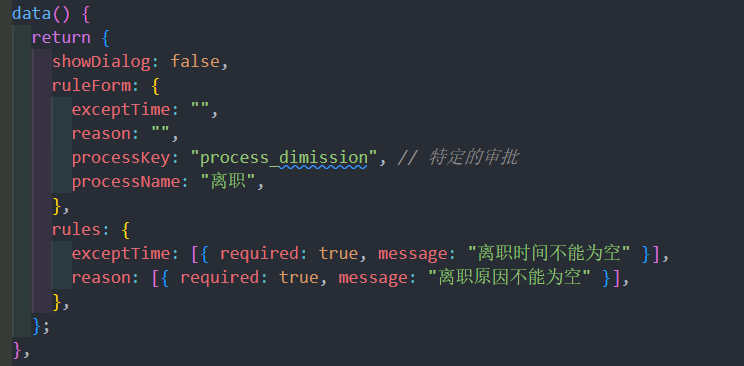
#### 提交审批逻辑
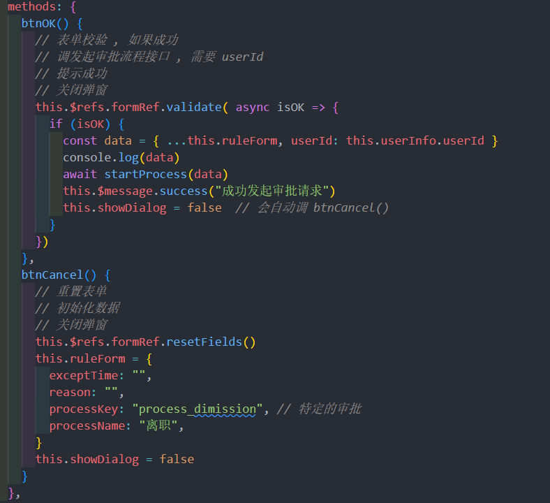
#### 配置审批列表的导航
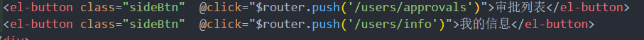