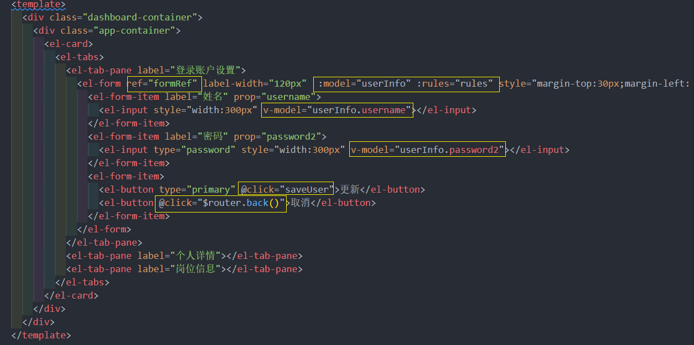
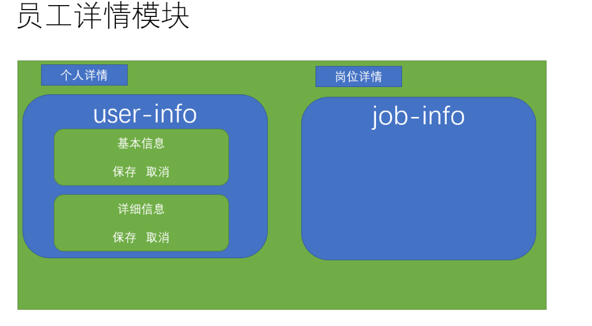

# 员工管理
## 1. 封装一个通用的工具栏
目标：封装一个通用的工具栏供使用
### 1.1通用工具栏的组件结构
> 在后续的业务开发中，经常会用到一个类似下图的工具栏，作为公共组件，进行一下封装


组件 **`src/components/PageTools/index.vue`**
```vue
<template>
  <el-card class="page-tools">
    <el-row type="flex" justify="space-between" align="middle">
      <el-col>
        <div  v-if="showBefore" class="before">
          <i class="el-icon-info" />
          <!-- 定义前面得插槽 -->
          <slot name="before" />
        </div>
      </el-col>
      <el-col>
        <el-row type="flex" justify="end">
           <!-- 定义后面的插槽 -->
           <slot name="after" />
        </el-row>
      </el-col>
    </el-row>
  </el-card>
</template>

<script>
export default {
  props: {
    showBefore: {
      type: Boolean,
      default: false
    }

  }
}
</script>

<style lang='scss'>
 .page-tools {
    margin: 10px 0;
    .before {
      line-height: 34px;
    i {
      margin-right: 5px;
      color: #409eff;
    }
    display: inline-block;
    padding: 0px 10px;
    border-radius: 3px;
    border: 1px solid rgba(145, 213, 255, 1);
    background: rgba(230, 247, 255, 1);
  }
 }
</style>
```
### 1.2 组件 统一注册
> 为了方便所有的页面都可以不用引用该组件，可以进行全局注册

提供注册入口 **`src/componets/index.js`**


> 在入口处进行注册 **`src/main.js`**


## 2. 员工列表页面的基本布局和结构
实现 员工列表 页面的基本布局和结构

**结构代码** **`src/employees/index.vue`**


## 3. 员工列表数据请求和分页加载
实现员工数据的加载和分页请求

首先，封装员工的加载请求 **`src/api/employees.js`**


然后，实现加载数据和分页的逻辑

绑定表格


## 4. 员工列表中的数据进行 格式化
将列表中的内容进行格式化
### 4.1 利用列格式化属性处理聘用形式

> 上面中，列表中的**聘用形式**/**入职时间**和**状态**等需要进行显示内容的处理

那么聘用形式中**1**代表什么含义，这实际上是我们需要的枚举数据，可以将枚举下的文件夹放于 **`src/api`** 文件夹下

针对**聘用形式**，可以使用 **el-table-column** 的 **formatter** 属性进行设置


### 4.2 过滤器解决时间格式的处理
针对入职时间，可以采用 el-table-column 的 **作用域插槽** 进行处理

```vue
 <el-table-column label="入职时间" sortable prop="timeOfEntry">
            <template slot-scope="obj">
              {{
                obj.row.timeOfEntry | 过滤器
              }}
            </template>
  </el-table-column>
```

> 问题来了，过滤器从哪里呢？

在 **`资源/过滤器`** 中，提供了若干工具方法，可以将其转化成过滤器，首先将其拷贝到 **`src`**

在 **`main.js`** 中将工具方法转化成过滤器

```js
import * as filters from '@/filters' // 引入工具类
// 注册全局的过滤器
Object.keys(filters).forEach(key => {
  // 注册过滤器
  Vue.filter(key, filters[key])
})
```

> 可以愉快的用过滤器的方式使用工具类的方法了

```vue
       <el-table-column label="入职时间" sortable="" align="center">
            <!-- 作用域插槽 -->
            <template slot-scope="{ row }">{{ row.timeOfEntry | formatDate }}</template>
       </el-table-column>
```

最后一项，账户状态，可以用开关组件 **switch** 进行显示

```vue
 <el-table-column label="账户状态" align="center" sortable="" prop="enableState">
            <template slot-scope="{ row }">
              <!-- 根据当前状态来确定 是否打开开关 -->
              <el-switch :value="row.enableState === 1" />
            </template>
    </el-table-column>
```
## 5. 删除员工功能
实现删除员工的功能

首先封装 删除员工 的请求接口  **src/api/employees.js**

#### 删除功能


## 6. 新增员工功能-弹层-校验-部门
实现 新增员工 的功能
### 6.1 新建员工弹层组件
> 当点击新增员工时，需要一个下图的弹层'


类似 **`组织架构`** 的组件，同样新建一个弹层组件 **`src/views/employees/components/add-employee.vue`**

### 6.2 引用弹出层，点击弹出
父组件中引用，弹出层


### 6.3 新增员工的表单校验
封装新增员工接口 **api **`src/api/employees.js`** 

针对员工属性，添加校验规则

绑定数据和规则校验

### 6.4 加载部门数据转化树形
**聘用形式**和**选择部门**的处理

> 员工的部门是从树形部门中选择一个部门 (如图)


#### 获取部门数据，转化树形


### 6.5 点击部门节点时赋值表单数据

#### 点击部门时触发


#### 聘用形式 

## 7. 新增员工功能-确定-取消 (掌握)
调用新增接口


绑定方法 


## 8. 员工 导入组件 封装
封装一个导入 excel 数据的文件

首先封装一个类似的组件，首先需要注意的是，类似功能，vue-element-admin已经提供了，我们只需要改造即可
[代码地址](https://github.com/PanJiaChen/vue-element-admin/blob/master/src/components/UploadExcel/index.vue)

> 类似功能性的组件，只需要会使用和封装即可 

excel导入功能需要使用 npm 包 **`xlsx`** ，所以需要安装 **`xlsx`**插件
```sh
npm i xlsx@0.14.1
```
> 将vue-element-admin提供的导入功能新建一个组件，位置： **`src/components/UploadExcel`**

#### 注册全局的导入excel组件
```js
import PageTools from './PageTools'
import UploadExcel from './UploadExcel'
export default {
  install(Vue) {
    Vue.component('PageTools', PageTools) // 注册工具栏组件
    Vue.component('UploadExcel', UploadExcel) // 注册导入excel组件
  }
}
```
#### 修改样式和布局
```vue
<template>
 <div class="upload-excel">
    <div class="btn-upload">
      <el-button :loading="loading" size="mini" type="primary" @click="handleUpload">
        点击上传
      </el-button>
    </div>

    <input ref="excel-upload-input" class="excel-upload-input" type="file" accept=".xlsx, .xls" @change="handleClick">
    <div class="drop" @drop="handleDrop" @dragover="handleDragover" @dragenter="handleDragover">
      <i class="el-icon-upload" />
      <span>将文件拖到此处</span>
    </div>
  </div>
</template>
<style scoped lang="scss">
.upload-excel {
  display: flex;
  justify-content: center;
   margin-top: 100px;
   .excel-upload-input{
       display: none;
        z-index: -9999;
     }
   .btn-upload , .drop{
      border: 1px dashed #bbb;
      width: 350px;
      height: 160px;
      text-align: center;
      line-height: 160px;
   }
   .drop{
       line-height: 80px;
       color: #bbb;
      i {
        font-size: 60px;
        display: block;
      }
   }
}
</style>
```
## 9. 员工的导入
实现员工的导入
### 9.1 建立公共导入的页面路由
新建一个公共的导入页面，挂载路由 **`src/router/index.js`**

**创建import路由组件** **`src/views/import/index.vue`**

### 9.2 分析excel导入代码，封装接口
组件源代码中 : 

把 excel文件打开 或 拖进去 , success函数会得到对象 , 包含两个数组 header 和 results


> 封装导入员工的 api 接口  


### 9.3 实现 excel 导入
**获取导入的excel数据, 导入excel接口**

> 为了让这个页面可以服务更多的导入功能，我们可以在页面中用参数来判断，是否是导入员工


当 excel 中有日期格式的时候，实际转化的值为一个数字，我们需要一个方法进行转化
```js
    formatDate(numb, format = "/") {
      const time = new Date((numb - 1) * 24 * 3600000 + 1)
      time.setYear(time.getFullYear() - 70)
      const year = time.getFullYear() + ''
      const month = time.getMonth() + 1 + ''
      const date = time.getDate() - 1 + ''
      if (format && format.length === 1) {
        return year + format + month + format + date
      }
      return year + (month < 10 ? '0' + month : month) + (date < 10 ? '0' + date : date)
    }
```
> 需要注意，**`导入的手机号不能和之前的存在的手机号重复

#### **逻辑判断**


#### 员工页面跳转

## 10. 员工导出 excel 功能
实现将员工数据导出功能

> 日常业务中，经常遇到excel导出功能， 怎么使用呢

Excel 的导入导出都是依赖于[js-xlsx](https://github.com/SheetJS/js-xlsx)来实现的。

在 `js-xlsx`的基础上又封装了[Export2Excel.js](https://github.com/PanJiaChen/vue-element-admin/blob/master/src/vendor/Export2Excel.js)来方便导出数据。

### 10.1 安装 excel 所需依赖和按需加载
由于 `Export2Excel`不仅依赖`js-xlsx`还依赖`file-saver`和`script-loader`。

所以需要安装如下命令：

```bash
npm install xlsx@0.14.1
npm install  file-saver@2.0.1 -S
npm install script-loader@0.7.2 -S -D
```

由于 `js-xlsx` 体积还是很大的，导出功能也不是一个非常常用的功能，所以使用的时候建议使用懒加载。使用方法如下：
```js
import('@/vendor/Export2Excel').then(excel => {
  excel.export_json_to_excel({
    header: tHeader, //表头 必填
    data, //具体数据 必填
    filename: 'excel-list', //非必填
    autoWidth: true, //非必填
    bookType: 'xlsx' //非必填
  })
})
```

简单例子: 


### 10.2 excel 导出参数的介绍
> vue-element-admin提供了导出的功能模块，在课程资源/excel导出目录下，放置到 src 目录下

**参数**

| 参数      | 说明                   | 类型    | 可选值                                                       | 默认值     |
| --------- | ---------------------- | ------- | ------------------------------------------------------------ | ---------- |
| header    | 导出数据的表头         | Array   | /                                                            | []         |
| data      | 导出的具体数据         | Array   | /                                                            | [[]]       |
| filename  | 导出文件名             | String  | /                                                            | excel-list |
| autoWidth | 单元格是否要自适应宽度 | Boolean | true / false                                                 | true       |
| bookType  | 导出文件类型           | String  | xlsx, csv, txt, [more](https://github.com/SheetJS/js-xlsx#supported-output-formats) | xlsx       |
### 10.3 excel 导出基本的结构(代码) + (导出 时间格式处理)
> 最重要的一件事，就是把表头 header和数据 data 进行相应的对应

因为数据中的 key 是英文，想要导出的表头是中文的话，需要将中文和英文做对应
```js
  const headers = {
        '手机号': 'mobile',
        '姓名': 'username',
        '入职日期': 'timeOfEntry',
        '聘用形式': 'formOfEmployment',
        '转正日期': 'correctionTime',
        '工号': 'workNumber',
        '部门': 'departmentName'
      }
```
然后，**完成导出代码**


### 10.4 扩展:复杂表头的导出
> 当需要导出复杂表头的时候，vue-element-admin同样支持该类操作

**vue-element-admin** 提供的导出方法中有 **multiHeader**和**merges** 的参数

| 参数        | 说明           | 类型  | 可选值 | 默认值 |
| ----------- | -------------- | ----- | ------ | ------ |
| multiHeader | 复杂表头的部分 | Array | /      | [[]]   |
| merges      | 需要合并的部分 | Array | /      | []     |

multiHeader里面是一个二维数组，里面的一个元素是一行表头，假设你想得到一个如图的结构


mutiHeader应该这样定义

```js
const multiHeader = [['姓名', '主要信息', '', '', '', '', '部门']]
```

multiHeader中的一行表头中的字段的个数需要和真正的列数相等，假设想要跨列，多余的空间需要定义成空串

它主要对应的是标准的表头

```js
const header = ['姓名', '手机号', '入职日期', '聘用形式', '转正日期', '工号', '部门']
```

如果，我们要实现其合并的效果， 需要设定merges选项

```js
 const merges = ['A1:A2', 'B1:F1', 'G1:G2']
```

merges的顺序是没关系的，只要配置这两个属性，就可以导出复杂表头的excel了


## 11. 员工详情页创建和布局
### 11.1 详情页的基本布局和路由

**建立详情页路由**

**建立基本架构**

**列表跳转到详情**

### 11.2 读取和保存用户信息的接口
**加载个人基本信息** > 该接口已经在之前写过了 **`src/api/user.js`**

**保存个人基本信息**  **`src/api/employees.js`**

### 11.3 实现用户名和密码的修改
**`注意`**：这里有个缺陷，接口中读取的是后端的密文，我们并不能解密，所以当我们没有任何修改就保存时，会校验失败，因为密文超过了规定的12位长度，为了真的修改密码，我们设定了一个临时的字段 **password2**，用它来存储我们的修改值，最后保存的时候，把**password2**传给**password**

#### **用户名和密码的修改**  **`src/views/employees/detail.vue`**

**绑定表单数据**

## 12. 个人组件和岗位组件封装
### 12.1 封装个人详情组件

封装个人组件**   **`src/views/employees/components/user-info.vue`**

略

在 detail.vue 组件中，注册并使用


在以上代码中，使用了动态组件**component**，它通过 **`is`**属性来绑定需要显示在该位置的组件，is 属性可以直接为 **`注册组件`** 的组件名称即可

### 12.2 封装改为组件
封装岗位组件**  **`src/views/employee/components/job-info.vue`**

略(都是表单 , 繁琐) 


**在detail.vue组件中，注册并使用**


## 13. 员工个人信息和岗位信息-读取-保存
实现个人信息的岗位信息的读取和校验，保存
### 13.1 读取个人保存个人信息

封装 **读取个人信息** **保存个人信息**  **读取岗位信息** **保存岗位信息**  

读取，保存个人信息**  **`user-info`**  需要注意：这里的保存实际上分成了两个接口，这是接口的设计，只能遵守

```js
import { getPersonalDetail, updatePersonal, saveUserDetailById } from '@/api/employees'
import { getUserDetailById } from '@/api/user'
 created() {
    this.getPersonalDetail()
    this.getUserDetailById()
  },
  methods: {
    async getPersonalDetail() {
      this.formData = await getPersonalDetail(this.userId) // 获取员工数据
    },
    async savePersonal() {
      await updatePersonal({ ...this.formData, id: this.userId })
      this.$message.success('保存成功')
    },
    async saveUser() {
    //  调用父组件
      await saveUserDetailById(this.userInfo)
      this.$message.success('保存成功')
    },
    async getUserDetailById() {
      this.userInfo = await getUserDetailById(this.userId)
    }
  }
```
### 13.2 读取保存岗位信息

**读取，保存岗位信息**  **`job-info`**
```js
  import { getEmployeeSimple, updateJob, getJobDetail } from '@/api/employees'

  created() {
    this.getJobDetail()
    this.getEmployeeSimple()
  },
  methods: {
    async getJobDetail() {
      this.formData = await getJobDetail(this.userId)
    },
    // 获取员工列表
    async getEmployeeSimple() {
      this.depts = await getEmployeeSimple()
    },
    // 保存岗位信息
    async saveJob() {
      await updateJob(this.formData)
      this.$message.success('保存岗位信息成功')
    }
  }
```


