# 主页模块
## 主页的 token 拦截处理
根据 token 处理主页的访问权限问题
### 权限拦截的流程图
根据有无token，进行页面访问的处理, 理解下面流程图
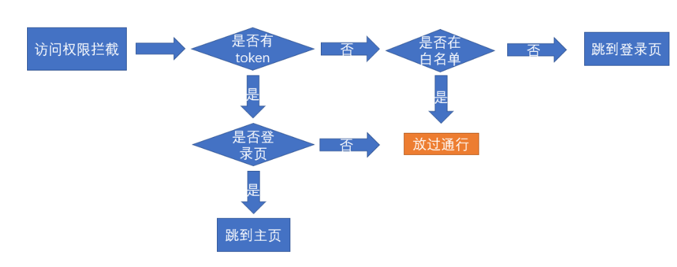
已经知道**`src/permission.js`**是专门处理路由权限的，所以在这里处理
### 流程图转化成代码
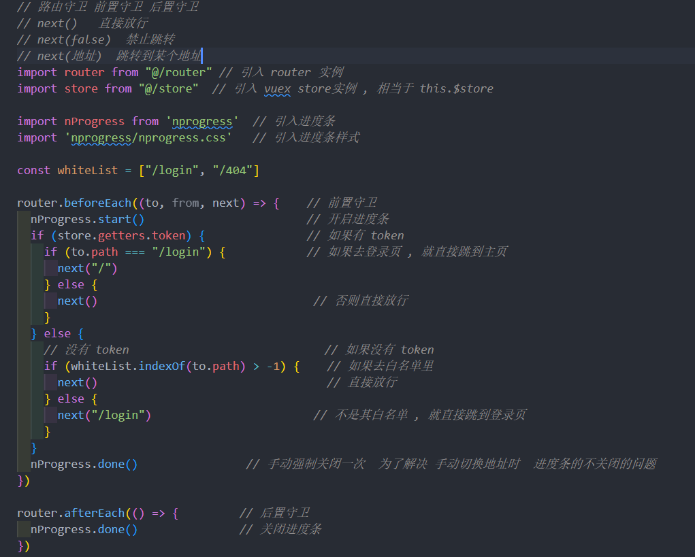
在导航守卫的位置，添加了 NProgress 的插件，可以完成跳转时的进度条效果
## 获取用户资料接口和 token 注入
封装获取用户资料的资料信息 , 现在需要通过接口调用的方式获取当前用户的资料信息
#### 获取用户资料接口 
接口文档: 
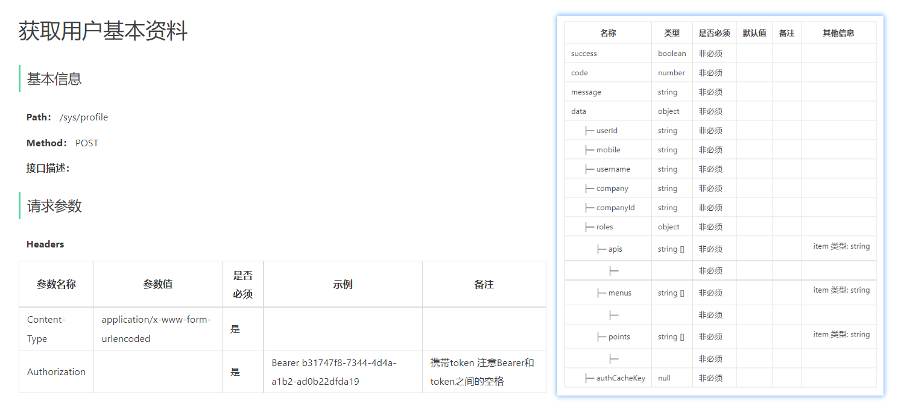

在 **`src/api/user.js`** 中封装获取用户资料的方法
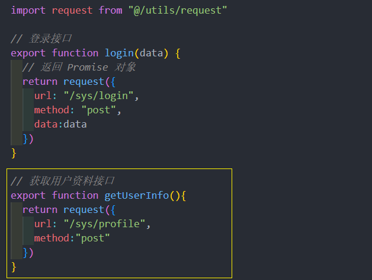
> 我们的headers参数并没有在这里传入，为什么呢 ? 

headers中的**Authorization**相当于我们**开门**（**调用接口**）时**钥匙(token)**，我们在打开任何带安全权限的门的时候都需要 **钥匙(token)** 如图
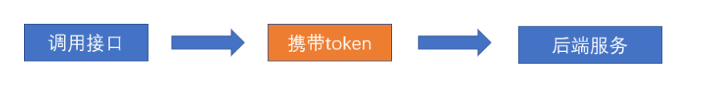

每次在接口中携带 **`钥匙（token）`** 很麻烦，所以可以在 **axios 请求拦截器中统一注入 token**
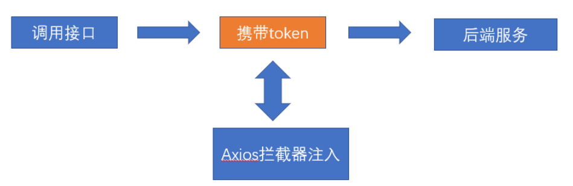

统一注入 token** **`src/utils/request.js`**  -> 请求拦截器
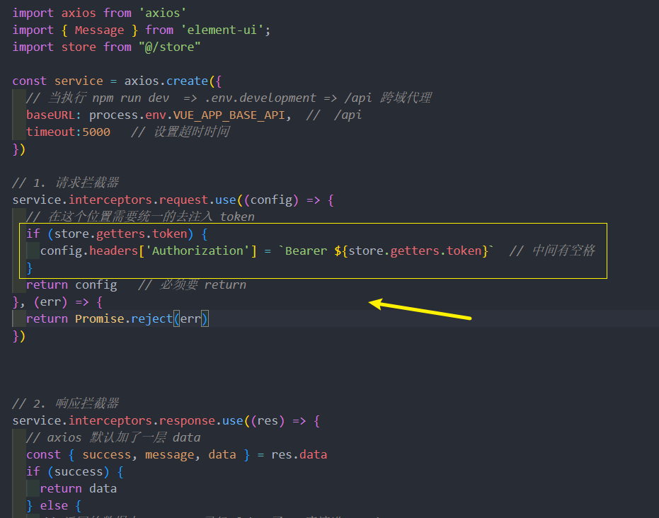
## 封装获取用户资料的 action 并共享用户状态
在用户的 vuex 模块中封装获取用户资料的 action，并设置相关状态

> 用户状态会在后续的开发中，频繁用到，所以我们将用户状态同样的封装到 action 中

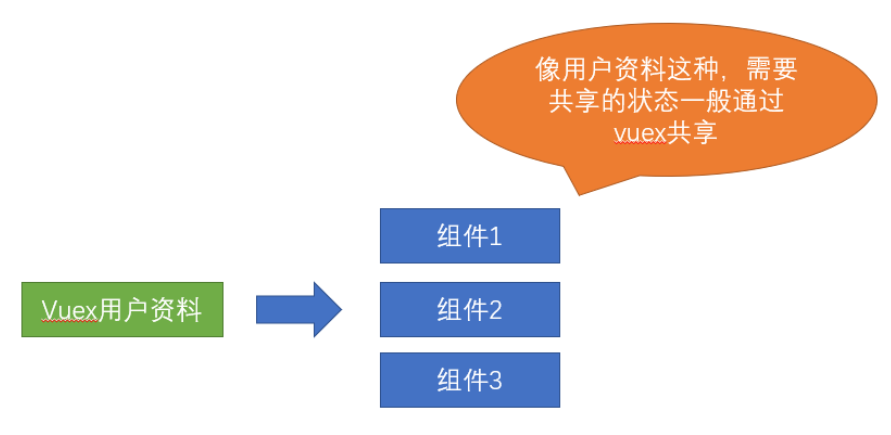

#### 封装获取用户资料action  **`src/store/modules/user.js`**
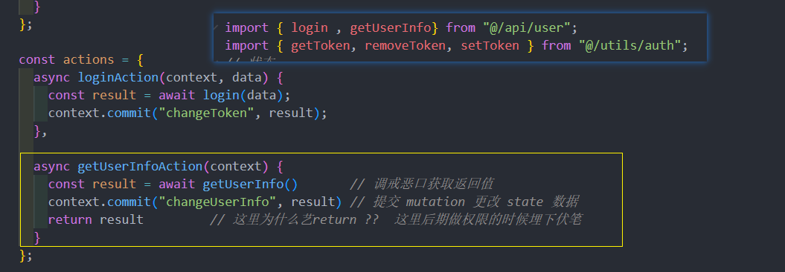
#### 初始化 state
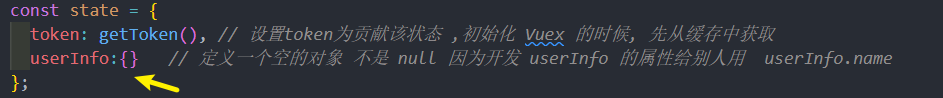
> userInfo为什么我们不设置为null，而是设置为 {} 

因为会在 **`getters`** 中引用 userInfo 的变量，如果设置为 null ，则会引起异常和报错 , null.name 当然会报错

#### 设置 和 删除 用户资料 mutation 
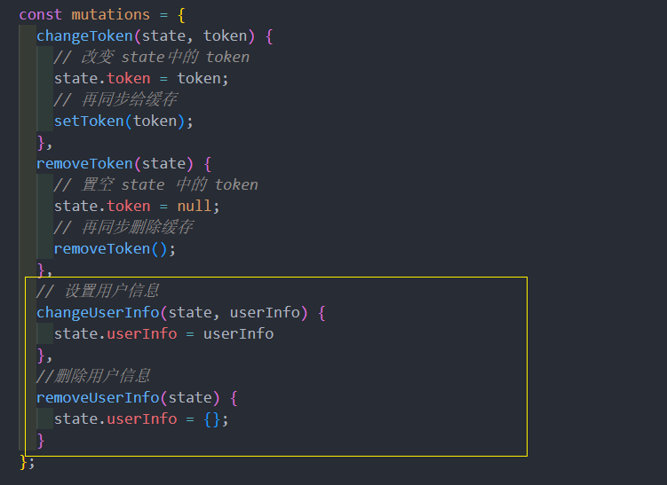

同样不能为 null , 置空为 空对象 {} , 因为我们要做映射，如果初始值为 null，一旦引用了getters，就会报错

#### 建立用户名的映射 **`src/store/getters.js`**
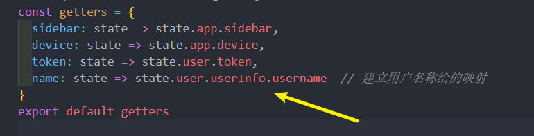
现在为止，将用户资料的 **action =>  mutation => state => getters** 都设置好了 , 接下来要调用这个 action

## 权限拦截处 调用获取资料action
在权限拦截处 调用aciton
### 权限拦截器调用action
在上面已经封装了获取用户资料的 action , 那么在哪里调用这个 action ? 

用户资料有个硬性要求，**必须有token** 才可以获取，那么就可以在确定有 token 的位置去获取用户资料
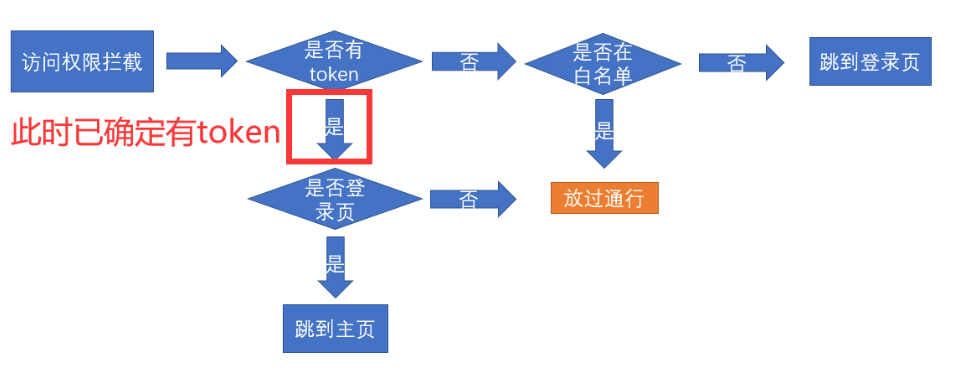
由上图可以看出，一旦确定进行了放行，就可以获取用户资料
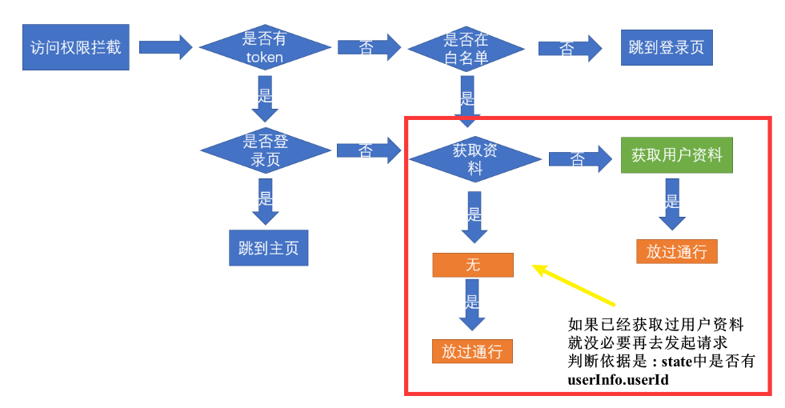

#### 调用action **src/permission.js**
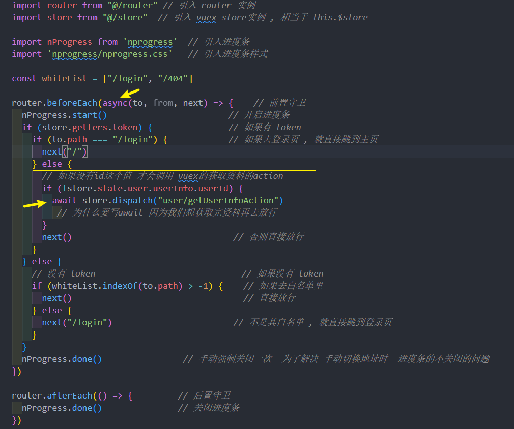
如果觉得获取用户 id 的方式写了太多层级，可以在 vuex 中的 getters 中设置一个映射 **src/store/getters.js**
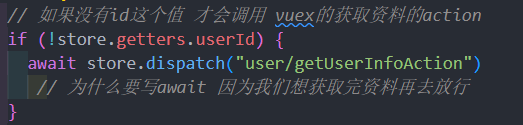
此时可以通过 dev-tools 工具在控制台清楚的看到数据已经获取
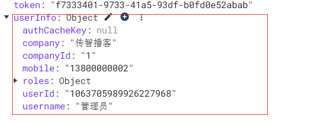
然后需要将头部菜单中的名称换成真实的用户名即可 Navbar.vue 
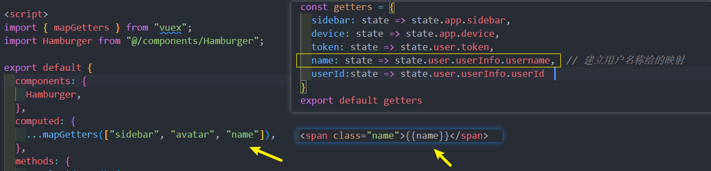
### 获取头像接口 合并数据
**头像怎么办？**

> 我们发现头像并不在接口的返回体中（接口原因），可以通过另一个接口来获取头像，并把头像合并到当前的资料中
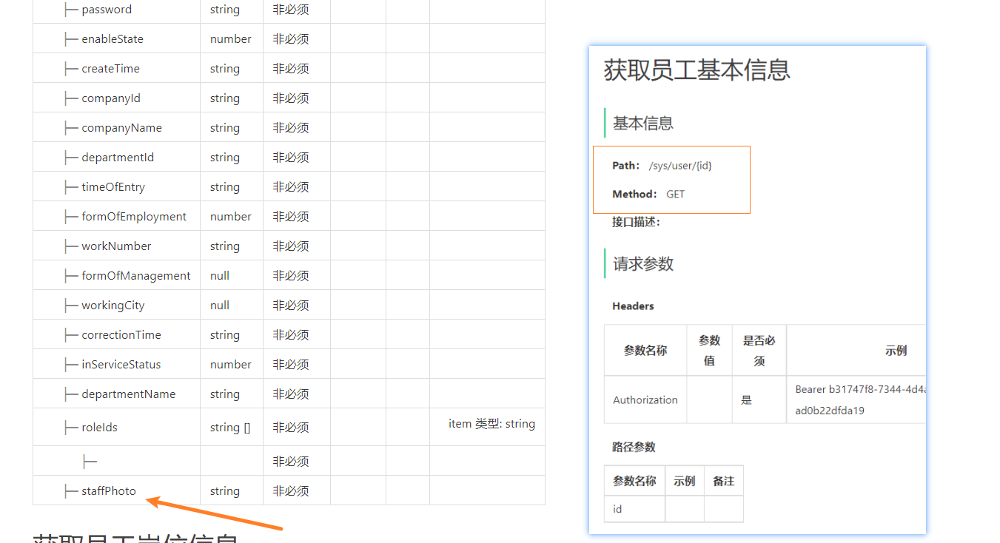
#### 封装获取用户信息接口  **src/api/user.js**
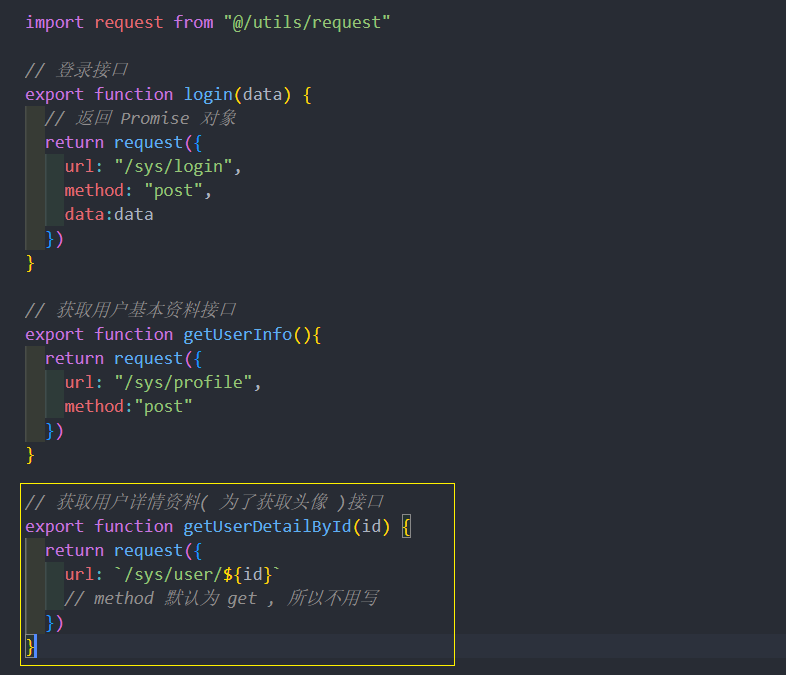
> 这个接口需要用户的userId，在前一个接口处，已经获取到了，所以可以直接在后面的内容去衔接
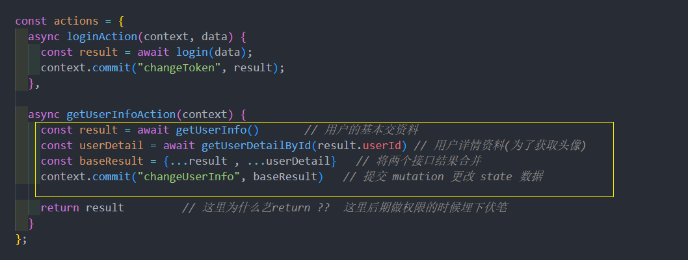
> 为了更好地获取头像，同样可以把头像放于 getters 中
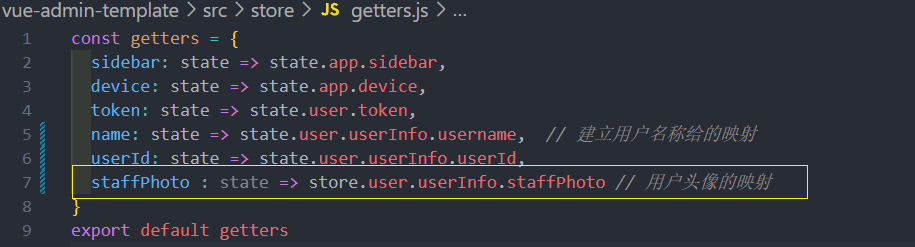
此时，头像和名称已经获取到了，可以直接将之前的假数据换成真正的头像和名称
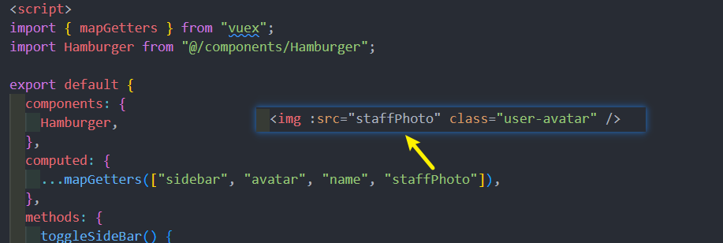
用户名已经显示，头像然依没有显示，这是因为虽然有地址，但是地址来源是私有云，目前已经失效，所以需要额外处理下图片的异常

至于处理图片的异常，在下面中，可采用自定义指令的形式来进行处理
## 自定义指令 - 解决异常图片情况
通过自定义指令的形式解决异常图片的处理
### 注册自定义指令
[https://v2.cn.vuejs.org/v2/guide/custom-directive.html 自定义指令文档](https://v2.cn.vuejs.org/v2/guide/custom-directive.html)

> 自定义指令可以采用统一的文件来管理  **`src/directives/index.js`**,这个文件负责管理所有的自定义指令
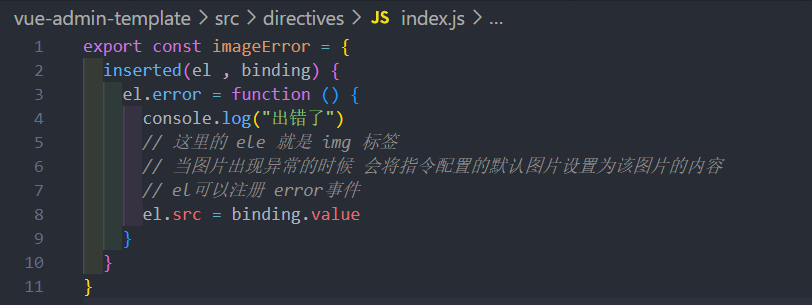
首先定义第一个自定义指令  **v-imageError**
### 在 main.js 完成自定义指令全局注册
然后，在 **`main.js`** 中完成对于该文件中所有指令的全局注册 
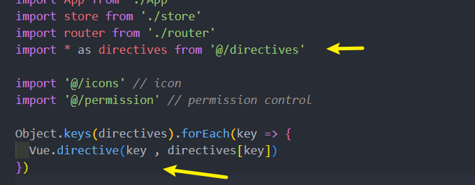
针对上面的引入语法  **`import *  as  变量`**  得到的是一个对象**`{ 变量1：对象1，变量2： 对象2 ...   }`**, 所以可以采用对象遍历的方法进行处理

指令注册成功，可以在 **Navbar.vue**中直接使用了
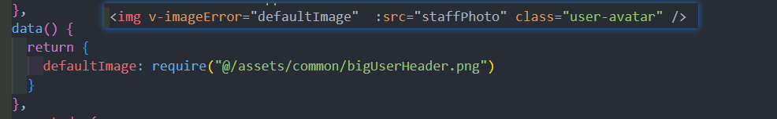
实现了一个自定义指令，解决图片加载异常的问题

## 实现登出功能
实现用户的登出操作
> 登出仅仅是跳到登录页吗？

不，当然不是，要处理的业务如下 : 
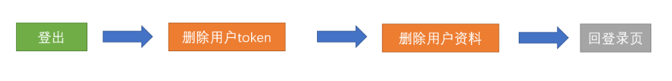
同样的，登出功能，要在 vuex 中的用户模块中实现对应的 **action**
#### 登出 action  **`src/store/modules/user.js`**
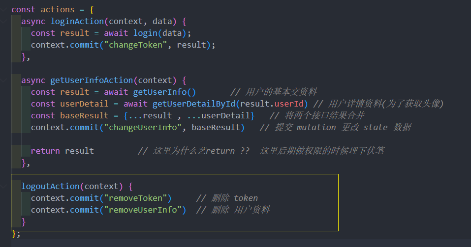
#### 头部菜单调用 action  **src/layout/components/Navbar.vue**
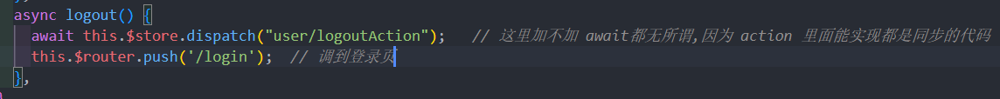
注意: **这里也可以采用 vuex 中的模块化	引入辅助函数**
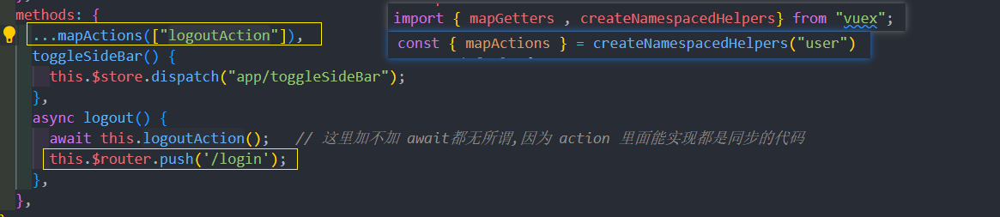

## Token 失效的主动介入
理当 token 失效时业务
### token 超时处理 - 客户端主动介入
> 开门的钥匙不是一直有效的，如果一直有效，会有安全风险，所以要尝试在客户端进行一下 token 的时间检查

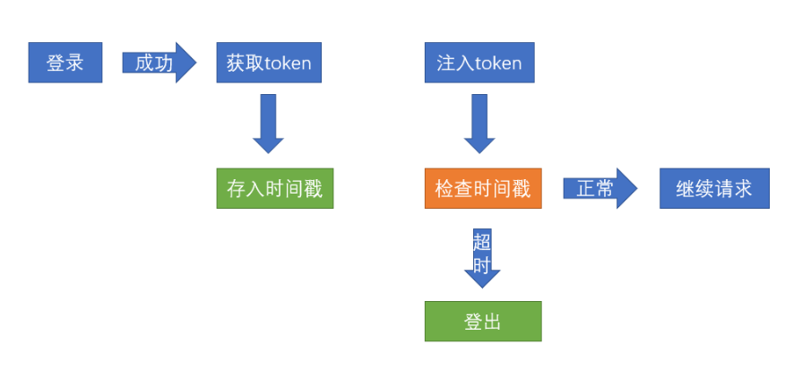
### 流程图转化代码
**src/utils/auth.js** 缓存
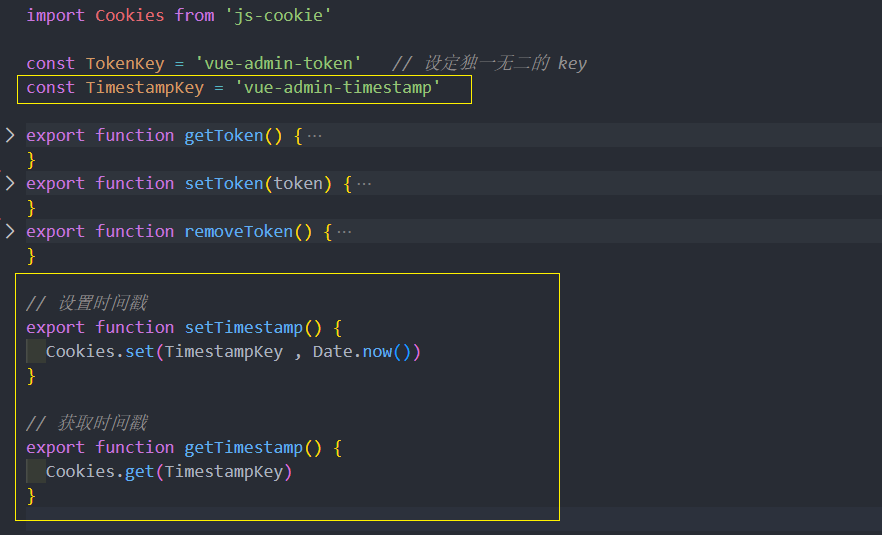
**src/utils/request.js**
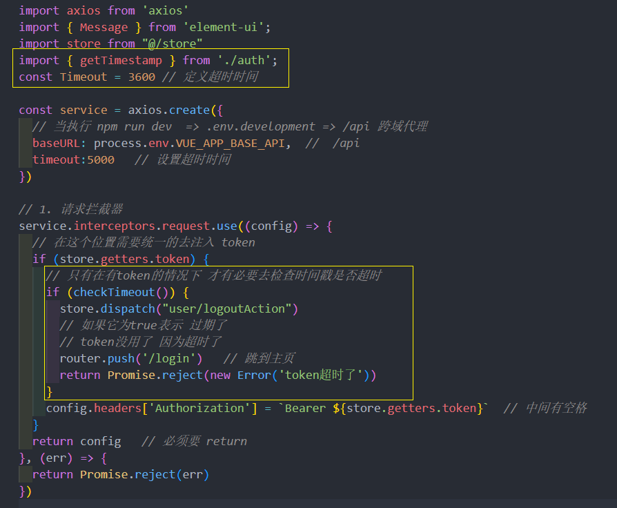
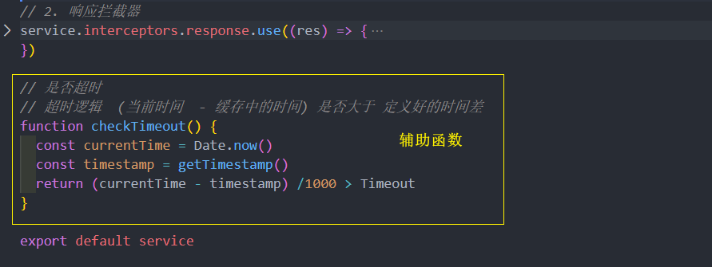
在调用登录接口的时候 一定是没有token的，所以 token 检查不会影响登录接口的调用

> 同理，在登录的时候，如果登录成功，应该设置时间戳
store/modules/user.js
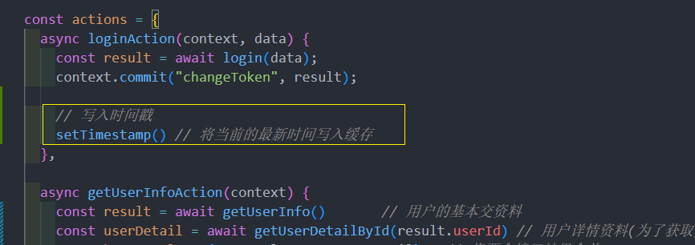

> 有主动处理就有被动处理，也就是后端告诉我们超时了，我们被迫做出反应，如果后端接口没有做处理，主动介入就是一种简单的方式
## Token失效的被动处理
实现 token 失效的被动处理

> 除了token的主动介入之外，我们还可以对token进行被动的处理，如图

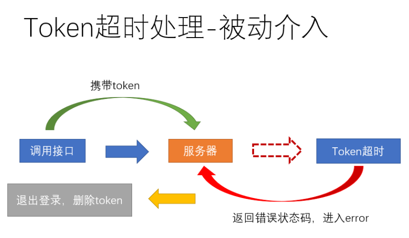
token 超时的错误码是 **`10002`**
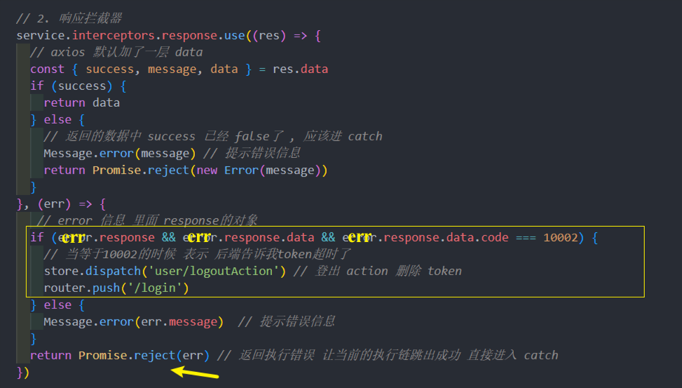
无论是主动介入还是被动处理，这些操作都是为了更好地处理 token，减少错误异常的可能性
