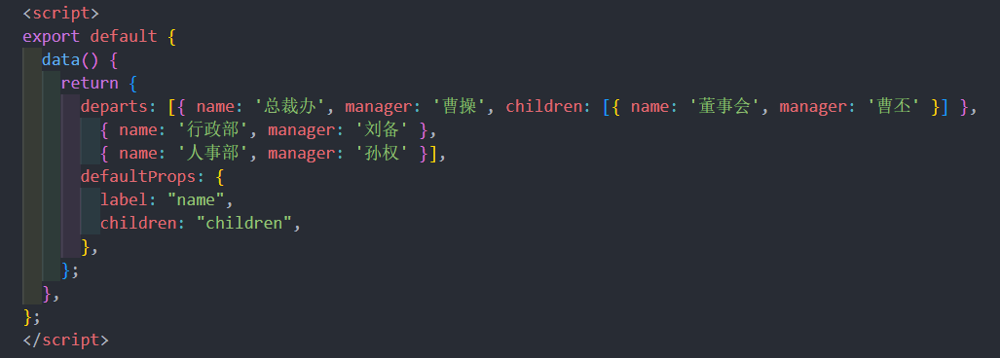
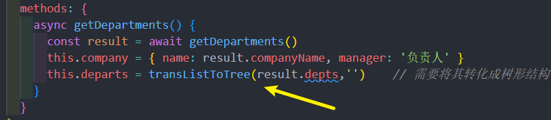
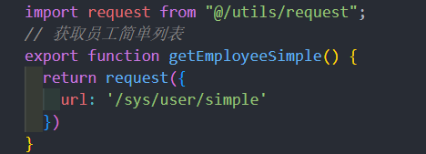

# 组织架构
## 组织架构树形结构布局
使用 element-UI 组件布局组织架构的基本布局
### 实现组织架构的头部内容

首先实现头部的结构，采用element 的 **行列布局**

样式
```css
<style lang="scss" scoped>
.tree-card {
  padding: 30px  140px;
  font-size:14px;
}
.companyName {
  font-weight:bolder;
}
</style>
```
### 树形组件
接下来，实现树形的结构，采用element的[el-tree组件](https://element.eleme.cn/#/zh-CN/component/tree)
> 树形组件属性

| 参数               | 说明                                                 | 类型    | 可选值 | 默认值 |
| :----------------- | :--------------------------------------------------- | :------ | :----- | :----- |
| default-expand-all | 是否默认展开所有节点                                 | boolean | —      | —      |
| data               | 展示数据                                             | array   | —      | —      |
| node-key           | 每个树节点用来作为唯一标识的属性，整棵树应该是唯一的 | String  | —      | —      |
| props              | 配置选项，具体看下表                                 | object  | —      | —      |

**props属性**

| 参数     | 说明                                                     | 类型                          | 可选值 | 默认值 |
| :------- | :------------------------------------------------------- | :---------------------------- | :----- | :----- |
| label    | 指定节点标签为节点对象的某个属性值                       | string, function(data, node)  | —      | —      |
| children | 指定子树为节点对象的某个属性值                           | string                        | —      | —      |
| disabled | 指定节点选择框是否禁用为节点对象的某个属性值             | boolean, function(data, node) | —      | —      |
| isLeaf   | 指定节点是否为叶子节点，仅在指定了 lazy 属性的情况下生效 | boolean, function(data, node) | —      | —      |

**data**是组成树形数据的关键，如下的数据便能构建树形数据
```json
 [{
          label: '一级 1',
          children: [{
            label: '二级 1-1',
            children: [{
              label: '三级 1-1-1'
            }]
          }]
        }, {
          label: '一级 2',
          children: [{
            label: '二级 2-1',
            children: [{
              label: '三级 2-1-1'
            }]
          }, {
            label: '二级 2-2',
            children: [{
              label: '三级 2-2-1'
            }]
          }]
        }, {
          label: '一级 3',
          children: [{
            label: '二级 3-1',
            children: [{
              label: '三级 3-1-1'
            }]
          }, {
            label: '二级 3-2',
            children: [{
              label: '三级 3-2-1'
            }]
          }]
        }]
```
### 实现树形的静态组织架构
接下来，对每个层级节点增加显示内容，此时需要用到 tree 的**作用域插槽**



静态结构的效果: 

## 将树形的操作内容 单独抽提成组件
将树形的操作内容单独抽提成组件
### 封装单独的树操作栏组件
> 现在发现，树形的顶级内容实际和子节点的内容是一致的，此时可以将相同的该部分抽提成一个组件，节省代码

组件 **src/views/departments/components/tree-tools.vue**

### 在组织架构中应用操作栏组件
接下来，在 **`src/views/departments/index.vue`** 进行代码的简化

上面代码中，company 变量需要在 data 中定义

同时，由于在两个位置都使用了该组件，但是放置在最上层的组件是不需要显示 **`删除部门`** 和 **`编辑部门`** 的

所以，增加一个新的属性 **`isRoot（是否根节点）`** 进行控制


组件中， 根据isRoot判断显示


> 通过封装，代码看上去更加紧凑，简洁，这就是封装的魅力
## 获取组织架构数据，并进行树形处理
获取真实的组织架构数据，并将其转化成树形数据显示在页面上
### 封装 API 接口，获取组织架构数据
> 现在基本的静态结构已经形成，接下来需要获取真实的数据

首先，**封装获取组织架构的请 求** **`src/api/departments.js`**

在钩子函数中调用接口

### 将数组数据转化成树形结构
然后，需要将列表型的数据，转化成树形数据，这里需要用到 **递归算法**


封装一个工具方法，**`src/utils/index.js`**

调用转化方法，转化树形结构

这样一来，树形数据就有了
## 删除部门功能实现
实现操作功能的删除功能
### 封装删除接口，注册下拉菜单事件
首先，封装删除功能模块 **src/api/departments.js**


然后，在 tree-tools 组件中，监听下拉菜单的点击事件  **`src/views/departments/index.vue`** 

[下拉菜单点击事件文档](https://element.eleme.io/#/zh-CN/component/dropdown#zhi-ling-shi-jian)

> dropdown 下拉菜单的监听事件 command

### 调用删除接口，通知父组件更新数据
> 删除之前，提示用户是否删除，然后调用删除接口


> 上面代码中，我们成功删除了员工数据，但是怎么通知父组件进行更新呢(只是调了接口, 后端数据变 , 但前端没变)

通过自定义事件 **`this.$emit`** 的方式来进行


父组件监听事件 **`src/views/department/index.vue`** 

## 新增部门功能-建立组件

### 封装新增接口，新建组件中的弹层结构
首先， 封装新增部门的 api 模块  **`src/api/departments.js`**


然后，需要构建一个新增部门的窗体组件 **`src/views/department/components/add-dept.vue`**

### 点击新增子部门显示弹层组件


然后，需要用属性控制组件的显示或者隐藏 , **add-dept.vue**

 
在 **`departments/index.vue`** 中引入该组件


定义控制窗体显示的变量 **`showDialog`**


当点击新增部门时，弹出组件

> 注意，点击新增时 tree-tools 组件，所以这里，依然需要子组件调用父组件
#### 子组件触发新增事件 **`src/views/departments/tree-tools.vue`** 


#### 父组件监听事件

#### 方法中弹出层,记录在哪个节点下添加子部门


## 完成新增部门的规则校验
成新增部门功能的规则校验和数据提交部分
### 完成新增表单的基本校验条件

部门名称（name）：必填 1-50个字符  / 同级部门中禁止出现重复部门

部门编码（code）：必填 1-50个字符  / 部门编码在整个模块中都不允许重复

部门负责人（manager）：必填

部门介绍 ( introduce)：必填 1-300个字符

> 定义数据结构

```js
  formData: {
        name: '', // 部门名称
        code: '', // 部门编码
        manager: '', // 部门管理者
        introduce: '' // 部门介绍
  },

```

> 完成表单校验需要的前置条件

- el-form配置model和rules属性
- el-form-item配置prop属性
- 表单进行v-model双向绑定

### 配置新增表单的基本校验规则
> 根据这些要求，校验规则


### 部门名称和部门编码的自定义校验
效果图: 


部门名称（name）：必填 1-50个字符  / **同级部门**中**禁止出现重复部门**

部门编码（code）：必填 1-50个字符  / 部门编码在**整个模块**中都**不允许重复**

**`注意`**：部门名称和部门编码的规则 有两条需要通过 **`自定义校验函数validator`** 来实现

> 首先，在校验名称和编码时，要获取最新的组织架构，这也是我们这里trigger采用blur的原因，因为change对于访问的频率过高，我们需要控制访问频率
```
  // 首先获取最新的组织架构数据
  const { depts } = await getDepartments()
```
部门名称不能和 **`同级别`** 的重复，这里注意，需要找到所有同级别的数据，进行校验，所以还需要另一个参数 pid

根据当前部门 id，找到所有子部门相关的数据，判断是否重复

检查部门编码的过程同理

在规则中定义

### 处理首部内容的 pid 数据
需要注意`**：在最根级的**`tree-tools`**组件中，由于 treenode 属性中没有id，id便是undefined，但是通过undefined进行等值判断是寻找不到对应的根节点的， 所以在传值时，将 id 属性设置为 "" 

src/views/departments/index.vue


## 新增部门功能 - 部门负责人的数据
**目标**：获取新增表单中的部门负责人下拉数据

> 在上节的表单中，部门负责人是下拉数据，我们应该从 **`员工接口`** 中获取该数据

首先，封装获取简单员工列表的模块 **`src/api/employees.js`**


然后，在 **`add-dept.vue`** 中的 select 聚焦事件 **`focus`** 中调用该接口，因为要获取实时的最新数据

获取员工列表 


## 新增功能-提交-取消-关闭
完成新增模块的 提交-取消-关闭 等功能
### 校验通过，调用新增接口
> 当点击新增页面的确定按钮时，需要完成对表单的整体校验，如果校验成功，进行提交

首先，在点击确定时，校验表单
#### 给el-form定义一个 ref 属性

```
    // 点击确定时触发
    btnOK() {
      this.$refs.deptForm.validate(isOK => {
        if (isOK) {
          // 表示可以提交了
        }
      })
    }
```
然后，在校验通过时，调用新增接口
> 因为是添加子部门，所以需要将新增的部门 pid 设置成当前部门的 id ，新增的部门就成了自己的子部门


同样，在新增成功之后，调用告诉父组件，重新拉取数据
```
 this.$emit('addDepts')
```
父组件监听事件, 再次获取最新数据 


### 利用 sync 修饰符关闭新增弹层 
弹窗 dialog 的显示隐藏 现在是父组件控制的

> 这里运用一个新的技巧， **`sync修饰符`**

按照常规，想要让父组件更新 **`showDialog`** 的话，需要这样做 

> 但是，vuejs为提供了 **`sync修饰符`**，它提供了一种简写模式 也就是


只要用 .sync 修饰，就可以省略父组件的监听和方法，直接将值赋值给 showDialog变量


### 点击取消时 重置数据和校验


还需要在 el-dialog 中监听其 **close事件**

## 编辑部门功能 - 实现数据回写
**目标**：实现编辑部门的功能
### 点击编辑弹出层，记录当前节点
> 编辑部门功能实际上和新增窗体采用的是一个组件，只不过我们需要将新增场景变成编辑场景


首先点击编辑部门时 


父组件弹层，赋值当前编辑节点


### 父组件调用子组件的获取详情方法
> 编辑时，需要获取点击部门的信息

封装获取部门信息的模块 **`src/api/departments.js`**

> 在什么时候获取部门详情?

可以在调用**编辑方法** **`editDepartment`** 中通过 **`ref`** 调用 **`add-dept.vue`** 的实例的方法


父组件中用 ref 获取组件实例并调用


### 根据计算属性显示控制标题
> 需要根据当前的场景区分显示的标题

计算属性

> 如何判断新增还是编辑

```js
computed: {
    showTitle() {
      return this.formData.id ? '编辑部门' : '新增子部门'
    }
  },
```

同时发现，el-form中的 resetFields 不能重置非表单中的数据，所以在取消的位置需要强制加上 重置数据

## 同时支持 编辑和新增场景
### 封装编辑接口，保存时区分场景(新增/编辑)
> 接下来，需要在点击确定时，同时支持新增部门和编辑部门两个场景，我们可以根据formData是否有id进行区分

#### **封装编辑部门接口**   **`src/api/departments.js`** 


> 点击确定时，进行场景区分


### 校验规则支持 编辑场景 下的校验
> 除此之外，发现原来的校验规则实际和编辑部门有些冲突，所以需要进一步处理

校验规则要留意的是 checkNameRepeat 和 checkCodeRepeat 校验函数


> 至此，整个组织架构， 完成了，组织架构读取 /  新增部门 / 删除部门  / 编辑部门


## 给数据获取添加加载进度条
**`目标`**  给当前组织架构添加加载进度条

由于获取数据的延迟性，为了更好的体验，可以给页面增加一个 Loading进度条，采用 element的指令 **v-loading** 解决方案即可[loading 加载官网](https://element.eleme.io/#/zh-CN/component/loading#options)

**定义loading变量**

```js
loading: false // 用来控制进度弹层的显示和隐藏
```

**赋值变量给指令**


**获取方法前后设置变量**


