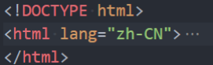

# HTML 
<!-- ## HTML 结构分析
* **文档声明**
* **html元素**
   1. head元素
   2. body元素

### 文档声明
HTML 最上方的一段文本我们称之为 `文档类型声明，用于声明文档类型`

`<!DOCTYPE html>`
* HTML文档声明，告诉浏览器当前页面是**HTML5页面**；
* 让浏览器用**HTML5的标准去解析识别内容**；
* 必须**放在HTML文档的最前面，不能省略**，省略了会出现兼容性问题；

### html元素
`<html>` 元素 表示一个 HTML 文档的根（顶级元素），所以它也被称为根元素
* 所有其他元素必须是**此元素的后代**

W3C标准建议为html元素增加一个 **lang属性** ，作用是
* 帮助**语音合成工具**确定要使用的发音
* 帮助**翻译工具**确定要使用的翻译规则

比如常用的规则：
* `lang=“en”` *表示这个 HTML 文档的语言是英文*
* `lang=“zh-CN”` *表示这个 HTML 文档的语言是中文* -->
## a元素
HTML `<a>` 元素（或称锚（anchor）元素）
* 定义超链接，用于打开新的 URL

a 元素有两个常见的属性：
* **href**：Hypertext Reference的简称
   * 指定要打开的URL地址；
   * 也可以是一个本地地址；
* **target**：该属性指定在何处显示链接的资源
   * _self：默认值，在当前窗口打开URL
   * _blank：在一个新的窗口中打开URL
   * 其他不常用, 后面iframe可以讲一下

### a元素 - 锚点链接
锚点链接可以实现：跳转到网页中的具体位置

锚点链接有两个重要步骤：
* 在要跳到的元素上**定义一个id属性**
* 定义a元素，并且a元素的**href指向对应的 id**

### a元素 - 图片链接
在很多网站会发现图片也是可以点击进行跳转的
* img元素跟a元素一起使用，可以实现图片链接；

实现思路：
* a元素中不存放文字，而是**存放一个img元素**
* 也就是img元素是a元素的内容；

## iframe元素
利用iframe元素可以实现：在一个HTML文档中嵌入其他HTML文档

frameborder属性
* 用于规定是否显示边框
✓ 1：显示
✓ 0：不显示

a元素target的其他值:
*  _parent：在父窗口中打开URL
* _top：在顶层窗口中打开URL

禁止 iframe : 

## div元素、span元素的区别
div元素和span元素都是“纯粹的” 容器，也可以把他们理解成 **“盒子”**，它们都是用来**包裹内容**的；

div元素 : 多个 div 元素包裹的内容会在**不同的行**显示；
* 一般作为其他元素的父容器，把其他元素包住，代表一个整体
* 用于把网页分割为多个独立的部分

span元素 : 多个span元素包裹的内容会在**同一行**显示；
* 默认情况下，跟普通文本几乎没差别
* 用于区分特殊文本和普通文本，比如用来显示一些关键字
## HTML 全局属性
可以发现**某些属性只能设置在特定的元素中**：
* 比如img元素的src、a元素的href；

也**有一些属性是所有HTML都可以设置和拥有的**，这样的属性我们称之为 “**全局属性（Global Attributes）**”
* 全局属性有很多：[https://developer.mozilla.org/zh-CN/docs/Web/HTML/Global_attributes](https://developer.mozilla.org/zh-CN/docs/Web/HTML/Global_attributes)

常见的全局属性如下：
1. id：定义唯一标识符（ID），该标识符在整个文档中必须是唯一的。其目的是在链接（使用片段标识符），脚本或样
式（使用 CSS）时标识元素。
2. class：一个以空格分隔的元素的类名（classes ）列表，它允许 CSS 和 Javascript 通过类选择器或者DOM方法来选
择和访问特定的元素；
3. style：给元素添加内联样式；
4. title：包含表示与其所属元素相关信息的文本。 这些信息通常可以作为提示呈现给用户，但不是必须的。

## 额外知识
### 字符实体
思考：编写的HTML代码会被浏览器解析

如下代码是**如何被解析**的呢？
* 如果使用小于号（<），浏览器会将其后的文本解析为一个tag
* 但是某些情况下，确实需要编写一个小于号（<）
* 这个时候就可以使用**字符实体**

HTML 实体是一段以**连字号（&）开头、以分号（;）结尾的文本（字符串）**：
* 实体常常用于显示保留字符（这些字符会被解析为 HTML 代码）和不可见的字符（如“不换行空格”）；
* 也可以用实体来代替其他难以用标准键盘键入的字符；

### URL的格式
URL的标准格式如下：

**`[协议类型]://[服务器地址]:[端口号]/[文件路径][文件名]?[查询]#[片段ID]`**

### 元素的语义化
元素的语义化：用正确的元素做正确的事情。

理论上来说，所有的HTML元素，都能实现相同的事情：

标签语义化的好处
* 方便代码维护
* 减少让开发者之间的沟通成本
* 能让语音合成工具正确识别网页元素的用途，以便作出正确的反应；
* 有利于SEO；
* .....
### 什么是SEO？
**搜索引擎优化**（英语：search engine optimization，缩写为SEO）是通过了解搜索引擎的运作规则来调整网站，
以及提高网站在有关搜索引擎内排名的方式

