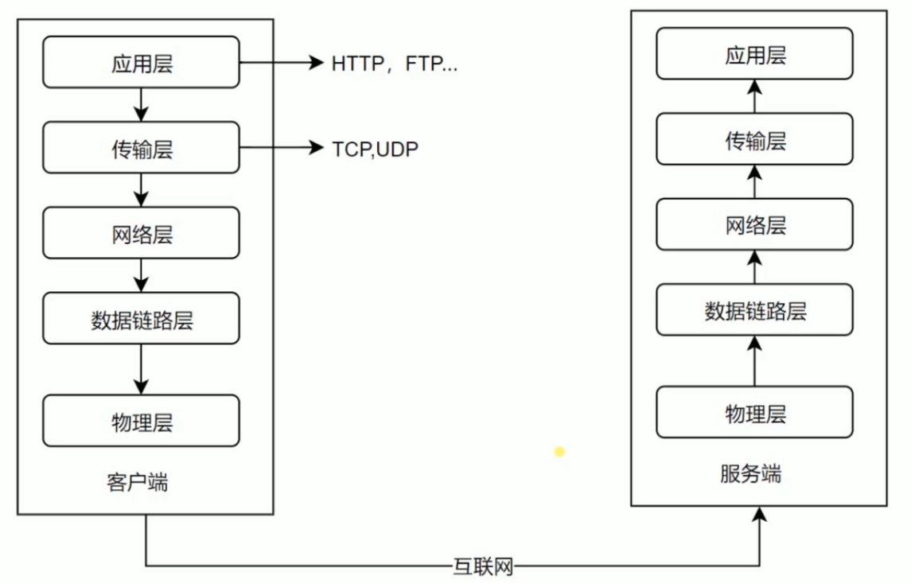

# http 协议 
## 网络分层模型

#### 低三层
* **物理层** : 主要作用是定义物理设备如何传输数据
* **数据链路层**在通信的实体间简历数据链路链接
* **网络层**: 为数据在节点之间传输创建逻辑链路 

### 传输层 

## http协议的发展历史 
### HTTP/0.9 
* 只有一个命令 get 
* 没有 header 等描述数据的信息
* 服务器发送完毕, 就关闭 TCP 链接 
### HTTP/1.0 
* 增加了很多命令
* 增加 status code 和 header 
* 多自字符集支持, 多部分的发送, 权限, 缓存等
### HTTP/1.1
* 持久链接 
* pipeline 
* 增加 host 和其他一些命令 
### HTTP/2
* 所有数据以二进制传输
* 同一个连接里面发送多个请求不在需要按照顺序来
* 头信息压缩以及推送等提高效率的功能

## 三次握手
