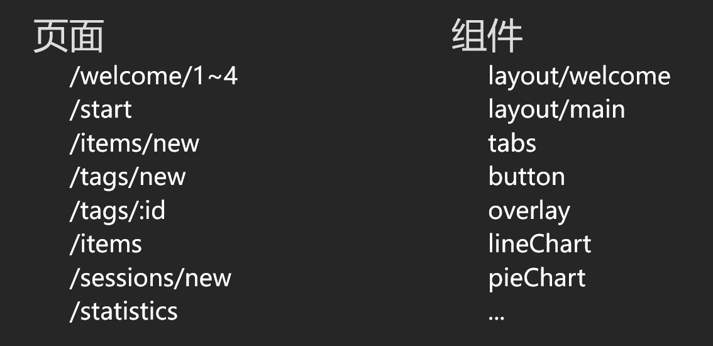
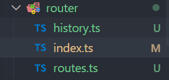
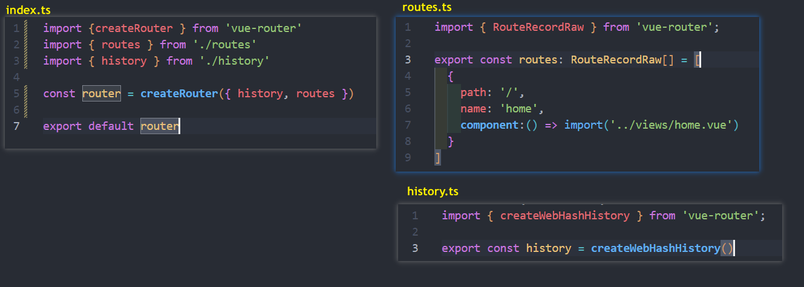
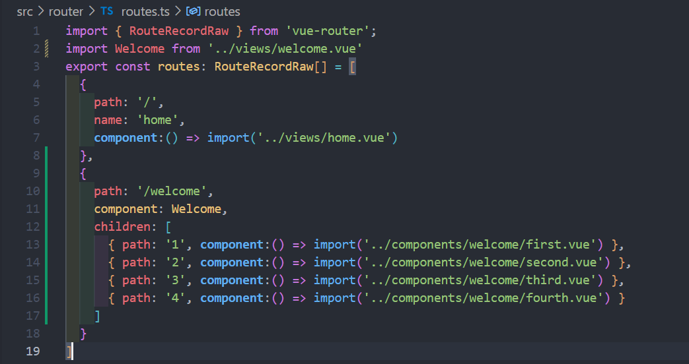
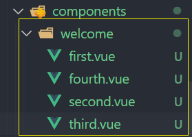

# 搭建
## 创建项目
```shell
npm create vite@2.9.0 mangosteen-fe-1 -- --template vue-ts
cd mangosteen-fe-1
npm install
npm run dev
```
#### 安装 sass
```shell
npm install sass@1.32.7
npm install sass-loader@12.0.0
```
## 引入 vue-router
router/index.ts
```ts
import {createRouter, createWebHashHistory,RouteRecordRaw } from 'vue-router'

const routes: RouteRecordRaw[] = [
  {
    path: '/',
    name: 'home',
    component:() => import('../views/home.vue')
  }
]
const router = createRouter({
  history: createWebHashHistory(),
  routes,
})
export default router
```
main.ts
```ts
import { createApp } from 'vue'
import App from './App.vue'
import router from './router/index'

createApp(App).use(router).mount('#app')
```
**注意** : 并且 App.vue 要加上 `<router-view>` 标签
## css 重置
assets/stylesheet/reset.scss
```scss
* {
  box-sizing: border-box;
  margin: 0;
  padding: 0;
}
*::before, *::after{
  box-sizing: border-box;
}
h1, h2, h3, h4, h5, h6{
  font-weight: normal;
}

a{
  color: inherit;
  text-decoration: none;
}

button, input {
  font: inherit;
}
```
## 路由和组件

### 重构路由
把 `routes` 和 `history` 单独抽离出来方便后期维护



### 创建 welcome 路由
首先创建 `/welcome/1 ~ 4` 的页面路由



### 完成 welcome 页面基本布局
```vue
<template>
  <div class="welcome">
    <header>
      
      <h1>日常记账</h1>
    </header>
    <main><router-view /></main>
    <footer v-if="$route.path !== '/welcome/4'">
      <div class="fake">fake</div>
      <div class="pass" @click="$router.push('/start')">跳过</div>
      <div class="next" @click="nextPageClick">下一页</div>
    </footer>
    <footer v-else>
      <div class="fake">fake</div>
      <div class="fake">跳过</div>
      <div class="pass" @click="$router.push('/start')">完成</div>
    </footer>
  </div>
</template>

<script lang="ts" setup>
import logo from '../assets/icons/mangosteen.svg'
import { useRoute, useRouter } from 'vue-router'

const route = useRoute()
const router = useRouter()
const nextPageClick = () => {
  const path = route.path
  const pathNum =  Number(path.split('/').pop())
  const newPath = path.slice(0, path.length - 1) + (pathNum + 1).toString()
  router.push(newPath)
}
</script>
<style scoped lang="scss">
.welcome{
  height:100vh;
  display:flex;
  flex-direction: column;
  background-image: linear-gradient(to bottom, #002ea6 , #3667e3);
  header {
    > img {
      width:60px;
      height: 60px;
    }
    flex-shrink: 0;
    display: flex;
    flex-direction: column;
    justify-content: center;
    align-items: center;
    padding-top:66px;
    color:#d4d4ee;
  }
  main {
    flex-grow:1;
    padding:20px 20px 0 20px;
  }
  footer{
    flex-shrink: 0;
    display: flex;
    justify-content: space-between;
    align-items: center;
    color:white;
    font-size:22px;
    font-weight: 600;
    margin: 0 20px;
    .fake {visibility: hidden;}
    .fake,.pass,.next {
      padding: 20px;
      border-radius: 4px;
      &:active {
        background-color: #2054d7;
      }
    }
  }
}
</style>
```

然后根据需求一步步实现页面...
## 添加路由动画
```vue
<template>
...
 <main>
    <router-view v-slot="{ Component }">
        <transition name="fade">
          <component :is="Component" />
        </transition>
    </router-view>
</main>
...
</template>
...
...
<style lang="scss" scoped>
.fade-move,
.fade-enter-active,
.fade-leave-active {
  transition: all 0.25s ease-in;
  width:100%;
  height:100%;
}
.fade-enter-from {
  transform:translateX(100vw);
  opacity:0;
}
.fade-leave-to {
  transform:translateX(-100vw);
  opacity:0;
}
.fade-leave-active{
  position: absolute;
  left: 0;
  top: 0;
}
</style>
```
## 支持滑动事件
封装一个 hooks 叫做 useSwipe, 根据手势动作返回方向, 距离..

hooks/useSwipe.ts
```ts
import { computed, onMounted, onUnmounted, ref, Ref } from "vue";

type Point = {
  x: number;
  y: number;
}

export const useSwipe = (element: Ref<HTMLElement | null>) => {
  const start = ref<Point | null>(null)
  const end = ref<Point | null>(null)
  const swiping = ref(false)
  const distance = computed(() => {
    if (!start.value || !end.value) { return null }
    return {
      x: end.value.x - start.value.x,
      y: end.value.y - start.value.y,
    }
  })
  const direction = computed(() => {
    if (!distance.value) { return '' }
    const { x, y } = distance.value
    if (Math.abs(x) > Math.abs(y)) {
      return x > 0 ? 'right' : 'left'
    } else {
      return y > 0 ? 'down' : 'up'
    }
  })
  const onStart = (e: TouchEvent) => {
    e.preventDefault() // 防止浏览器一起被滑动
    swiping.value = true
    end.value = start.value = { x: e.touches[0].screenX, y: e.touches[0].screenY }
  }
  const onMove = (e: TouchEvent) => {
    if (!start.value) { return }
    end.value = { x: e.touches[0].screenX, y: e.touches[0].screenY, }
  }
  const onEnd = (e: TouchEvent) => {
    swiping.value = false
  }

  onMounted(() => {
    if (!element.value) { return }
    element.value.addEventListener('touchstart', onStart)
    element.value.addEventListener('touchmove', onMove)
    element.value.addEventListener('touchend', onEnd)
  })
  onUnmounted(() => {
    if (!element.value) { return }
    element.value.removeEventListener('touchstart', onStart)
    element.value.removeEventListener('touchmove', onMove)
    element.value.removeEventListener('touchend', onEnd)
  })
  return {
    swiping,
    direction,
    distance,
  }
}
```