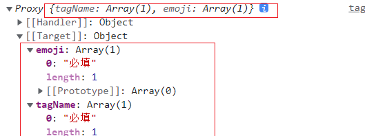
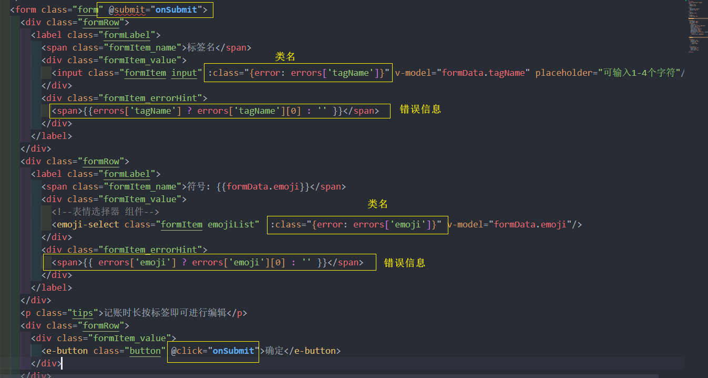

# 业务功能
## 表单验证
### 设计表单验证逻辑
```js
const formData = reactive({
  tagName:'',
  emoji:''
}) 

const rules = [
  { key: 'tagName', required: true, message: '必填' },
  { key: 'tagName', pattern: /^.{1,4}$/, message: '请填入1~4个字符' },
  { key: 'emoji', required: true, message: '必填' },
]

const errors = validate(formData, rules)
// 可以得出 errors 的数据结构为
// const errors = {
//   'tagName': ['错误1', '错误2'],
//   'emoji':['错误3', '错误4']
// }
```
根据 表单数据 `formData` 和 验证规则 `rules`, 封装一个 `validate` 工具函数返回对应的 `errors`,
然后可以再根据结果 errors 在模板上渲染

### 实现表单验证函数
utils/validate.ts
```ts
// 表单数据
export interface FData {
  [k: string]: string | number | undefined | null
}
// 每个验证规则 Rule 每个规则的 key 必须是 FData的属性值, 所以使用泛型
export interface Rule<T>  {
  key: keyof T
  message: string
  required?: boolean
  pattern?: RegExp
} 
// 验证规则 Rules
export type Rules<T> = Rule<T>[]

export const validate = <T extends FData>(formData: T, rules: Rules<T>) => {
  type Errors = {
    [k in keyof T]?:string[]
  }
  const errors:Errors = {}

  // 遍历 rules , 分析出错情况, 最终返回 errors
  rules.forEach(rule => {
    const { key, message, pattern, required } = rule
    const value = formData[key]
    // 校验
    if (required === true && !value) {
      errors[key] = errors[key] ?? []
          errors[key]?.push(message)
    } else if (pattern && value && !pattern.test(value.toString())) {
      errors[key] = errors[key] ?? []
      errors[key]?.push(message)
    }
  })
  return errors
}
```
### 使用校验函数
**点击确定**时触发此校验函数
```vue
<script>
// 表单数据
const formData = reactive({
  tagName: '',
  emoji:''
})
type FormData =  {
  tagName:string
  emoji:string
}
// 校验规则
const rules:Rules<FormData> = [
  { key: 'tagName', required: true, message: '必填' },
  { key: 'tagName', pattern: /^.{1,4}$/, message: '请填入1~4个字符' },
  { key: 'emoji', required: true, message: '必填' },
]
// 最终错误结果
const errors = ref<any>([])
// 点击时 触发
const onSubmit = (e:Event) => {
  // 取消默认动作
  e.preventDefault()
  errors.value = validate<FormData>(formData, rules)
}
</script>
```



并且在模板上绑定进行渲染

