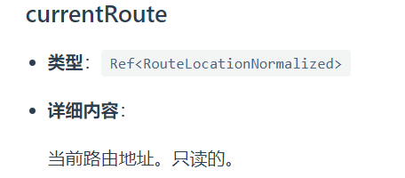
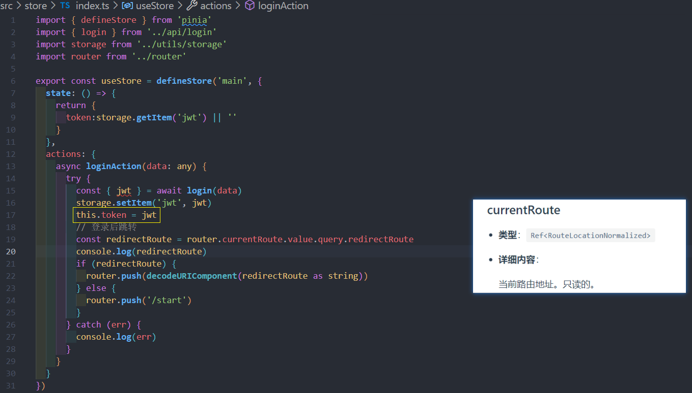
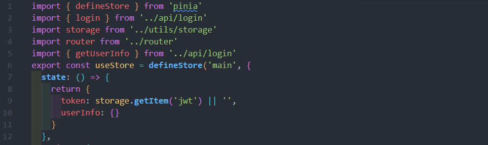
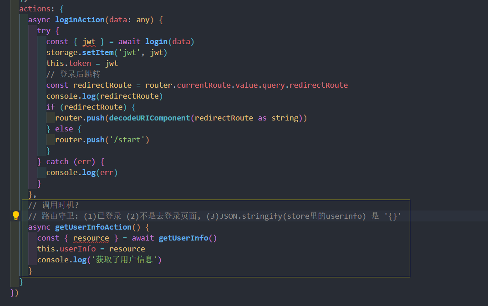
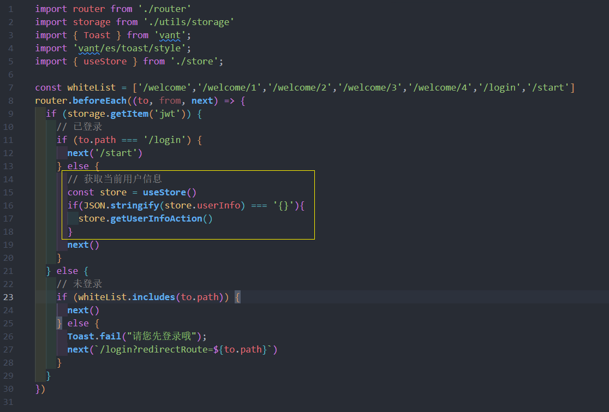
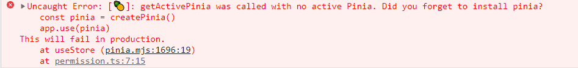
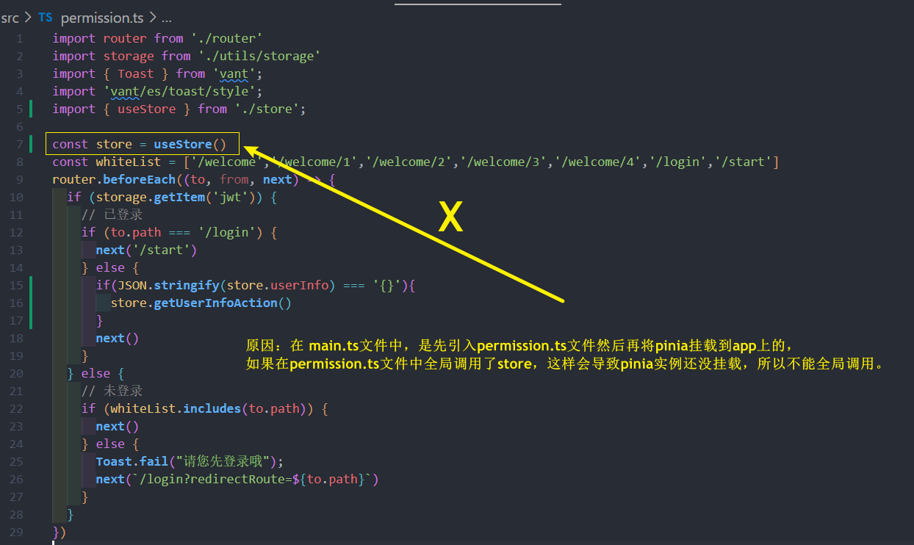
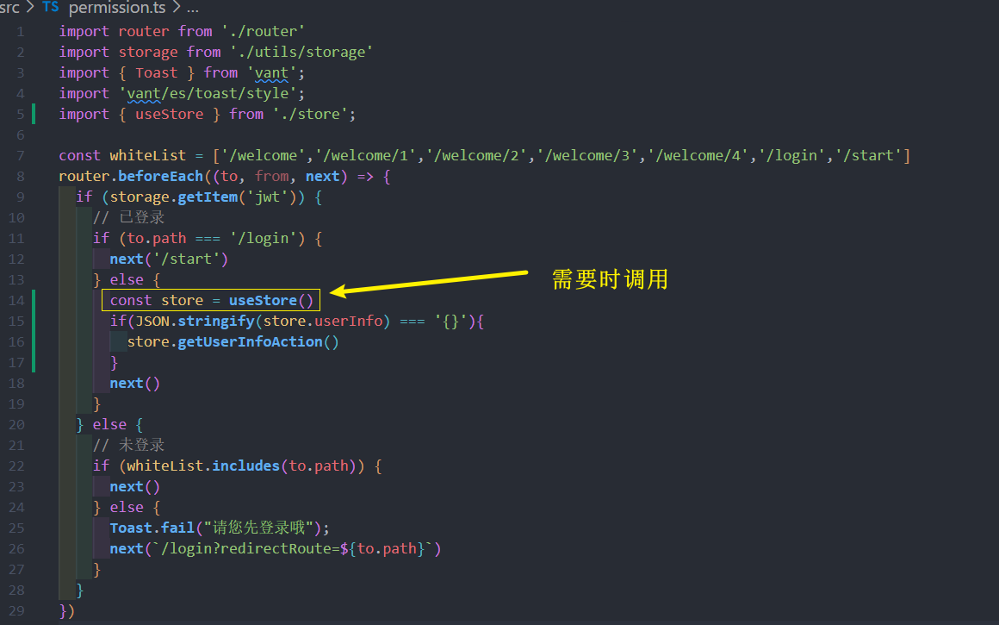
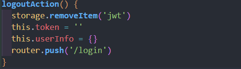

# 业务功能
## 表单验证
### 设计表单验证逻辑
```js
const formData = reactive({
  tagName:'',
  emoji:''
}) 

const rules = [
  { key: 'tagName', required: true, message: '必填' },
  { key: 'tagName', pattern: /^.{1,4}$/, message: '请填入1~4个字符' },
  { key: 'emoji', required: true, message: '必填' },
]
// validate 函数需要封装
const errors = validate(formData, rules)
// 可以得出 errors 的数据结构为
// const errors = {
//   'tagName': ['错误信息 1', '错误信息 2'],
//   'emoji':['错误信息 3', '错误信息 4']
// }
```
根据 **表单数据 `formData` 和 验证规则 `rules**`, **需要封装一个 `validate` 工具函数**返回其表单验证对应的 `errors` 错误信息,
然后可以再根据结果 errors 在模板上渲染

### 实现表单验证函数
utils/validate.ts
```ts
// 表单数据
export interface FData {
  [k: string]: string | number | undefined | null
}
// 每个验证规则 Rule 每个规则的 key 必须是 FData 的属性值, 所以这里使用泛型
export interface Rule<T>  {
  key: keyof T
  message: string
  required?: boolean
  pattern?: RegExp
} 
// 验证规则 Rules
export type Rules<T> = Rule<T>[]

export const validate = <T extends FData>(formData: T, rules: Rules<T>) => {
  type Errors = {
    [k in keyof T]?:string[]
  }
  const errors:Errors = {}

  // 遍历 rules , 分析出错情况, 最终返回 errors
  rules.forEach(rule => {
    const { key, message, pattern, required } = rule
    const value = formData[key]
    // 校验
    if (required === true && !value) {
      errors[key] = errors[key] ?? []
          errors[key]?.push(message)
    } else if (pattern && value && !pattern.test(value.toString())) {
      errors[key] = errors[key] ?? []
      errors[key]?.push(message)
    }
  })
  return errors
}
```
### 使用校验函数并渲染模板
**点击确定**时触发此校验函数
```vue
<script>
// 表单数据
const formData = reactive({
  tagName: '',
  emoji:''
})
// 表单数据 ts 类型
type FormData =  {
  tagName:string
  emoji:string
}
// 校验规则
const rules:Rules<FormData> = [
  { key: 'tagName', required: true, message: '必填' },
  { key: 'tagName', pattern: /^.{1,4}$/, message: '请填入1~4个字符' },
  { key: 'emoji', required: true, message: '必填' },
]
// 最终错误结果
const errors = ref<any>([])
// 点击时 触发
const onSubmit = (e:Event) => {
  // 取消默认动作
  e.preventDefault()
  errors.value = validate<FormData>(formData, rules)
}
</script>
```


并且在模板上绑定进行渲染

## 封装 dayjs 函数
封装一些项目中使用到的 dayjs函数
```js
import dayjs from 'dayjs'

// 上个月
export function getLastMonth() {
  return {
    startDate: dayjs().subtract(1, 'month').startOf('month').format('YYYY-MM-DD'),
    endDate:dayjs().subtract(1, 'month').endOf('month').format('YYYY-MM-DD')
  }
}

// 本月
export function getThisMonth(){
  return {
    startDate: dayjs().startOf('month').format('YYYY-MM-DD'),
    endDate:dayjs().endOf('month').format('YYYY-MM-DD'),
  }
}
// 今年
export function getThisYear(){
  return {
    startDate: dayjs().startOf('year').format('YYYY-MM-DD'),
    endDate:dayjs().endOf('year').format('YYYY-MM-DD'),
  }
}
```
## axios 封装
```shell
npm install axios
```
### 基本使用
* 使用了 `class类` 封装
```ts
import axios, {AxiosInstance,AxiosRequestConfig } from 'axios'

type JSONValue = string | number | null | boolean | JSONValue[] | { [key: string]: JSONValue };

export class http {
  instance:AxiosInstance
  constructor(baseURL: string) {
    this.instance = axios.create({
      baseURL
    }) 
  }
  // 得到的数据类型<R>通过泛型传递给下面请求 request<R>
  get<R = any>(url: string, query?: Record<string, string>,config?:AxiosRequestConfig) {
    return this.instance.request<R>({ ...config, url, params: query, method:'GET' })
  }
  post<R = any>(url: string, data?: Record<string, JSONValue>, config?: AxiosRequestConfig) { 
    return this.instance.request<R>({ ...config, url, data, method:'POST' })
  }
  patch<R = any>(url: string, data?: Record<string, JSONValue>, config?: AxiosRequestConfig) { 
    return this.instance.request<R>({ ...config, url, data, method:'PATCH' })
  }
  delete<R = any>(url: string, query?: Record<string, JSONValue>,config?:AxiosRequestConfig) {
    return this.instance.request<R>({ ...config, url, params: query, method:'DELETE' })
  }
}
```
### axios 拦截器的使用
* 请求头统一注入 token
* 响应拦截器如果失败 -> 那么一定要 `throw error` 或者 `return Promise.reject(error)` , 不能 return error
* 响应成功直接返回 res.data
```ts{27-49}
import axios, {AxiosInstance,AxiosRequestConfig,AxiosError } from 'axios'
type JSONValue = string | number | null | boolean | JSONValue[] | { [key: string]: JSONValue };

export default class Http {
  instance:AxiosInstance
  constructor(baseURL: string) {
    this.instance = axios.create({
      baseURL
    }) 
  }
  get<R = any>(url: string, query?: Record<string, string>,config?:AxiosRequestConfig) {
    return this.instance.request<R>({ ...config, url, params: query, method:'GET' })
  }
  post<R = any>(url: string, data?: Record<string, JSONValue>, config?: AxiosRequestConfig) { 
    return this.instance.request<R>({ ...config, url, data, method:'POST' })
  }
  patch<R = any>(url: string, data?: Record<string, JSONValue>, config?: AxiosRequestConfig) { 
    return this.instance.request<R>({ ...config, url, data, method:'PATCH' })
  }
  delete<R = any>(url: string, query?: Record<string, JSONValue>,config?:AxiosRequestConfig) {
    return this.instance.request<R>({ ...config, url, params: query, method:'DELETE' })
  }
}

export const http = new Http('/api/v1')

http.instance.interceptors.request.use((config) => {
  // 请求头统一注入 token
  const token = storage.getItem('jwt')
  if (token) {
    config.headers!['Authorization'] = `Bearer ${token}`
  }
  return config
}, (error) => {
  return Promise.reject(error)
})

http.instance.interceptors.response.use((response) => {
  // 直接返回 response.data
  return response.data
}, (error:AxiosError) => {
  // 直接断言成 AxiosError 类型, 那就就可以愉快的使用代码提示
  if (error.response?.status === 429) {
    // TODO: 弹出错误提示
    console.log('请求过于频发, 请稍后再试')
  }
  // TODO: 弹出错误提示
  return Promise.reject(error)
})
```
## 登录

### 登录之后的路由跳转到原来页面功能
* 方案一 : 可以保存到 localStorage
* 方案二 : 或者可以使用 querystring
* 但不能使用 Vuex 或者 pinia, 因为刷新页面数据会被清除掉, 所以可以使用上面两种方案

这里使用第二种方案:  querystring 的方法

* 登录到 login 页面时, 并把当前路由的 url 路径保存到 login 的 `query` 中
```js
const router = useRouter()

router.push({
  name:'login',
  query:{
    redirectRoute: router.currentRoute.value.fullPath 
  }
})
```


* 在登录页登录成功后，使用传过来的参数 `redirectRoute`，即原页面路径, 进行跳转
```js
const route = useRoute()
const router = useRouter()
const redirectRoute = route.query.redirectRoute

router.push({
  path: decodeURIComponent(redirectRoute)
})
```
### 登录鉴权(路由守卫)
主要逻辑:
* 登录之后**不能**访问 login 页面, 其他页面正常通行
* 未登录只**能访问白名单**页面(如 login页面...数组), 其他路由**提示并跳转到登录页**

permissions.ts
```ts
import router from './router'
import storage from './utils/storage'
import { Toast } from 'vant';
import 'vant/es/toast/style';

const whiteList = ['/welcome','/welcome/1','/welcome/2','/welcome/3','/welcome/4','/login','/start']
router.beforeEach((to, from, next) => {
  if (storage.getItem('jwt')) {
    // 已登录
    if (to.path === '/login') {
      next('/start')
    } else {
      next()
    }
  } else {
    // 未登录
    if (whiteList.includes(to.path)) {
      next()
    } else {
      Toast.fail("请您先登录哦");
      // 返回到原来想要访问的页面
      next(`/login?redirectRoute=${to.path}`)
    }
  }
})
```
## 长按编辑
* 监听 `onTouchstart` 和 `onTouchend` 事件, 在 onTouchend **删除监听器**

```vue
<template>
  <div @touchstart="onTouchStart(tag.id)" 
     @touchend="onTouchend"  
  ></div>
</template>
<script>
// 长按跳转
const longPress = (id:number) => {
  // 长按后执行函数
  // activeName.value === '支出' ? router.push(`/tag/${id}/edit?kind=expenses`)  : router.push(`/tag/${id}/edit?kind=income`)
}
let timer:any = null
const onTouchStart = (id:number) => {
  timer = setTimeout(() => {
    longPress(id)
  },400)
}
const onTouchend = () => {
  clearTimeout(timer)
}
</script>
``` 

## 尝试 pinia
[pinia 中文文档](https://pinia.web3doc.top/getting-started.html)
### 封装 登录操作
小问题:
* 状态管理中想要使用 rotuer 和 route

store/index.ts
```js
import router from './router' // 引入 router 实例

const route = router.currentRoute.value 
// currentRoute 类型：Ref<RouteLocationNormalized>
// 当前路由地址。只读的
```
[currentRoute](https://router.vuejs.org/zh/api/#currentroute)


### 封装 获取当前用户信息操作
* 实现用 axios 请求拦截器中在请求头里统一注入 token
* pinia 的 actions 中封装获取当前用户信息操作
* 那么什么时候该调用? 
* 路由守卫(全局前置): (1) 已登录(有token) (2)去的不是登录页面 (3)`JSON.stringify(store的userInfo) === '{}'` 即没有用户资料'

store/useStore.ts



permission.js 路由守卫

### 使用 pinia 报错
* 原因：在 main.ts 文件中，是先引入permission.ts文件然后再将 pinia 挂载到app上的，如果在permission.ts文件中全局调用了store，这样会导致pinia实例还没挂载，所以不能全局调用。 

* 解决方法：取消全局调用，在用的地方局部调用即可


解决办法: 局部调用


###  封装 退出登录操作
* 清除缓存
* 重置 pinia 数据
* 跳转到登录页面




