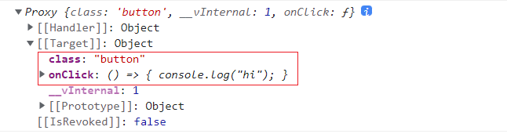
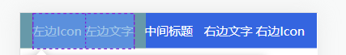
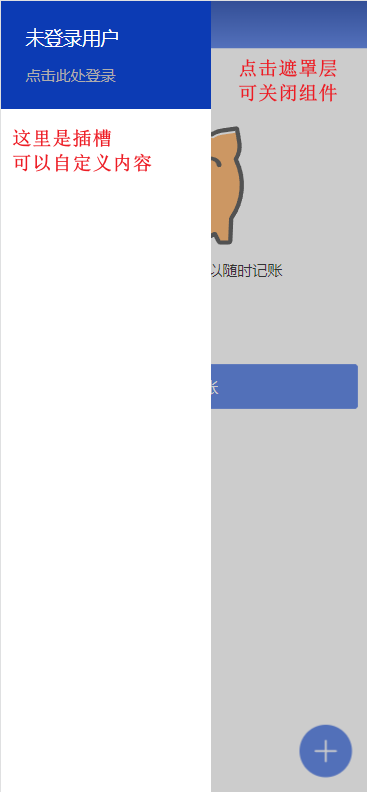
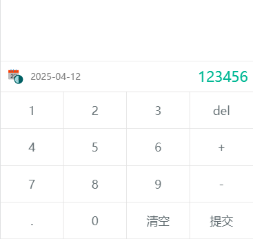
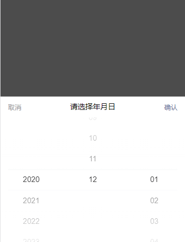
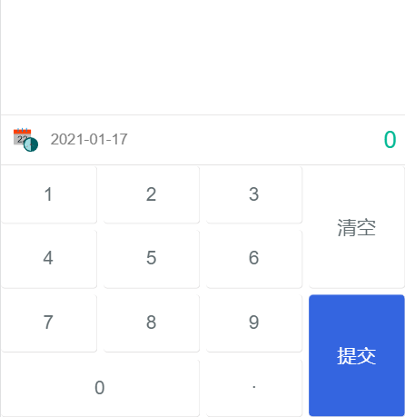
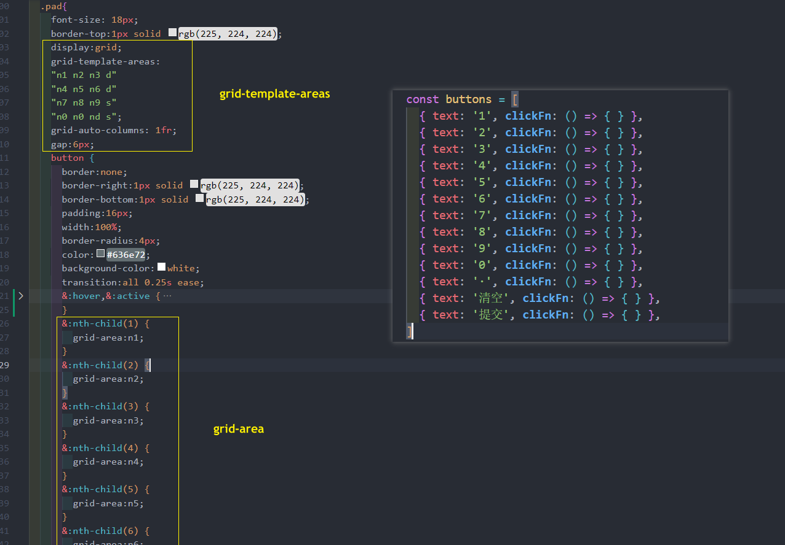

# 封装业务组件
## Button 按钮 组件


细节: 
* **$attrs** 的( **类名,事件**.. )的绑定 : 将外部传过来的 `attrs` 手动分配到的指定的标签上(`attrs` 包括类名以及事件...)
* 如果用户想要让**此 button 组件撑满屏幕**, 使用时可以在**组件上**添加 `display:block`(实现组件时已默认将原生 button 的宽度设置为 `100%`)
```vue
<template>
  <!--外面包了一层 div, 并且把 attrs 绑定到跟标签上(但 Vue 会默认绑定到根标签上)-->
  <div :class="$attrs" class="eren-button-wrapper">  
    <button class="eren-button">
    <slot></slot>
  </button>
  </div>
</template>
<script lang="ts" setup>
import { useAttrs } from 'vue'
const attrs = useAttrs()
console.log(attrs)
</script>
<style lang="scss" scoped>
$btn-bg:#3465e0;
$btn-bg-hover:#0433ab;
$btn-fs:18px;
.eren-button-wrapper{
  /*如果用户想要让此组件撑满屏幕, 会加上 display:block 覆盖 , 并且因为下面的 width:100% 撑满屏幕*/
  display: inline-block;
  .eren-button{
    /* 默认加上了width:100 */
    width: 100%;
    height: 48px;
    border:1px solid $btn-bg;
    padding:8px 16px; 
    font-size:$btn-fs;
    color:white;
    background-color:$btn-bg;
    border-radius:4px;
    transition: all 0.3s ease;
    &:hover,&:active {
      background-color:$btn-bg-hover;
      border:1px solid $btn-bg-hover;
    }
  }
}
</style>
```
使用 button 组件
```vue
<template>
  <div>
    <e-button class="button" @click="handleClick">开始记账</e-button>
  </div>
</template>
<script setup lang="ts">
import EButton from '../components/button.vue'
const handleClick = () => {
  console.log('hi')
}
</script>
<style lang="scss" scoped>
.button {
  display: block;
  margin:10px;
}
</style>
```
打出来此组件接受的 `attrs` 看一看:

## NavBar 导航栏 组件


需求:
* 文字(左, 中, 有) 要通过 **props 传递**(`left-text`, `title` , `right-text` )
* icon图标 通过**插槽**让用户自定义
* 并且点击左则区域 / 右侧区域触发**点击事件**, 组件监听的事件名为 `@click-left` 和 `@click-right` 

实现需要注意细节:
* 组件实现思路借鉴了Vant UI 的 [navBar 组件](https://vant-ui.github.io/vant/v2/#/zh-CN/nav-bar#ji-chu-yong-fa)
* 点击时需要触发事件, 所以需要适当扩大区域面积给用户使用(用的时一个css小技巧 绝对定位: left,top,bottom:0 沾满整个区域)

```vue
<template>
  <div class="eren-navBar-content">
    <!--左侧区域-->
    <div class="eren-navBar-left" @click="clickLeft">
      <span class="eren-navBar-left-icon">
        <slot name="leftIcon"></slot>
      </span>
      <span class="eren-navBar-left-text" v-if="leftText">
        {{ leftText }}
      </span>
    </div>
    <!--中间标题-->
    <span class="eren-navBar-title" v-if="title">{{ title }}</span>
    <!--右侧区域-->
    <div class="eren-navBar-right" @click="clickRight">
      <span class="eren-navBar-left-text" v-if="rightText">
        {{ rightText }}
      </span>
      <span class="eren-navBar-right-icon">
        <slot name="rightIcon"></slot>
      </span>
    </div>
  </div>
</template>
<script lang="ts" setup>
export interface NavBarProps {
  leftText?: string
  title?: string
  rightText?:string
}
const props = defineProps<NavBarProps>()

const emits = defineEmits(['clickLeft','clickRight'])
// 点击左侧区域
const clickLeft = () => {
  emits('clickLeft')
}
// 点击右侧区域
const clickRight = () => {
  emits('clickRight')
}
</script>
<style lang="scss" scoped>
.eren-navBar-content {
  width:100%;
  background-image: linear-gradient(to bottom, #002ea6, #3667e3);
  color:white;
  position:relative;
  display: flex;
  justify-content: center;
  align-items: center;
  height:46px;
  .eren-navBar-left{
    position:absolute;
    // 使用 绝对定位 撑满区域(下面三行), 并加上 左右padding 增加区域宽度
    left: 0;
    top: 0;
    bottom: 0;
    padding:0 16px;
    display: flex;
    justify-content: center;
    align-items: center;
    &-icon {
      margin-right:4px;
    }
    &-text {
      
    }
  }
  .eren-navBar-title{
    
  }
  .eren-navBar-right{
    position:absolute;
    // 使用 绝对定位 撑满区域(下面三行), 并加上 左右padding 增加区域宽度
    right:0;
    top: 0;
    bottom: 0;
    padding:0 16px;
    display: flex;
    justify-content: center;
    align-items: center;
    &-icon {
      margin-left:4px;
    }
    &-text {

    }
  }
}
</style>
```
使用该 navBar 组件
```vue
<template>
    <nav-bar left-text="左边文字" title="中间标题" right-text="右边文字" 
      @click-left="clickLeftHandle" @click-right="clickRightHandle">
      <template #leftIcon>
        左边Icon
      </template>
      <template #rightIcon>
        右边Icon
      </template>
    </nav-bar>
</template>
<script setup lang="ts">
import navBar from '../components/navBar.vue'

const clickLeftHandle = () => {
  console.log('点击了 navBar的左侧区域')
}
const clickRightHandle = () => {
  console.log('点击了 navBar的右侧区域')
}
</script>
```
## Overlay 遮罩层 组件


细节:
* 遮罩层和左边区域都使用 position:fixed 定位, 并用 z-index 调整层次
* 内容区域使用插槽让用户自定义内容
* 其组件的 显示/隐藏 通过 props 传递过来的 `visible` 属性所控制
```vue
<template>
  <transition name="fade">
    <div v-if="visible" class="eren-overlay">
    <!--遮罩层-->
    <div class="eren-overlay-mask" @click="clickOverlay"></div> 
    <!--内容-->
    <div class="eren-overlay-content">
      <section class="eren-overlay-content-login">
          <span class="text-login1">未登录用户</span>
          <span class="text-login2">点击此处登录</span> 
      </section>
      <!--插槽-->
        <slot></slot>
    </div>
  </div>
  </transition>
</template>
<script setup lang="ts">
export interface OverlayProps {
  visible:boolean
}
const props = defineProps<OverlayProps>()

const emits = defineEmits(['closeOverlay'])
// 点击了遮罩层区域
const clickOverlay = () => {
  emits('closeOverlay')
}
</script>
<style lang="scss" scoped>
.eren-overlay {
  &-mask {
    // 绝对定位
    position:fixed;
    background-color: gray;
    left: 0;
    right: 0;
    top: 0;
    bottom: 0;
    opacity: 0.4 ;
    z-index:8;
  }
  &-content {
    // 绝对定位
    position:fixed;
    left: 0;
    top: 0;
    width:14em;
    background-color: white;
    height: 100%;
    z-index:16;
    &-login {
      background-color: #0c3bb4;
      color:white;
      padding:26px;
      display: flex;
      flex-direction: column;
      .text-login1{
        font-size:20px;
      }
      .text-login2{
        margin-top:16px;
        color:rgb(176, 172, 172);
      }
    }
  }
}
.fade-enter-active,
.fade-leave-active {
  transition: all 0.15s ease;
}
.fade-enter-from,.fade-leave-to {
  opacity:0;
}
</style>
```
## tabs 标签页 组件
细节: 
* 需要 两个组件 tabs.vue , tab.vue

tabs 接受 `v-model:active` , 其 `active` 的值对应 tab 组件的 `name` 属性
```js
<tabs v-model:active="activeName">
    <tab name="支出">内容 1</tab>
    <tab name="收入">内容 2</tab>
</tabs>

const activeName = ref('支出')
```
* 因为对于 tabs 组件, 里面的 tab 组件 属于是它的插槽的内容, 这就是关键点 (使用了**插槽**获取了 tab 的组件实例)
* 使用 Composition API 中的 `computed` 找到了激活的组件
* 在使用 `component 动态组件` 时必须要加上 **key**

**tabs.vue** 实现功能(没加样式)
```vue
<template>
  <div class="eren-tabs">
    <ul class="eren-tabs-tab">
      <li v-for="item in arr" 
        :key="item.props?.name" 
        class="eren-tabs-tab-name"
        :class="{'active':item.props?.name === active}"
        @click="clickTab(item)"
      >{{item.props?.name}}</li>
    </ul>
    <!--细节: 这个时候 component 动态组件必须要加上 key-->
    <component :is="activeTab" :key="activeTab.props?.name"></component>
  </div>
</template>
<script lang="ts" setup>
import { useSlots, computed } from 'vue'
import tab from './tab.vue'

const slots = useSlots()
const arr = slots.default() 

// 检查 tabs 的子元素必须是 tab 组件
arr.forEach(item => {
  if (item.type !== tab) {
    throw new Error('tabs 组件的的子元素必须要求是 tab 组件')
  }
})
const props = defineProps({
  active: {
    type:String
  }
})
const emits = defineEmits(['update:active'])

// 获取当前激活的 tab 组件实例(必须计算属性)
const activeTab = computed(() => {
  return arr.filter(tab => tab.props?.name === props.active )[0]
})
// 点击标签名
const clickTab = (item:any) => {
  emits('update:active' , item.props.name)
}
</script>
<style lang="scss" scoped>
.eren-tabs{
  .active {
     background-color: antiquewhite;
  }
}
</style>
```
tab.vue
```vue
<template>
  <div class="eren-tab">
    <slot></slot> 
  </div>
</template>
<script lang="ts" setup>
</script>
```

加了样式
```vue
<style lang="scss" scoped>
.eren-tabs{
  .active {
    transition: all 0.25s ease;
    position:relative;
    // 使用了伪元素, 实现了下面的横线 (绝对定位)
    &::after {
      content:'';
      display: block;
      position:absolute;
      bottom:0;
      left: 0;
      right:0;
      height: 4px;
      background-color: white;
    }
  }
  &-tab {
    background-color: #273c75;
    display:flex;
    font-size: 18px;
    &-name {
      color:white;
      padding:8px 16px;
      flex-grow:1;
      display:flex;
      justify-content: center;
      align-items: center;
    }
  }
}
</style>
```
## InputPad 数字按键 组件

### 初步实现布局
```vue
<template>
  <div class="inputPad">
    <div class="notes">
      <span class="date">
        
        <span class="dateText">2025-04-12</span>
      </span>
      <span class="amount">123456</span>
    </div>
    <div class="pad">
      <button v-for="button in buttons" @click="button.clickFn">{{button.text}}</button>
    </div>
  </div>
</template>
<script lang="ts" setup>
import dateSvg from '../assets/icons/date.svg'
// 数字按键规则, v-for 循环显示
const buttons = [
  { text: '1', clickFn: () => { } },
  { text: '2', clickFn: () => { } },
  { text: '3', clickFn: () => { } },
  { text: 'del', clickFn: () => { } },
  { text: '4', clickFn: () => { } },
  { text: '5', clickFn: () => { } },
  { text: '6', clickFn: () => { } },
  { text: '+', clickFn: () => { } },
  { text: '7', clickFn: () => { } },
  { text: '8', clickFn: () => { } },
  { text: '9', clickFn: () => { } },
  { text: '-', clickFn: () => { } },
  { text: '.', clickFn: () => { } },
  { text: '0', clickFn: () => { } },
  { text: '清空', clickFn: () => { } },
  { text: '提交', clickFn: () => { } },
]
</script>
<style lang="scss" scoped>
.inputPad{
  .notes {
    display: flex;
    padding:8px;
    border-top:1px solid rgb(225, 224, 224); ;
    justify-content: space-between;
    .date {
      display: flex;
      img{
      width:30px;
      height:30px;
      margin-right:8px;
    }
    .dateText{
      display: flex;
      align-items: center;
      color:gray;
      font-size:14px;
    }
    }
    .amount {
      display: flex;
      align-items: center;
      color:#00b894;
      font-size:22px;
    }
  }
  .pad{
    font-size: 18px;
    display: flex;
    flex-wrap: wrap;
    border-top:1px solid rgb(225, 224, 224);
    button {
      border:none;
      border-right:1px solid rgb(225, 224, 224);
      border-bottom:1px solid rgb(225, 224, 224);
      padding:16px;
      width:25%;
      color:#636e72;
      background-color:white;
      transition:all 0.25s ease;
      &:nth-child(4n) {
        border-right:none;
      }
      &:hover,&:active {
        background-color: #feedb0;
        border-right:1px solid #feedb0;
      border-bottom:1px solid #feedb0;
      }
    }
  }
}
</style>
```
### Vant 引入日期选择器 和 弹出层 组件


[Vant 安装](https://vant-contrib.gitee.io/vant/#/zh-CN/quickstart#tong-guo-npm-an-zhuang)
[Vant 按需引入组件方法](https://vant-contrib.gitee.io/vant/#/zh-CN/quickstart#fang-fa-er.-an-xu-yin-ru-zu-jian-yang-shi)

utils/formatDate.js 先封装日期格式转换工具函数
```shell
npm i dayjs
```
```ts
import dayjs from 'dayjs'

// 加载中文语言包
import 'dayjs/locale/zh-cn'

// 配置使用中文语言包
dayjs.locale('zh-cn')

const DATE_TIME_FORMAT = "YYYY-MM-DD"

export default function formateDate(date:Date,format:string = DATE_TIME_FORMAT) {
  return dayjs(date).format(format)
}
```

使用 日期选择器 和 弹出层 组件 
```vue{4,13-24}
<template>
  <div class="inputPad">
    <div class="notes">
      <span class="date" @click="popupVisible = true">
        
        <span class="dateText">{{formatDate(currentDate)}}</span>
      </span>
      <span class="amount">123456</span>
    </div>
    <div class="pad">
      <button v-for="button in buttons" @click="button.clickFn">{{button.text}}</button>
    </div>
    <!--弹出层 - 日期选择器-->
    <van-popup v-model:show="popupVisible" position="bottom">
      <van-datetime-picker
          :value="currentDate"
          type="date"
          title="请选择年月日"
          :min-date="minDate"
          :max-date="maxDate"
          @confirm = "clickConfirmHandle"
          @cancel = "clickCancelHandle"
      />
    </van-popup>
  </div>
</template>
<script lang="ts" setup>
import dateSvg from '../assets/icons/date.svg'
import { ref } from 'vue';
import formatDate from '../utils/formatDate'
const buttons = [
  { text: '1', clickFn: () => { } },
  { text: '2', clickFn: () => { } },
  { text: '3', clickFn: () => { } },
  ...
  ...
]
// 弹出层
const popupVisible = ref(false)
// 选择的日期
const currentDate = ref(new Date(2021, 0, 17));
const minDate = new Date(2020, 0, 1)
const maxDate = new Date(2025, 10, 1)

// 日期选择 - 点击确认
const clickConfirmHandle = (date:Date) => {
  console.log(date)
  currentDate.value = date
  popupVisible.value = false
}
// 日期选择 - 点击取消
const clickCancelHandle = () => {
  popupVisible.value = false
}
</script>
```
### 改数字按键的需求 并且完成数字检查


布局细节:
* 使用 `grid` 布局


数字检查细节:
* 一开始就有 `0`
* 一开始`0`之后不能再连续输入 `0`, 但小数点之后的 `0`可以重复
* 一开始`0`, 再选 1~9 会把`0`去掉, 但`.`除外
* `.`之后不能再有个 `.`

```js
const buttons = [
  { text: '1', clickFn: () => { appendText('1')} },
  { text: '2', clickFn: () => { appendText('2')} },
  { text: '3', clickFn: () => { appendText('3')} },
  { text: '4', clickFn: () => { appendText('4')} },
  { text: '5', clickFn: () => { appendText('5')} },
  { text: '6', clickFn: () => { appendText('6')} },
  { text: '7', clickFn: () => { appendText('7')} },
  { text: '8', clickFn: () => { appendText('8')} },
  { text: '9', clickFn: () => { appendText('9')} },
  { text: '0', clickFn: () => { appendText('0')} },
  { text: '·', clickFn: () => { appendText('.')} },
  { text: '清空', clickFn: () => {amount.value = '0' } },
  { text: '提交', clickFn: () => { console.log('提交')} },
]
// 总金额
const amount = ref('0')
// 按键逻辑
const appendText = (str:string) => {
  if (str === '.') {
    if (amount.value.indexOf('.') > -1) {
      return 
    }
  }
  if (amount.value === '0') {
    if (str === '.') {
      amount.value += str
      return 
    }
    amount.value = ''  
    amount.value += str
    return 
  }
  if (amount.value.length === 16) {
    return
  }
  amount.value += str
}
```
### 点击提交派发事件
目前提交条件的细节还没有添加, 后面使用时需要自己定制
```js
const emits = defineEmits(['click-submit'])

const buttons = [
  ...
  { 
    text: '提交', 
    clickFn: () => { 
      emits('click-submit' , amount.value)
    }},
]

const amount = ref('0')
```
并且父组件监听此事件
```vue
  <inputPad @click-submit="submitHandle"/>
```


