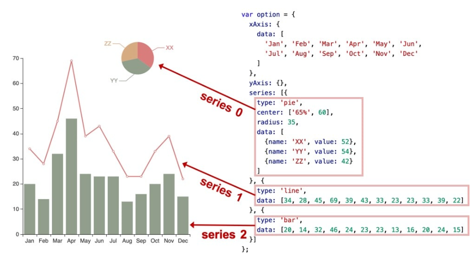
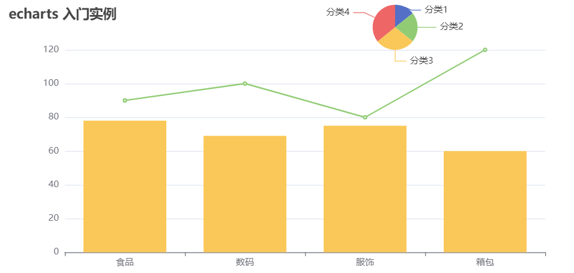
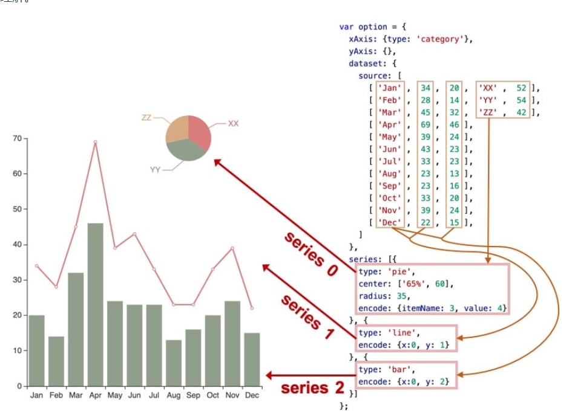
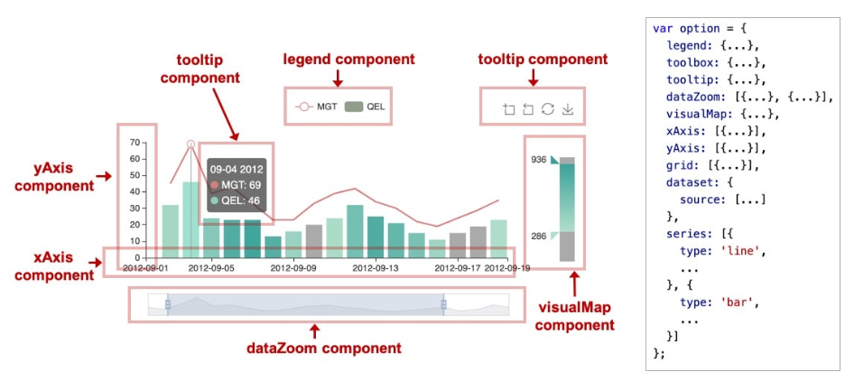
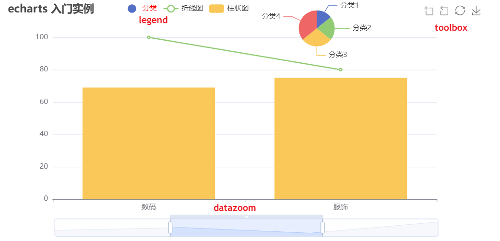
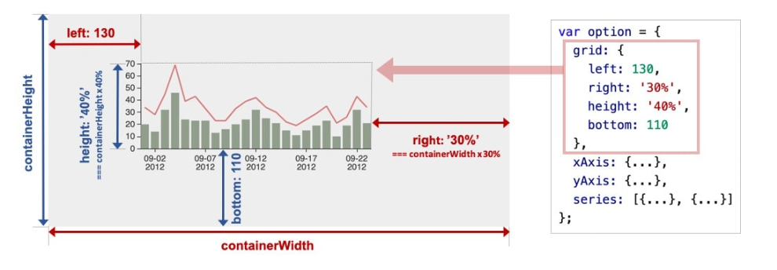
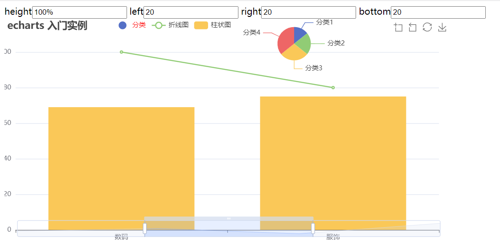

# Echarts 基本概念
## Echarts 基本概念: 系列
系列（series）是指：一组数值映射成对应的图


## 案例: 多系列混合
**多系列**指的是 **一个坐标系内出现多个图**



```vue{19-40}
<template>
  <div ref="echartRef"  :style="{width:'800px', height:'400px'}"></div>
</template>

<script setup>
import * as echarts from 'echarts'
import { ref, onMounted } from 'vue'
const echartRef = ref()
onMounted(() => {
  const echartInstance = echarts.init(echartRef.value)
  echartInstance.setOption({
    title: {
      text:'echarts 入门实例'
    },
    xAxis: {
      data:['食品', '数码', '服饰', '箱包']
    },
    yAxis: {},
    series: [
      {
        type: 'pie',
        radius: 30,   // 半径
        center:['65%', 30], // 位置
        data: [
          { name: '分类1', value: 20 },
          { name: '分类2', value: 30 },
          { name: '分类3', value: 40 },
          { name: '分类4', value:50 },
        ]
      },
      {
        type: 'line',
        data: [90, 100, 80, 120]
      },
      {
        type: 'bar',
        data: [78,69,75,60]
      }
    ]
  })
})
</script>
```
## ECharts 4.0 新特性：dataset
ECharts 4 开始支持了 数据集（dataset）组件用于单独的数据集声明，从而数据可以单独管理，被多个组件复用，并且可以自由指定数据到视觉的映射。这一特性能将逻辑和数据分离，带来更好的复用，并易于理解。




## 案例: dataset 移植
```vue{12-18,32,36,40}
<template>
  <div ref="echartRef" :style="{ width: '800px', height: '400px' }"></div>
</template>

<script setup>
import * as echarts from 'echarts'
import { ref, onMounted } from 'vue'
const echartRef = ref()
onMounted(() => {
  const echartInstance = echarts.init(echartRef.value)
  echartInstance.setOption({
    dataset:{
      source: [
        ['食品',78,90,'分类1',20],
        ['数码',69,100,'分类2',30],
        ['服饰',75,80,'分类3',40],
        ['箱包',60 ,120,'分类4',50]
      ]
    },
    title: {
      text:'echarts 多系列实例',
    },
    xAxis: {
      type: 'category'
    },
    yAxis: {},
    series: [
      {
        type: 'pie',
        radius: 30,   // 半径
        center:['65%', 30], // 位置
        encode: {itemName:3, value:4}
      },
      {
        type: 'line',
        encode: {x:0, y:2}
      },
      {
        type: 'bar',
        encode: {x:0, y:1}
      }
    ]
  })
})
</script>
```
## Echarts 基本概念 - 组件
ECharts 中除了绘图之外其他部分，都可抽象为 「组件」。例如，ECharts 中至少有这些组件：xAxis（直角坐标系 X 轴）、yAxis（直角坐标系 Y 轴）、grid（直角坐标系底板）、angleAxis（极坐标系角度轴）...

## 案例：各种组件


::: details
```vue
<template>
  <div ref="echartRef" :style="{ width: '800px', height: '400px' }"></div>
</template>

<script setup>
import * as echarts from 'echarts'
import { ref, onMounted } from 'vue'
const echartRef = ref()
onMounted(() => {
  const echartInstance = echarts.init(echartRef.value)
  echartInstance.setOption({
    dataset:{
      source: [
        ['食品',78,90,'分类1',20],
        ['数码',69,100,'分类2',30],
        ['服饰',75,80,'分类3',40],
        ['箱包',60 ,120,'分类4',50]
      ]
    },
    title: {
      text: 'echarts 入门实例',
      subText:'- 组件 -' // 副标题
    },
    xAxis: {
      type: 'category'
    },
    yAxis: {},
    legend: {
      data: [{ // 必须给 series 指定对应的 name 属性
        name: '分类',
        // 强制设置图形为圆。
        icon: 'circle',
            // 设置文本为红色
            textStyle: {
              color: 'red'
            }
      }, '折线图', '柱状图'],
      left:200
    },
    toolbox: {
          feature: {
            dataZoom: {
              yAxisIndex: 'none'
            },
            restore: {},
            saveAsImage: {}
          }
        },
        dataZoom: [{
          show: true,
          start: 30,
          end: 70
        }],
    series: [
      {
        name:'分类',
        type: 'pie',
        radius: 30,
        center:['65%', 45], 
        encode: {itemName:3, value:4}
      },
      {
        name:'折线图',
        type: 'line',
        encode: {x:0, y:2}
      },
      {
        name:'柱状图',
        type: 'bar',
        encode: {x:0, y:1}
      }
    ]
  })
})
</script>
```
:::

## Echarts 基本概念: 定位
大多数组件都提供了定位属性，我们可以采用类似 CSS absolute 的定位属性来控制组件的位置，下面这个案例可以通过修改 grid 组件定位来控制图表的位置





::: details
```vue{28,32}
<template>
  height<input type="text" v-model="height">
  left<input type="text" v-model="left">
  right<input type="text" v-model="right">
  bottom<input type="text" v-model="bottom">
  <div ref="echartRef" :style="{ width: '800px', height: '400px' }"></div>
</template>

<script setup>
import * as echarts from 'echarts'
import { ref, onMounted } from 'vue'
const echartRef = ref()
const left = ref(20)
const right = ref(20)
const bottom = ref(20)
const height = ref('100%')
onMounted(() => {
  const echartInstance = echarts.init(echartRef.value)
  echartInstance.setOption({
    dataset:{
      source: [
        ['食品',78,90,'分类1',20],
        ['数码',69,100,'分类2',30],
        ['服饰',75,80,'分类3',40],
        ['箱包',60 ,120,'分类4',50]
      ]
    },
    grid: {
      left: left.value,
      bottom: bottom.value,
      right: right.value,
    },
    title: {
      text: 'echarts 入门实例',
      subText:'- 组件 -' // 副标题
    },
    xAxis: {
      type: 'category'
    },
    yAxis: {},
    legend: {
      data: [{ // 必须给 series 指定对应的 name 属性
        name: '分类',
        // 强制设置图形为圆。
        icon: 'circle',
            // 设置文本为红色
            textStyle: {
              color: 'red'
            }
      }, '折线图', '柱状图'],
      left:200
    },
    toolbox: {
          feature: {
            dataZoom: {
              yAxisIndex: 'none'
            },
            restore: {},
            saveAsImage: {}
          }
        },
        dataZoom: [{
          show: true,
          start: 30,
          end: 70
        }],
    series: [
      {
        name:'分类',
        type: 'pie',
        radius: 30,
        center:['65%', 45], 
        encode: {itemName:3, value:4}
      },
      {
        name:'折线图',
        type: 'line',
        encode: {x:0, y:2}
      },
      {
        name:'柱状图',
        type: 'bar',
        encode: {x:0, y:1}
      }
    ]
  })
})
</script>
```
:::