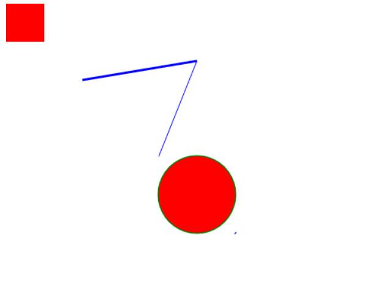
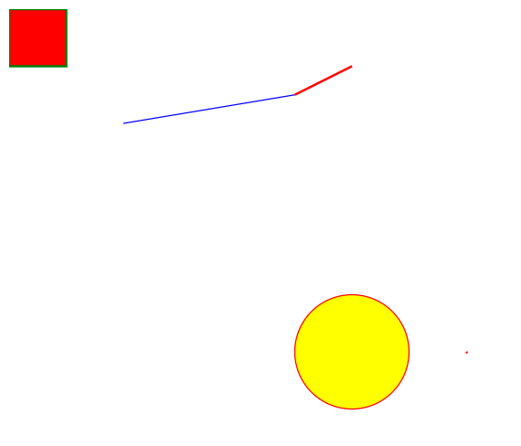
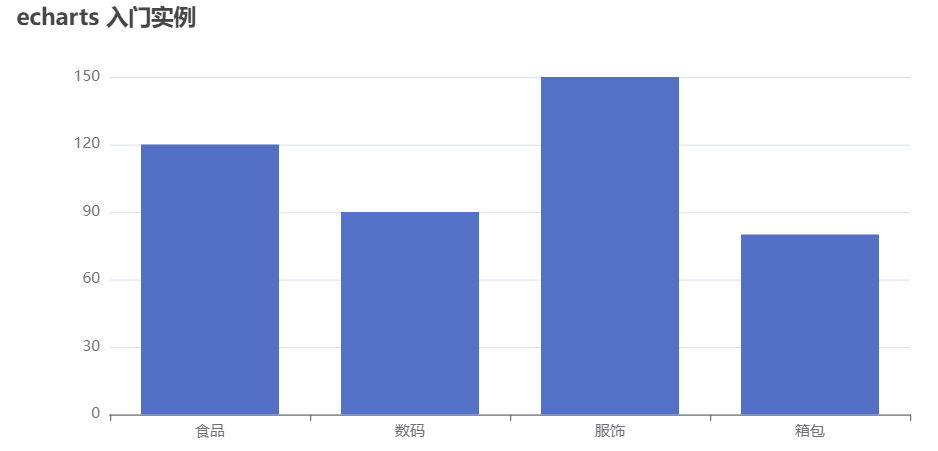

# 入门
## canvas 入门
绘制 矩形, 线 , 圆 , 点


```html
<!DOCTYPE html>
<html lang="en">
<head>
  <meta charset="UTF-8">
  <meta http-equiv="X-UA-Compatible" content="IE=edge">
  <meta name="viewport" content="width=device-width, initial-scale=1.0">
  <title>Document</title>
</head>
<body>
  <canvas id="canvas" width="800" height="800"></canvas>
  <script>
    const canvas = document.getElementById("canvas")
    const ctx = canvas.getContext('2d') // 获取到 canvas 对象
    ctx.fillStyle = 'red'  // 修改填充色为红色
    ctx.fillRect(0, 0, 50, 50) // 绘制矩形

    ctx.beginPath()
    ctx.lineWidth = 3     // 线条宽度
    ctx.strokeStyle = 'blue'  // 线条颜色
    ctx.moveTo(100, 100) // 起点坐标
    ctx.lineTo(250, 75) // 中间点坐标
    ctx.stroke() // 绘制线段
    ctx.lineWidth = 1 // 改下宽度
    ctx.lineTo(200, 200) // 终点坐标
    ctx.stroke() // 再绘制一次

    ctx.beginPath()
    ctx.lineWidth = 3
    ctx.strokeStyle = 'green'
    ctx.fillStyle = 'red'
    ctx.arc(250,250 , 50 , 0, 2 * Math.PI) // 绘制 圆
    ctx.stroke()
    ctx.fill() // 填充
    
    ctx.beginPath()
    ctx.lineWidth = 3     // 线条宽度
    ctx.strokeStyle = 'blue'  // 线条颜色
    ctx.moveTo(300, 300) // 起点坐标
    ctx.lineTo(301, 301) // 中间点坐标
    ctx.stroke() // 绘制线段
  </script>
</body>
</html> 
```

> 总结出 Canvas 绘图的流程?
1. 编写 Canvas 标签 (注意指定宽高, 默认宽高300 x 150 往往满足不了需求)
2. 获取 Canvas DOM 对象 
3. 获取 Canvas 对象
4. 设置绘图属性
5. 调用绘图 API

## svg 入门


```js
<!DOCTYPE html>
<html lang="en">
<head>
  <meta charset="UTF-8">
  <meta http-equiv="X-UA-Compatible" content="IE=edge">
  <meta name="viewport" content="width=device-width, initial-scale=1.0">
  <title>Document</title>
</head>
<body>
  <svg width="800" height="800">
    <rect width="50" height="50" style="fill:red;stroke-width:2;stroke:green"></rect>
    <line 
      x1="100"
      y1="100"
      x2="250"
      y2="75"
      style="stroke:blue;stroke-width:1"
    ></line>
    <line 
      x1="250"
      y1="75"
      x2="300"
      y2="50"
      style="stroke:red;stroke-width:2"
    ></line>
    <circle 
      cx="300"
      cy="300"
      r="50"
      style="stroke-width: 1;stroke:red;fill:yellow"
    ></circle>
    <line 
      x1="400"
      y1="300"
      x2="401"
      y2="301"
      style="stroke:red;stroke-width:2"
    ></line>
  </svg>
</body>
</html>
```

> svg 和 canvas 比较

实现效果比较类似, 但实现方法完全不同

svg是通过DOM 方式来进行绘制, 而 Canvas是通过 JS API的方式进行绘制

所以 svg 绘制的每一个图形都可以选中DOM , 因为它本身就是 HTML 元素, 而 Canvas 绘制的图形不能选中 DOM

svg适合绘制图标和矢量图
## echart 入门

```shell
npm install echarts --save
```
```vue
<template>
  <!--要给个宽高-->
  <div ref="echartRef" :style="{width:'800px', height:'400px'}"></div>
</template>

<script setup>
import * as echarts from 'echarts'
import { ref, onMounted } from 'vue'
const echartRef = ref() // dom 元素
onMounted(() => {
  const echartInstance = echarts.init(echartRef.value)  // init 实例
  echartInstance.setOption({ // 配置项
    title: {
      text:'echarts 入门实例'
    },
    xAxis: {
      data:['食品', '数码', '服饰', '箱包']
    },
    yAxis: {},
    series: {
      type: 'bar',
      data:[120, 90,  150 ,80]
    }
  })
})
</script>
```
### 自定义主题和 svg渲染
[官网 - theme 主题](https://echarts.apache.org/handbook/zh/concepts/style)
[主题编辑器](https://echarts.apache.org/zh/theme-builder.html)
```js
// HTML 引入 vintage.js 文件后（假设主题名称是 "vintage"）
var chart = echarts.init(dom, '主题名称');
// ...
```

**svg 渲染** - 设置 renderer 参数 为 'canvas' 或 'svg' 即可指定渲染器(默认 Canvas)
```js
var chart = echarts.init(dom, '主题名称', {renderer:'svg'});
```


