# 包管理工具
## npm
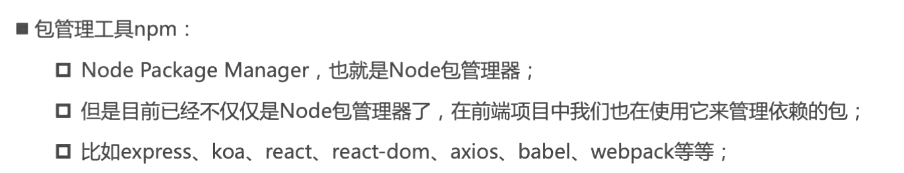

[npm 官网](http://www.npmjs.com/)
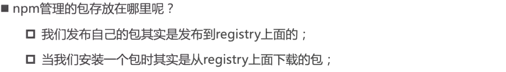
## 项目配置文件
### 常见的属性
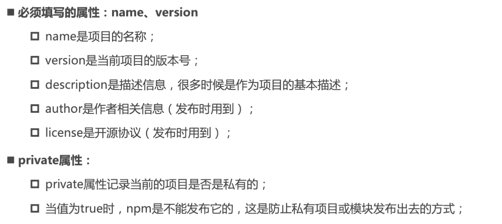
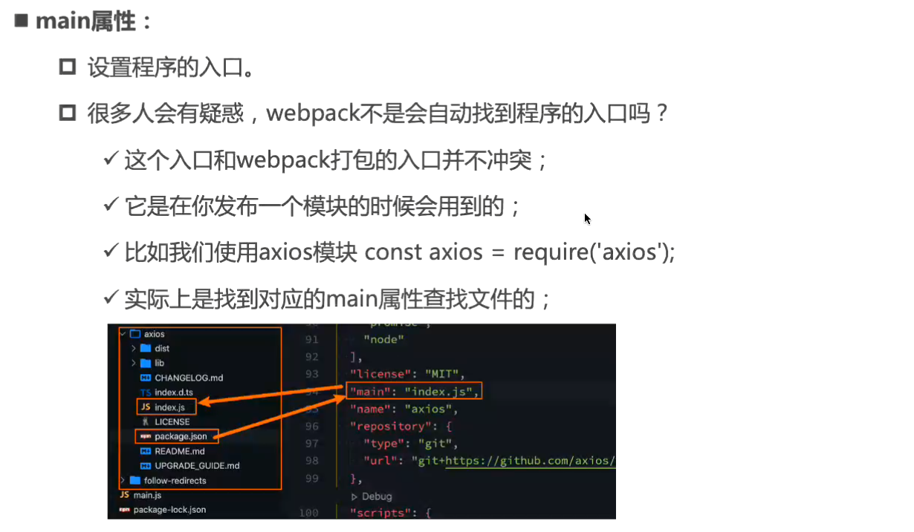
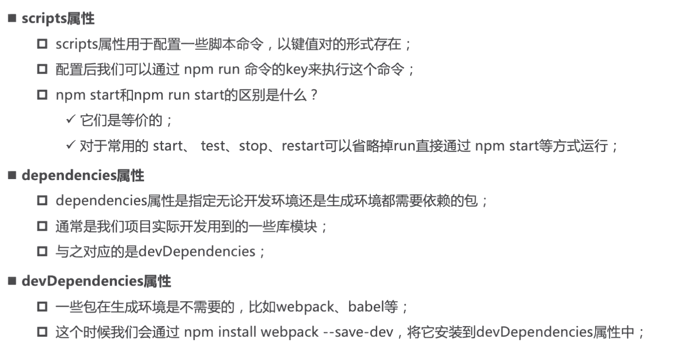
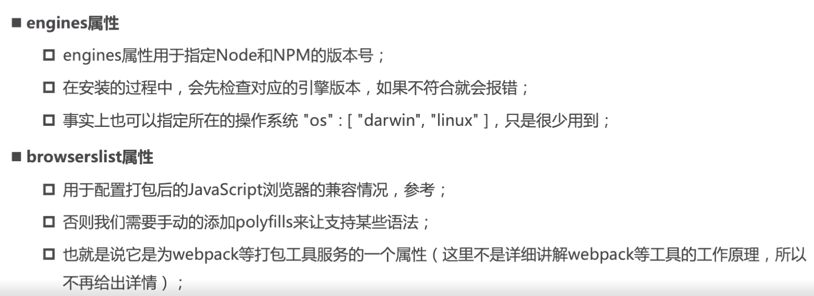
### 版本管理的问题
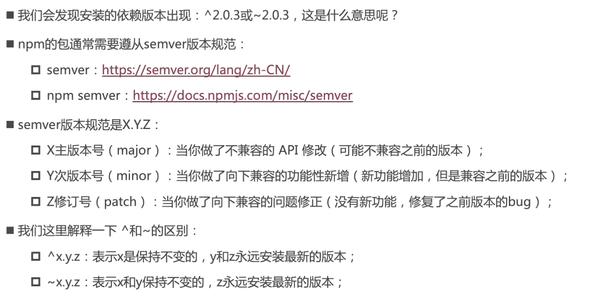
### npm install 命令
全局安装 `npm install package -g`

(项目)局部安装 `npm install package`
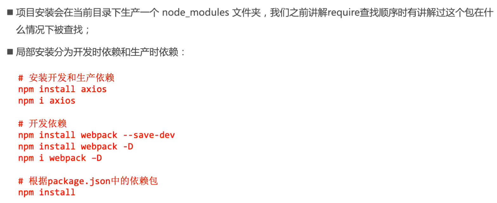
### npm install 原理
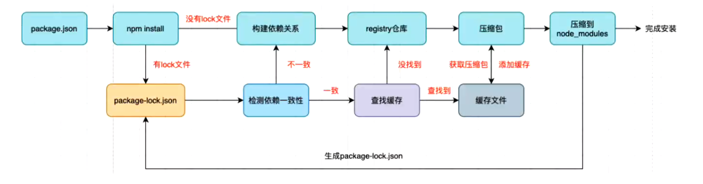
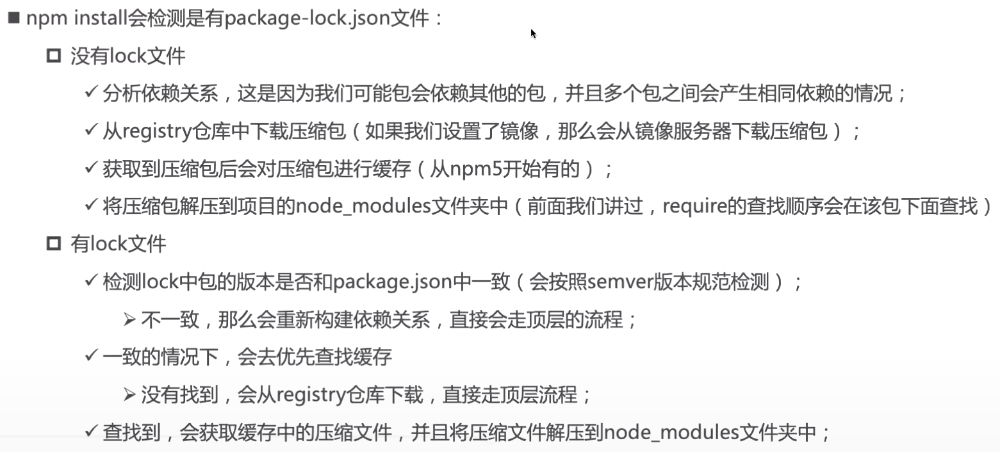

#### package-lock.json
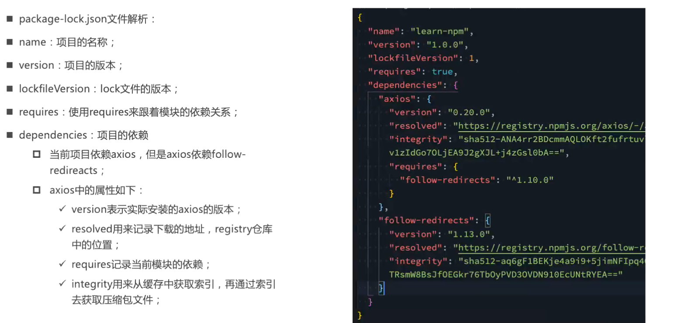
### npm 其他命令
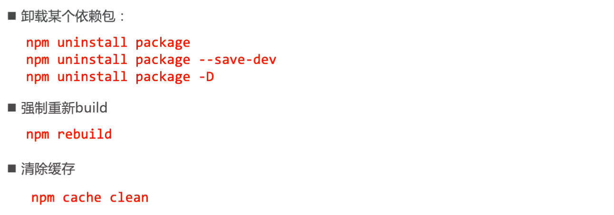

