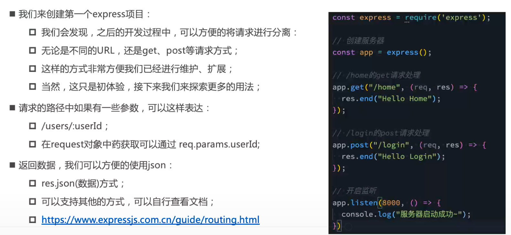

# express

## 安装

## 基本使用


## 认识中间件


## 应用中间件 - 自己编写

### 普通中间件

### path 路径匹配的中间件

### path 和 method 匹配的中间件

### 连续注册多个中间件

## 中间件的应用

### 编写解析 request body 中间件

### json, urlencoded 解析

其中 `express.urlencoded({extended: true})`
* `true` : 那么对 urlencoded 进行解析时, 它使用的是第三方库 qs
* `false` : 那么对urlencoded 进行解析时, 使用的是 Node 内置的模块 querystring
### form-data 解析
需要使用 express 官方推出的第三方库 **multer**
```shell
npm install multer
```

### form-data 上传文件

### 第三方中间件

## 客户端发送请求的方式

### request 参数解析 - params, query

## 响应数据


<!-- ## 基本使用
### 安装 express
```
npm i express@4.17.1
```

### 创建基本的 web 服务器
```js
// 导入 express 模块
const express = require('express')
// 创建 web 服务器
const app = express()
// 调用 app.listen(端口号, 启动成功后的回调函数), 启动服务器
app.listen(80, () =>{
  console.log('express listening on port 80)
})
```
### 监听 GET / POST 请求
`app.get()` 或 `app.post()` 方法, 可以监听客户端的 GET 请求

```js
// 参数1 : 客户端请求的 url
// 参数2 : 请求对应的处理函数
//      req: 请求对象
//      res: 响应对象
app.get('请求的url', function(req,res){ /*处理函数*/})   
// 或者
app.post('请求的url', function(req,res){ /*处理函数*/})   
```
### 把内容响应给客户端
`res.send()`方法, 把处理好的内容, 发送给服务端

```js
app.get('/user',(req,res)=>{
    // 向客户端发送 json 对象
    res.send({name:'frank', age:18})
})

app.post('/user' ,(req,res)=>{
    // 向客户端发送文本那内容
    res.send('请求成功')
})
```
### 获取 URL 中携带的查询参数
通过 **req.query** 对象, 可以访问到客户端通过查询字符串的形式, 发送到服务器的参数

```js
app.get('/', (req,res) =>{
  // req.query 默认是个空对象
  // 客户端使用 ?name=frank&age=18 的格式, 发送服务器的参数
  // 可以通过 req.query.name  req.query.age 访问到
  console.log(req.query)
  res.send(req.query)
})
```
### 获取 url 中的动态参数
`res.params` 对象, 可以访问到URL中, 通过 `:` 匹配到的动态参数 
```js
app.get('/user/:id',(req,res)=>{
  // req.params 默认空对象
  console.log(req.params)
  // 输出 如  { id : 1}
  res.send(req.params)
})
```
## 托管静态资源
### express.static()
**非常方便的创建一个静态资源服务器**

例如: 如下代码, 将 public 目录下的图片 ,css 文件, JavaScript 文件对外开放访问了
```js
app.use(express.static('public'))
```
就可以访问 public 目录中的所有文件了


**注意 :** Express 在**指定的**静态目录中查找文件, 并对外提供资源的访问路径, 因此**存放静态资源的目录名不会出现在 URL 中** ! 


```js
const express = require('express')
const app = express()

// 调用 express.static() 提供静态资源
app.use(express.static('./public'))

app.listen(80, (req,res)=>{
  console.log('启动')
})
```
### 托管多个静态资源目录
如果要托管多个静态资源目录, 需要多次调用 express.static() 函数
```js
app.use(express.static('public'))
app.use(express.static('files'))
```
访问静态资源文件时, express.static() 会**根据目录的添加顺序**查找所需的文件

### 挂载路径前缀
前面加一下**访问前缀**
```js
app.use('/public', express.static('public'))
```
通过 public 前缀地址来访问 public 目录的文件了

## nodemon
修改了代码每次都要重启, 非常繁琐

现在可以使用 nodemon , 它**能够监听项目文件的变动**, 当代码被修改后, nodemon 会**自动帮我们重启项目** , 极大方便了开发和调试

安装
```shell
npm install -g nodemon
```

使用 nodemon
```shell
node app.js
# 将上面命令替换为下面命令
nodemon app.js
```
## 路由
### Express 中的路由
在 Express 中, 路由指的是 **客户端的请求** 与 **服务器处理函数**之间的*映射关系*

Express的路由有三部分组成, **请求的类型**, **请求的 URL 地址**, **处理函数**, 格式如下:
```js
app.METHOD(PATH , HANDLER>
```
比如, app.get('/',function(req,res){...})
### 路由的匹配过程
每当一个请求请求到服务器, **需要先经过路由的匹配**,只有匹配成功, 才会调用对应的处理函数

在匹配时, 会按照路由的顺序进行匹配, 如果 **请求类型** 和 **请求的 url** 同时匹配成功, 则 Express  会将这次请求转交给对应的  function 函数进行处理


注意: 
* 按照**先后顺序**
* **请求类型, 请求的 url** 同时匹配成功, 才会调用对应的处理函数

### 最简单用法
最简单的方式, 把路由挂载到 app 上 , 代码如下: 
```js
const express = require('express')
const app = express()

app.get('/',(req,res)=>{res.end('Hello')})
app.post('/',(req,res)=>{res.end('Hello')})

app.listen(80,()=>{
  console.log('listening on port 80')
})
```
### 模块化路由
为了方便对路由进行模块化管理, Express **不建议** 将路由直接挂载到 app 上, **而是推荐将路由抽离为单独的模块**

1. 创建路由对应的 .js 文件
2. 调用 `express.Router()` 函数创建路由对象
3. 向路由实例挂载具体的路由
4. 使用 **module.exports** 向外共享路由对象
5. 使用 **app.use** 函数注册路由模块

```js
const express = require('express')
// 创建路由对象
const router = express.Router()

// 挂载具体的路由
router.get('/user/list',(req,res)=>{
  res.send('Get user list')
})
router.post('user/list',(req,res)=>{
  res.send('add new user')
})
// module.exports 导出
module.exports = router
```
然后 `app.use()` **注册**路由模块
```js
// 导入路由模块
const userRouter = require('./router/user.js')
// 使用 app.use() 注册路由模块
app.use(userRouter)
```

`app.use()` 的作用 : 就是来注册全局中间件
#### 为路由模块添加访问前缀
```js
// 导入路由模块
const userRouter = require('./router/user.js')
// 使用 app.use() 注册路由模块
app.use('/api', userRouter)
```


 -->


