# fs 文件系统模块
## fs的三种操作方式

#### 同步操作
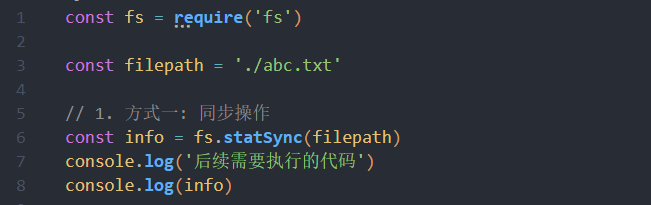

终端会打出
```
后续需要执行的代码
Stats {
  dev: 1745203973,
  mode: 33206,
  nlink: 1,
  uid: 0,
  gid: 0,
  rdev: 0,
  blksize: 4096,
  ino: 20547673300363388,
  size: 25,
  blocks: 0,
  atimeMs: 1665300898547.661,
  mtimeMs: 1665300898444.702,
  ctimeMs: 1665300898444.702,
  birthtimeMs: 1665300886624.2046,
  atime: 2022-10-09T07:34:58.548Z,
  mtime: 2022-10-09T07:34:58.445Z,
  ctime: 2022-10-09T07:34:58.445Z,
  birthtime: 2022-10-09T07:34:46.624Z
}
```
#### 异步操作
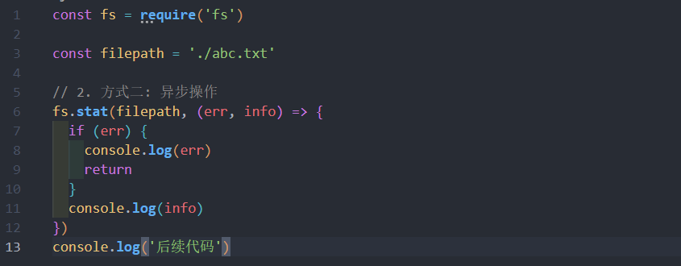
#### promise 的方式
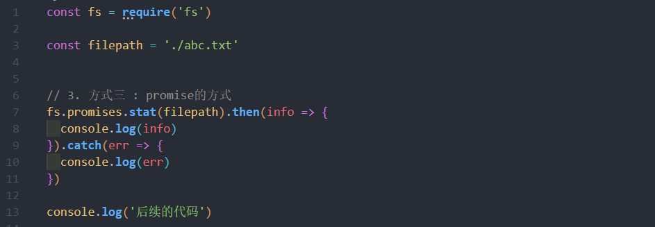
## 文件描述符
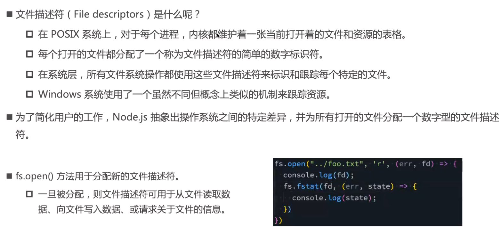
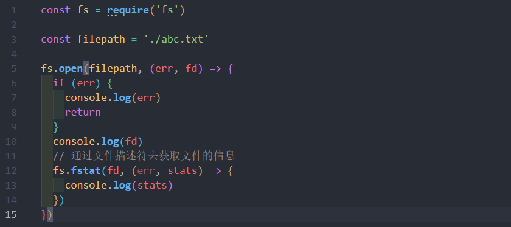
## 文件的读写
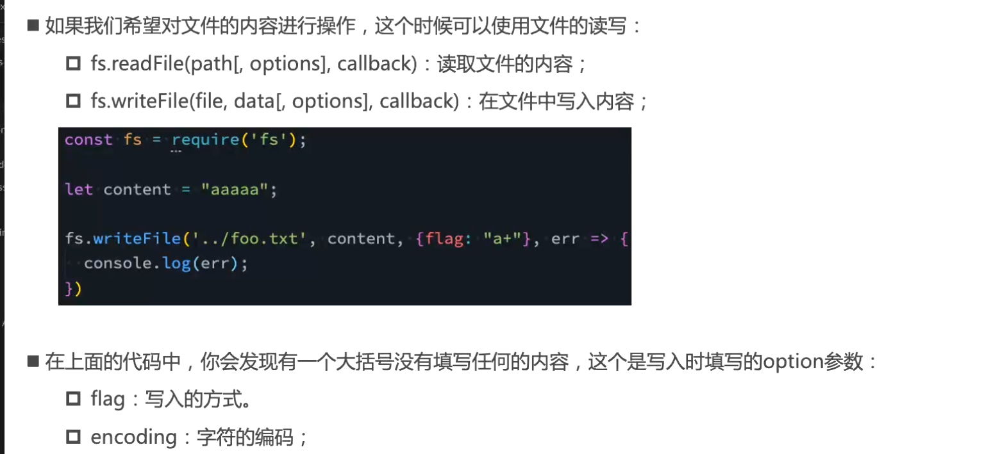
### flag 选项
flag 的值很多: 
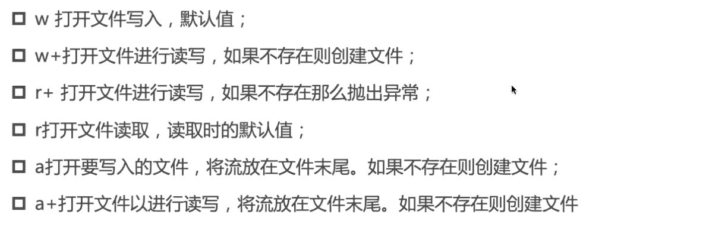
例: 
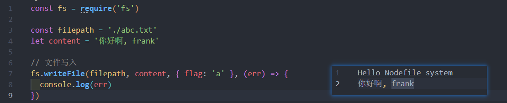
### encoding 选项
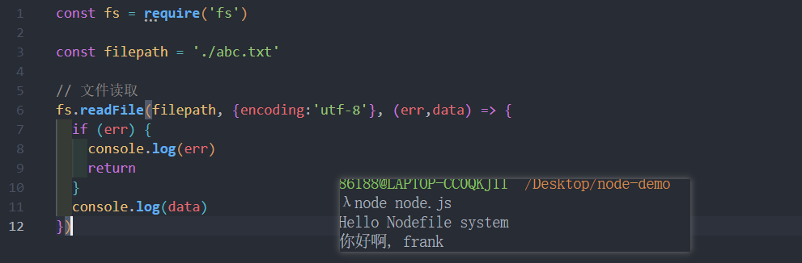
## 文件夹操作
#### 创建文件夹
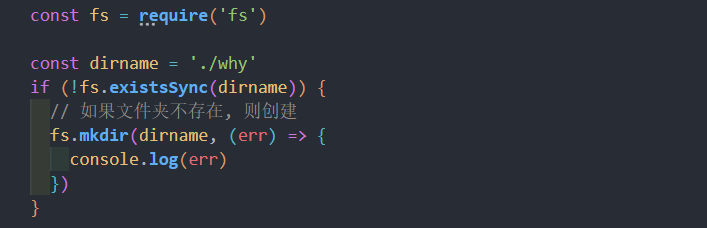
#### 读取文件夹中的所有文件
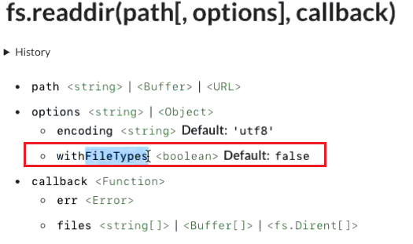
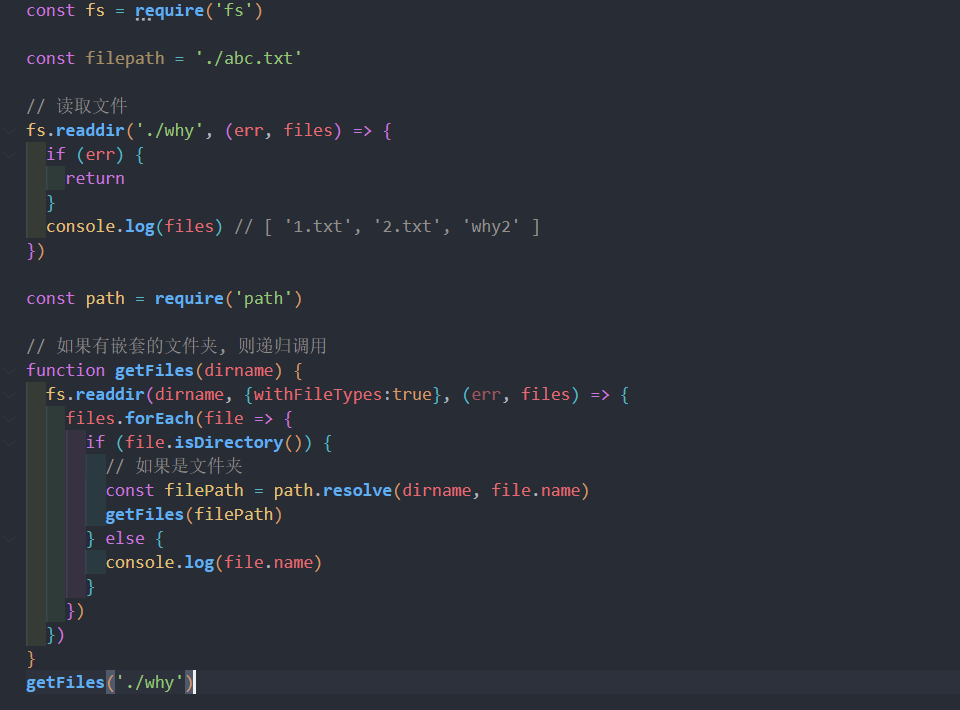
#### 重命名
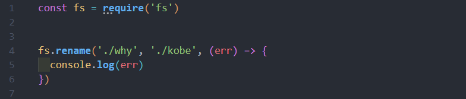


<!-- fs 模块是用拉埃操作文件的模块

例如:
* `fs.readFile()` 方法, 用来读取指定文件的内容
* `fs.writeFile()` 方法, 想指定的文件中写入内容

需要先导入 fs 模块
```js
const fs = require('fs')
```

## 读取指定文件内容
### fs.readFile() 语法格式
```js
fs.readFile(path[, options], callback)
```
* 参数1 : **必选**参数, 文件路径
* 参数2 : 可选参数, 表示以什么**编码格式**来读取文件, 一般指定为 utf8
* 参数3 : **必选**参数, 读取后, 通过回调函数拿到读取的结果
### fs.readFile() 实例代码
以 utf8 的编码格式, 读取指定文件的内容, 并打印 err 和 dataStr
```js
// 1.  导入 fs 模块, 来操作文件
const fs = require('fs')

// 2.  调用 readFile() 读取文件
fs.readFile('./file/1.txt', 'utf8', function (err, dataStr) {
  // 1. 打印失败的结构
  // 如果读取成功, 则 err 的值为 null
  // 如果读取失败, 则 err 的值为 错误对象, dataStr 的值为 undefined
  console.log(err)
  console.log('--------')
  // 2. 打印成功的结果
  console.log(dataStr)
})
```
### 判断文件是否读取成功
可以判断 err 对象是否为 `null`, 来知晓文件读取的解构
```js
const fs = require('fs')

fs.readFile('./file/1.txt', 'utf8', function (err, dataStr) {
  // err 存在, 说明出错
  if(err) {
    console.log('文件读取失败!' + err.message )
  }
  console.log('文件读取成功, 内容是:' + result)
})
```
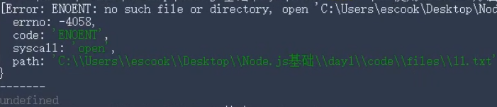
## 向指定文件写入内容
### fs.writeFile() 的语法格式
```js
fs.writeFile(file,data[,options],callback)
```

* 参数1 : **必选**参数, **文件路径的字符串**
* 参数2 : **必选**参数, 表示写入的内容
* 参数3 : 可选参数, 什么格式写入文件, 默认值为 `utf8`
* 参数4 : **必选**参数, 文件写入完成后的回调函数

```js
const fs = require('fs')

fs.writeFile('./file/2.txt', 'Hello, Node.js!', function (err) {
  // 如果文件写入成功, 则 err 的值 等于 null
  // 如果文件写入失败, 则 err 的值 等于 一个错误对象
  console.log(err)
})
```
### 判断是否写入成功
可以判断 err 对象是否为 `null`, 来知晓文件写入的结果
```js
const fs = require('fs')

fs.writeFile('./file/2.txt', 'Hello, Node.js!', function (err) {
    if(err) {
      return  console.log('文件写入失败!' + err.message)
    }
    console.log('文件写入成功 ! ')
})
```
## 练习
```js
// 1.txt 
小红=99 小黄=94 小白=92 小红=93 小绿=98 小黑=99  

// 上面数据想要转换成下面这样, 并整理到 2.txt 里
小红:99 
小黄:94 
小白:92 
小红:93 
小绿:98 
小黑:99 
```

写代码~~

```js
const fs = require('fs')

fs.readFile('./1.txt', 'utf8', function (err,dataStr) {
  if (err) {
      console.log('文件读取失败! ' + err.message)
  }
  // console.log('文件读取成功!')
  
  // 数据按空格分割
  // 分割后字符串, 遍历, 替换字符串
  // 新数组每一项, 进行合并
  const arrOld = dataStr.split('')
  const arrNew = []
  arrOld.forEach(item => {
    arrNew.push(item.replace('=',':'))
  })
  const newStr = arrNew.join('\r\n')

  // 写入文件
  fs.writeFile('./2.txt', newStr, function (err) {
    if (err) {
      return console.log('写入文件失败' + err.message)
    }
    console.log('写入成功')
  })
})
```


## 路径动态拼接的问题 __dirname
在使用 fs 模块操作文件时, **直接提供完整的路径**， 不要写成 ./ 或 ../ 开头的相对路径， 从而防止路径动态拼接的问题

`__dirname` 表示当前文件所处的目录
```js
console.log(__dirname)
```

不要使用相对路径 ! 
```js
const fs = require('fs')

fs.readFile(__dirname + '/file/1.txt', 'utf8', function (err, dataStr) {
  // err 存在, 说明出错
  if(err) {
    console.log('文件读取失败!' + err.message )
  }
  console.log('文件读取成功, 内容是:' + result)
})
```
``` -->


