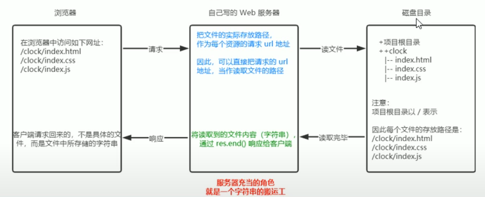

# http 模块
创建 web 服务器

先导入
```js
const http = require('http')
```

## 创建最基本的 web 服务器
### 基本步骤
1. 导入 http 模块
2. 创建 web 服务器实例
3. 为服务器实例绑定 `request` 事件, 监听客户端的请求
4. 启动服务器

```js
// 1. 导入 http 模块
const http = require('http')

// 2. 创建 web 服务器实例
const server = http.createServer()

// 3. 服务器实例绑定 request 事件
// 使用服务器实例的 .on 方法 ,  为服务器绑定一个 request 事件
server.on('request', (req, res)=>{
  // 只要有客户端请求自己的服务器, 就会触发 request 事件, 从而调用这个事件函数
  console.log('someone visit our web server')
})

// 4. 启动服务器
// 调用 server.listen(端口号, cb回调) 方法, 即可启动 web 服务器
server.listen(8080, ()=>{
  console.log('http server running on port 80 ')
})
```
### req 请求对象
只要服务器接收到了客户端的请求, 就会调用 server.on() 为服务器绑定的 **request 事件处理函数**

如果想在事件处理函数中, 访问客户端相关的**数据**或**属性** , 使用如下方式
```js
server.on('request', (req) =>{
  // req 是请求对象, 它包含了客户端相关的数据和属性
  // req.url 是客户端请求的 URL 地址
  // req.method 是客户端的 method 请求类型
  
  console.log(req.url)
  console.log(req.method)
})
```
### res 响应对象
访问与服务器相关的**数据**或**属性**
```js
server.on('request', (req, res) =>{
  // req 是请求对象, 它包含了客户端相关的数据和属性
  // req.url 是客户端请求的 URL 地址
  // req.method 是客户端的 method 请求类型
  console.log(req.url)
  console.log(req.method)
  const resStr = `request url is ${}, request method is ${req.method}`

  // res.end() 方法的作用
  // 想客户端发送指定的内容, 并结束这次请求的处理过程
  res.end(reqStr)
})
```
### 解决中文乱码问题
当调用 res.end() 方法, 向客户端发送中文内容, 会出现乱码问题, 此时需要**手动设置内容的编码格式**

```js
server.on('request' ,(req,res)=>{
const str = `你请求的 url 地址是${req.url}, 请求的 method 类型是 ${req.method}`

// 为了防止中文乱码问题, 需要设置响应头 Content-Type 的值为 text/html; charset=utf-8
res.setHeader('Content-Type', 'text/html; charset=utf-8)

// 把包含中文的内容, 响应给客户端
res.end(str) 
})
```
## 根据不同的 url 响应不同的 html 内容
1. 获取**请求的 url 地址**
2. 设置**默认的响应内容**为 404 Not Found
3. 判断用户请求的是否为 **/** 或 **index.html**
4. 判断用户请求的是否为 /about.html 关于页面
5. 设置 **Content-Type 响应头**, 防止中文乱码
6. 使用 **res.end()** 把内容响应给客户端

```js
server.on('request',(req,res)=>{
  const url = req.url                       // 1. 获取 请求的 url 地址
  let content = '<h1>404 not found</h1>'    // 2. 设置默认的内容为 404 

  if(url === '/' || url === '/index.html') {  // 3. 用户请求的是首页
    content = '<h1>首页</h1>'
  }else if(url === '/about.html') {           // 用户请求的是关于页面
    content = '<h1>关于页面</h1>'
  }
  res.setHeader('Content-Type', 'text/html; charset=utf-8')  // 设置 Content-Type , 防止中文乱码
  res.end(content)   // 把内容个发送给客户端 
})
```

## 案例
把文件的**实际存放路径**, 作为每个资源的请求 url 地址


1. 导入模块
2. 创建基本的 web 服务器
3. 将资源的请求 url 地址映射为文件的存放路径
4. 读取文件内容并响应给客户端
5. 优化请求的请求路径

### 1. 导入需要的模块
```js
const fs = require('fs')

const path = require('path')

const http = require('http')
```
### 2. 创建基本的 web 服务器
```js
// 创建 web 服务器
const server = http.createServer()

// 监听 web 服务器 , request 事件
server.on('request' ,(req, res)=>{

})

// 启动 web 服务器
server.on(80,function(){
  console.log('server listen on http://127.0.0.1')
})
```
### 3. 将资源的请求 url 地址映射为文件的存放路径
```js
// 1. 获取到客户端请求的 url 地址
const url = req.url
// 2. 把请求的 url 地址, 映射为本地文件的存放路径
const fpath = path.join(__dirname , url)
```
### 4. 读取文件的内容响应给客户端
```js
// 根据映射过来的文件路径读取文件
fs.readFile(fpath , 'utf8',(err,dataStr)=>{
  // 读取文件失败, 相关客户端响应固定的 '错误消息'
  if(err) {
    return res.end('404 not found')
  }
  // 读取文件成功后, 内容响应给客户端
  res.end(dataStr)
})
```
### 5. 优化资源的请求路径
* / 根路径跳转到 /clock/index.html
* 直接输入 index.html 也可以跳转

```js
// 改下第三个步骤的代码

let fpath = ''
if(url === '/') {
  // 如果请求路径为 '/' , 手动指定文件路径
  fpath = path.join(__dirname ,'./clock/index.html')
}else {
  // 入股请求丼不为 '/', 动态拼接请求路径
  fpath = path.join(__dirname , './clock',url)
}
```

