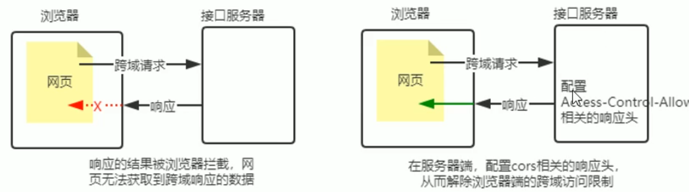
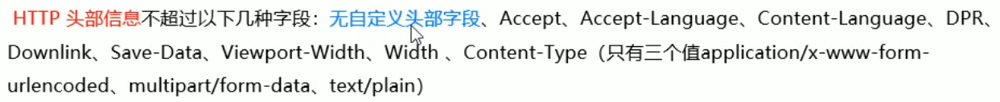

# 使用 Express 写接口
## 写接口
### 创建基本的 web 服务器
```js
const express = require('express')
const app = express()

// write code ..

app.listen(80, ()=>{
  console.log('listening on port 80')
})
```
### 创建 API 路由模块
apiRouter.js
```js
const express = require('express')
const router = express.Router()

module.exports = router
```
```js
const express = require('express')
const app = express()

//导入 路由模块
const router = require('./apiRouter.js')
app.use('/api', router)

app.listen(80, ()=>{
  console.log('listening on port 80')
})
```
### 编写 GET 接口
apiRouter.js
```js
const express = require('express')
const router = express.Router()

router.get('/get', (req,res)=>{
  // req.query 获取客户端的通过查询字符串发送到服务器的数据
  const query = req.query
  // res.send() 方法, 向客户端返回处理的结果
  res.send({
    status: 0, // 0 成功 , 1 失败
    mag:'GET 请求成功' 
    data: query
  })
})

module.exports = router
```
### 编写 POST 接口
apiRouter.js
```js
const express = require('express')
const router = express.Router()


router.get('/get', (req,res)=>{
  // req.body 获取客户端的通过请求体, 发送到服务器的 URL-encoded 数据
  const body = req.body
  // res.send() 方法, 向客户端返回处理的结果
  res.send({
    status: 0, // 0 成功 , 1 失败
    mag:'POSt 请求成功' 
    data: body
  })
})

module.exports = router
```
**注意 : 入股要获取 URL-encoded 格式的请求体数据, 必须配置中间件 app.use(express.urlencoded({extended:false}))**

```js{4}
const express = require('express')
const app = express()

app.use(express.urlencoded({extended:false})

//导入 路由模块
const router = require('./apiRouter.js')
app.use('/api', router)

app.listen(80, ()=>{
  console.log('listening on port 80')
})
```
## CORS 跨域资源共享
上面编写的接口, **不支持跨域请求**

两种解决方案:
* CORS(主流, 推荐使用)
* JSONP(有缺陷, 只支持 GET)
### CORS 中间件解决跨域
cors 是 Express 的中间件, 通过安装和配置 cors 中间件, 可以方便的解决跨域问题
1. npm install cors 安装中间件
2. const cors = require('cors') 导入中间件
3. 在路由器你调用 app.use(cors())  配置中间件

```js{7-8}
const express = require('express')
const app = express()

app.use(express.urlencoded({extended:false})

// 路由之前配置中间件 , 配置 cors 这个中间件, 解决跨域问题
const cors = require('cors')
app.use(cors())

//导入 路由模块
const router = require('./apiRouter.js')
app.use('/api', router)

app.listen(80, ()=>{
  console.log('listening on port 80')
})
```
###  CORS 概念 和 注意事项
CORS (Cross-Origin Resource Sharing, 跨域资源共享) 有**一系列 HTTP 响应头组成**, 这些 HTTP 响应头决定浏览器是否组织前端 JS 代码 跨域获取资源

浏览器的同源策略默认会阻止网页 跨域 获取资源, 但接口服务器配置了 CORS 相关的HTTP响应头, 就可以接触浏览器端的跨域访问控制



注意事项: 
* CORS 是在 **服务端** 进行配置
* **有兼容性** 例如(IE10+ , CHrome4+, Firefox3.5+)
### CORS响应头部 - Access-Control-Allow-Origin
响应头中可以携带一个 Access-Control-Allow-Origin 字段 
```
Access-Control-Allow-Origin: <origin> | *
```
其中, origin 参数**指定了允许访问该资源的 URL**

```js
res.setHeader('Access-Control-Allow-Origin','http://xxxxx')
```

* 表示通配符, 允许任何网站的请求
```js
res.setHeader('Access-Control-Allow-Origin','*')
```
### CORS响应头部 - Access-Control-Allow-Headers
默认情况下, CORS 仅支持客户端向服务端发送的如下 9个请求头:


如果客户端向服务端发送了额外的请求头信息, 则需要在服务端, 通过 Access-Control-Allow-Headers 对额外的请求头进行声明, 否则这次请求会失败
```js
res.setHeader('Access-Control-Allow-Headers','Content-Type','X-Custom-Header')
```
### CORS响应头部 - Access-Control-Allow-Methods
默认情况下, CORS 只支持客户端发起 GET, POST ,HEAD 请求

如果客户端希望通过 **PUT , DELETE** 等方式请求服务端的资源, 则需要在服务端, 通过 Access-Control-Allow-Methods 来指明实际请求所允许使用的HTTP 方法

```js
// 只允许 'POST','GET','DELETE','HEAD' 请求方法
res.setHeader('Access-Control-Allow-Methods','POST','GET','DELETE','HEAD')
// 允许所有的 HTTP 请求方法
res.setHeader('Access-Control-Allow-Methods','*')
```
### CORS 请求的分类
根据请求方式和请求头的不同, 可以将 CORS 的请求分为两大类: 

分别是
* 简单请求
* 预检请求
### 简单请求
满足一下条件
* 请求方式 : GET, POST , HEAD 三者之一
* HTTP的头部信息不超过以下几种字段

### 预检请求
只要符合任何一个条件的请求, 都需要进行预检请求
* 请求方式为  **GET, POST, HEAD 之外的请求 METHOD 类型**
* **请求头中包含自定义头部字段**
* 向服务端发送了 **application/json 格式的数据**

浏览器和服务器正式通信之前, 浏览器**会发送 OPTION 请求进行预检, 已获知服务器是否允许该实际请求**, 所以这次的 OPTION 请求称为'预检请求',
**服务器成功响应预检请求后, 才会发送真正的请求, 并且携带真实数据**
### 简单请求和预检请求的区别
* 简单请求的特点: 客户端和服务端之间**只会发生一次请求**

* 预检请求的特点: 客户端和服务端之间只会发生两次请求,**OPTION 预检请求成功之后, 才会发起真正的请求**
### 创建 JSONP 接口的注意事项
如果项目中已经配置了 CORS , **为了防止冲突, 必须在配置 CORS 中间件之前声明 JSONP 的接口**, 否则 JSONP 接口会被处理成开启了 CORS 的接口 
```js
// 优先创建 jsonp 的接口 [这个接口不会被处理成 CORS 接口]
app.get('/api/jsonp',(req, res) =>{
  // TODO: 接口具体的实现过程
})

app.use(cors())

app.get('/api/get',(req, res) =>{})
```
### 实现 jsonp 的接口
1. **获取**客户端发送过来的**回调函数的没名字**
2. 得到要通过 JSONP 的形式发送给客户端的数据
3. 根据前两部得到的数据, **拼接出一个函数调用的字符串**
4. 把上一步拼接得到的字符串, 响应给客户端的 `<script>` 标签进行解析执行

```js
app.get('/api/jsonp',(req,res)=>{
  // 1. 获取客户端发送过来的回调函数的名字
  const functionName = req.query.callback
  // 2. 定义要通过 jsonp 形式发送给客户端的数据
  const data = {name:'frank',age:18}
  // 3. 根据前两部拼接字符串, 拼接处函数调用的字符串
  const scriptStr = `${functionName}(${JSON.stringify(data)})`
  // 4. 把字符串响应给客户端的 <script> 标签进行解析执行 
  res.send(scriptStr)
})
```


