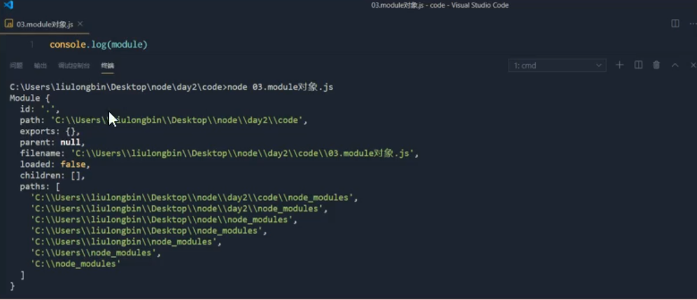
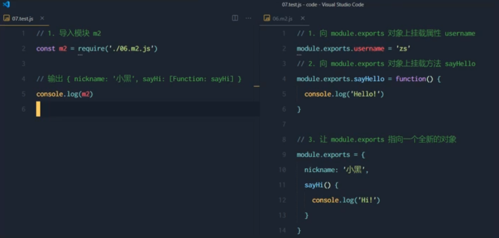
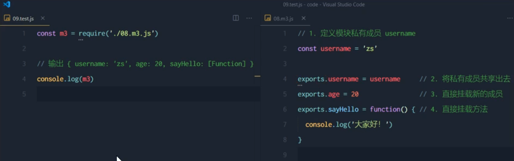
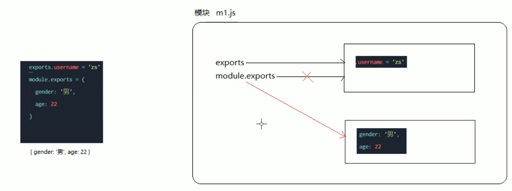
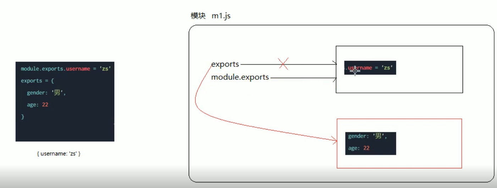
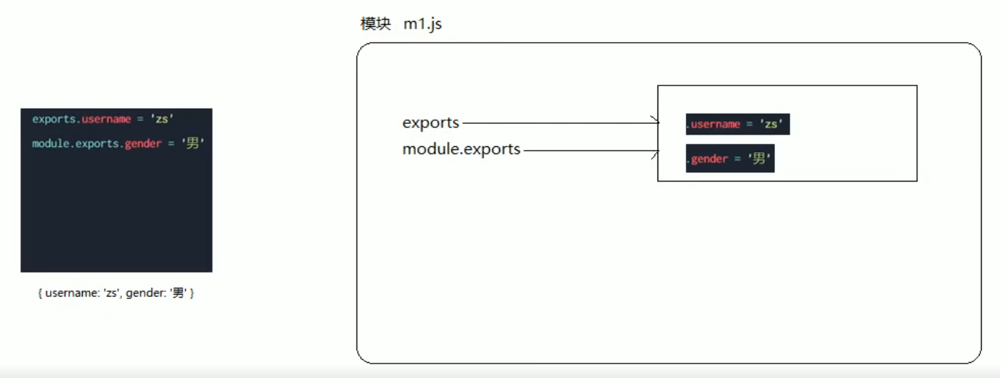
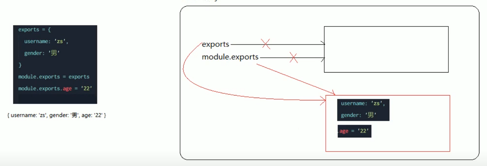

# 模块化
## Node 中模块的分类
* **内置模块** (例如:fs, path , http 等)
* **自定义模块** (用户创建的每个 .js 文件, 都是自定义模块)
* **第三方模块** (有第三方开发出来的模块, 使用前需要先下载)

### 加载模块
**require()** 方法, 可以加载需要的 内置模块, 用户自定义模块, 第三方模块 等

```js
// 加载内置模块
const fs = require('fs')

// 加载用户的自定义模块
const custom  =require('./custom.js')

// 加载第三方模块
const moment = require('moment')
```

**注意** : 使用 require() 方法加载模块时, 会执行被夹在模块中的代码
### 使用 require() 方法注意点
在使用 require() 加载用户自定义模块期间, **可以省略 .js 的后缀名**

## 模块作用域

在自定义模块中定义的**变量, 方法**等成员, **只能在当前模块内访问**, 这种**模块级别的访问限制**, 叫做模块作用域

作用 : 防止全局变量的污染

### module 对象
每个 .js 自定义模块中都有一个 module 对象, 它里面**存储了和当前模块有关的信息**


### module.exports 对象
在自定义模块中, 可以使用 module.exports 对象, 将模块内的成员共享出去, 供外界使用

外界使用 **require() 方法**导入自定义模块, 得到的就是 module.export 所指的那个对象, 默认 `module.export = {}`

#### 向外共享模块作用域中的成员
main.js
```js
// 一个自定义模块, 默认情况下, module.exports = {}

const age = 20 
module.exports.username = '张三'

module.exports.sayHello = function (){
  console.log('Hello!')
}

module.exports.age = age
```

```js
const m = require('./m.js')

console.log(m)  // { username:'张三', sayHello:[Function], age:20 }
```
#### 向外共享时的注意点
永远以 module.exports 指向的对象为准


### exports 对象
**默认情况下, exports 和 module.exports 指向的是同一个对象**。 最终共享的结果, 还是以 module.exports 指向的独显过为准

```js
console.log(module.exports === exports)  // true
```

### exports 和 module.exports 使用误区
时刻要记住, require() 模块时, *得到的永远是 **module.exports** 指向的对象*

**注意**: **不要**在同一个模块**同时**使用 exports 和 module.exports

时刻要记住, require() 模块时, *得到的永远是 **module.exports** 指向的对象*

时刻要记住, require() 模块时, *得到的永远是 **module.exports** 指向的对象*

时刻要记住, require() 模块时, *得到的永远是 **module.exports** 指向的对象*


## 模块化规范 CommonJS
Node.js 遵循了 CommonJS 模块化规范

规定: 
* 每个模块内部, **module 变量**代表当前模块
* module 变量是一个对象, 它的 exports 属性(即 **module.exports) 是对外的接口**
* 加载某个模块 , *其实就是加载该模块的 module.exports 属性*, **require () 方法用于加载模块**


## npm 与 包
## 安装包
安装指定的包
```shell
npm install 包的名字
# 简写
npm i 包的名字
```
### 安装指定版本
`npm install` 会自动安装最新的包, 通过 `@ 符号`指定具体的版本
### 卸载包
```shell
npm uninstall 包名字
```
### 语义化版本规范
总共有三位数字, 例如 2.24.0

代表的含义
* 第一位数字: **大版本**
* 第二位数字: **功能版本**
* 第三位数字: **Bug 修复版本**

**版本号提升规则**: 只要前面的版本号增长了,  则后面的版本号**归零**
## 包管理配置文件
**项目根目录中**的 package.json 文件, 用来记录与项目有关的一些配置文件

例如
* 项目的名称, 版本号, 描述 等
* 项目中用到了哪些包
* 哪些包只在开发期间会用到 devDependencies
* 哪些包在开发和部署(以及上线之后)都会用到 dependencies
### 创建 package.json 文件
```shell
npm init -y
```
### dependencies 节点
### devDependencies 节点
某些包**只在项目开发阶段会用到**, 在**项目上线之后不会用到**, 则放在 devDependencies 节点中

与之对应, 某些宝在开发和项目上线以后都需要用到, 则放到 dependencies 节点上

以下命令会记录到 devDependencies 节点中
```shell
npm i 包名 -D   (-D的顺序不重要)

# 上面命令式简写 , 等价于下面命令
npm install 包名 --save-dev
```
## 下载包速度慢的问题
默认从国外服务器尽心下载, 因此下包速度慢
### 切换 npm 的下包镜像源
下包的服务器地址
```shell
# 查看当前的下包镜像源
npm config get registry
# 将下包的镜像源切换到 淘宝镜像源
npm config set registry=https://registry.npm.taobao.org/
# 检查镜像源是否下载成功
npm config get registry
```
### nrm 切换下包服务器
为了更加方便切换报的镜像源
```shell
# 将 nrm 安装位全局可用的工具
npm i nrm -g
# 查看所有可用的镜像源
nrm ls
# 将下包的镜像源切换为 taobao
nrm use taobao
```
## 包的分类
### 项目包
项目包分为两类:
1. **开发依赖包** - (被记录到 devDependencies 节点的包, 只在开发期间会用到)
2. **核心依赖包** - (被记录到 dependencies 节点中的包,  在开发期间和项目上线之后都能用到)

```shell
npm i 包名 -D  # 开发依赖包(被记录到 devDependencies 节点)

npm i 包名     # 核心依赖包(被记录到 dependencies 节点)
```
### 全局包
在执行 npm install 命令, 提供了 `-g`, 则把包安装位**全局包**
```shell
npm i 包名 -g  # 全局安装

npm uninstall 包名 -g # 卸载全局安装的包
```
### 规范的包结构


