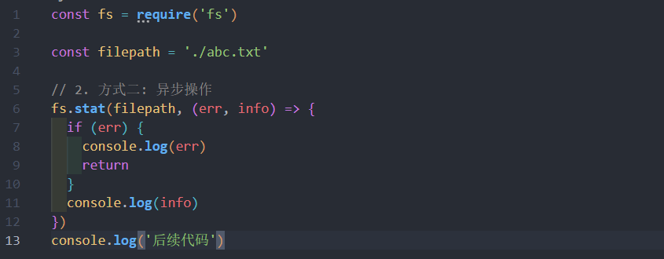
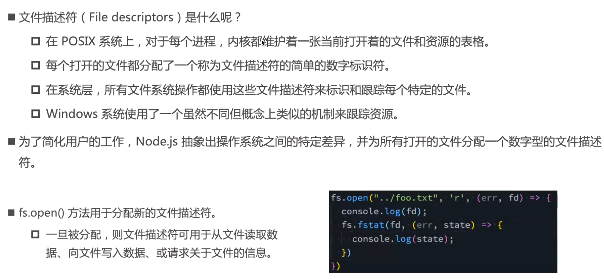
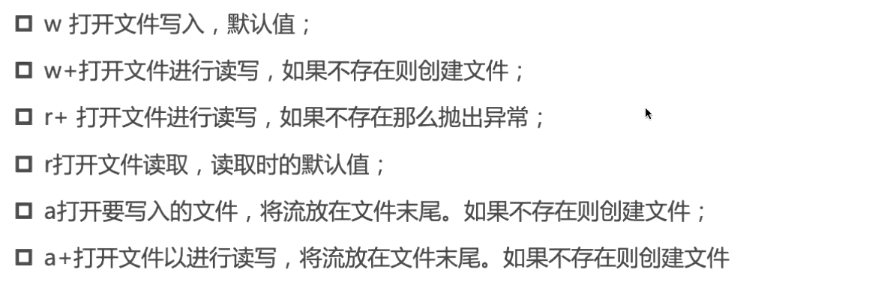
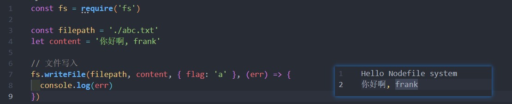
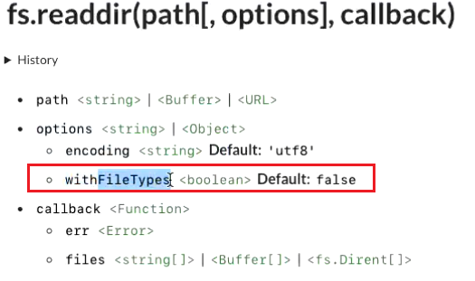
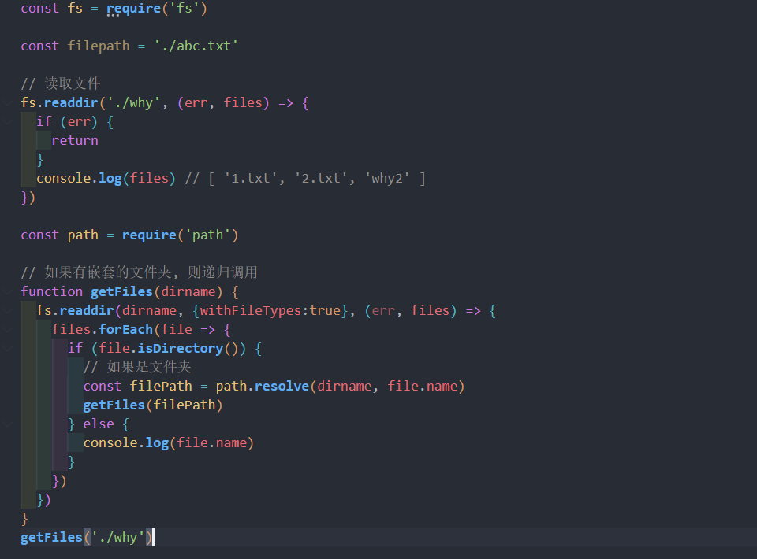
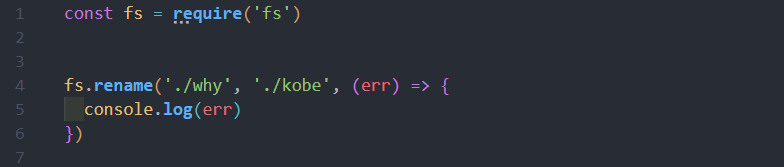

# 常见的内置模块
## path
用来**处理路径**的模块

例如: 
* path.join() 方法 , 用来**将多个片段拼接成一个完整的路径字符串**
* path.basename() 方法, 用来从路径字符串 , 将文件名解析出来

需要导入
```js
const path = require('path')
```
```js
const path = require("path");

const basePath = "./User/why";
const filename = "abc.txt";


// join 路径拼接
// 直接拼接
console.log(path.join(basePath, filename));  //  \User\why\abc.txt
// resolve 路径拼接
// resolve 会拼接的是 /或 ./ 或 ../ 开头的路径, 查找拼接(比较智能)
console.log(path.resolve(basePath, filename));  //  C:\Users\86188\Desktop\node-demo\User\why\abc.txt
```
获取路径信息
```js
const path = require("path");

const filePath = '/User/why/abc.txt'

// 目录名
console.log(path.dirname(filePath))  // /User/why
// 文件名
console.log(path.basename(filePath)) // abc.txt
// 文件名后缀
console.log(path.extname(filePath))  // .txt
```
### webpack 中的使用

## fs
### fs的三种操作方式

#### 同步操作


终端会打出
```
后续需要执行的代码
Stats {
  dev: 1745203973,
  mode: 33206,
  nlink: 1,
  uid: 0,
  gid: 0,
  rdev: 0,
  blksize: 4096,
  ino: 20547673300363388,
  size: 25,
  blocks: 0,
  atimeMs: 1665300898547.661,
  mtimeMs: 1665300898444.702,
  ctimeMs: 1665300898444.702,
  birthtimeMs: 1665300886624.2046,
  atime: 2022-10-09T07:34:58.548Z,
  mtime: 2022-10-09T07:34:58.445Z,
  ctime: 2022-10-09T07:34:58.445Z,
  birthtime: 2022-10-09T07:34:46.624Z
}
```
#### 异步操作

#### promise 的方式

### 文件描述符


### 文件的读写

#### flag 选项
flag 的值很多: 

例: 

#### encoding 选项

### 文件夹操作
#### 创建文件夹

#### 读取文件夹中的所有文件


#### 重命名



## events

### 基础方法
```js
const EventEmitter = require('events')
// 1. 创建发射器 
const emitter = new EventEmitter()

emitter.on('click', (...args) => {
  console.log('监听1', args)
})

const fn = (...args) => {
  console.log('监听2', args)
}
emitter.on('click', fn)


setTimeout(() => {
  emitter.emit('click', 'kobe', 'james')
  emitter.off('click', fn)
  emitter.emit('click', 'kobe', 'james')
},1000)
```
### 获取信息
```js
console.log(emitter.eventNames())  // 绑定的事件名
console.log(emitter.listenerCount('click'))  // 绑定的事件个数
console.log(emitter.listeners())    // 绑定的事件函数
// [ 'click' ]
// 2
// [ [Function (anonymous)], [Function: fn] ]
```

### 不常用的一些方法
```js
// 只执行一次 
emitter.once('click',(...args)=>{
  console.log(...args)
})
// 将本次监听放到最前面
emitter.prependListener('click', (...args)=>{
  console.log(...args)
})
// 移除'全部的'监听
emitter.removeListeners()
```


