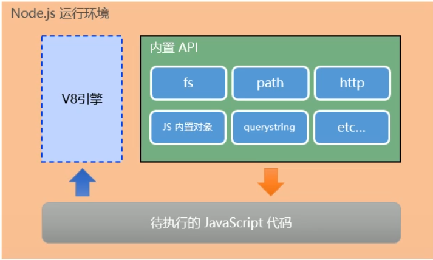
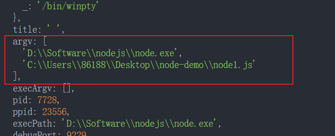
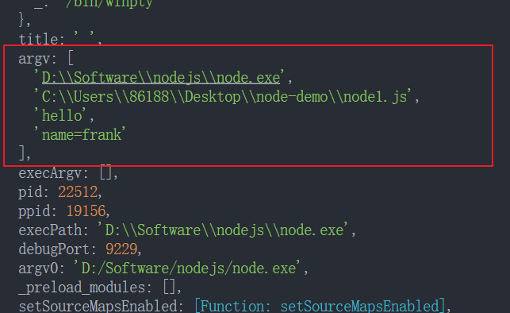
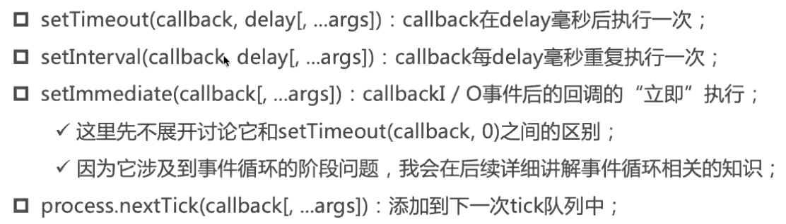

# 初识 Node
**Node.js** 是一个基于 Chrome V8 引擎的 **JavaScript 运行环境**
#### Node.js 中的 javascript 运行环境


注意:
* **浏览器**是 JavaScript 的**前端运行环境**
* **Node.js**是 JavaScript 的**后端运行环境**
*  Node.js 中**无法调用** DOM 和 BOM 等**浏览器内置 API**
## 查看版本号
window + R 打开控制面板, 输入 cmd 后打回车. 即可打开终端, 然后运行命令
```shell
node -v
```
## Node 环境中执行 JS 代码
```shell
node 要执行的js文件
```
## 给 Node 传递参数
node1.js
```js
console.log(process)
```
```shell
node node1.js
```
在 argv 属性里有参数信息


如果要传递参数, 比如 
```shell
node node1.js hello name=frank
```


所以可以打出全部的 process 
```js
console.log(process.argv[0])
console.log(process.argv[1])

process.argv.forEach(item =>{
  console.log(item)
})
```
## Node 全局对象
### 特殊的全局对象
* 包括: __dirname, __filename, exports , module , require()
* 这些全局对象实际上是模块中的变量, 只是每个模块都有, 看起来像是全局变量
* 在命令行交互中是不可以使用的
```js
console.log(__dirname)  // C:\Users\86188\Desktop\node-demo
console.log(__filename) // C:\Users\86188\Desktop\node-demo\node1.js
```

* process 对象: process 提供了Node进程相关信息

比如 Node 的 运行环境, 参数信息等

* console 对象: 提供了简单的调试控制台

* 定时器函数


### global 全局对象
#### global 和  window 对象的区别
在浏览器上, 全局对象都是在 window 上的, 比如有document, setInterval, setTimeout, alert 等

在 Node 中, 也有一个 global 属性, 它里面有很多其他对象

但是在浏览器中执行的 JS 代码, 如果在顶级范围内通过 var 定义一个属性, 默认会添加到 window 对象上
```js
var age = 18
console.log(window.age)  // 18
```

但是在 node 中, 通过 var定义的变量, 他只是在在当前模块(每个 .js 文件相当于一个模块)中有一个变量, 不会放到全局
```js
var age = 18
console.log(global.age)  // undefined
```


