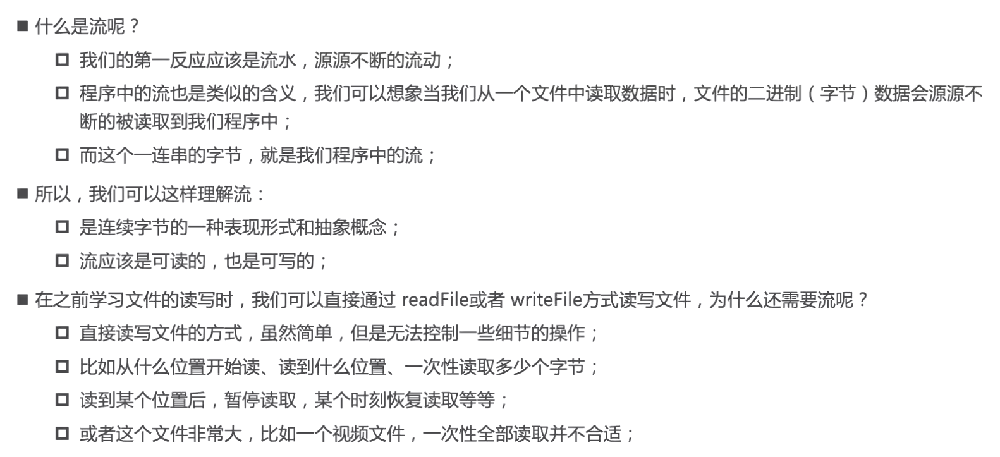
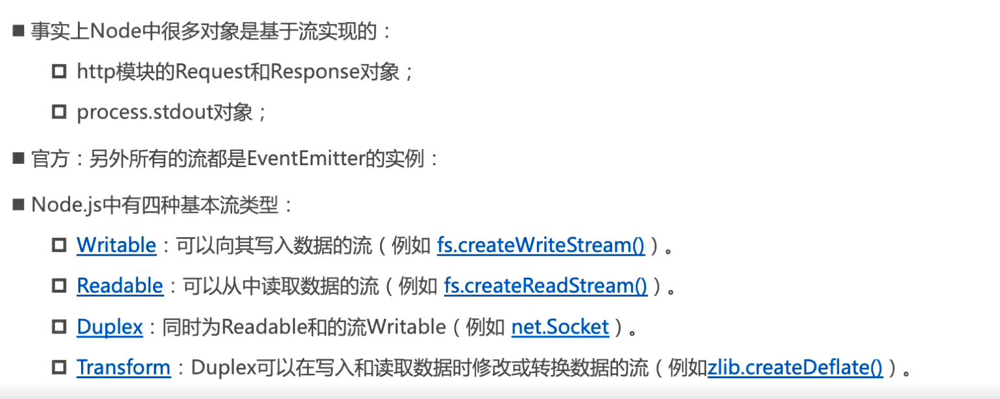
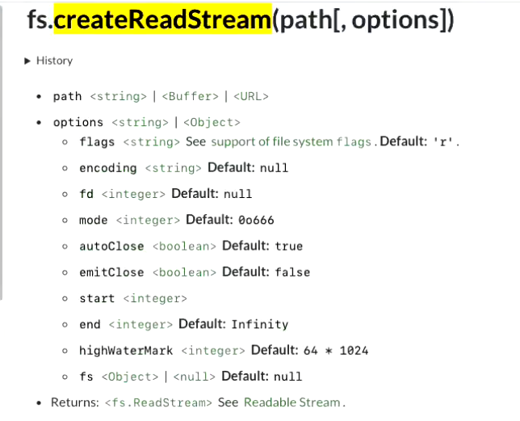
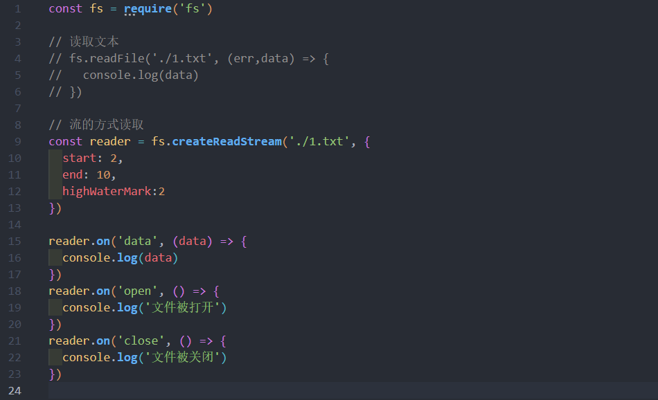
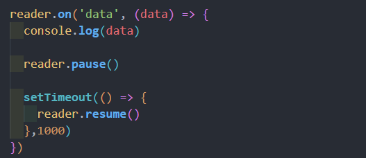
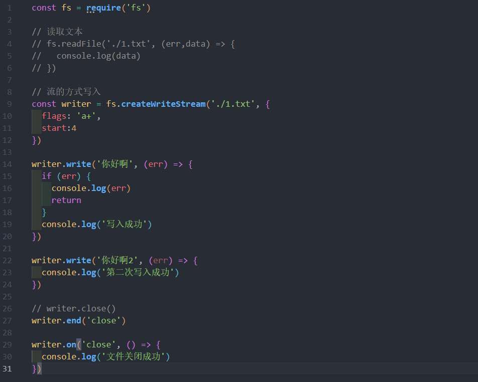
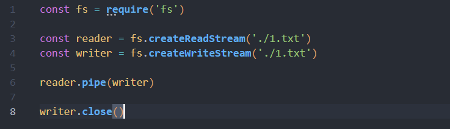

# Stream

## 文件读写的 Stream

### Readable 流的使用
之前读取一个文件的信息:
```js
fs.readFile('./1.txt',(err,data)=>{
  console.log(data)
})
```
* **流的方式读取文件:**





### Writable 流的使用
之前传统的方式是写入文件
```js
const fs = require('fs')
fs.writeFile('./1.txt', 'Hello Stream',{flag:'a'}, (err)=>{
  console.log(err)
})
```

* 流的写入方式



### 读文件然后写入到另外一个文件里面 - pipe 方法
传统的方式
```js
fs.readFile('./1.txt',(err,data)=>{
  fs.writeFile('./2.txt', data, (err)=>{
    console.log(err)
  })
})
```

* **Stream 的写法**(更优雅)



