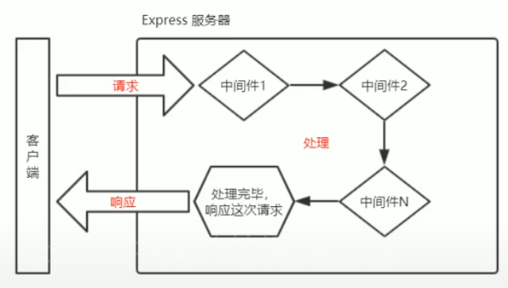
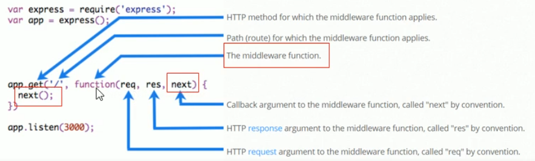
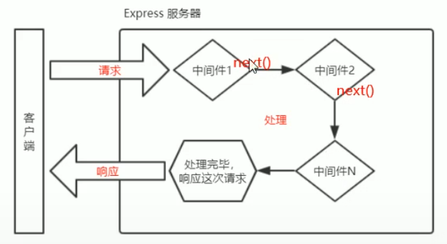
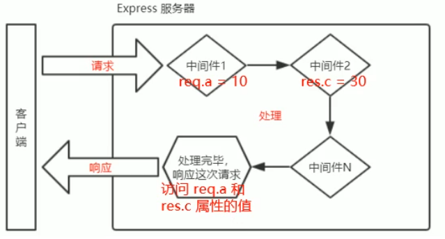

# Express 中间件
## 概念
当一个请求到达 Express 服务器之后, **可以连续调用多个中间件**, 从而对这次请求进行**预处理**


### Express 中间件的格式
Express的中间件, **本质**上就是一个 **function 处理函数**


注意: 中间件函数的形参列表中, **必须包含 next 参数**, 而路由处理函数只包含 req 和 res
### next 函数作用 
**next 函数**是**实现多个中间件连续调用**的关键, 它表示把流传关系**转交**给*下一个中间件或路由*

## 中间件函数
### 定义中间件函数
定义一个最简单的中间件
```js
const express = require('express')
const app = express()

// 定义一个最简单的中间件
const mw = function(req,res,next){
  console.log('这是最简单的中间件')
  // 把流传关系转交给*下一个中间件或路由
  next()
}
app.listen(80,()=>{console.log('http://localhost:80')})
```
### 全局生效的中间件
客户端发起的 **任何请求**, 到达服务器之后, **都会触发的中间件**, 叫做全局生效的中间件

通过调用 `app.use(中间件函数)` 即可定义一个全局生效的中间件, 如下

```js
const mw = function(req,res,next){
  console.log('这是最简单的中间件')
  next()
}
// 全局生效的中间件
app.use(mw)
```
#### 直接简写
```js
app.use(function(req, res, next){
  console.log('简写')
  next()
})
```
### 中间件的作用
多个中间件之间, **共享同一份 req 和 res** , 基于这样的特性, 可以在**上游**的中间件中, **统一**为 req 和 res 对象添加*自定义的属性和方法*, 供**下游**的中间件中间件或路由使用



比如: 
```js{4-13}
const express = require('express')
const app = express()

app.use(function(req, res, next) {
  const time = Date.now()
  // 为 req 对象, 挂载自定义属性, 从而把事件共享给后面的所有路由
  req.startTime = time
})

app.get('/',(req,res)=>{
  console.log(req.startTime)
  res.send('Home page')
})

app.listen(80,()=>{
  console.log('listening on port 80')
})
```
### 定义多个全局中间件
可以使用 app.use() **连续定义**多个全局中间件, 会按照定义的先后顺序一次进行调用

```js
app.use(function(req,res,next){
  console.log('调用了第一个中间件')
  next()
})

app.use(function(req,res,next){
  console.log('调用了第二个中间件')
  next()
})

app.get('/',function(){
  res.send('Home page')
})
```
### 局部生效 的中间件
不使用 app.use() 定义的中间件, 叫做**局部生效的中间件**

```js
const mw1 = function(req,res,next){
  console.log('中间件函数')
  next()
}
// mw1 这个中间件"只在当前路由生效", 这种做法属于"局部生效的中间件"
app.get('/',mw1 , function(req,res){
  res.send('Home page')

})
// mw1 中间件不会影响下面路由
app.get('/user',function(req,res){
  res.send('user page')
})
```
### 定义多个局部中间件
通过下面两种等价的方式,  使用多个局部中间件
```js
app.get('/', mw1, mw2 ,function(req,res){res.send('Home page')})
app.get('/', [mw1, mw2] ,function(req,res){res.send('Home page')})
```
### 中间件 5个注意事项
* 一定要**路由之前**注册中间件
* 客户端发送过来的请求, **可以连续调用多个中间件**进行处理
* 执行完中间件业务代码之后, 不要**忘记 next() 函数**
* 为了**防止代码逻辑混乱**, 调用 next() 函数后不要再写额外的代码
* 连续调用多个中间件, 多个中间件之间, **共享** req 和 res 

## 中间件的分类
5 大类 :
* **应用级别**的中间件
* **路由级别**中间件
* **错误级别**中间件啊
* **Express 内置**的中间件
* **第三方**的中间件
#### 1. 应用级别中间件
通过 app.use() 或 app.get() 或 app.post(), **绑定到 app 实例上的中间件**, 叫做应用级别的中间件
```js
app.use(function(req, res, next) {  // 应用级别的中间件(全局中间件)
  next()
})

app.get('/', mw1, function(req, res, next) {
  res.send('Home page')
})
```
#### 路由级别的中间件
绑定到 express.Router() 实例上的中间件, 叫做路由级别的中间件

*应用级别的中间件是绑定到 app 实例, 路由级别的中间件绑定到 router 实例*

```js
const express = require('express')
const app = express()
const router = express.Router()

// 路由级别的中间件
router.use(function(req, res, next) {
  console.log('Time:' + Date.now())
  next()
})

app.use('/', router)
```
#### 3. 错误级别的中间件
专门用来捕获整个项目中发生的异常错误, 从而防止项目异常崩溃

错误级别的中间件 function 处理函数, 必须有 4个参数, 分别是 (**err**,req,res,next)

```js
app.get('/', function(){
  throw new Error('服务器繁盛了错误')
  res.send('Home page')
})

app.use(function(err,req,res,next){
  console.log('发生额了错误' + err.message)
  res.send('Error !'+ err.message)
})
```
#### 4. 内置中间件
Express 4.16.0 版本开始,  提供了 3 个常用的中间件
1. express.static() 快速托管静态资源的内置组件(无兼容性)
2. express.json() 解析 JSON 格式的请求体数据(仅在 4.16.0+ 版本中使用)
3. express.urlencoded() 解析 URL-encoded 格式的请求体数据(仅在 4.16.0+ 版本中使用)

```js
// 配置解析 application/json 格式数据的内置中间件
app.use(express.json())
// 配置解析 application/x-www-form-urlencoded 格式数据的内置中间件
app.use(express.urlencoded({extended: false}))
```

express.json()的使用
```js
const express = require('express()
const app = express()

// 除了错误级别的中间件, 其他的中间件, 必须在路由前面进行配置
// 通过 express.json() 这个中间件 , 解析表单的 JSON 格式的数据
app.use(express.json())

app.post('/', function(req, res) {
  // req.body 可接受客户端发送传过来的数据
  // 默认情况下, 如果不配置表单解析数据的中间件, 则 req.body 默认等于 undefined
  console.log(req.body)
  res.send('ok')
})
```
express.urlencoded()的使用
#### 5. 第三方的中间件
例如 : 4.16.0 版本之前, 经常使用 body-parser 这个第三方中间件, 来解析请求体数据

1. npm install  body-parser
2. 使用 require 导入中间件
3. 使用 app.use() 注册使用中间件

```js
const express= require('express')
const app = express()

// 导入解析表单第三方中间件 body-parser
const parser = require('body-parser')
app.use(parser,urlencoded({extended:true}))

app.post('/',function(req,res){
  // 如果没有配置任何解析表单数据的中间件, 则 res.body 默认等于 undefined
  console.log(req.body)
  res.send('ok')
})

app.listen(80,()=>{
  console.log('listening on port 80')
})
```

注意 : Express 内置的 express.urlencoded 中间件, 就是基于 body-parser 这个第三方中间件进一步封装出来的


## 自定义中间件
**手动模拟** 一个类似于 express.urlencoded 这样的中间件, 来**解析 POST 提交到服务器的表单数据**

实现步骤: 
1. 定义中间件
2. 监听 req 的 data 事件
3. 监听 req 的 end 事件
4. 使用 querystring 模块解析请求体数据
5. 将解析出来的数据对象挂在为 req.body
6. 将自定义中间件封装为 模块
### 定义中间件
```js
const express = require('express')
const app = express()

// 解析表单数据的中间件
app.use(function(req,res,next){
  // 定义中间件具体业务逻辑

})


app.listen(80,function(){
  console.log('Express listening on port 80')
})
```

### 监听 req 的 data 事件
如果数据量比较大, 无法一次性发送完毕, 则客户端**会把数据切割后, 分批发送到服务器**, 所以 data 事件会触发多次, 每一次触发 data 事件,
**获取到的数据只是完整数据的一部分**, 需要手动对接收到的数据进行拼接
```js{8-13}
const express = require('express')
const app = express()

// 解析表单数据的中间件
app.use(function(req,res,next){
  // 定义中间件具体业务逻辑
  // 1. 定义一个 str 字符串, 专门用来存储客户端反送过来的请求体数据
  let str = ''
  // 2. 监听 req 的 data 事件 
  req.on('data',(chunk)=>{
    // 进行拼接, 隐式转换字符串
    str += chunk
  })
})

app.listen(80,function(){
  console.log('Express listening on port 80')
})
```
### 监听 req 的 end 事件
当请求体数据**触发完毕**后, 会自动触发 req 的 end 事件

因此, 可以在 req 的 end 事件中, **拿到并处理完整的请求体数据**

```js{15-19}
const express = require('express')
const app = express()

// 解析表单数据的中间件
app.use(function(req,res,next){
  // 定义中间件具体业务逻辑
  // 1. 定义一个 str 字符串, 专门用来存储客户端反送过来的请求体数据
  let str = ''
  // 2. 监听 req 的 data 事件 
  req.on('data',(chunk)=>{
    // 进行拼接, 隐式转换字符串
    str += chunk
  })
  // 3. 监听 req 的 end 事件
  req.on('end',()=>{
    // 在 str 中存放的是 , 完整的请求体
    console.log(str)
    // TODO: 把字符串格式的请求体, 解析成对象数据
  })
})

app.post('/user',(req,res)=>{
  res.send('ok')
})

app.listen(80,function(){
  console.log('Express listening on port 80')
})
```
### 使用 querystring模块解析请求体数据
Node.js 内置了一个 querystring 模块, **专门用来处理查询字符串**, 通过 parse 函数,   可办查询字符串解析成对象格式
```js{4,21-22}
const express = require('express')
const app = express()
// 导入Node.js 中 querystring 模块
const qs = require('querystring')

// 解析表单数据的中间件
app.use(function(req,res,next){
  // 定义中间件具体业务逻辑
  // 1. 定义一个 str 字符串, 专门用来存储客户端反送过来的请求体数据
  let str = ''
  // 2. 监听 req 的 data 事件 
  req.on('data',(chunk)=>{
    // 进行拼接, 隐式转换字符串
    str += chunk
  })
  // 3. 监听 req 的 end 事件
  req.on('end',()=>{
    // 在 str 中存放的是 , 完整的请求体
    // console.log(str)
    // TODO: 把字符串格式的请求体, 解析成对象数据
    const body = qs.parse(str)
    console.log(body)
  }) 
})

app.post('/user',(req,res)=>{
  res.send('ok')
})

app.listen(80,function(){
  console.log('Express listening on port 80')
})
```
### 解析出来的对象挂载为 req.body
上游的中间件和下游的中间件及路由之间, **共享同一份 req 和 res**, 

因此, 挂载为 req.body , 供**下游**使用

```js{22,23}
const express = require('express')
const app = express()
// 导入Node.js 中 querystring 模块
const qs = require('querystring')

// 解析表单数据的中间件
app.use(function(req,res,next){
  // 定义中间件具体业务逻辑
  // 1. 定义一个 str 字符串, 专门用来存储客户端反送过来的请求体数据
  let str = ''
  // 2. 监听 req 的 data 事件 
  req.on('data',(chunk)=>{
    // 进行拼接, 隐式转换字符串
    str += chunk
  })
  // 3. 监听 req 的 end 事件
  req.on('end',()=>{
    // 在 str 中存放的是 , 完整的请求体
    // console.log(str)
    // TODO: 把字符串格式的请求体, 解析成对象数据
    const body = qs.parse(str)
    req.body = body
    next()
  }) 
})

app.post('/user',(req,res)=>{
  res.send('ok')
})

app.listen(80,function(){
  console.log('Express listening on port 80')
})
```
### 自定义中间件封装为模块
custom-body-parser.js
```js
const qs = require('querystring')
const bodyParser = function(req,res,next){
  // 定义中间件具体业务逻辑
  // 1. 定义一个 str 字符串, 专门用来存储客户端反送过来的请求体数据
  let str = ''
  // 2. 监听 req 的 data 事件 
  req.on('data',(chunk)=>{
    // 进行拼接, 隐式转换字符串
    str += chunk
  })
  // 3. 监听 req 的 end 事件
  req.on('end',()=>{
    // 在 str 中存放的是 , 完整的请求体
    // console.log(str)
    // TODO: 把字符串格式的请求体, 解析成对象数据
    const body = qs.parse(str)
    req.body = body
    next()
  }) 
}

module.exports = bodyParser
```
```js
const customBodyParser =  require('./custom-body-parser.js')

app.use(customBodyParser)
```
