# Pinia

## Pinia 和 VueX 对比
* 与 VueX 相比, Pinia **提供了一个更简单的 API , 具有更少的仪式, 提供了 Composition Api 风格的 API**
* 最重要的是, 在**与 TypeScript 一起使用的时候, 具有可靠的类型推断支持** 

和 VueX 相比, Pinia 有很多的优势
1. **比如 mutation 不再存在**
   * 它们经常被认为是非常多余的 
   * 它们最初是为了 devTools 的集成, 但这不再是问题
2. **更友好的 TypeScript 支持, VueX 之前对 TS 支持很不友好**
3. **不再有 modules 嵌套结构**
   * 可以灵活使用每一个 store, 他们是通过扁平化的方式开相互使用的
4. **也不再有名革命空间的概念, 不需要记住它们复杂关系**

## 如何使用 Pinia
[Pinia 中文文档](https://pinia.web3doc.top/getting-started.html#%E5%AE%89%E8%A3%85)

先安装 pinia
```shell
npm install pinia
```
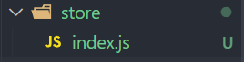

store/index.js 创建 pinia 并且将其传递给应用程序

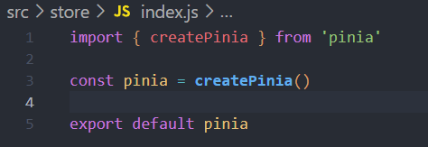

main.js 引入

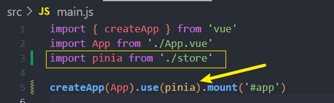

## 认识 Store
什么是 Store?
* 一个 Store 是一个**实体**, 它会持有绑定到你**组件树的状态和业务逻辑**, 也就是保存了全局的状态
* 他有点想始终存在, 并且**每个人都可以读取和写入的组件**
* 可以在我的应用程序中**定义任意数量的 store 来管理状态**

Store 有三个概念:
1. **state, actions, getters** , 等同于组件的 data,computed, methods
2. 一旦 store 被实例化, 就可以直接在 store 上访问 state, getters, actions 中定义的任意属性

### 定义一个 Store 
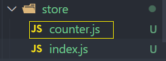

Store 是**使用 `defineStore()`来定义的**

并且他需要一个唯一的名称 , 作为第一个参数传递: 
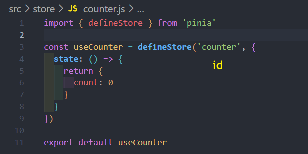

这个 name, 也**称为 id**, Pinia会使用它来连接到 devTools

**返回的函数统一使用 useXXXX 作为命名方案, 这是约定的规范**
### 使用定义的 Store
Store 在它使用之前是不会被创建的, 我们可以通过调用 **use函数** 来使用 Store
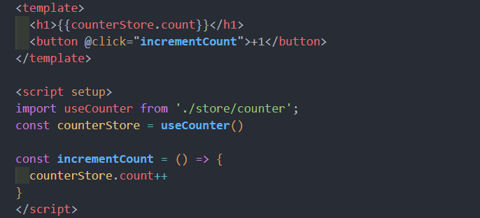

**注意:** Store 获取到后不能被解构, 那么**会失去响应式**
* 为了从 Store 提取属性同时保持响应式, **需要使用 `storeToRefs()`**

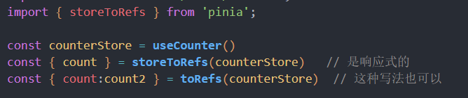

## state
先定义一个 store
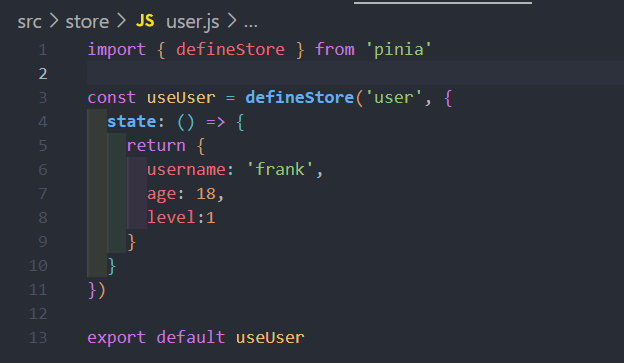
### 操作 state (一)
读取和写入 state:
* 默认情况下, 可以通过 store 实例访问状态来直接读取和写入状态
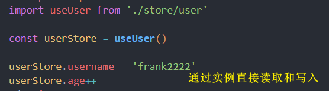

重置 state
* 可以通过调用 store 上的 **`$reset()`** 方法 将状态**重置**到其初始值
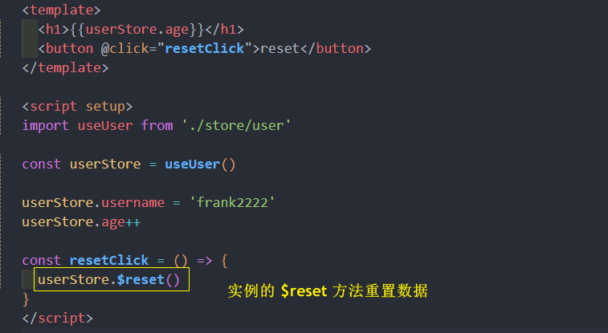
### 操作 state (二)
改变 state
* 除了直接用 store.state++ 修改 store, 还可以调用 $patch 方法
* 它允许你使用部分 state 对象**同时应用多个修改**

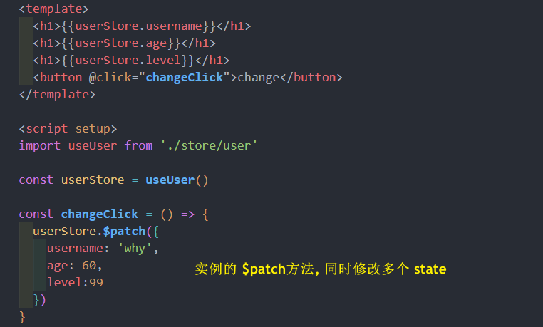

替换 state
* 可以通过将其 $state 属性设置为新对象, 来替换 Store 的整个状态
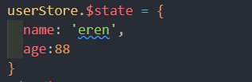

## getters
相当于 计算属性

定义 getters 4种情况: 

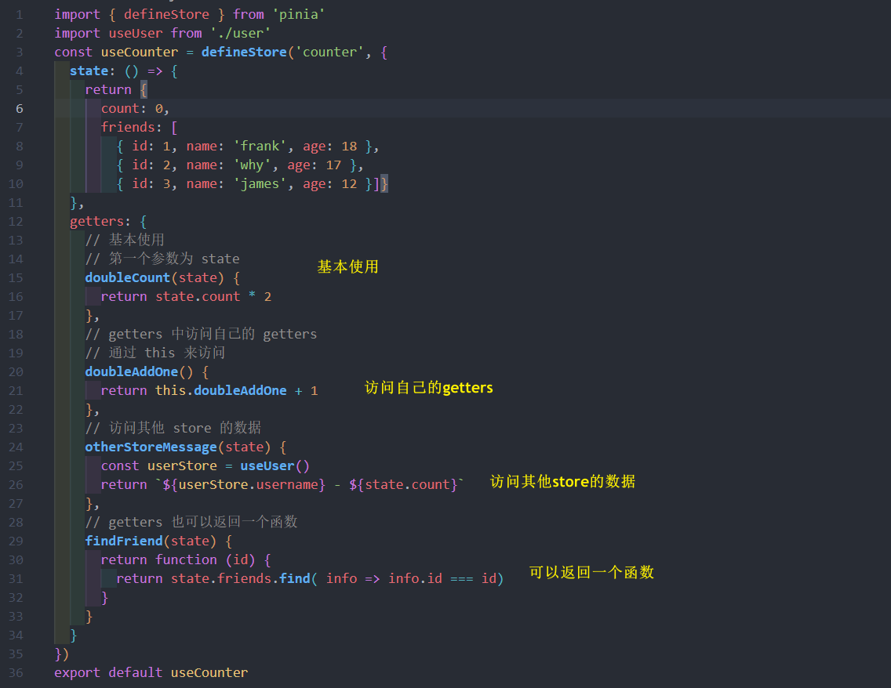
## actions
### ctions 执行异步操作
actions 中支持异步操作的, 并且可以编写异步函数, , 在函数中使用 await

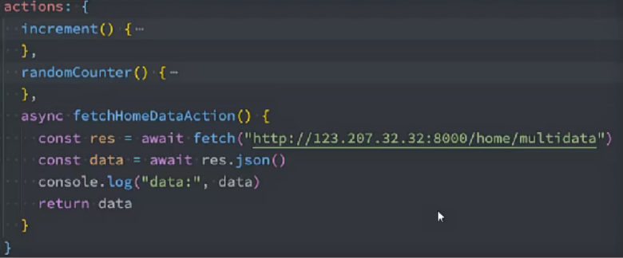


 