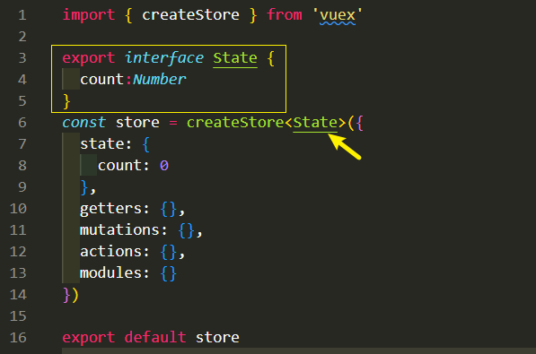
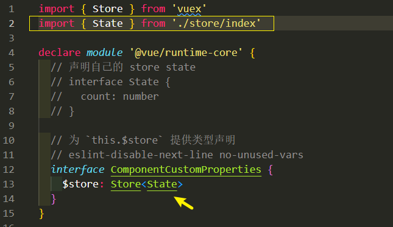

# 搭建项目架构
## 使用 Vite 创建项目
> 使用 Vite 创建项目
[参考 Vite 官方指南](https://cn.vitejs.dev/guide/#scaffolding-your-first-vite-project)

```
npm create vite@latest

Need to install the following packages:
  create-vite@latest
Ok to proceed? (y) y
√ Project name: ... shop-admin
√ Select a framework: » Vue
√ Select a variant: » TypeScript

Scaffolding project in C:\Users\86188\Desktop\shop-admin\shop-admin...

Done. Now run:

  cd shop-admin
  npm install  
  npm run dev
```

在安装了 Vite 的项目中，可以在 npm scripts 中使用 vite 可执行文件，或者直接使用 npx vite 运行它。下面是通过脚手架创建的 Vite 项目中默认的 npm scripts：
```json
{
  "scripts": {
    "dev": "vite", // 启动开发服务器
    "build": "vite build", // 为生产环境构建产物
    "serve": "vite preview" // 本地预览生产构建产物
  }
}
```
### 调整目录结构
```
.
├── public                  # 不需要打包的静态资源
│   └── favicon.ico
├── src
│   ├── api                 # 后台 API 接口封装
│   ├── assets              # 需要打包的静态资源
│   ├── components          # 公共组件
│   ├── composables         # 通用的组合式 API
│   ├── layout              # 页面布局模板
│   ├── plugins             # 插件
│   ├── router              # 路由
│   ├── store               # Vuex 存储
│   ├── styles              # 样式
│     └── index.scss        # 全局通用样式
│   ├── utils               # 工具模块
│   ├── views               # 路由页面
│   ├── App.vue             # 根组件
│   ├── main.ts             # 入口模块
│   ├── shims-vue.d.ts      # 补充 .vue 模块类型声明
│   └── vite-env.d.ts       # 补充 vite 类型声明
├── .gitignore
├── README.md
├── index.html
├── package-lock.json
├── package.json
├── tsconfig.json
└── vite.config.ts
```
## 代码规范和 ESLint
### 基础配置
1. 安装 ESLint 到项目中 
```
npm install eslint --save-dev
```

2. 初始化 ESLint 配置
```
 npx eslint --init

You can also run this command directly using 'npm init @eslint/config'.
Need to install the following packages:
  @eslint/create-config
Ok to proceed? (y) y
√ How would you like to use ESLint? · style       
√ What type of modules does your project use? · esm
√ Which framework does your project use? · vue
√ Does your project use TypeScript? · No / Yes
√ Where does your code run? · browser
√ How would you like to define a style for your project? · guide
√ Which style guide do you want to follow? · standard-with-typescript
√ What format do you want your config file to be in? · JavaScript
Checking peerDependencies of eslint-config-standard-with-typescript@latest
The config that you've selected requires the following dependencies:

eslint-plugin-vue@latest eslint-config-standard-with-typescript@latest @typescript-eslint/eslint-plugin@^5.0.0 eslint@^8.0.1 eslint-plugin-import@^2.25.2 eslint-plugin-n@^15.0.0 eslint-plugin-promise@^6.0.0 typescript@*
√ Would you like to install them now? · No / Yes
√ Which package manager do you want to use? · npm
Installing eslint-plugin-vue@latest, eslint-config-standard-with-typescript@latest, @typescript-eslint/eslint-plugin@^5.0.0, eslint@^8.0.1, eslint-plugin-import@^2.25.2, eslint-plugin-n@^15.0.0, eslint-plugin-promise@^6.0.0, typescript@*
``` 
3. ESLint 配置文件
```
// .eslintrc.js
module.exports = {
  env: {
    browser: true,
    es2021: true
  },
  extends: [
    // 'plugin:vue/essential',
    
    // 使用 Vue 3 规则
    // https://eslint.vuejs.org/user-guide/#bundle-configurations
    'plugin:vue/vue3-strongly-recommended',
    'standard'
  ],
  parserOptions: {
    ecmaVersion: 12,
    parser: '@typescript-eslint/parser',
    sourceType: 'module'
  },
  plugins: [
    'vue',
    '@typescript-eslint'
  ],
  rules: {}
}
```

4. 在 npm scripts 中添加验证脚本
```json
"scripts": {
	...
  "lint": "eslint src/**/*.{js,jsx,vue,ts,tsx} --fix",
}
```
### 编辑器集成
* 禁用 Vetur
* 安装 eslint 插件
* 安装 volar 插件
### defineProps、defineEmits、no-undef 规则警告

需要定义全局变量 （打开新窗口）在 ESLint 配置文件中

如果不想定义全局变量，请使用 import { defineProps, defineEmits } from 'vue'.

示例 .eslintrc.js：
```
module.exports = {
  globals: {
    defineProps: "readonly",
    defineEmits: "readonly",
    defineExpose: "readonly",
    withDefaults: "readonly"
  }
}
```
## TypeScript 相关
* [TS 环境说明](https://cn.vitejs.dev/guide/features.html#typescript)
* shimes-vue.d.ts 文件的作用
* vite-env.d.ts 文件的作用
* vue-tsc 和 tsc
  * tsc 只能验证 ts 代码类型
  * vue-tsc 可以验证 ts + Vue Template 中的类型（基于 Volar）

### Vue 3 中的 TS 支持
[https://v3.cn.vuejs.org/guide/typescript-support.html](https://v3.cn.vuejs.org/guide/typescript-support.html)

1. lang="ts"
2. 要让 TypeScript 正确推断 Vue 组件选项中的类型, 需要使用的 **defineComponent** 中 全局方法定义组件
3. [组合式 API 配合 TS](https://cn.vuejs.org/guide/typescript/composition-api.html#typing-component-props)

## 初始化 Vue Router
### 基本配置
1、安装
```
npm install vue-router@4
```

2、初始化路由实例
```ts
// src\router\index.ts
import { createRouter, RouteRecordRaw, createWebHashHistory } from 'vue-router'

const routes:RouteRecordRaw[] = [
  {
    path: '/',
    component: () => import('../views/home/index.vue')
  },
  {
    path: '/login',
    component: () => import('../views/login/index.vue')
  }
]

const router = createRouter({
  history: createWebHashHistory(),
  routes
})

export default router
```

```ts
// src\main.ts
import { createApp } from 'vue'
import router from './router'
import App from './App.vue'

createApp(App).use(router).mount('#app')
```
### 404 未找到
```ts
{
  path: '/:pathMatch(.*)*',
  name: 'notFound',
  component: () => import('../views/notFound/index.vue')
}
```
## 初始化 Vuex 
1、安装
```
npm install vuex@next --save
```

2、配置
```ts
// src\store\index.ts
import { createStore } from 'vuex'

const store = createStore({
  state: {},
  getters: {},
  mutations: {},
  actions: {},
  modules: {}
})

export default store
```

```ts
// src\main.ts
import { createApp } from 'vue'
import router from './router'
import store from './store'
import App from './App.vue'
import ElementPlus from 'element-plus'
import 'element-plus/lib/theme-chalk/index.css'

createApp(App).use(store).use(router).use(ElementPlus).mount('#app')
```

### TS 支持
官方文档方案（仅支持 state）：[https://next.vuex.vuejs.org/zh/guide/typescript-support.html](https://next.vuex.vuejs.org/zh/guide/typescript-support.html)

store/index.ts 在这里生命的 State 类型传递给 vuex.d.ts , 形成依赖关系



vuex.d.ts 




Vuex 4 版本依然没有很好的解决 TS 类型问题，官方宣称会在 Vuex 5 中提供更好的方案

[useStore 类型声明](https://vuex.vuejs.org/zh/guide/typescript-support.html#usestore-%E7%BB%84%E5%90%88%E5%BC%8F%E5%87%BD%E6%95%B0%E7%B1%BB%E5%9E%8B%E5%A3%B0%E6%98%8E)
## 配置模块路径别名
在 Vite 中支持模块路径别名自定义，[参考文档](https://cn.vitejs.dev/config/)

```ts
import { defineConfig } from 'vite'
import vue from '@vitejs/plugin-vue'
// 注意：在 ts 模块中加载 node 核心模块需要安装 node 的类型补充模块：npm i -D @types/node
import path from 'path'

// https://vitejs.dev/config/
export default defineConfig({
  plugins: [vue()],
  resolve: {
    alias: {
      '@': path.resolve(__dirname, './src')
    }
  }
})
```

如果项目中使用了 TS，则还需要告诉 TS 别名的路径，否则 TS 会报错
```json
// tsconfig.json
{
  "compilerOptions": {
    ...
    "baseUrl": ".",
    "paths": {
      "@/*": ["src/*"]
    }
  },
  ...
}
```
## CSS 样式管理
Vite 中对 CSS 的支持：
* [https://cn.vitejs.dev/guide/features.html#css](https://cn.vitejs.dev/guide/features.html#css)

（1）由于 Vite 的目标仅为现代浏览器，因此建议使用原生 CSS 变量和实现 CSSWG 草案的 PostCSS 插件（例如 postcss-nesting）来编写简单的、符合未来标准的 CSS。

（2）但 Vite 也同时提供了对 .scss, .sass, .less, .styl 和 .stylus 文件的内置支持。没有必要为它们安装特定的 Vite 插件，但必须安装相应的预处理器依赖：
```shell
# .scss and .sass
npm install -D sass

# .less
npm install -D less

# .styl and .stylus
npm install -D stylus
```

如果是用的是单文件组件，可以通过 `<style lang="scss">`（或其他预处理器）自动开启

注意事项: 
* Vite 为 Sass 和 Less 改进了 @import 解析，以保证 Vite 别名也能被使用。
* 另外，url() 中的相对路径引用的，与根文件不同目录中的 Sass/Less 文件会自动变基以保证正确性。
* 由于 Stylus API 限制，@import 别名和 URL 变基不支持 Stylus。
* 你还可以通过在文件扩展名前加上 .module 来结合使用 CSS modules 和预处理器，例如 style.module.scss

### 样式目录结构
```
variables.scss  # 全局 Sass 变量
mixin.scss      # 全局 mixin
common.scss     # 全局公共样式
transition.scss # 全局过渡动画样式
index.scss      # 组织统一导出
```
> 的工作流程是，全局样式都写在 src/styles 目录下，每个页面自己对应的样式都写在自己的 .vue 文件之中

```
// index.scss
@import './variables.scss';
@import './mixin.scss';
@import './transition.scss';
@import './common.scss';
```

然后在 main.ts 中导入 index.scss

```
import "./styles/index.scss"
```

### 配置使用全局样式变量
为了能够在组件内直接使用全局变量、mixin 等，需要特殊配置。

具体配置参见 Vite 官方文档：[css.preprocessorOptions](https://cn.vitejs.dev/config/)。

这是一个常见的配置参考示例
```js
css: {
  loaderOptions: {
    // 给 sass-loader 传递选项
    sass: {
      // @/ 是 src/ 的别名
      // 所以这里假设你有 `src/variables.sass` 这个文件
      // 注意：在 sass-loader v8 中，这个选项名是 "prependData"
      additionalData: `@import "@/styles/variables.scss"`
    },
    // 默认情况下 `sass` 选项会同时对 `sass` 和 `scss` 语法同时生效
    // 因为 `scss` 语法在内部也是由 sass-loader 处理的
    // 但是在配置 `prependData` 选项的时候
    // `scss` 语法会要求语句结尾必须有分号，`sass` 则要求必须没有分号
    // 在这种情况下，我们可以使用 `scss` 选项，对 `scss` 语法进行单独配置
    scss: {
      additionalData: `@import "~@/variables.scss";`
    },
    // 给 less-loader 传递 Less.js 相关选项
    less: {
      // http://lesscss.org/usage/#less-options-strict-units `Global Variables`
      // `primary` is global variables fields name
      globalVars: {
        primary: '#fff'
      }
    }
  }
}
```