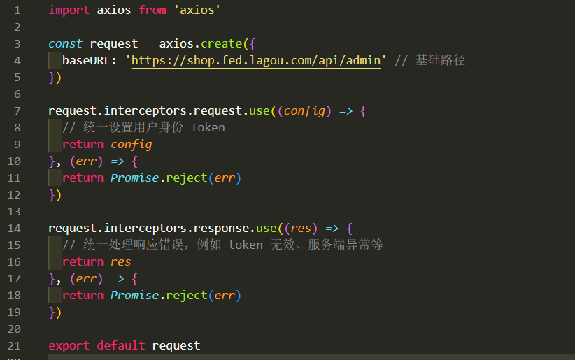
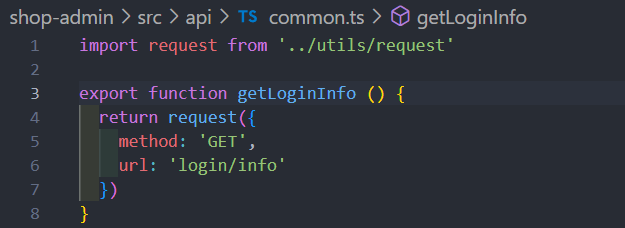

# 起步
## 和服务端交互 
* 基于 axios 的二次封装
* 关于接口的类型问题
* 多环境 baseURL
* 跨域处理
* 数据 mock
### axios 的二次封装
安装
```
npm install axios 
```
为什么用 axios.create()创建出一个axios实例? 因为创建出实例, 接下来我对她做的任何一些操作都是针对与实例的, 不影响 axios 本身


utils/request/ts 


封装 API 请求模块




