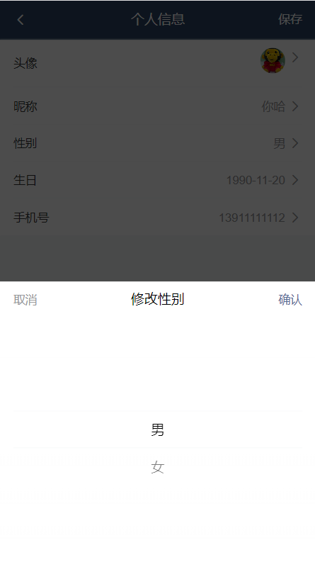

# 编辑资料
## 1. 创建页面并配置路由


1、创建 `views/user-profile/index.vue


2. 配置路由


## 2. 展示用户信息 
思路：

- 找到数据接口
- 封装请求方法
- 请求获取数据
- 模板绑定

1. 封装请求 


模板绑定

## 3. 修改昵称

一、准备弹出层

二、封装组件

三、页面布局

四、基本功能处理

五、更新完成

封装修改个人资料请求


主页: 


封装修改昵称组件 src/user-profile/components/update-name.vue 


## 4. 修改性别 


[Picker 选择器组件](https://vant-ui.github.io/vant/v2/#/zh-CN/picker)

主页 : 


封装修改性别组件 components/update-gender.vue


## 5. 修改生日
主页 


封装修改生日组件 components/update-birthday.vue


## 6. 修改头像
### 6.1 图片上传预览
#### 1. 用原生 input 选择图片


#### 2. 选择完图片就显示出弹层


#### 3. 弹层里的内容封装成组件 **update-photo.vue** 


主页中使用此组件: 


#### 4. 样式处理


### 6.2 裁剪
方案一：结合服务端的图片裁切上传流程


方案二：纯客户端的图片裁切上传流程

####  1. 初始化
[cropper.js 库](https://github.com/fengyuanchen/cropperjs)


#### 2. cropperjs 基本配置
[cropperjs 配置文档](https://github.com/fengyuanchen/cropperjs#options)
```
viewMode: 1,
dragMode: 'move',
aspectRatio: 1,
autoCropArea: 1,
cropBoxMovable: false,
cropBoxResizable: false,
background: false,
movable: true
```


### 6.3 保存更新
#### 1
如果是基于**服务端的裁切**，则使用：[getData](https://github.com/fengyuanchen/cropperjs#getdatarounded) 方法，该方法得到裁切的区域参数


把这些这些参数传给服务端, 服务端在进行处理

#### 2 
如果是**纯客户端的图片裁切**，则使用：[getCroppedCanvas](https://github.com/fengyuanchen/cropperjs#getcroppedcanvasoptions) 方法，该方法得到裁切之后的图片对象（类似于URL.createObjectURL 方法得到的文件对象）

先封装请求 user.js 


```
如果 Content-Type 要求是	application/json	，则 data 传普通对象 {}
如果 Content-Type 要求是	multipart/form-data	，则 data 传 FormData 对象
纵观所有数据接口，你会发现大多数的接口都要求 Content-Type 要求是	application/json
一般只有涉及到文件上传的数据接口才要求Content-Type 要求是	multipart/form-data
这个时候传递一个 FormData 对象
```


