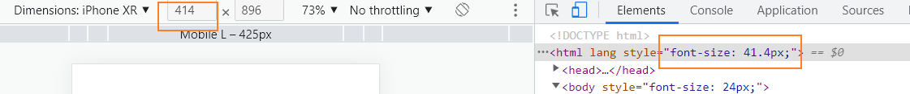
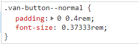

# 项目初始化
## 使用 Vue Cli创建项目
```
vue create toutiao-m
``` 
## 调整初始目录结构
- src/**api** 目录
  - 存储接口封装
- src/**utils** 目录
  - 存储一些工具模块
- src/**styles** 目录
  - index.less 文件，存储全局样式
  - 在 `main.js` 中加载全局样式 `import './styles/index.less'`

调整之后的目录结构如下。
```                
├── README.md                     
├── babel.config.js               
├── package-lock.json             
├── package.json                  
├── public                        
│   ├── favicon.ico               
│   └── index.html                
└── src                           
    ├── api
    ├── App.vue                   
    ├── assets                    
    ├── components                
    ├── main.js                   
    ├── router
    ├── utils
    ├── styles
    ├── store                     
    └── views
```

## iconPark 图标库
[iconPark图标官网](https://iconpark.oceanengine.com/home)

[使用文档](https://github.com/bytedance/IconPark/blob/master/packages/vue/README.md)
## 引入 Vant 组件库
Vant 是有赞商城前端开发团队开发的一个基于 Vue.js 的移动端组件库，它提供了非常丰富的移动端功能组件，简单易用。

- [官方文档](https://youzan.github.io/vant/#/zh-CN/)
- [GitHub 仓库](https://github.com/youzan/vant)
在我们的项目中主要使用 Vant 作为核心组件库，下面我们根据[官方文档](https://youzan.github.io/vant/#/zh-CN/quickstart#yin-ru-zu-jian)将 Vant 导入项目中。

将 Vant 引入项目一共有四种方式：

- 方式一：自动按需引入组件
  - 和方式二一样，都是按需引入，但是加载更方便一些（需要额外配置插件）
  - 优点：打包体积小
  - 缺点：每个组件在使用之前都需要手动加载注册
- 方式二：手动按需引入组件
  - 在不使用插件的情况下，可以手动引入需要的组件
  - 优点：打包体积小
  - 缺点：每个组件在使用之前都需要手动加载注册
- 方式三：导入所有组件
  - Vant 支持一次性导入所有组件，引入所有组件会增加代码包体积，因此不推荐这种做法
  - 优点：导入一次，使用所有
  - 缺点：打包体积大
- 方式四：通过 CDN 引入
  - 使用 Vant 最简单的方法是直接在 html 文件中引入 CDN 链接，之后你可以通过全局变量`vant`访问到所有组件。
  - 优点：适合一些演示、示例项目，一个 html 文件就可以跑起来
  - 缺点：不适合在模块化系统中使用

这里建议为了前期开发的便利性我们选择方式三：导入所有组件，在最后做打包优化的时候根据需求配置按需加载以降低打包体积大小。

1、安装 Vant

```shell
npm i vant
```

2、在 `main.js` 中加载注册 Vant 组件

```javascript
import Vue from 'vue'
import Vant from 'vant'
import 'vant/lib/index.css'

Vue.use(Vant)
```
## 移动端 Rem 适配
Vant 中的样式默认使用 `px` 作为单位，如果需要使用 `rem` 单位，推荐使用以下两个工具：

- [postcss-pxtorem](https://github.com/cuth/postcss-pxtorem) 是一款 postcss 插件，用于将单位转化为 rem
- [lib-flexible](https://github.com/amfe/lib-flexible) 用于设置 rem 基准值

分别将这两个工具配置到项目中完成 REM 适配。

**一、使用 [lib-flexible](https://github.com/amfe/lib-flexible) 动态设置 REM 基准值（html 标签的字体大小）**

1、安装

```shell
npm i amfe-flexible
```

2、然后在 `main.js` 中加载执行该模块

```javascript
import 'amfe-flexible'
```

最后测试：在浏览器中切换不同的手机设备尺寸，观察 html 标签 `font-size` 的变化。



**二、使用 [postcss-pxtorem](https://github.com/cuth/postcss-pxtorem) 将 `px` 转为 `rem`**

1、安装

```shell
# -D 是 --save-dev 的(开发时依赖)简写
npm install postcss-pxtorem -D
```

2、然后在**项目根目录**中创建 `.postcssrc.js` 文件

```javascript
module.exports = {
  plugins: {
    'autoprefixer': {
      browsers: ['Android >= 4.0', 'iOS >= 8']
    },
    'postcss-pxtorem': {
      rootValue: 37.5,
      propList: ['*']
    }
  }
}

```

3、**配置完毕，重新启动服务**
最后测试：**刷新浏览器页面**，审查元素的样式查看是否已将 `px` 转换为 `rem`。

## 关于 `.postcssrc.js` 配置文件
```js
module.exports = {
  plugins: {
    'autoprefixer': {
      browsers: ['Android >= 4.0', 'iOS >= 8']
    },
    'postcss-pxtorem': {
      rootValue: 37.5,
      propList: ['*']
    }
  }
}

```

`.postcssrc.js` 是 PostCSS 的配置文件。


（1）PostCSS 介绍

[PostCSS](https://postcss.org/) 是一个处理 CSS 的处理工具，本身功能比较单一，它主要负责解析 CSS 代码，再交由插件来进行处理，它的插件体系非常强大，所能进行的操作是多种多样的，例如：

- [Autoprefixer](https://github.com/postcss/autoprefixer) 插件可以实现自动添加浏览器相关的声明前缀
- [PostCSS Preset Env](https://github.com/csstools/postcss-preset-env) 插件可以让你使用更新的 CSS 语法特性并实现向下兼容
- [postcss-pxtorem](https://github.com/cuth/postcss-pxtorem) 可以实现将 px 转换为 rem
- ...

目前 PostCSS 已经有 [200 多个功能各异的插件](https://github.com/postcss/postcss/blob/master/docs/plugins.md)。开发人员也可以根据项目的需要，开发出自己的 PostCSS 插件。


PostCSS 一般不单独使用，而是与已有的构建工具进行集成。

[Vue CLI 默认集成了 PostCSS](https://cli.vuejs.org/zh/guide/css.html#postcss)，并且默认开启了 [autoprefixer](https://github.com/postcss/autoprefixer) 插件。

> Vue CLI 内部使用了 PostCSS。
>
> 你可以通过 `.postcssrc` 或任何 [postcss-load-config](https://github.com/michael-ciniawsky/postcss-load-config) 支持的配置源来配置 PostCSS。也可以通过 `vue.config.js` 中的 `css.loaderOptions.postcss` 配置 [postcss-loader](https://github.com/postcss/postcss-loader)。
>
> 我们默认开启了 [autoprefixer](https://github.com/postcss/autoprefixer)。如果要配置目标浏览器，可使用 `package.json` 的 [browserslist](https://cli.vuejs.org/zh/guide/browser-compatibility.html#browserslist) 字段。

（2）Autoprefixer 插件的配置


[autoprefixer](https://github.com/postcss/autoprefixer) 是一个自动添加浏览器前缀的 PostCss 插件，`browsers` 用来配置兼容的浏览器版本信息，但是写在这里的话会引起编译器警告。

```
Replace Autoprefixer browsers option to Browserslist config.
Use browserslist key in package.json or .browserslistrc file.

Using browsers option can cause errors. Browserslist config
can be used for Babel, Autoprefixer, postcss-normalize and other tools.

If you really need to use option, rename it to overrideBrowserslist.

Learn more at:
https://github.com/browserslist/browserslist#readme
https://twitter.com/browserslist
```

警告意思就是说你应该将 `browsers` 选项写到 `package.json` 或 `.browserlistrc` 文件中。

```
[Android]
>= 4.0

[iOS]
>= 8

```

> 具体语法请[参考这里](https://github.com/browserslist/browserslist)。

（3）postcss-pxtorem 插件的配置


- `rootValue`：表示根元素字体大小，它会根据根元素大小进行单位转换
- `propList` 用来设定可以从 px 转为 rem 的属性
  - 例如 `*` 就是所有属性都要转换，`width` 就是仅转换 `width` 属性


`rootValue` 应该如何设置呢？

```
如果你使用的是基于 lib-flexable 的 REM 适配方案，则应该设置为你的设计稿的十分之一。
例如设计稿是 750 宽，则应该设置为 75。
```


大多数设计稿的原型都是以 iphone6 为原型，iphone6 设备的宽是 750，我们的设计稿也是这样。

但是 Vant 建议设置为 37.5，为什么呢？

```
因为 Vant 是基于 375 写的，所以如果你设置为 75 的话，Vant 的样式就小了一半。
```

所以如果设置为 `37.5` 的话，Vant 的样式是没有问题的，但是我们在测量设计稿的时候都必须除2才能使用，否则就会变得很大。


这样做其实也没有问题，但是有没有更好的办法呢？我就想实现测量多少写多少（不用换算）。于是聪明的你就想，可以不可以这样来做？

- 如果是 Vant 的样式，就把 `rootValue` 设置为 37.5 来转换
- 如果是我们的样式，就按照 75 的 `rootValue` 来转换


通过[查阅文档](https://github.com/cuth/postcss-pxtorem#options)可以看到 `rootValue` 支持两种参数类型：

- 数字：固定值
- 函数：动态计算返回
  - postcss-pxtorem 处理每个 CSS 文件的时候都会来调用这个函数
  - 它会把被处理的 CSS 文件相关的信息通过参数传递给该函数

所以修改配置如下：

```js
/**
 * PostCSS 配置文件
 */

module.exports = {
  // 配置要使用的 PostCSS 插件
  plugins: {
    // 配置使用 autoprefixer 插件
    // 作用：生成浏览器 CSS 样式规则前缀
    // VueCLI 内部已经配置了 autoprefixer 插件
    // 所以又配置了一次，所以产生冲突了
    // 'autoprefixer': { // autoprefixer 插件的配置
    //   // 配置要兼容到的环境信息
    //   browsers: ['Android >= 4.0', 'iOS >= 8']
    // },

    // 配置使用 postcss-pxtorem 插件
    // 作用：把 px 转为 rem
    'postcss-pxtorem': {
      rootValue ({ file }) {
        return file.indexOf('vant') !== -1 ? 37.5 : 75
      },
      propList: ['*']
    }
  }
}

```

配置完毕，把服务重启一下

## 封装请求模块
和之前项目一样，这里我们还是使用 [axios](https://github.com/axios/axios) 作为我们项目中的请求库，为了方便使用，我们把它封装为一个请求模块，在需要的时候直接加载即可。

1、安装 axios

```shell
npm i axios
```

2、创建 `src/utils/request.js`

```javascript
/**
 * 封装 axios 请求模块
 */
import axios from "axios"

const request = axios.create({
  baseURL: "http://ttapi.research.itcast.cn/" // 基础路径
})
 
export default request
```
先写这些
3、如何使用

- 方式一（简单方便，但是不利于接口维护）：可以把请求对象挂载到 `Vue.prototype` 原型对象中，然后在组件中通过 `this.xxx` 直接访问
- 方式二（推荐）：把每一个请求都封装成每个独立的功能函数，在需要的时候加载调用，这种做法更便于接口的管理和维护

在项目中建议使用方式二，更推荐
