# 登录注册
> 目标
- 能实现登录页面的布局
- 能实现基本登录功能
- 掌握 Vant 中 **Toast 提示组件**的使用
- 理解 **API 请求模块**的封装
- 理解发送**验证码**的实现思路
- 理解 Vant **Form 实现表单验证**的使用

## 1. 准备阶段

### 1.1 创建组件并配置路由
`src/views/login/index.vue`  创建登录页面并配置路由
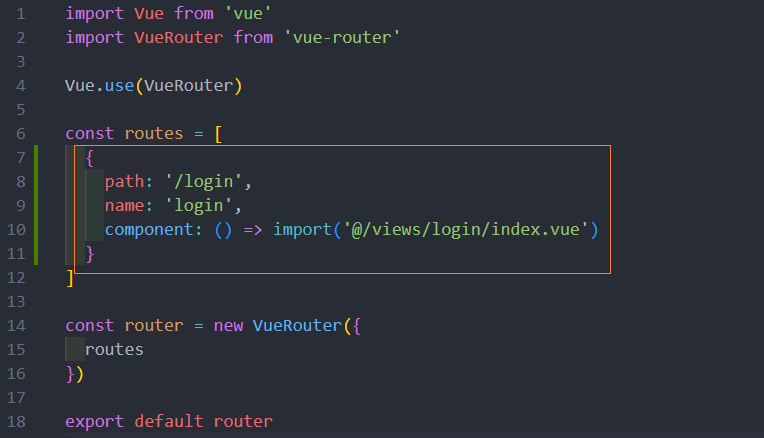
访问 `/login` 查看是否能访问到登录页面
### 1.2 布局结构
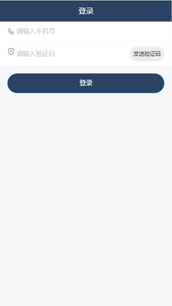

这里主要使用到三个 Vant 组件：

- [NavBar 导航栏](https://youzan.github.io/vant/#/zh-CN/nav-bar)
- [Form 表单](https://youzan.github.io/vant/#/zh-CN/form)
  - [Field 输入框](https://youzan.github.io/vant/#/zh-CN/field)
  - [Button 按钮](https://youzan.github.io/vant/#/zh-CN/button)
> 一个经验：使用组件库中的现有组件快速布局，再慢慢调整细节，效率更高
### 1.3 布局样式
> 写样式的原则：将公共样式写到全局（`src/styles/index.less`），将局部样式写到组件内部。

1、`src/styles/index.less`  全局样式

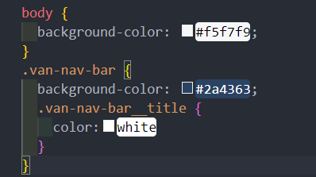

2、`src/views/login/index.vue` 登录页面
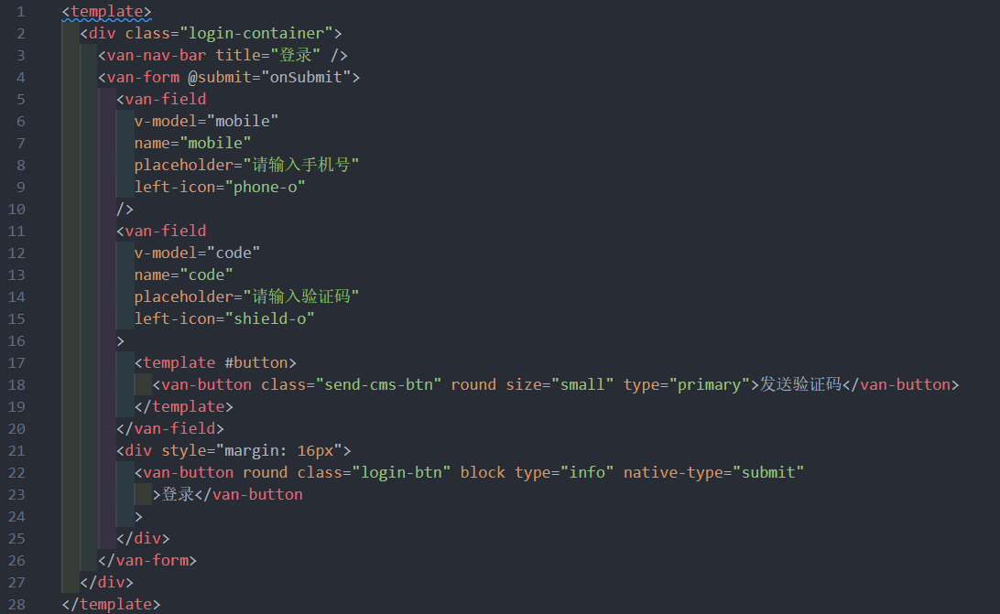
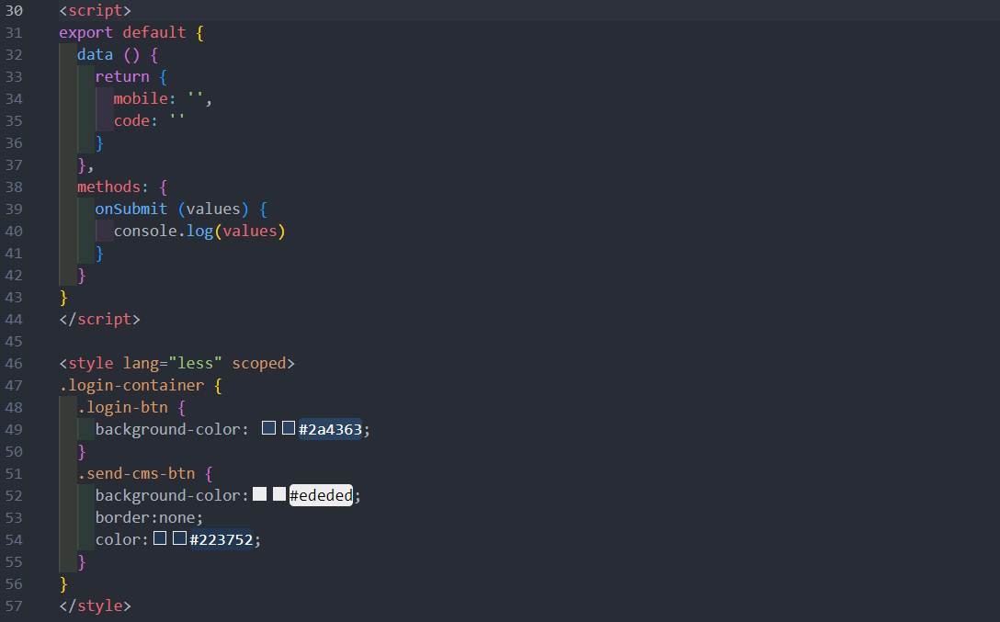

## 2. 实现基本登录功能
1. 封装登录请求  src/api/user.js 
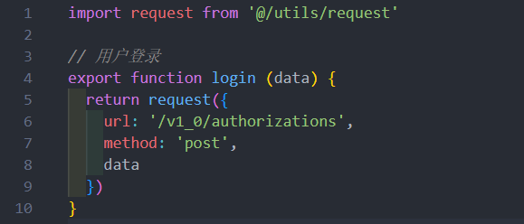

2、在表单中使用 `v-model` 绑定对应数据
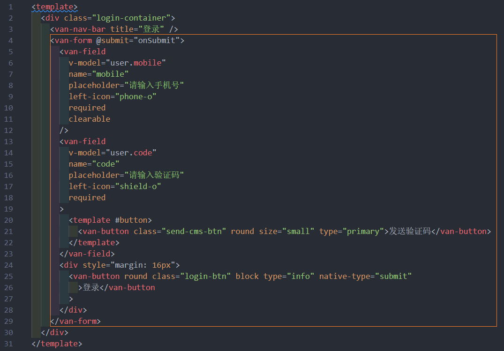
3、给登录按钮注册点击事件, 实现最基本的登录
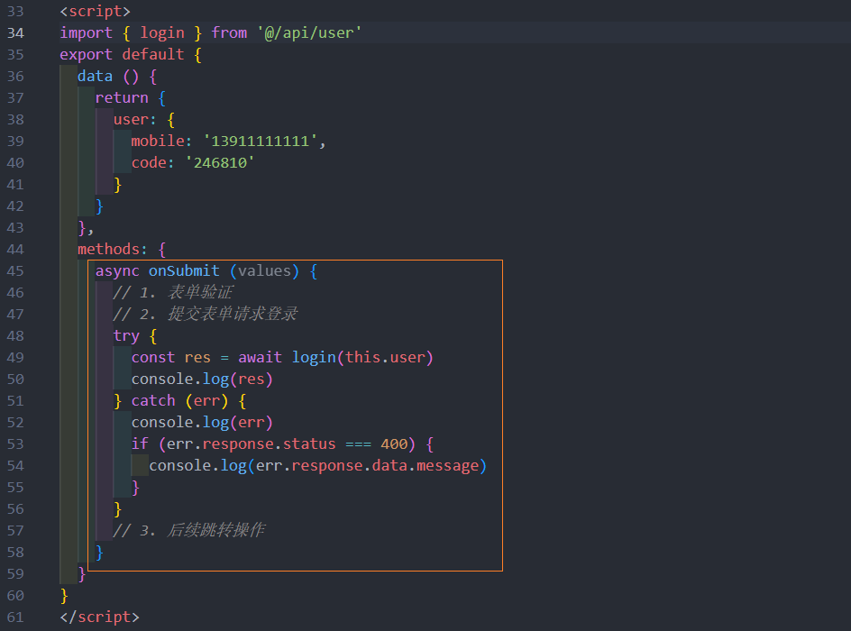
## 3. 登录状态提示 
Vant 中内置了[Toast 轻提示](https://youzan.github.io/vant/#/zh-CN/toast)组件，可以实现移动端常见的提示效果。
```
// 简单文字提示 
Toast("提示内容");

// loading 转圈圈提示
Toast.loading({
  duration: 0, // 持续展示 toast
  message: "加载中...",
  forbidClick: true // 是否禁止背景点击
});

// 成功提示
Toast.success("成功文案");

// 失败提示
Toast.fail("失败文案");
```
> 提示：在组件中可以直接通过 `this.$toast` 调用。

另外需要注意的是：Toast **默认采用单例模式**，即同一时间只会存在一个 Toast，如果需要在同一时间弹出多个 Toast，可以参考下面的示例

```javascript
Toast.allowMultiple();

const toast1 = Toast('第一个 Toast');
const toast2 = Toast.success('第二个 Toast');

toast1.clear();
toast2.clear();
```

下面给登录功能增加 toast 交互提示
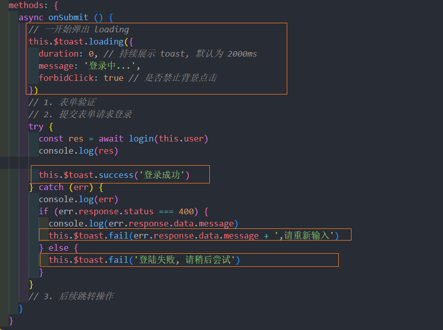
## 4. 表单验证
> 参考文档：[Form 表单验证](https://youzan.github.io/vant/#/zh-CN/form#xiao-yan-gui-ze)


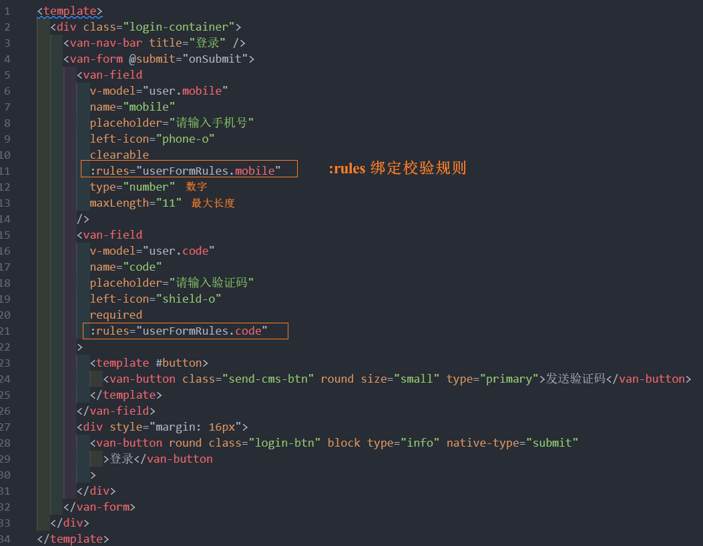
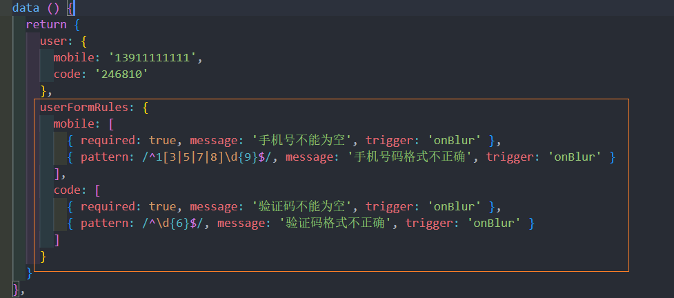
## 5. 验证码处理
### 5.1 验证手机号 
发送验证码之前 (1)需要校验手机号, (2)如果验证通过, 显示倒计时 (3) 调接口
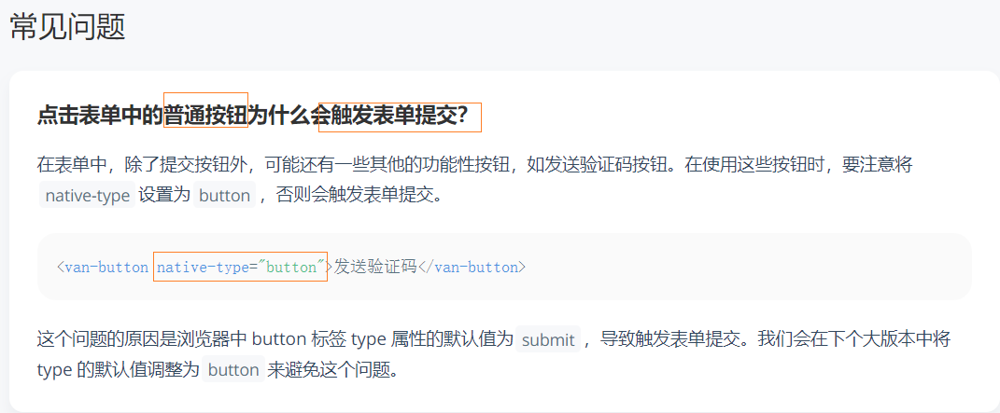

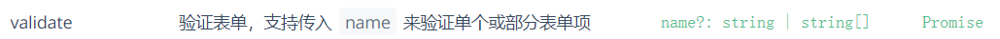
### 5.2 使用倒计时组件
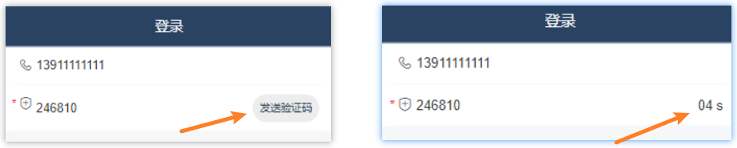
使用倒计时组件
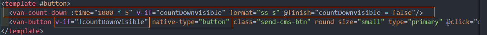
在 data 中添加数据用来控制倒计时的显示和隐藏
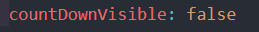
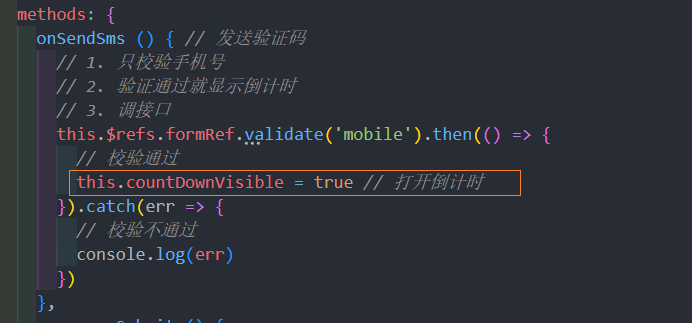
### 5.3 发送验证码 
#### 封装 发送验证码 接口 
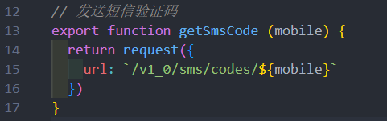
#### 发送处理
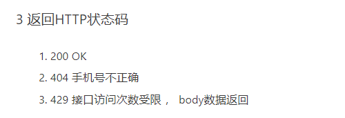
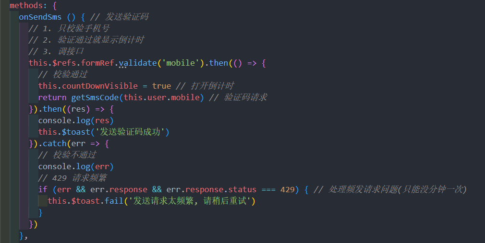
## 6. 处理用户 token 
Token 是用户登录成功之后服务端返回的一个身份令牌，在项目中的多个业务中需要使用到：

- 访问需要授权的 API 接口
- 校验页面的访问权限
- ...

但是我们只有在第一次用户登录成功之后才能拿到 Token。

所以为了能在其它模块中获取到 Token 数据，我们需要把它存储到一个公共的位置，方便随时取用。

往哪儿存？

- 本地存储
  - 获取麻烦
  - 数据不是响应式
- Vuex 容器（推荐）
  - 获取方便
  - 响应式的

使用容器存储 Token 的思路：

- 登录成功，将 Token 存储到 Vuex 容器中
  - 获取方便
  - 响应式
- 为了持久化(刷新页面Vuex数据会清空)，还需要把 Token 放到本地存储
  - 持久化

### 6.1 封装 本地存储 模块
创建 src/utils/storage.js 模块 
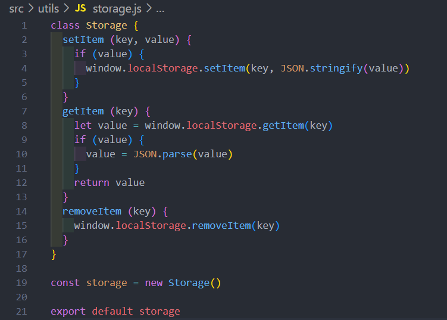
### 6.2 Vuex 的登录封装
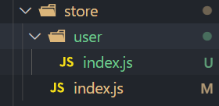

数据持久化:  为了防止数据刷新丢失 , 需要把数据本分到本地存储, 刷新页面使直接从本地存储里拿
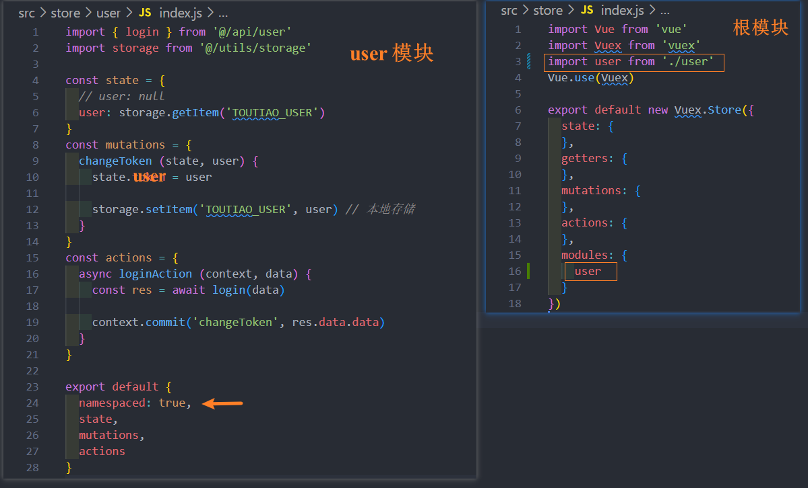

调用 登录 dispatch 请求
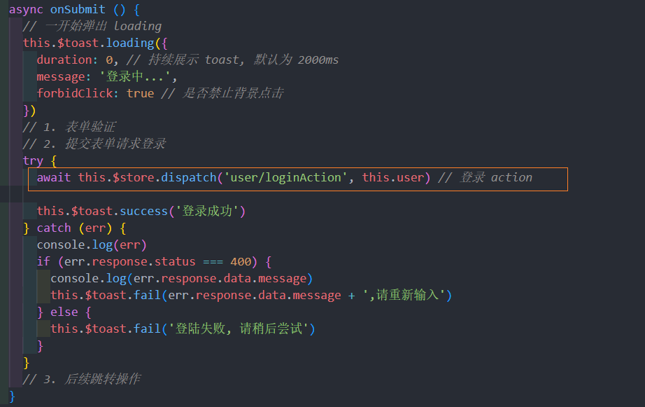

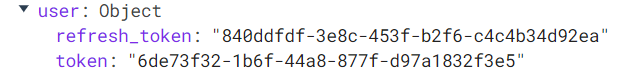
## 解决 Token 过期 
登录成功之后后端会返回两个 Token：

- `token`：访问令牌，有效期 2 小时
- `refresh_token`：刷新令牌，有效期 14 天，用于访问令牌过期之后重新获取新的访问令牌

项目接口中设定的 `Token` 有效期是 `2 小时`，超过有效期服务端会返回 `401` 表示 Token 无效或过期了。


为什么过期时间这么短？

- 为了安全，例如 Token 被别人盗用

过期了怎么办？

- ~~让用户重新登录~~，用户体验太差了
- 使用 `refresh_token` 解决 `token` 过期

概述：服务器生成token的过程中，会有两个时间，一个是token失效时间，一个是token刷新时间，刷新时间肯定比失效时间长，当用户的 `token` 过期时，你可以拿着过期的token去换取新的token，来保持用户的登陆状态，当然你这个过期token的过期时间必须在刷新时间之内，如果超出了刷新时间，那么返回的依旧是 401。

处理流程：

1. 在axios的拦截器中加入token刷新逻辑
2. 当用户token过期时，去向服务器请求新的 token
3. 把旧的token替换为新的token
4. 然后继续用户当前的请求

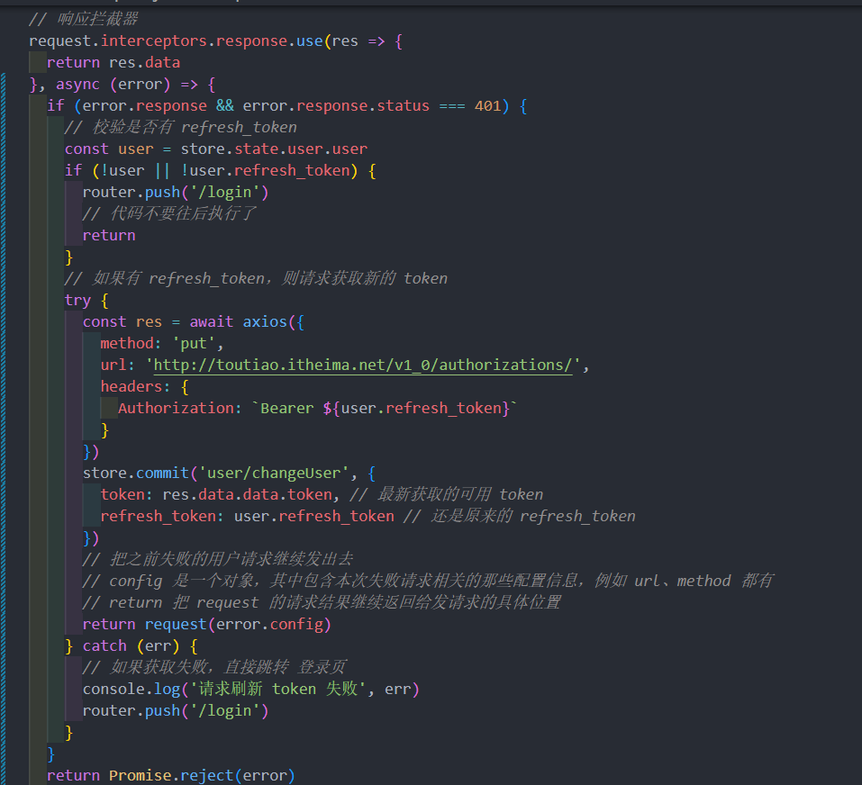

