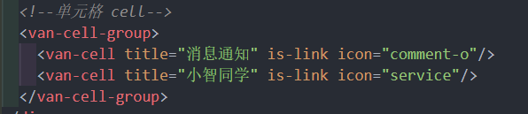

# 个人中心
## 1. TabBar 处理
通过分析页面，可以看到，首页、问答、视频、我的 都使用的是同一个底部标签栏，没必要在每个页面中都写一个，所以为了通用方便，可以使用 Vue Router 的嵌套路由来处理。

- 父路由：一个空页面，包含一个 tabbar，中间留子路由出口
- 子路由
  - 首页
  - 问答
  - 视频
  - 我的

创建 tabbar 组件并配置路由 

这里主要使用到的 Vant 组件：

- [Tabbar 标签栏](https://youzan.github.io/vant/#/zh-CN/tabbar)

创建 src/layout/index.vue


分别创建 首页、问答、视频、我的 页面组件


然后将 layout 组件配置到一级路由, 并且设置它的子路由 src/router/index.js  


## 2. 页面布局
### 2.1 未登录/登录头部状态


写 html , css , 头像用到了Vant的[image组件](https://vant-ui.github.io/vant/v2/#/zh-CN/image)
### 2.2 宫格导航
[宫格 grid组件](https://vant-ui.github.io/vant/v2/#/zh-CN/grid)


导航要加 to 属性, 后面再加
### 2.3 单元格导航
[cell 单元格](https://vant-ui.github.io/vant/v2/#/zh-CN/cell)




后面再加 to 属性跳转
## 3. 处理 未登录/已登录 不同的显示状态
- 未登录，展示登录按钮
- 已登录，展示登录用户信息

记得之前 Vuex里的user模块 存了 user, 判断有没有这个 use 数据


最终效果: 


## 4. 退出登录 
* 点击退出登录按钮, 弹窗提示(确认退出吗?)
* 调 action -> 删除 state 数据, 删除本地存储  -> 提示退出成功并跳转到 login 页面

[dialog 弹出框](https://vant-ui.github.io/vant/v2/#/zh-CN/dialog)

Vuex 退出登录 action 封装  src/store/user/index.js

点击退出按钮并调用 dispatch


这个项目没把用户资料存在 Vuex 里面, 所以这个方面就不管了

## axios 请求拦截器 token 优化
项目中的接口除了登录之外大多数都需要提供 token 才有访问权限。

通过接口文档可看以到，后端接口要求我们将 token 放到请求头 `Header` 中并以下面的格式发送。


> 字段名称：`Authorization`
>
> 字段值：`Bearer token`，注意 `Bearer` 和 `token` 之间有一个空格

方式一：在每次请求的时候手动添加（麻烦）

```js
axios({
  method: "",
  url: "",
  headers: {
    Authorization: "Bearer token"
  }
})

```

方式二：使用请求拦截器统一添加（推荐，更方便）


在 `src/utils/request.js` 中添加拦截器统一设置 token :


在响应拦截器还直接返回了 res.data , 所以前面登录模块user数据接受部分还要处理一下
## 展示用户登录信息 
- 封装接口
- 请求获取数据
- 模板绑定

1、在 `api/user.js` 中添加封装数据接口

在 axios 请求拦截器中已经注入了 token, 所以没必要单独注入
2、在 `views/my/index.vue` 请求加载数据


3. 模板上绑定


