# 首页 - 频道编辑
## 1. 处理页面弹出层
Vant 中内置了 [Popup 弹出层](https://youzan.github.io/vant/#/zh-CN/popup) 组件

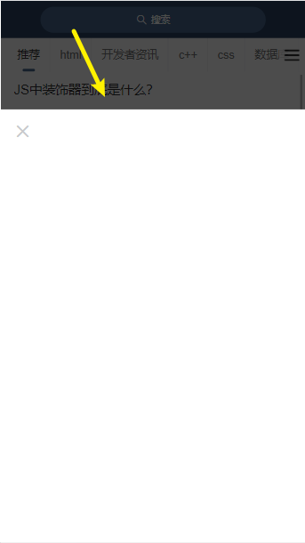

1、在 `data` 中添加一个数据用来控制弹层的显示和隐藏
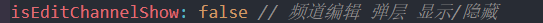

2、在首页模板中的频道列表后面添加弹出层组件 src/views/home/index.vue 
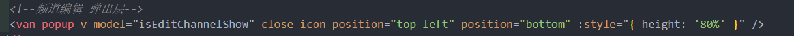

3、点击汉堡图标时弹出 
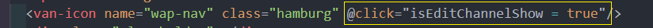
## 2. 创建频道编辑组件 
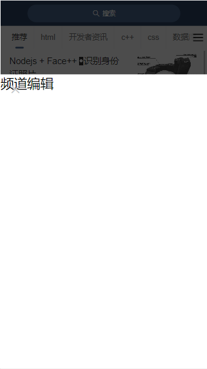

1、创建 `views/home/components/channel-edit.vue` 
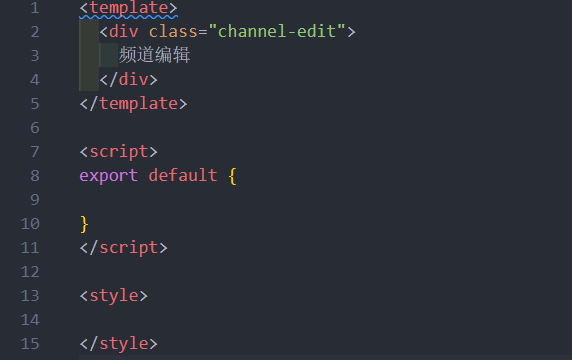

2、在首页中加载注册 
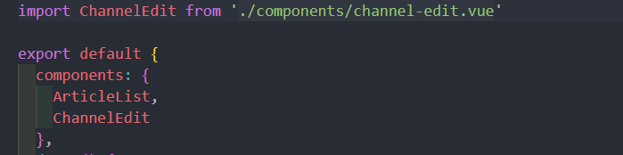
3、在弹出层中使用频道编辑组件
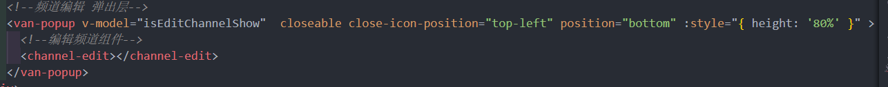

## 3. 页面布局及样式
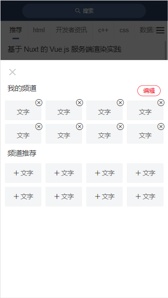
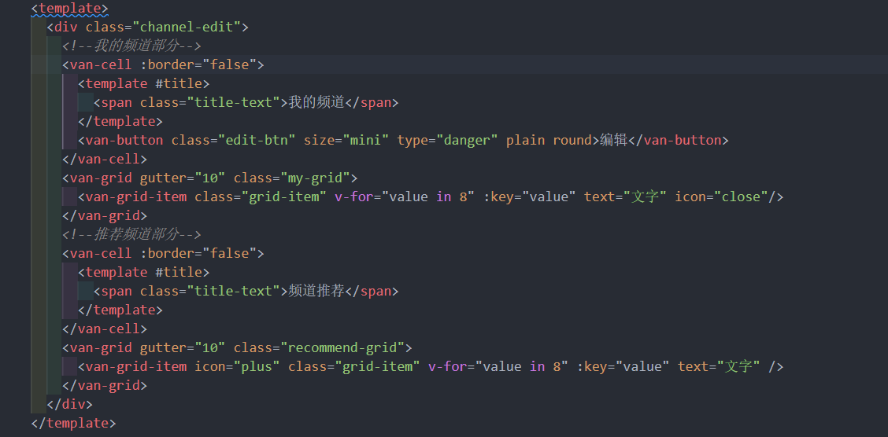

```html
<style lang="less" scoped>
.channel-edit {
  padding: 85px 0;
  .title-text {
    font-size:32px;
    color: #333333;
  }
  .edit-btn {
    width:104px;
    height:48px;
    font-size:26px;
  }
  /deep/.grid-item {
    width:160px;
    height:86px;
    .van-grid-item__content{
      background-color: #f4f5f6;
      white-space: nowrap;
      border-radius: 6px;
      .van-grid-item__text{
        font-size:28px;
      }
    }
  }
  /deep/ .my-grid {
    .grid-item {
      .van-icon-close {
        position:absolute;
        right:-6px;
        top:-6px;
        z-index:2;
        font-size:34px;
      }
    }
  }
  /deep/.recommend-grid {
    .grid-item {
      .van-grid-item__content {
        flex-direction: row;
        .van-icon-plus {
          font-size: 28px;
          margin-right:6px;
        }
        .van-grid-item__text {
          margin-top: 0
        }
      }
    }
  }
}
```

## 4. 展示我的频道
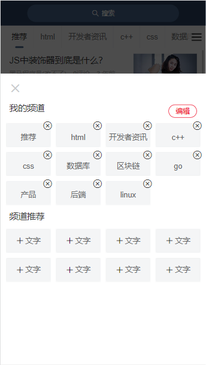

1、在父组件中把 `channels` 传递给频道编辑组件
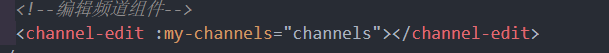

2、在频道编辑组件中声明`myChannels`接收父组件的 channels 频道列表数据并遍历展示
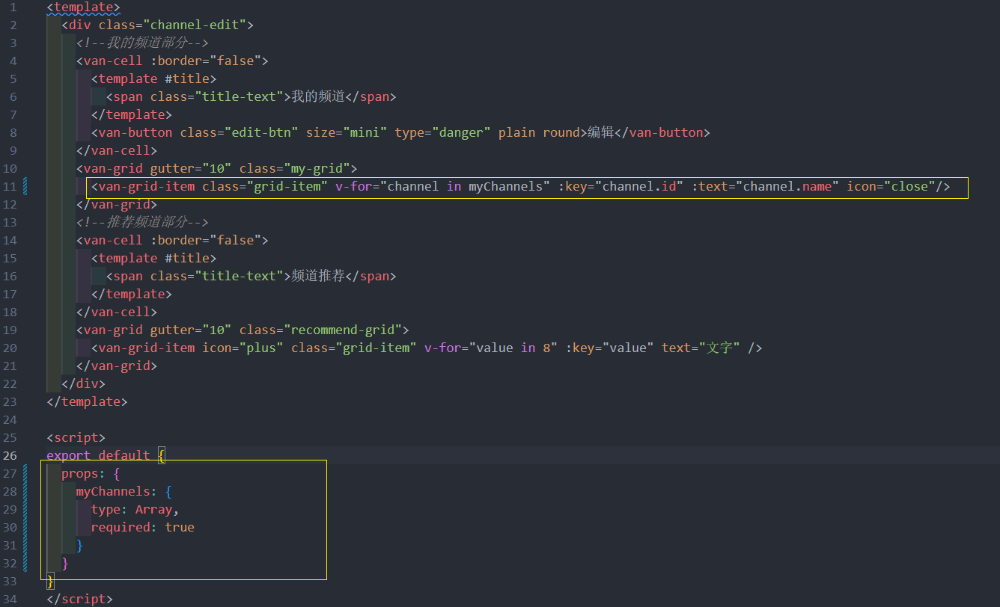
## 5. 当前频道高亮激活
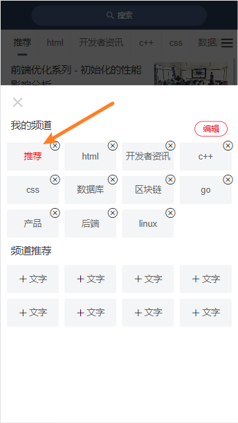
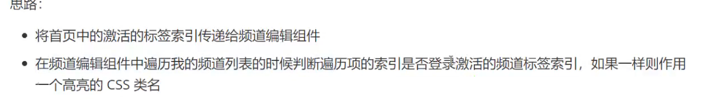

1. 首页组件的 `active` 传递给编辑组件 

2. 编辑组件用 `props` 接受 传过来的 `active` 

并且使用对应的**类名**改样式


## 6. 展示推荐频道
没有用来获取推荐频道的数据接口，但是我们有获取**所有频道**列表的数据接口

所以：`所有频道列表 - 我的频道 = 剩余推荐的频道`。

实现过程所以一共分为两大步：

- 获取所有频道
- 基于所有频道和我的频道 **计算属性(computed)** 获取**剩余**的推荐频道
### 6.1 获取所有频道 
1. 封装获取所有频道接口 

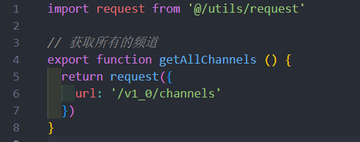

2、在编辑频道组件中请求获取所有频道数据
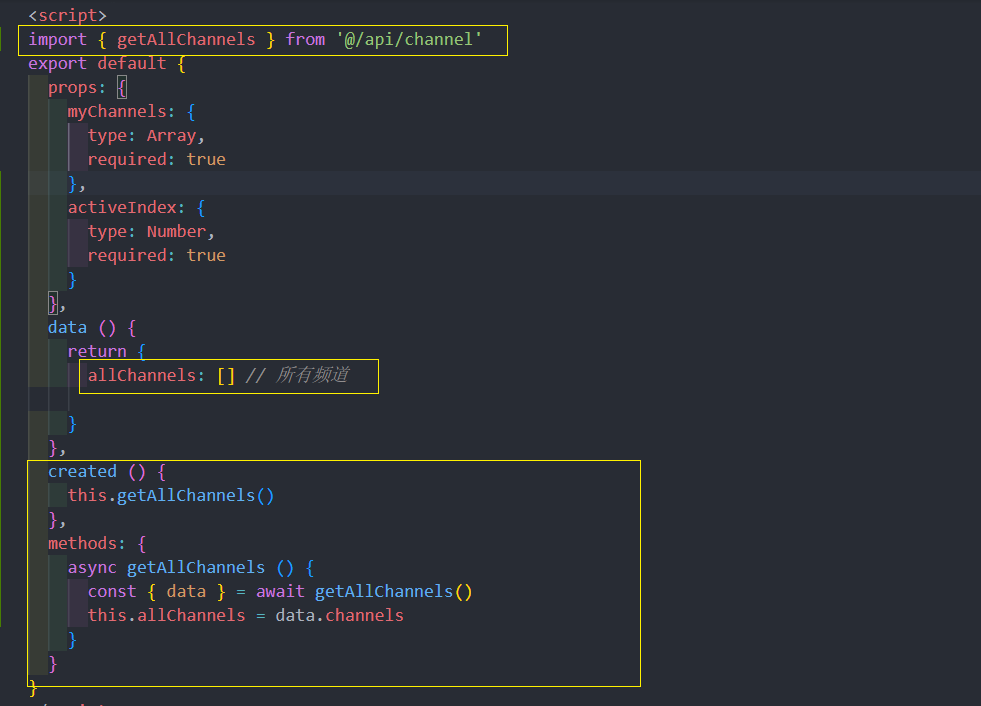
### 6.2 处理展示推荐频道
使用 `computed` 计算属性
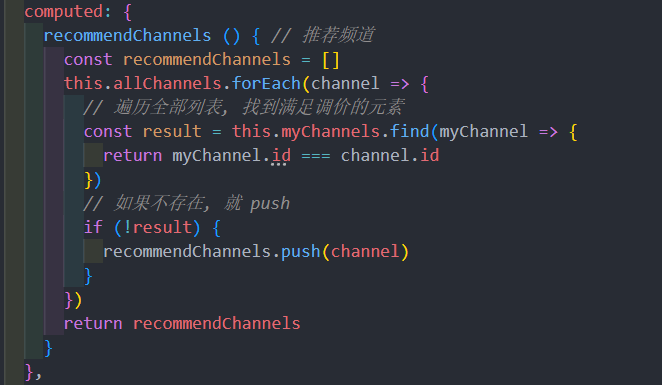

或者 使用 **filter()** 方法
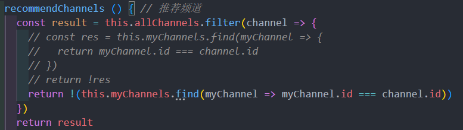

模板绑定
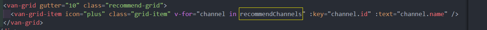

最终效果 

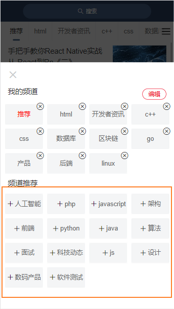
## 7. 添加频道
思路：

- 给推荐频道列表中每一项注册点击事件
- 获取点击的频道项
- 将频道项添加到我的频道中
- ~~将当前点击的频道项从推荐频道中移除~~
  - 不需要删除，因为我们获取数据使用的是计算属性，当我频道发生改变，计算属性重新求值了

但是需要还要做数据的**持久化**, 这个部分到后面在做

1、给推荐频道中的频道注册点击事件
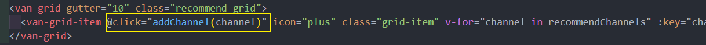

2、在添加频道事件处理函数中
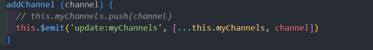
这里要注意, 这里需要修改props, 需要通过 $emit通知父组件亲自修改, 所以父组件使用到了 **.sync** 修饰符
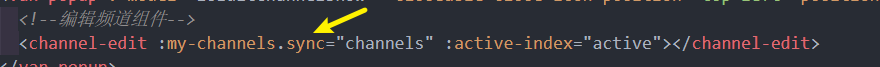

然后会神奇的发现点击的那个推荐频道跑到我的频道中了，并没有去手动的删除点击的这个推荐频道，但是它没了！主要是因为推荐频道是通过一个**计算属性**获取的，计算属性中使用了 channels（我的频道）数据，所以只要我的频道中的数据发生变化，那么计算属性就会重新运算获取最新的数据

## 8. 编辑频道 
思路：

- 给我的频道中的频道项注册点击事件
- 在事件处理函数中
  - 如果是编辑状态，则执行删除频道操作
  - 如果是非编辑状态，则执行切换频道操作

### 8.1 处理 编辑/非编辑 状态
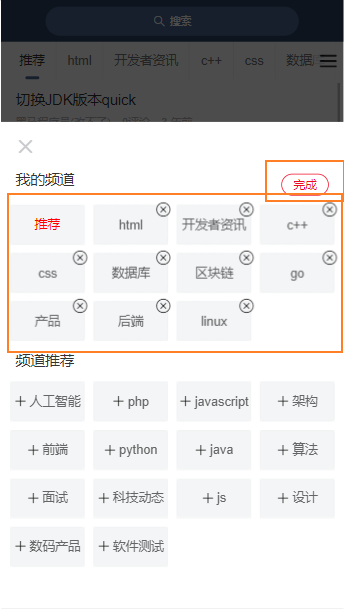

1、在 data 中添加数据 `isEdit` 用来控制编辑状态的显示
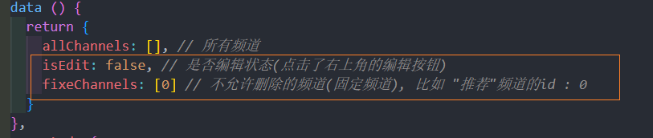

**条件判断** `isEdit && !fixedChannels.includes(channel.id)` 比如: 控制图标的显示 等
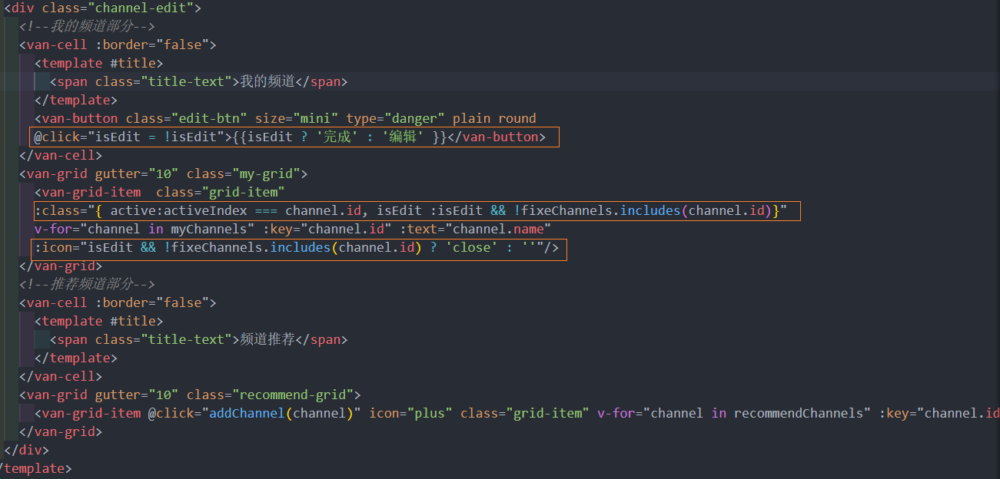

### 8.2 切换我的频道 

需求: 在非编辑状态下点击我的频道, 就跳转到点击的那个频道(附加: 要关闭弹层)
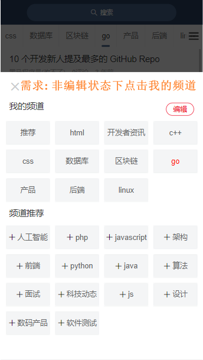

1、给我的频道项注册点击事件
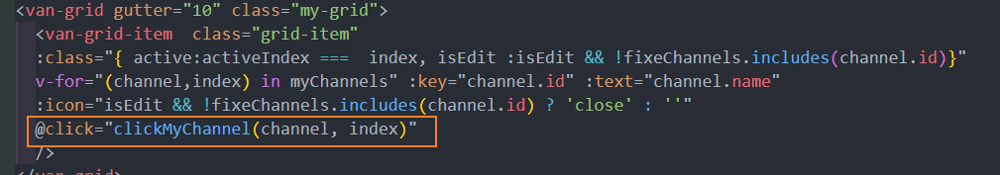

2、处理函数, 通知父组件改变它的 `active` 值
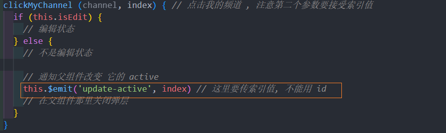

3、在父组件中监听处理其自定义事件
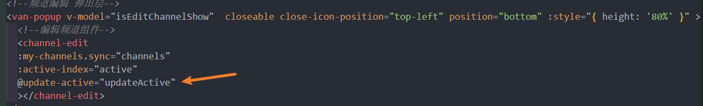
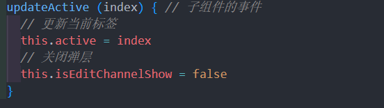
### 8.3 删除我的频道 (细节)
需求 : 在编辑状态下删除点击的频道

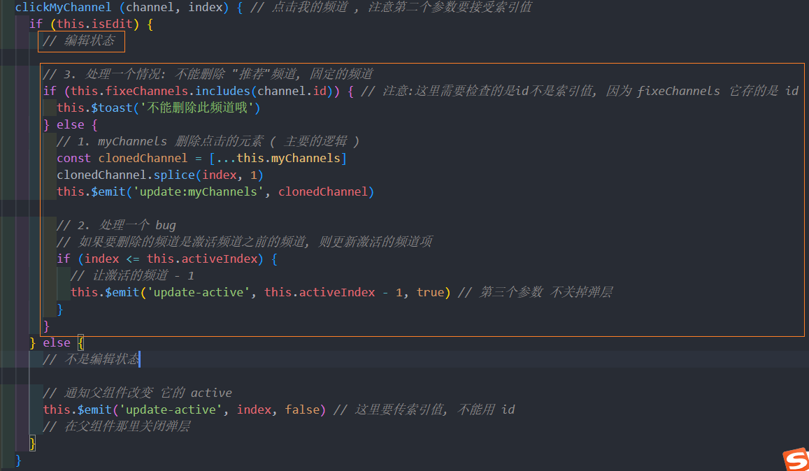

父组件的监听子组件事件这个方法, 添加了第三个参数并设置了默认值(决定是否关闭弹层)
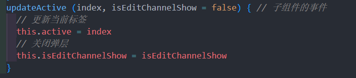

这节部分要注意很多细节边界情况
## 9. 频道数据持久化
### 9.1 业务分析 
频道编辑这个功能，无论用户是否登录用户都可以使用。

不登录也能使用

- 数据存储在**本地**
- 不支持同步功能

登录也能使用

- 数据存储在线上后台服务器
- 更换不同的设备可以同步数据


### 9.2 添加频道
1. 先封装 登录状态时的添加频道接口  src/api/channel.js 
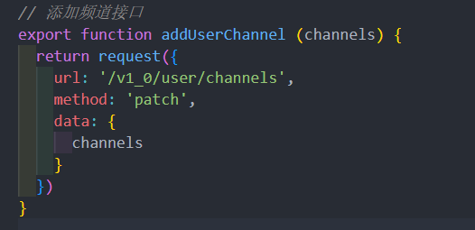

2、修改添加频道的处理逻辑

用 Vuex 里的 `user`数据 判断是否登录后做相应的逻辑判断
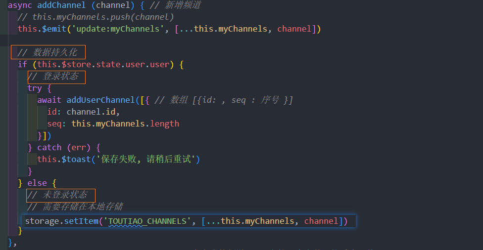

### 9.3 删除频道 
封装删除频道接口 
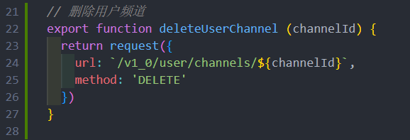

修改一下删除逻辑 
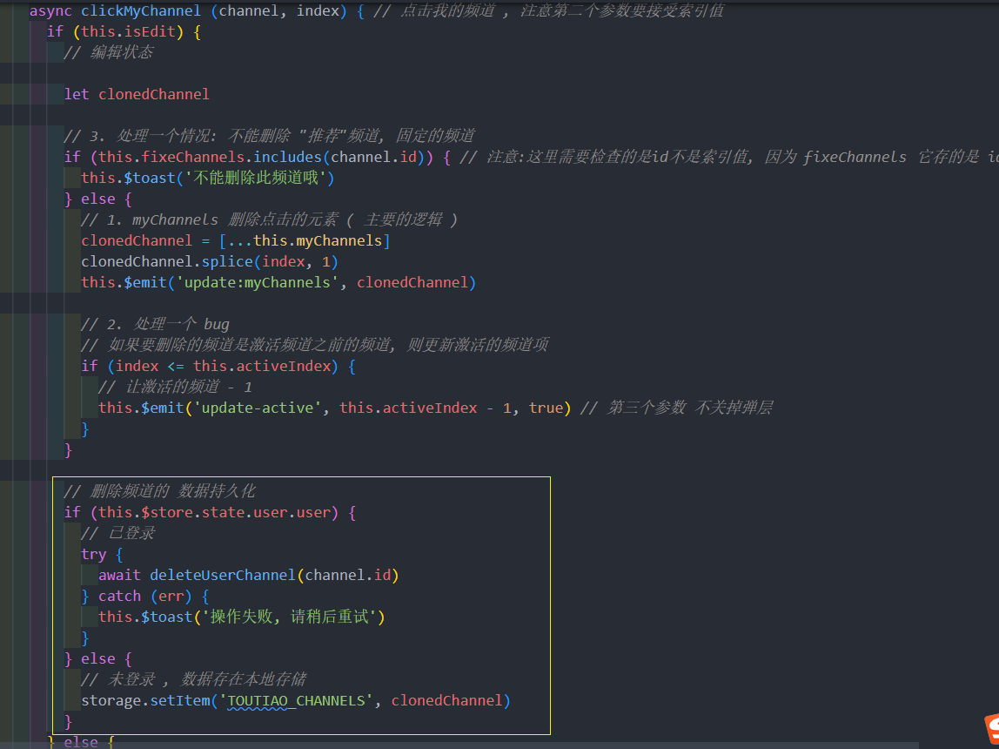
## 10. 正确的获取首页频道列表数据
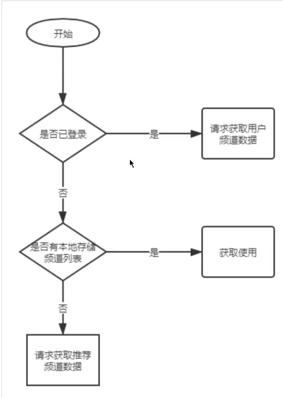
> 提示：获取登录用户的频道列表和获取默认推荐的频道列表是同一个数据接口。后端会根据接口中的 token 来判定返回数据

主页 src/views/index.vue 最初获取数据 
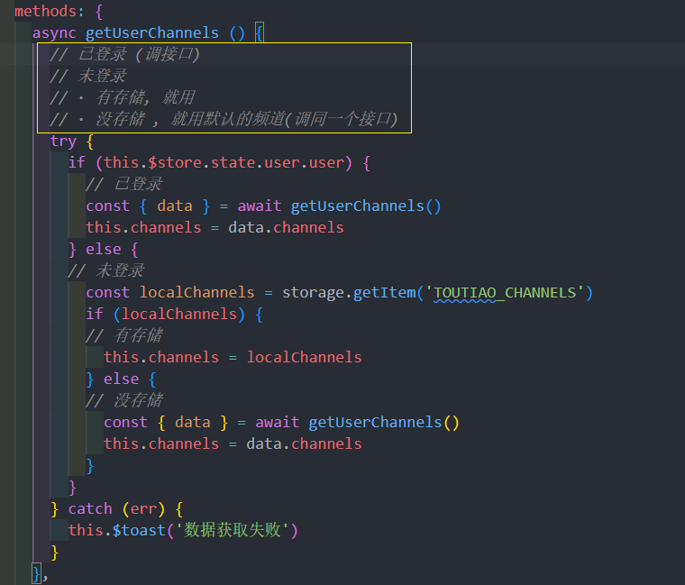
