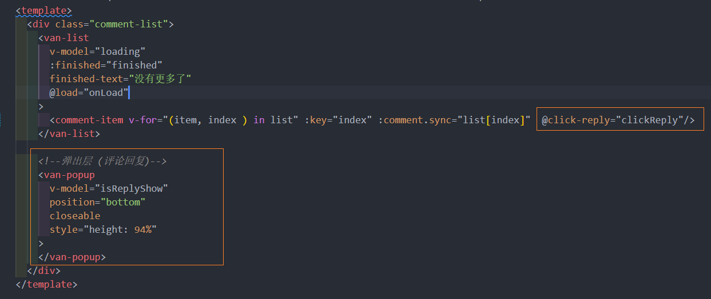

# 文章评论 
## 1. 展示文章评论列表
### 1.1  准备组件
创建组件  src/views/article/components/comment-list.vue

[list 组件](https://vant-ui.github.io/vant/v2/#/zh-CN/list)
### 1.2 获取数据并展示


步骤：

- 封装接口
- 请求获取数据
- 处理模板

1、在 `api/comment.js` 中添加封装请求方法


2、请求获取数据


### 1.3 展示文章评论总数量


comment-list.vue 评论组件: 


父组件: 


父组件监听子组件的事件


### 1.4 展示文章评论项


评论项封装一个组件 comment-item.vue 
```vue
<template>
  <van-cell class="comment-item">
    <van-image
      slot="icon"
      class="avatar"
      round
      fit="cover"
      src="https://img.yzcdn.cn/vant/cat.jpeg"
    />
    <div slot="title" class="title-wrap">
      <div class="user-name">用户名称</div>
      <van-button
        class="like-btn"
        icon="good-job-o"
      >赞</van-button>
    </div>

    <div slot="label">
      <p class="comment-content">这是评论内容</p>
      <div class="bottom-info">
        <span class="comment-pubdate">4天前</span>
        <van-button
          class="reply-btn"
          round
        >回复 0</van-button>
      </div>
    </div>
  </van-cell>
</template>

<script>
export default {
  name: 'CommentItem',
  components: {},
  props: {},
  data () {
    return {}
  },
  computed: {},
  watch: {},
  created () {},
  mounted () {},
  methods: {}
}
</script>

<style scoped lang="less">
.comment-item {
  .avatar {
    width: 72px;
    height: 72px;
    margin-right: 25px;
  }
  .title-wrap {
    display: flex;
    justify-content: space-between;
    align-items: center;
    .user-name {
      color: #406599;
      font-size: 26px;
    }
  }
  .comment-content {
    font-size: 32px;
    color: #222222;
    word-break: break-all;
    text-align: justify;
  }
  .comment-pubdate {
    font-size: 19px;
    color: #222;
    margin-right: 25px;
  }
  .bottom-info {
    display: flex;
    align-items: center;
  }
  .reply-btn {
    width: 135px;
    height: 48px;
    line-height: 48px;
    font-size: 21px;
    color: #222;
  }
  .like-btn {
    height: 30px;
    padding: 0;
    border: none;
    font-size: 19px;
    line-height: 30px;
    margin-right: 7px;
    .van-icon {
      font-size: 30px;
    }
  }
}
</style>
```

父组件绑定


绑定模板 


## 2. 评论点赞(v-for 和 .sync的bug)


1、在 `api/comment.js` 中添加封装两个接口

2、然后给评论项中的 `like` 图标注册点击事件

3、在事件处理函数中

4、父组件使用 .sync , 但这里需要注意的是**v-for 和 .sync**不能一起绑定因为**会报错**, 解决办法是用**索引**值取值 代替原来的值


## 3. 发布文章评论
### 3.1 准备组件 
[popup弹出层](https://vant-ui.github.io/vant/v2/#/zh-CN/popup)


在主页 article/index.vue: 


### 3.2 封装弹出层内部的组件


封装 src/views/article/components/comment-post.vue 组件 
```vue
<template>
  <div class="post-comment">
    <van-field
      class="post-field"
      v-model="message"
      rows="2"
      autosize
      type="textarea"
      maxlength="50"
      placeholder="优质评论将会被优先展示"
      show-word-limit
    />
    <van-button
      type="primary"
      size="small"
    >发布</van-button>
  </div>
</template>

<script>
export default {
  name: 'PostComment',
  components: {},
  props: {},
  data () {
    return {
      message: ''
    }
  },
}
</script>

<style scoped lang="less">
.post-comment {
  display: flex;
  padding: 15px;
  align-items: flex-end;
  .post-field {
    background: #f5f7f9;
    margin-right: 15px;
  }
}
</style>
```
在主页注册 index.vue


### 3.3 发布评论逻辑完成
1、 封装接口 src/api/comment.js


2、 comment-post.vue 组件内绑定点击事件, 调接口


3、在主页监听子组件事件, 并通过 $ref 把最新评论 obj 追加到`comment-list`组件里的`list`数组, 引起视图变化 


<!-- ## 4. 评论回复 

### 4.1 准备回复弹层


一、在详情页中使用弹层用来展示文章的回复

在 data 中添加数据用来控制展示回复弹层的显示状态



在 `comment-item.vue` 组件中点击回复按钮的时候，对外发布自定义事件


父组件中使用的位置监听处理


### 展示评论回复列表

基本思路：

- 回复列表和文章的评论列表几乎是一样的
- 重用把之前封装的评论列表 -->
