# 文章搜索
## 1. 创建组件并配置路由 
创建 src/views/search/index.vue 
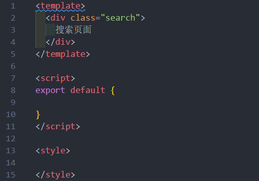

配置路由

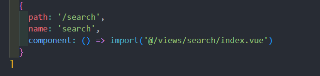

点击搜索时跳转
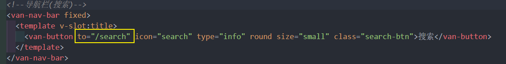
## 2. 搜索页面的布局
Vant 的[Search 组件](https://vant-ui.github.io/vant/v2/#/zh-CN/search)

有搜索历史 , 搜索建议 , 搜索结果

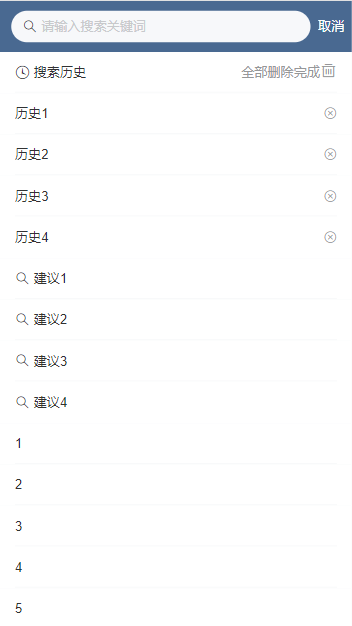

1,  搜索历史 src/views/search/components/**search-history**.vue
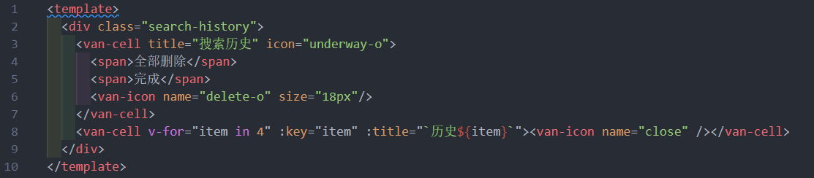
2,  搜索历史 src/views/search/components/**search-suggestion**.vue
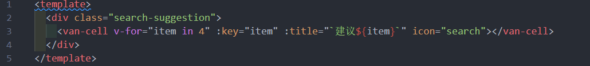
3,  搜索结果 src/views/search/components/**search-result**.vue
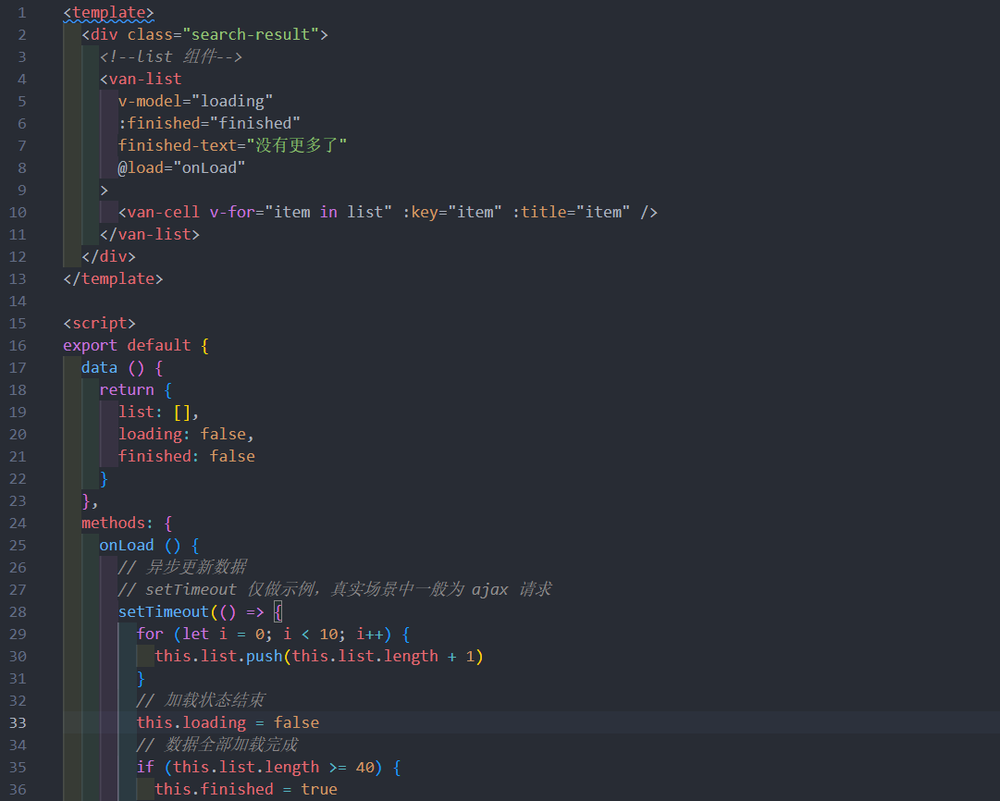

在主页注册 
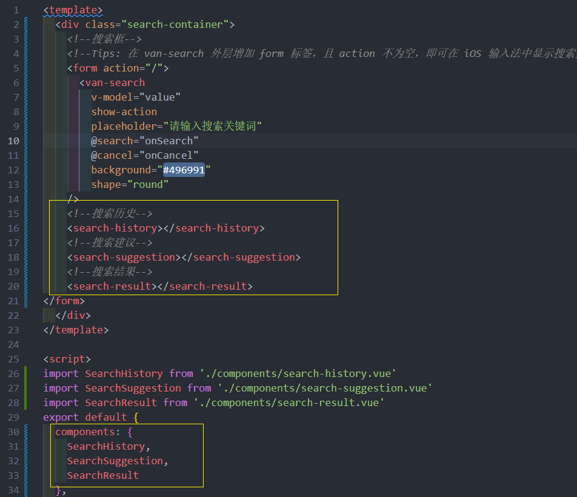

## 3. 处理组件显示状态 (细节)
思路 : 
* 通过一个变量控制是否显示 **搜索结果**

* 并且用  value 是否有**值**来判断是否为**搜索历史**或者**搜索建议**, 可以使用 `v-for, v-else-if, v-if`

* 还需要注意: 得到搜索结果后, *再次在搜索框获取焦点时*需展示搜索建议, 这个也要处理一下

1. 在 `data` 中添加数据用来控制搜索结果的显示状态
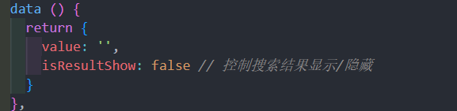
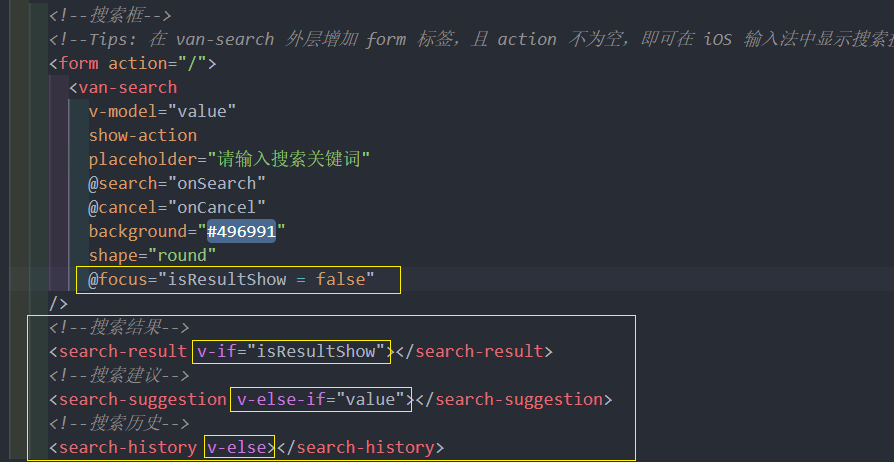
## 4. 搜索联想建议
### 4.1 基本功能
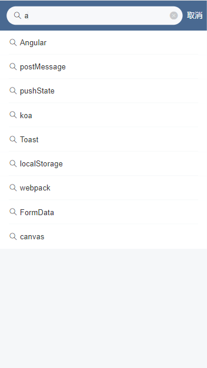

一、将父组件中搜索框输入的内容传给联想建议子组件

二、在子组件中监视搜索框输入内容的变化，如果变化则请求获取联想建议数据

三、将获取到的联想建议数据展示到列表中

父组件通过props传递给子组件搜索框内容 value
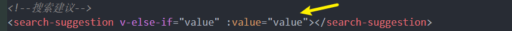

封装请求 src/api/search.js

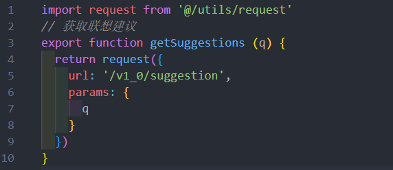

watch 监听父组件传过来的搜索框内容 src/views/search/components/**search-suggestion**.vue
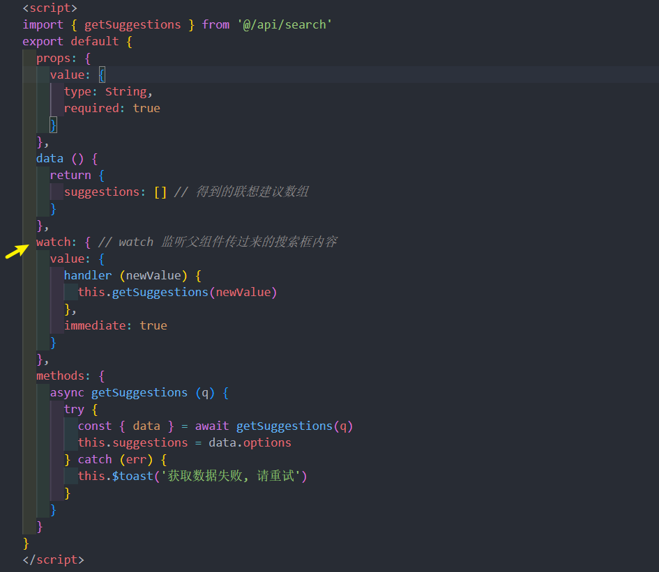
绑定模板 
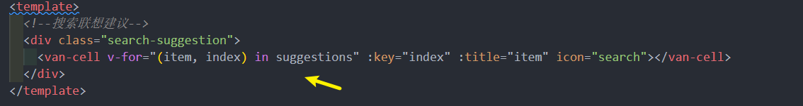

### 4.2 防抖优化 
1、安装 lodash

```sh
# yarn add lodash
npm i lodash
```

2、防抖处理

```js
// lodash 支持按需加载，有利于打包结果优化
import { debounce } from "lodash"
```

> 不建议下面这样使用，因为这样会加载整个模块。
>
> ```js
> import _ from 'lodash'
> _.debounce()
> ```
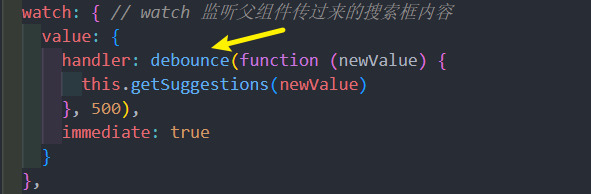

### 4.3 搜索关键字高亮
如何将字符串中的指定字符在**网页**中高亮展示？

```js
"Hello World";
```

将需要高亮的字符包裹 HTML 标签，为其单独设置颜色。

```js
"Hello <span style="color: red">World</span>"
```

在 Vue 中如何渲染带有 HTML 标签的字符串？

```js
data () {
  return {
     : 'Hello <span style="color: red">World</span>'
  }
}
```

```html
<div>{{ htmlStr }}</div>
<div v-html="htmlStr"></div>
```


如何把字符串中指定字符统一替换为高亮（包裹了 HTML）的字符？

```js
const str = "Hello World"

// 结果：<span style="color: red">Hello</span> World
"Hello World".replace('Hello', '<span style="color: red">Hello</span>')

// 需要注意的是，replace 方法的字符串匹配只能替换第1个满足的字符
// <span style="color: red">Hello</span> World Hello abc
"Hello World Hello abc".replace('Hello', '<span style="color: red">Hello</span>')

// 如果想要全文替换，使用正则表达式
// g 全局
// i 忽略大小写
// <span style="color: red">Hello</span> World <span style="color: red">Hello</span> abc
"Hello World Hello abc".replace(/Hello/gi, '<span style="color: red">Hello</span>')
```

> 一个小扩展：使用字符串的 split 结合数组的 join 方法实现高亮
>
> ```js
> var str = "hello world 你好 hello";
> 
> // ["", " world 你好 ", ""]
> const arr = str.split("hello");
> 
> // "<span>hello</span> world 你好 <span>hello</span>"
> arr.join("<span>hello</span>");
> ```

**具体实现:**

1、在 methods 中添加一个方法处理高亮
2、然后在联想建议列表项中绑定调用, 插槽, v-html ...
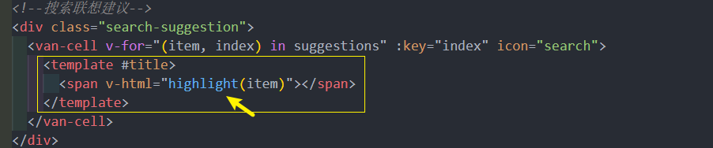
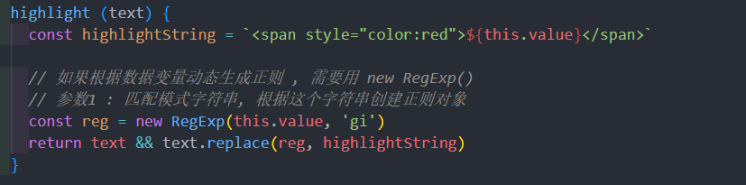

## 5. 搜索结果 

### 5.1 传递搜索内容 
但我们看到搜索建议后并且我们点击了某一个搜索建议, 这时应该要显示其搜索结果, 并且搜索框里显示点击的字符串

注册事件 **search-suggestion**.vue
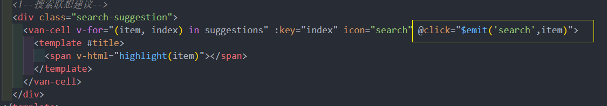
父组件监听 index.vue
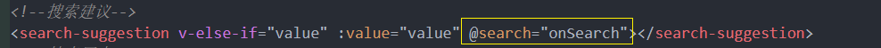
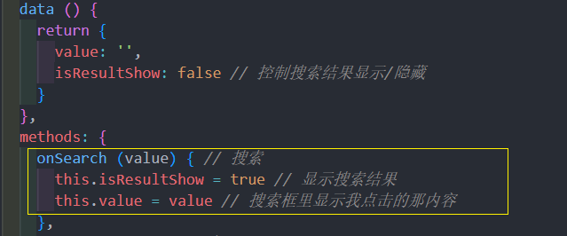

把 value 以props传递个 search-result.vue 组件 
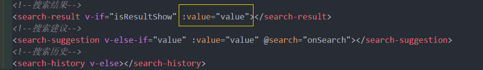

search-result.vue 组件接受 value 

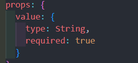

### 5.2 搜索结果处理完成
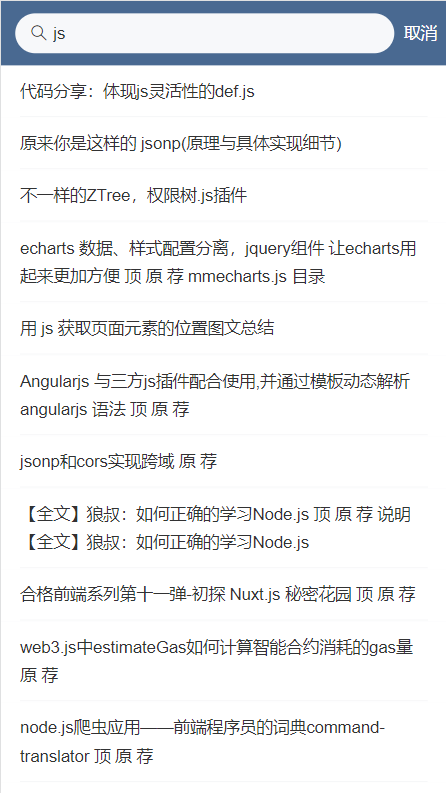

1. 封装 获取搜索结果 接口  src/api/search.js
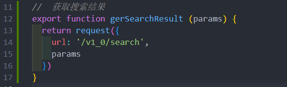

**search-result.vue**
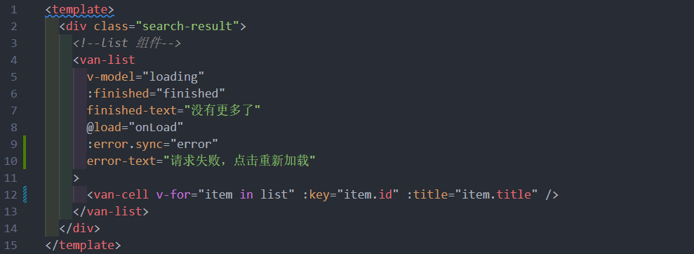
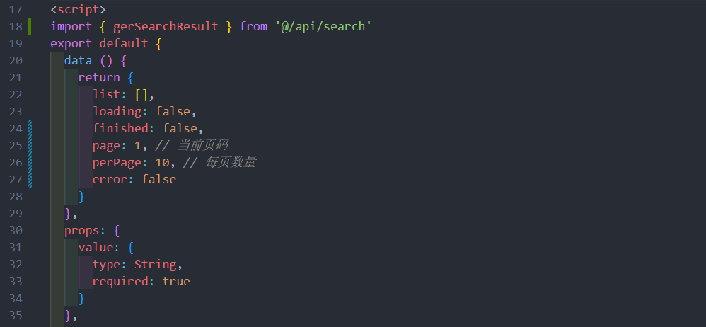
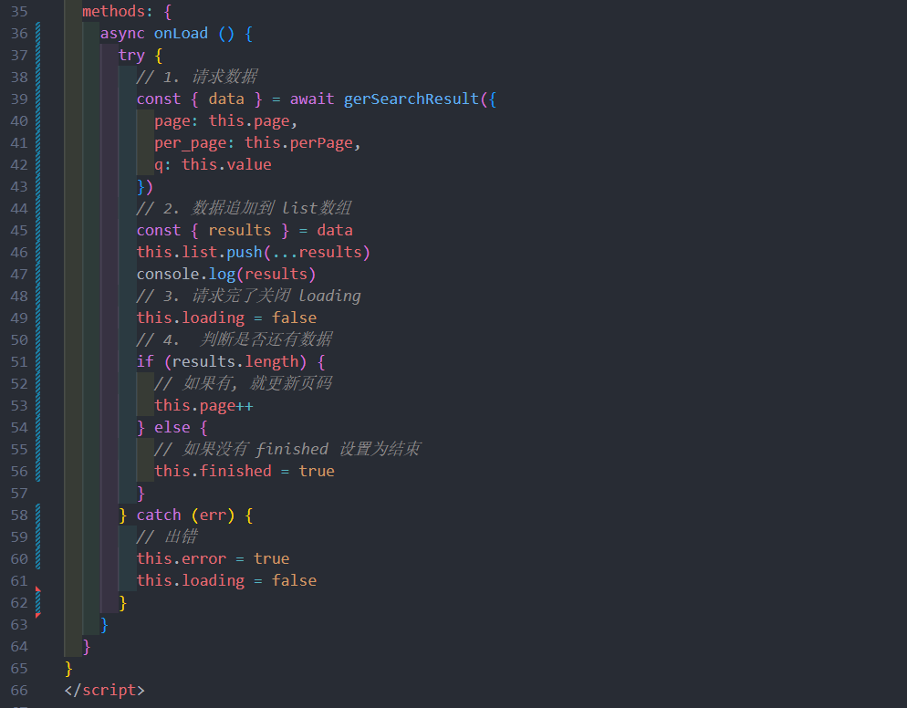

## 6. 搜索历史记录
### 6.1 添加历史记录
当搜素时才需要记录

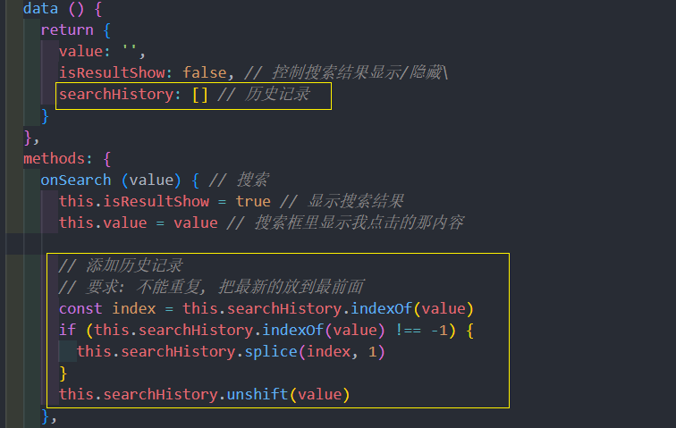
### 6.2 展示历史记录 
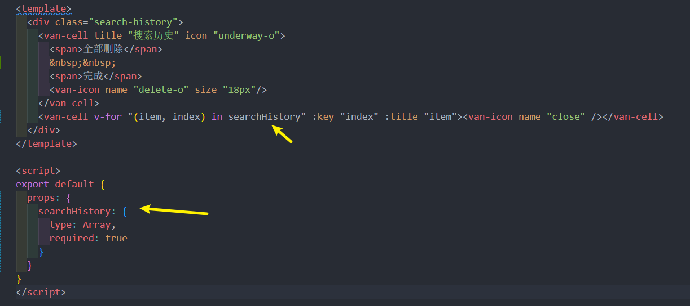
### 6.3 删除历史记录
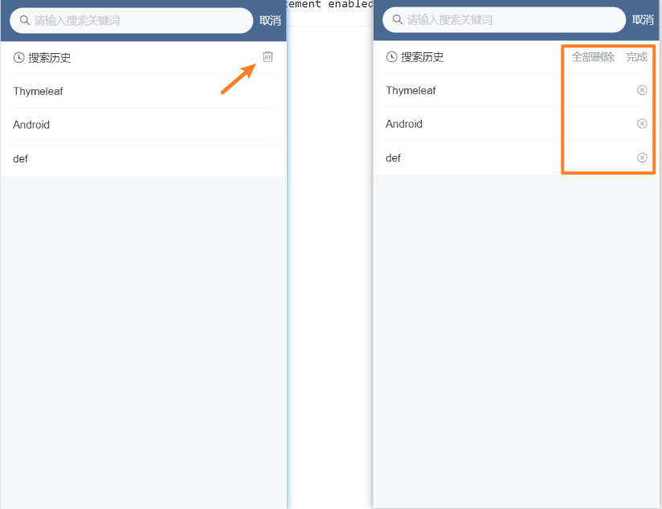

基本思路：

- 给历史记录中的每一项注册点击事件
- 在处理函数中判断
  - 如果是删除状态，则执行删除操作
  - 如果是非删除状态，则执行搜索操作

定义变量 isDeleteShow 判断不同场景(删除 / 可直接跳转)
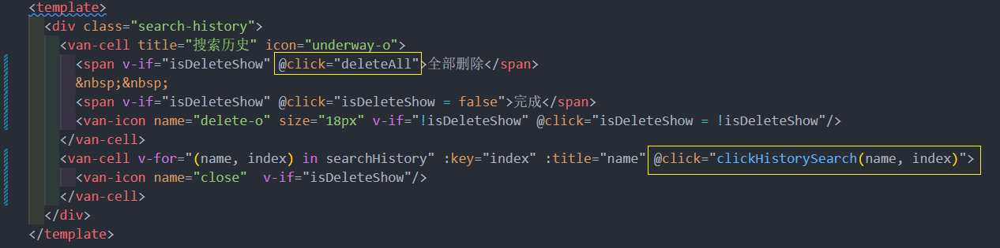
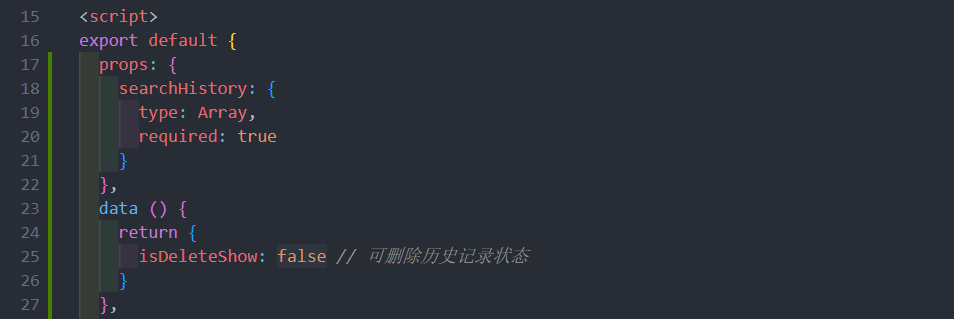
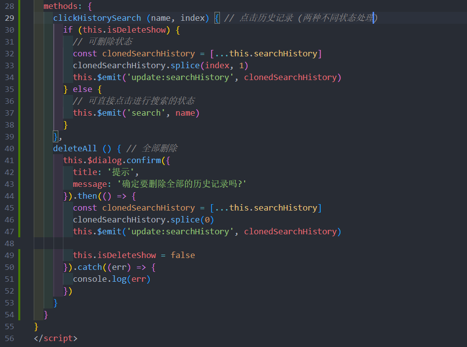

### 6.4 数据持久化
因为在index.vue 主页定义了 searchHistory 数组变量 

1. 可以用 **watch 监听**它的变化, 每当变化时同步到本地存储

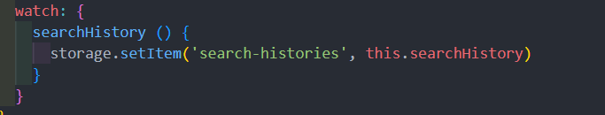

2、初始化的时候从本地存储获取数据

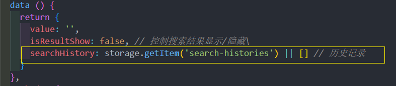