# 首页 - 文章列表
## 1. 头部导航栏 
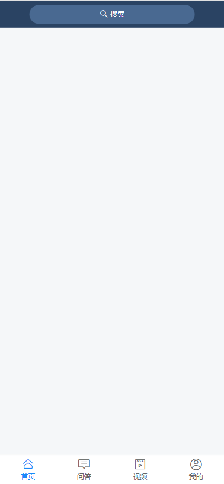

1、使用导航栏组件

2、在导航栏组件中插入按钮

- 文本
- 图标

3、样式调整

- 宽高
- 背景色
- 边框
- 文本大小
- 图标大小

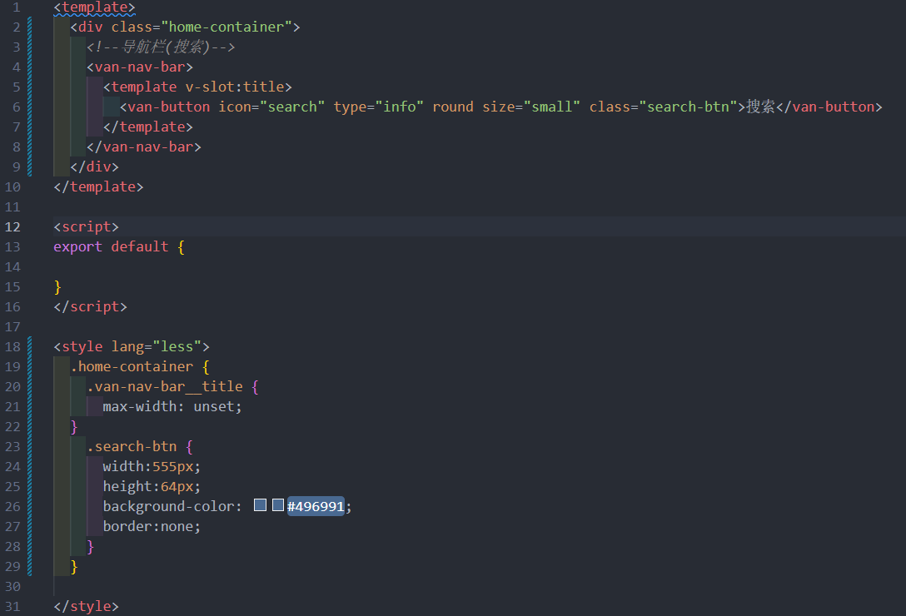
## 2. 频道列表 
### 2.1 使用 Tab 标签页组件
参考：[Tab 标签页组件](https://youzan.github.io/vant/#/zh-CN/tab)

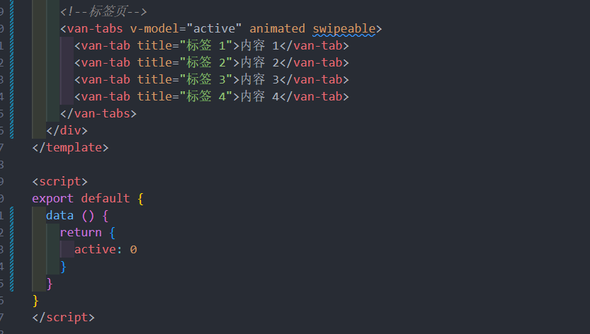
### 2.2 样式调整
（1）**基础样式调整**

- 标签项
  - 右边框
  - 下边框
  - 宽高
  - 文字大小
  - 文字颜色
- 底部条
  - 宽高
  - 颜色
  - 位置

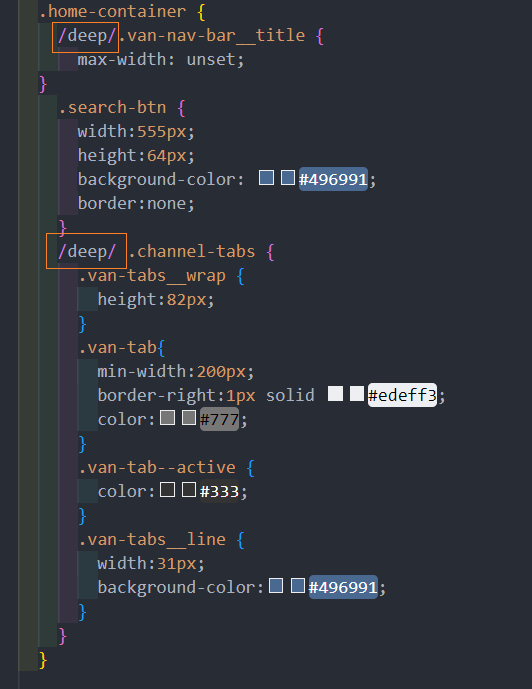

（2）**处理汉堡按钮**

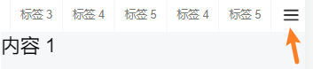

1、使用插槽插入内容

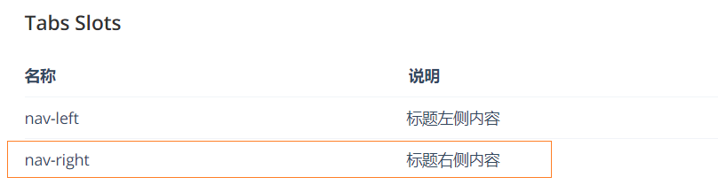

2、样式调整

- 定位
- 内容居中
- 宽高
- 背景色、透明度
- 字体图标大小

3、使用伪元素设置渐变边框

- 定位
- 宽高
- 背景图
- 背景图填充模式

4、添加占位符充当内容区域

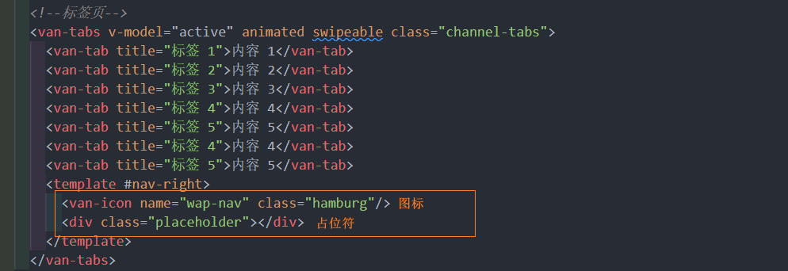
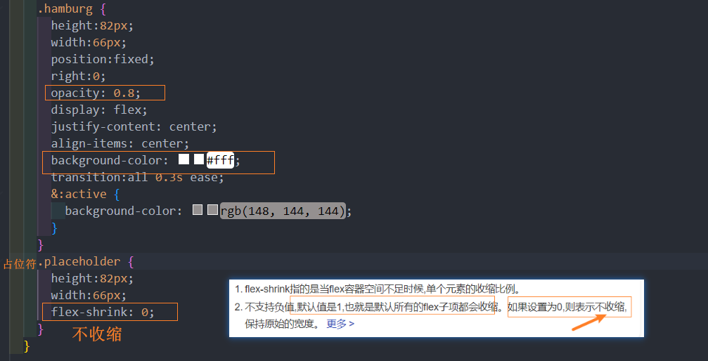
### 2.3 展示频道列表 
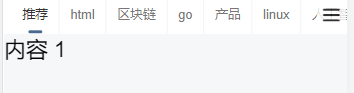

1. 封装请求  src/api/user.js 
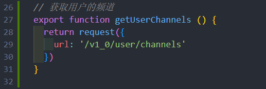

2. 调接口, 绑定数据 
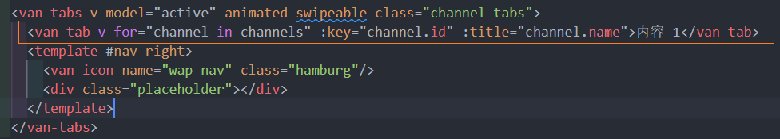
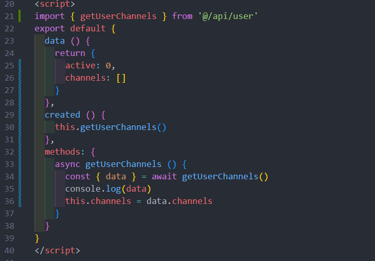
## 3. 文章列表 
### 3.1 思路分析 
思路**可能**是这样的：

1、找到数据接口
2、封装请求方法
3、在组件中请求获取数据，将数据存储到 data 中
4、模板绑定展示


根据不同的频道加载不同的文章列表，思路可能是这样的：

- 有一个 `list` 数组，用来存储文章列表
- 查看 `a` 频道：请求获取数据，让 `list = a` 频道文章
- 查看 `b` 频道：请求获取数据，让 `list = b` 频道文章
- 查看 `c` 频道：请求获取数据，让 `list = c` 频道文章
- ...

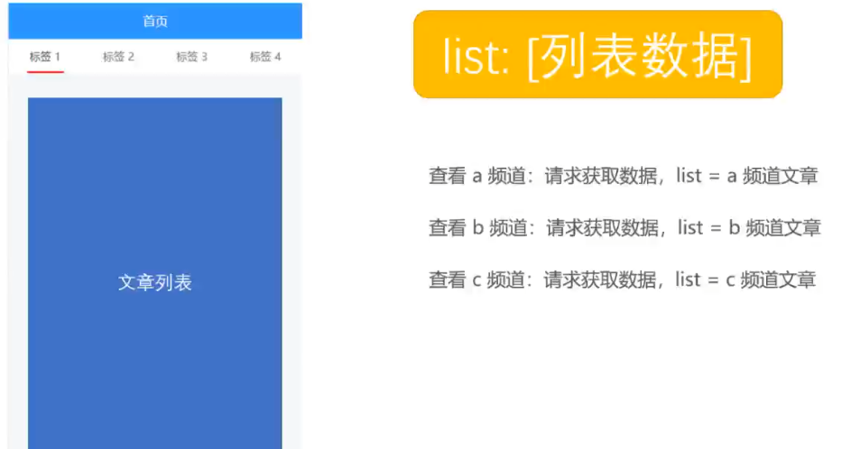

思路没有问题，但是并不是我们想要的效果。

现在想要的效果是：**加载过的数据列表不要重新加载**。


实现思路也非常简单，就是准备**多个 list 数组，每个频道对应一个，查看哪个频道就把数据往哪个频道的列表数组中存放，这样的话就不会导致覆盖问题**。

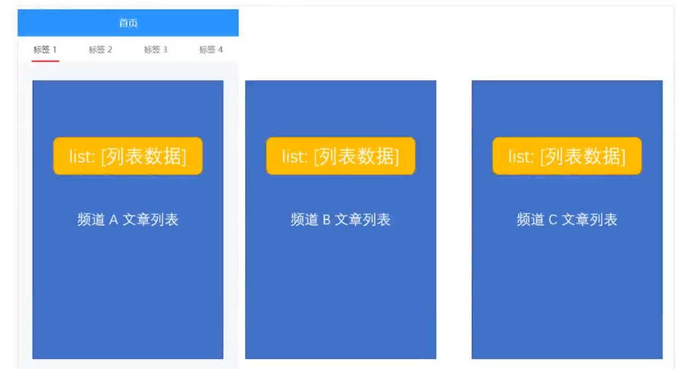


可是有多少频道就得有多少频道文章数组，都一个一个声明的话会非常麻烦，所以这里的建议是利用组件来处理

具体做法就是：

- 封装一个文章列表组件
- 然后在频道列表中把文章列表遍历出来

**因为文章列表组件中请求获取文章列表数据需要频道 id，所以 频道 id 应该作为 props 参数传递给文章列表组件，为了方便，我们直接把频道对象传递给文章列表组件就可以了。**

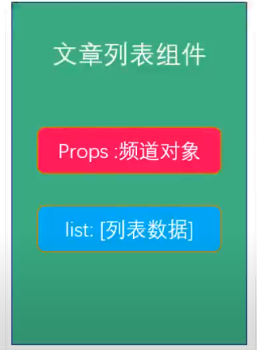

在文章列表中请求获取对应的列表数据，展示到列表中。

最后把组件在频道列表中遍历出来

1. 创建文章列表组件 src/home/components/article-list.vue 
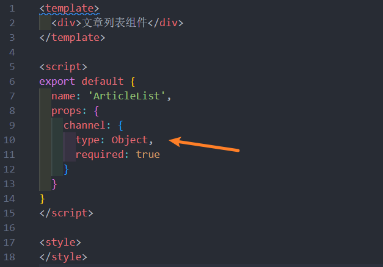

2. 在 `home/index.vue` 中注册使用
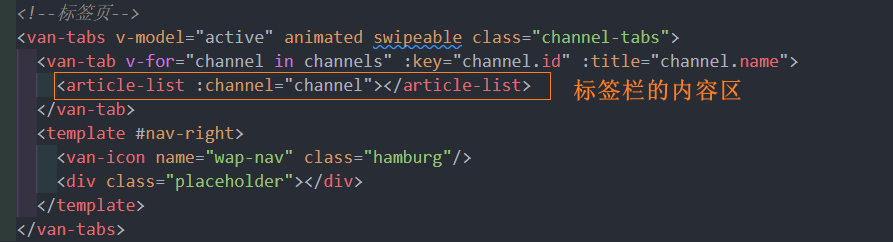
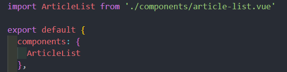

为什么标签内容是**懒渲染**的？

- 因为这是 Tab 标签页组件本身支持的默认功能，如果不需要可以通过配置 `:lazy-render="false"` 来关闭这个效果

### 3.2 使用 List 列表组件
[List 列表组件](https://youzan.github.io/vant/#/zh-CN/list)：瀑布流滚动加载，用于展示长列表。

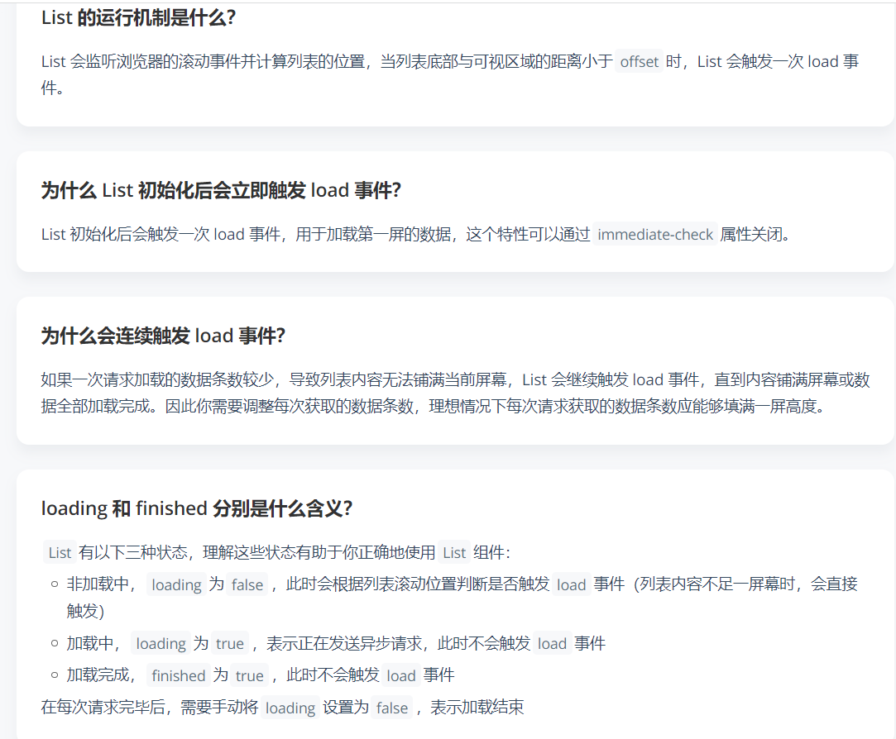
List 组件通过 loading 和 finished 两个变量控制加载状态，
当组件初始化或滚动到到底部时，会触发 load 事件并将 loading 设置成 true，此时可以发起异步操作并更新数据，数据更新完毕后，将 loading 设置成 false 即可。
若数据已全部加载完毕，则直接将 finished 设置成 true 即可。

- `load 事件`：
  - List 初始化后会触发一次 load 事件，用于加载第一屏的数据。
  - 如果一次请求加载的数据条数较少，导致列表内容无法铺满当前屏幕，List 会继续触发 load 事件，直到内容铺满屏幕或数据全部加载完成。
- `loading 属性`：控制加载中的 loading 状态
  - 非加载中，loading 为 false，此时会根据列表滚动位置判断是否触发 load 事件（列表内容不足一屏幕时，会直接触发）
  - 加载中，loading 为 true，表示正在发送异步请求，此时不会触发 load 事件
- `finished 属性`：控制加载结束的状态
  - 在每次请求完毕后，需要手动将 loading 设置为 false，表示本次加载结束
  - 所有数据加载结束，finished 为 true，此时不会触发 load 事件

```vue
<template>
  <div class="article-list">
    <!--
      List 列表组件：瀑布流滚动加载，用于展示长列表。

      List 组件通过 loading 和 finished 两个变量控制加载状态，
      当组件初始化或滚动到到底部时，会触发 load 事件并将 loading 自动设置成 true，此时可以发起异步操作并更新数据，
      数据更新完毕后，将 loading 设置成 false 即可。
      若数据已全部加载完毕，则直接将 finished 设置成 true 即可。

      - load 事件：
        + List 初始化后会触发一次 load 事件，用于加载第一屏的数据。
        + 如果一次请求加载的数据条数较少，导致列表内容无法铺满当前屏幕，List 会继续触发 load 事件，直到内容铺满屏幕或数据全部加载完成。

      - loading 属性：控制加载中的 loading 状态
        + 非加载中，loading 为 false，此时会根据列表滚动位置判断是否触发 load 事件（列表内容不足一屏幕时，会直接触发）
        + 加载中，loading 为 true，表示正在发送异步请求，此时不会触发 load 事件

      - finished 属性：控制加载结束的状态
        + 在每次请求完毕后，需要手动将 loading 设置为 false，表示本次加载结束
        + 所有数据加载结束，finished 为 true，此时不会触发 load 事件
     -->
    <van-list
      v-model="loading"
      :finished="finished"
      finished-text="没有更多了"
      @load="onLoad"
    >
      <van-cell v-for="item in list" :key="item" :title="item" />
    </van-list>
  </div>
</template>

<script>
export default {
  name: 'ArticleList',
  components: {},
  props: {
    channel: {
      type: Object,
      required: true
    }
  },
  data () {
    return {
      list: [], // 存储列表数据的数组
      loading: false, // 控制加载中 loading 状态
      finished: false // 控制数据加载结束的状态
    }
  },
  computed: {},
  watch: {},
  created () {},
  mounted () {},
  methods: {
    // 初始化或滚动到底部的时候会触发调用 onLoad
    onLoad () {
      console.log('onLoad')
      // 1. 请求获取数据
      // setTimeout 仅做示例，真实场景中一般为 ajax 请求
      setTimeout(() => {
        // 2. 把请求结果数据放到 list 数组中
        for (let i = 0; i < 10; i++) {
          // 0 + 1 = 1
          // 1 + 1 = 2
          // 2 + 1 = 3
          this.list.push(this.list.length + 1)
        }

        // 3. 本次数据加载结束之后要把加载状态设置为结束
        //     loading 关闭以后才能触发下一次的加载更多
        this.loading = false

        // 4. 判断数据是否全部加载完成
        if (this.list.length >= 40) {
          // 如果没有数据了，把 finished 设置为 true，之后不再触发加载更多
          this.finished = true
        }
      }, 1000)
    }
  }
}
</script>

<style scoped lang="less"></style>
```

### 3.3 加载文章列表数据
- 封装请求方法
- 请求获取数据
- 模板绑定

1、创建 `src/api/article.js` 封装获取文章列表数据的接口
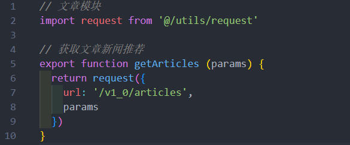
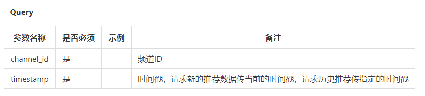
2、然后在首页文章列表组件 `onload` 的时候请求加载文章列表
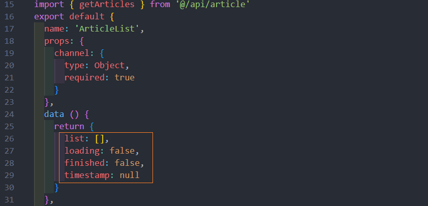
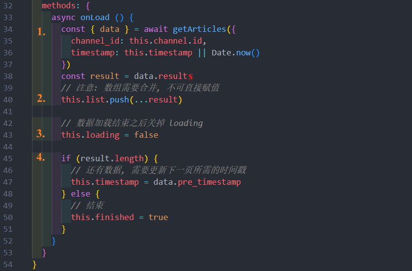

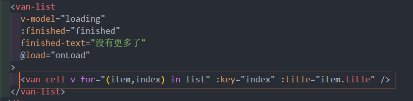
### 3.4 错误提示 
[错误提示](https://vant-ui.github.io/vant/v2/#/zh-CN/list#cuo-wu-ti-shi) 

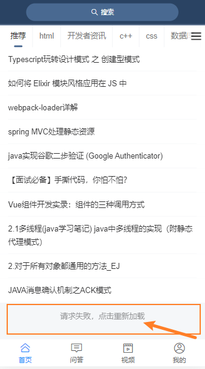
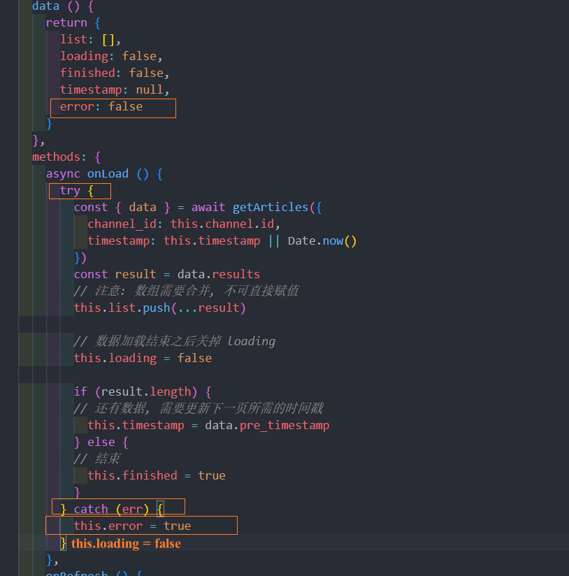
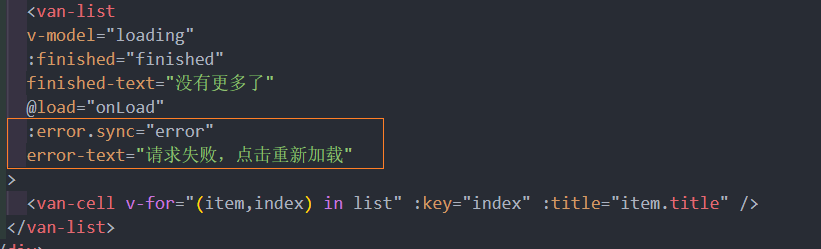

### 3.5 下拉刷新 
[pullRefresh 下拉刷新](https://vant-ui.github.io/vant/v2/#/zh-CN/pull-refresh)

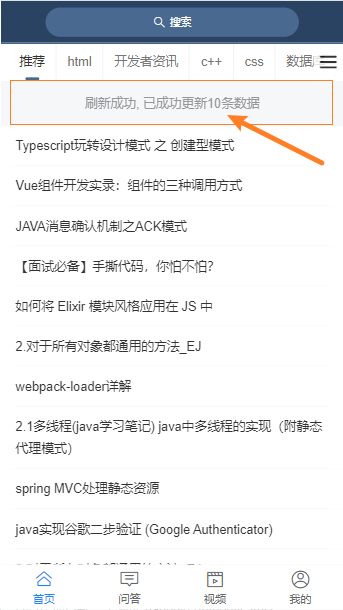

下面直接全部写出了成功提示和错误提示逻辑, 细品
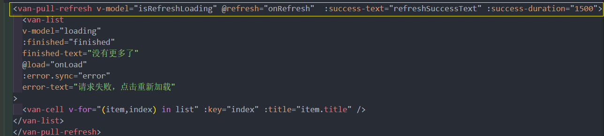
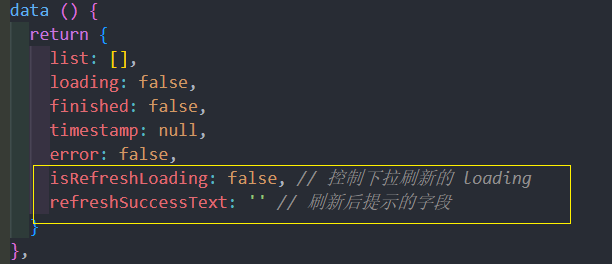
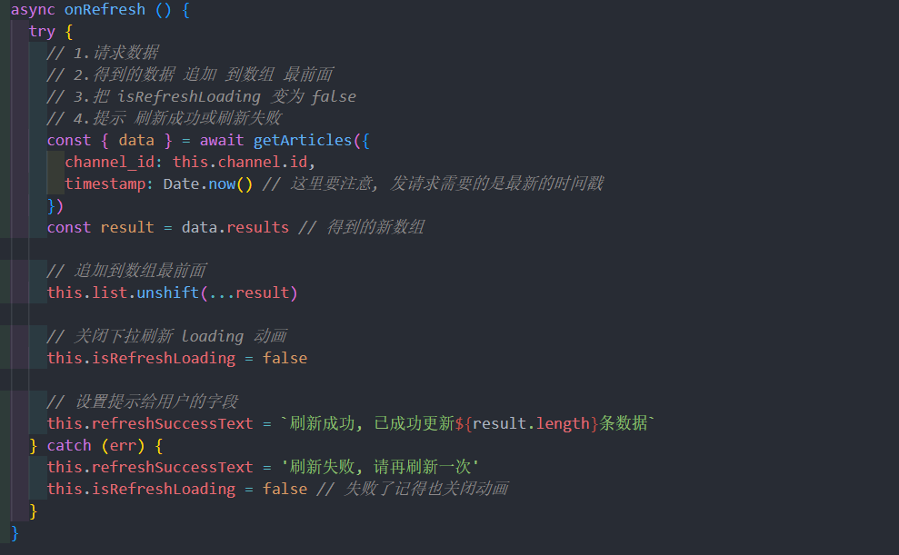
### 3.6 让导航栏在上面固定定位
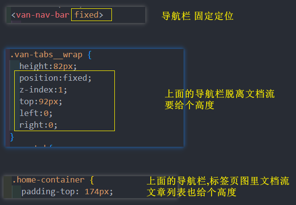
### 3.7 记住列表的滚动位置 
> 为什么列表的滚动会相互影响? 

因为 它们并不是在自己内部滚动, 而是整个body 页面在滚动,
无论是在a频道, 还是在b频道, 其实滚动的都是 body 元素

> 这里有个小技巧 , 如何快速找到那个元素产生的滚动 ? 
把下面的代码复制到调试工具中调用运行一下, 然后滚动各页面, 就可以看到哪个元素产生的滚动了 
```js
function findScroller(element){
  element.onscroll = function(){console.log(element)}
  Array.from(element.children).forEach(findScroller)
}
findScroller(document.body)
```

> 怎么解决 ? 

**让每一个标签内容列表产生自己的滚动容器, 这样就不会相互影响了** 

如何让标签内容列表产生自己的滚动容器呢 ? 
* 固定容器 : `height: xxx`
* 一处滚动 : `overflow-y:auto`

然后给文章列表组件的根节点样式设置如下 
```css
.article-list {
  height:100%;
  overflow-y:auto;
}
```

但是会发现设置高 **`100%`**的话没有作用, 这是为什么 ? 

*因为**百分比是相对于父元素的**, 而通过审查父元素发现它所有的父元素都没有高, 那坑定就没有作用了*

解决办法来了 : CSS3新增了一种视口单位 **`vw`** 和 **`vh`**, 就是根据浏览及窗口的大小的单位, **不受父元素的影响**
* 1vw = 可视窗口的宽度的百分之一. 比如窗口宽度为750, 则 1vw = 7.5px
* 1vh = 可视窗口的高度的百分之一. 比如窗口高度为667, 则 1vw = 6.67px

唯一需要关系的是兼容性, 但无需在意, 可以大胆去用 

所以设置代码如下 
```css
.article-list{
  height:79vh;
  overflow-y:auto;
}
```
## 4. 文章列表项
### 4.1 准备组件
项目中有好几个页面中都有这个文章列表项内容，如果在每个页面中都写一次的话不仅效率低而且维护起来也麻烦。所以最好的办法就是把它封装为一个组件，然后在需要使用的组件中加载使用即可

1、创建 `src/components/article-item/index.vue` 组件
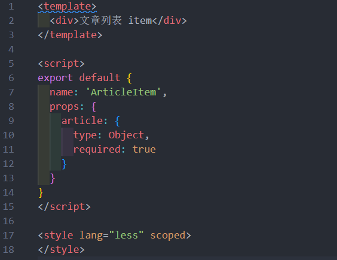
2、在文章列表组件中注册使用文章列表项组件 src/views/home/components/article-list.vue
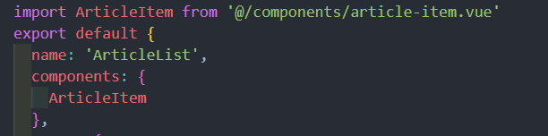
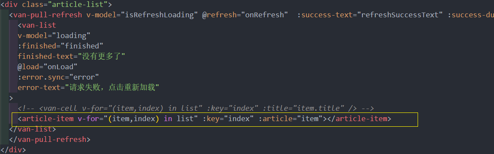

### 4.2 展示其内容
- 使用 [Cell 单元](https://vant-ui.github.io/vant/v2/#/zh-CN/cell)格组件
- 展示标题
- 展示底部信息

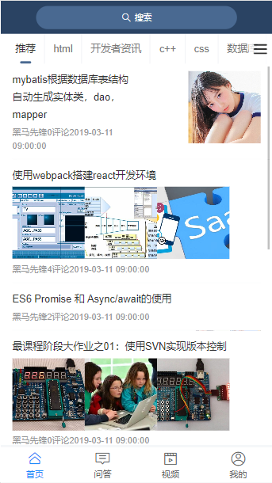
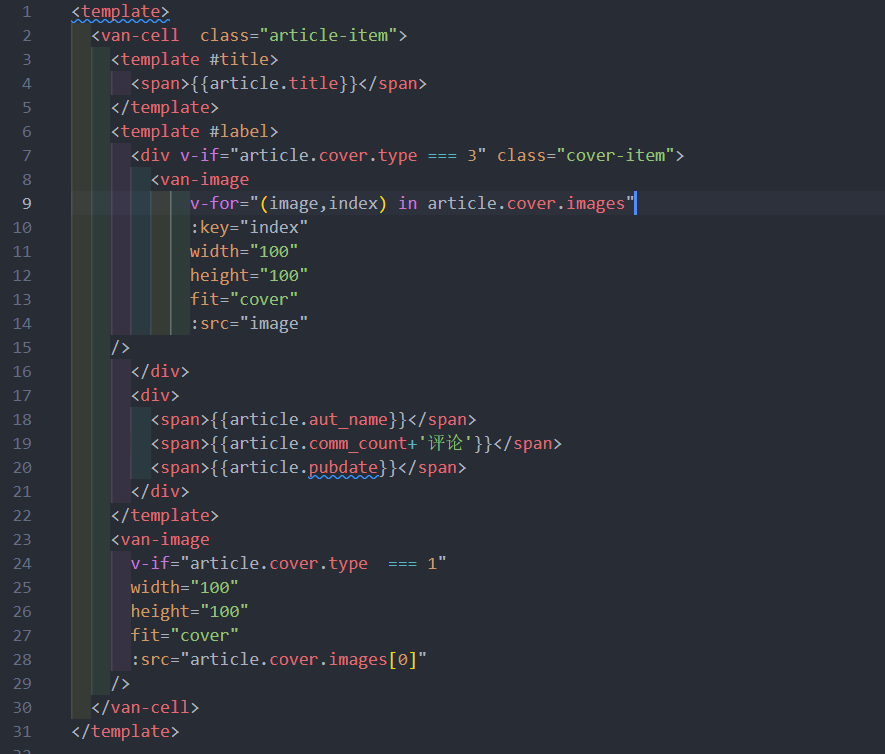
### 4.3 样式调整
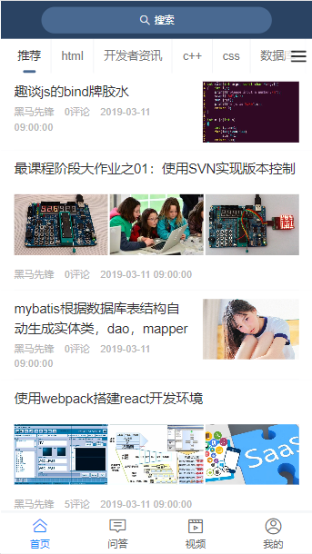
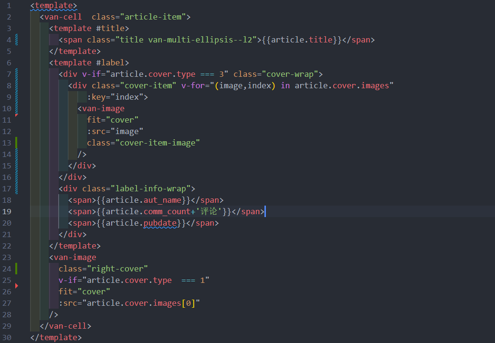
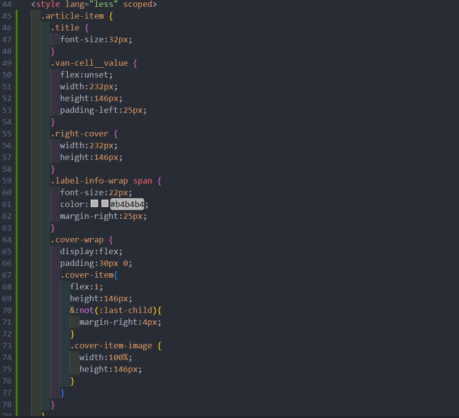
### 4.4 图片资源 403 问题
为什么文章列表数据中的好多图片资源请求失败返回 403？

```
这是因为我们项目的接口数据是后端通过爬虫抓取的第三方平台内容，而第三方平台对图片资源做了防盗链保护处理。

```


第三方平台怎么处理图片资源保护的？

```
服务端一般使用 Referer 请求头识别访问来源，然后处理资源访问。

```
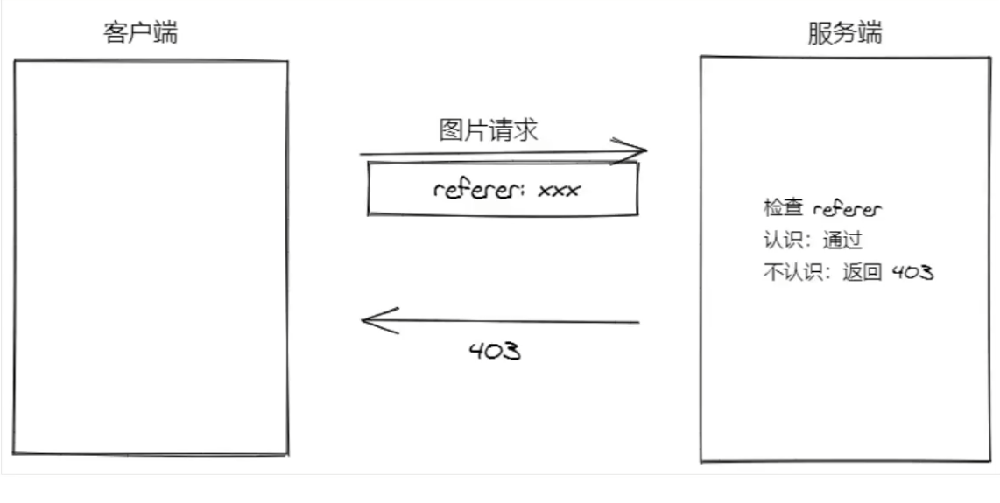

Referer 是什么东西？

> 扩展参考：http://www.ruanyifeng.com/blog/2019/06/http-referer.html

```
Referer 是 HTTP 请求头的一部分，当浏览器向 Web 服务器发送请求的时候，一般会带上 Referer，它包含了当前请求资源的来源页面的地址。服务端一般使用 Referer 请求头识别访问来源，可能会以此进行统计分析、日志记录以及缓存优化等。
```

> 需要注意的是 referer 实际上是 "referrer" 误拼写。参见 [HTTP referer on Wikipedia](https://zh.wikipedia.org/wiki/HTTP_referer) （HTTP referer 在维基百科上的条目）来获取更详细的信息。


怎么解决？

```
不要发送 referrer ，对方服务端就不知道你从哪来的了，姑且认为是你是自己人吧。

```

如何设置不发送 referrer？

用 `<a>`、`<area>`、``、`<iframe>`、`<script>` 或者 `<link>` 元素上的 `referrerpolicy` 属性为其设置独立的请求策略，例如：

```html


```

或者直接在 HTMl 页面头中通过 meta 属性全局配置：

```html
<meta name="referrer" content="no-referrer" />

```

### 4.5 处理相对时间
推荐两个第三方库：

- [Moment.js](https://momentjs.com/)
- [Day.js](https://day.js.org/)

两者都是专门用于处理时间的 JavaScript 库，功能差不多，因为 Day.js 的设计就是参考的 Moment.js。但是 Day.js 相比 Moment.js 的包体积要更小一些，因为它采用了插件化的处理方式。  

1、安装

```sh
npm i dayjs

```

2、创建 `utils/dayjs.js`

```js
import Vue from 'vue'
import dayjs from 'dayjs'

// 加载中文语言包
import 'dayjs/locale/zh-cn'

import relativeTime from 'dayjs/plugin/relativeTime'

// 配置使用处理相对时间的插件
dayjs.extend(relativeTime)

// 配置使用中文语言包
dayjs.locale('zh-cn')

// 全局过滤器：处理相对时间
// 参数一 : 过滤器名称
// 参数二 : 过滤器函数 
// 前面的表达式的结果会以过滤器函数的参数传递给函数
// 返回值会显示给模板
Vue.filter('relativeTime', value => {
  return dayjs().to(dayjs(value))
})

```

3、在 `main.js` 中加载初始化

```js
import './utils/dayjs'
```

4、使用

使用过滤器：

```html
<p>{{ 日期数据 | relativeTime }}</p>
```


