# 文章详情 
## 1. 创建组件并配置路由


1、创建 `views/article/index.vue` 组件
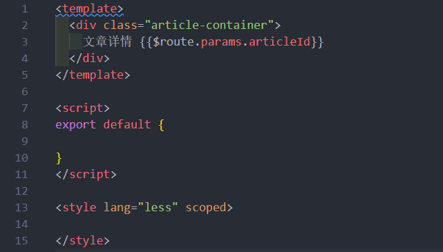

2、然后将该页面配置到根级路由
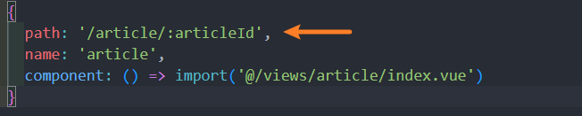

3. 点击某一项是进入详情页面 

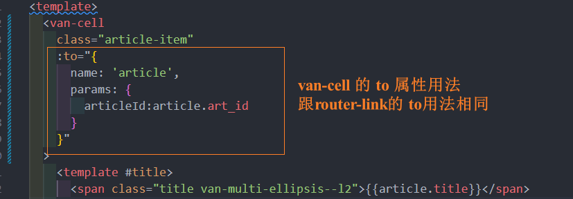
### 使用组件 props 解耦路由参数
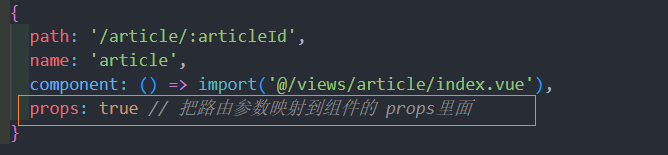
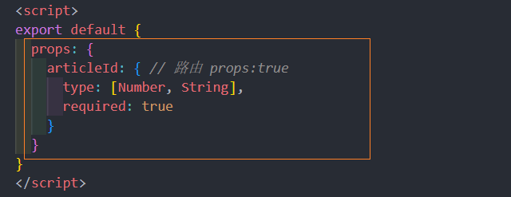
注意类型 : 可能是数字, 也可能是字符串
> 官方文档：[路由 props 传参](https://router.vuejs.org/zh/guide/essentials/passing-props.html)

## 2. 页面布局
使用到的 Vant 中的组件：

- [NavBar 导航栏](https://youzan.github.io/vant/#/zh-CN/nav-bar)
- [Loading 加载](https://youzan.github.io/vant/#/zh-CN/loading)
- [Cell 单元格](https://youzan.github.io/vant/#/zh-CN/cell)
- [Button 按钮](https://youzan.github.io/vant/#/zh-CN/button)
- [Image 图片](https://youzan.github.io/vant/#/zh-CN/image)
- [Divider 分割线](https://youzan.github.io/vant/#/zh-CN/divider)
- [Icon 图标](https://youzan.github.io/vant/#/zh-CN/icon)

## 3. 关于后端返回数据中的大数据问题
之所以请求文章详情返回 404 是因为我们请求发送的文章 ID （article.art_id）不正确。

JavaScript 能够准确表示的整数范围在`-2^53`到`2^53`之间（不含两个端点），超过这个范围，无法精确表示这个值，这使得 JavaScript 不适合进行科学和金融方面的精确计算。

```javascript
Math.pow(2, 53) // 9007199254740992

9007199254740992  // 9007199254740992
9007199254740993  // 9007199254740992

Math.pow(2, 53) === Math.pow(2, 53) + 1
// true
```

上面代码中，超出 2 的 53 次方之后，一个数就不精确了。
ES6 引入了`Number.MAX_SAFE_INTEGER`和`Number.MIN_SAFE_INTEGER`这两个常量，用来表示这个范围的上下限。

```javascript
Number.MAX_SAFE_INTEGER === Math.pow(2, 53) - 1
// true
Number.MAX_SAFE_INTEGER === 9007199254740991
// true

Number.MIN_SAFE_INTEGER === -Number.MAX_SAFE_INTEGER
// true
Number.MIN_SAFE_INTEGER === -9007199254740991
// true
```

上面代码中，可以看到 JavaScript 能够精确表示的极限。

后端返回的数据一般都是 **JSON 格式的字符串**。

```json
'{ "id": 9007199254740995, "name": "Jack", "age": 18 }'
```

如果这个字符不做任何处理，你能方便的获取到字符串中的指定数据吗？非常麻烦。所以我们要把它转换为 JavaScript 对象来使用就很方便了。

幸运的是 axios 为了方便我们使用数据，它会在内部使用 `JSON.parse()` 把后端返回的数据转为 JavaScript 对象。

```javascript
// { id: 9007199254740996, name: 'Jack', age: 18 }
JSON.parse('{ "id": 9007199254740995, "name": "Jack", "age": 18 }')
```

可以看到，超出安全整数范围的 id 无法精确表示，这个问题并不是 axios 的错。

了解了什么是大整数的概念，接下来的问题是如何解决？

[json-bigint](https://github.com/sidorares/json-bigint) 是一个第三方包，它可以帮我们很好的处理这个问题。

使用它的第一步就是把它安装到你的项目中。

```shell
npm i json-bigint
```

下面是使用它的一个简单示例。

```javascript
const jsonStr = '{ "art_id": 1245953273786007552 }'

console.log(JSON.parse(jsonStr)) // 1245953273786007600
// JSON.stringify()

// JSONBig 可以处理数据中超出 JavaScript 安全整数范围的问题
console.log(JSONBig.parse(jsonStr)) // 把 JSON 格式的字符串转为 JavaScript 对象

// 使用的时候需要把 BigNumber 类型的数据转为字符串来使用
console.log(JSONBig.parse(jsonStr).art_id.toString()) // 1245953273786007552

console.log(JSON.stringify(JSONBig.parse(jsonStr)))

console.log(JSONBig.stringify(JSONBig.parse(jsonStr))) // 把 JavaScript 对象 转为 JSON 格式的字符串转
```


> json-bigint 会把超出 JS 安全整数范围的数字转为一个 BigNumber 类型的对象，对象数据是它内部的一个算法处理之后的，我们要做的就是在使用的时候转为字符串来使用。

通过 Axios 请求得到的数据都是 Axios 处理（JSON.parse）之后的，我们应该在 Axios 执行处理之前手动使用 json-bigint 来解析处理。Axios 提供了自定义处理原始后端返回数据的 API：`transformResponse` 。

```javascript
import axios from 'axios'

import jsonBig from 'json-bigint'

var json = '{ "value" : 9223372036854775807, "v2": 123 }'

console.log(jsonBig.parse(json))

const request = axios.create({
  baseURL: 'http://ttapi.research.itcast.cn/', // 接口基础路径

  // transformResponse 允许自定义原始的响应数据（字符串）
  transformResponse: [function (data) {
    try {
      // 如果转换成功则返回转换的数据结果
      return jsonBig.parse(data)
    } catch (err) {
      // 如果转换失败，则包装为统一数据格式并返回
      return {
        data
      }
    }
  }]
})

export default request

```

> 扩展：ES2020 BigInt
>
> ES2020 引入了一种新的数据类型 BigInt（大整数），来解决这个问题。BigInt 只用来表示整数，没有位数的限制，任何位数的整数都可以精确表示。
>
> 参考链接：
>
> - [https://developer.mozilla.org/zh-CN/docs/Web/JavaScript/Reference/Global_Objects/BigInt](https://developer.mozilla.org/zh-CN/docs/Web/JavaScript/Reference/Global_Objects/BigInt)
> - [http://es6.ruanyifeng.com/#docs/number#BigInt-%E6%95%B0%E6%8D%AE%E7%B1%BB%E5%9E%8B](

## 4. 展示文章详情
思路：

- 找到数据接口
- 封装请求方法
- 请求获取数据
- 模板绑定

1、在 `api/article.js` 中新增封装接口方法
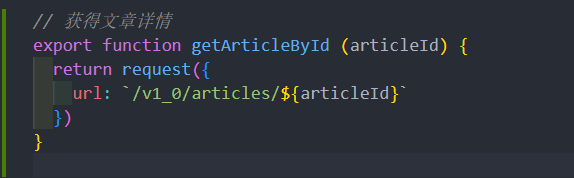

2、在组件中调用获取文章详情
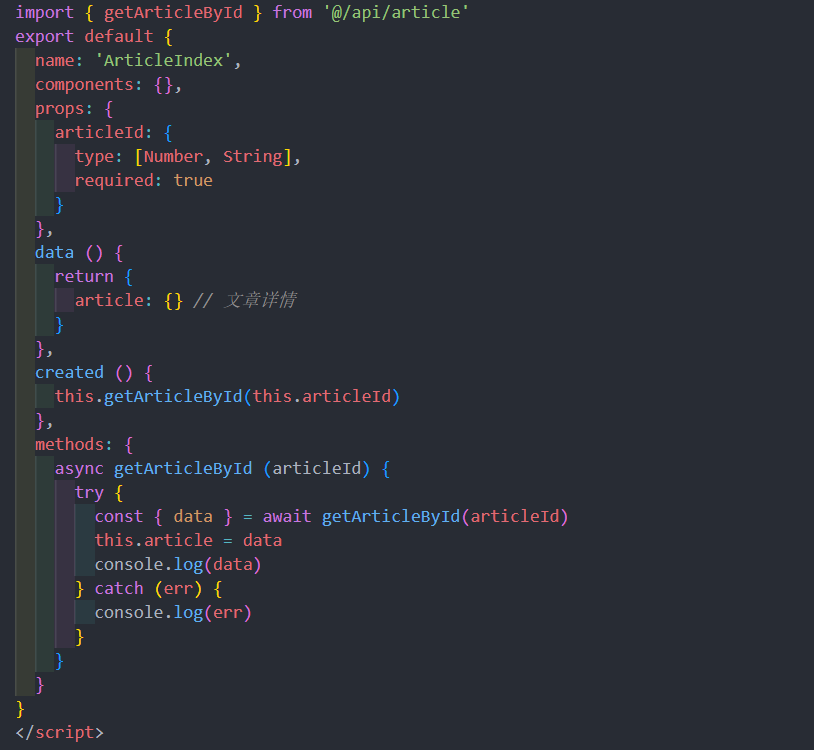

3. 绑定模板
## 5. 处理内容加载状态  
需求：

- 加载中，显示 loading
- 加载成功，显示文章详情
- 加载失败，显示错误提示
  - 如果 404，提示资源不存在
  - 其它的，提示加载失败，用户可以点击重试重新加载

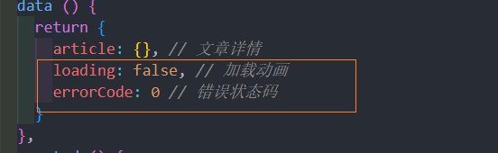
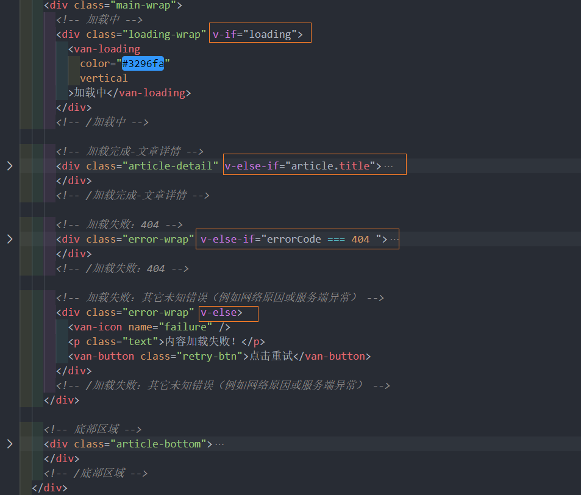
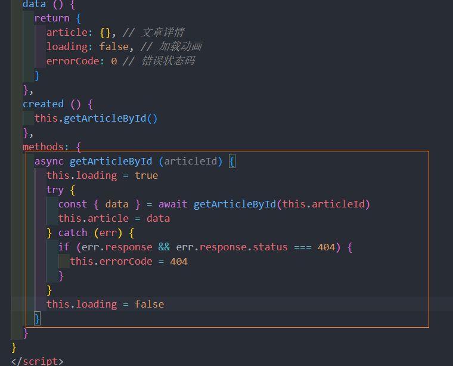

并且需要注意的是 axios 响应拦截器里面要返回 Promise.reject(err) 才能拿到 err.response 对象
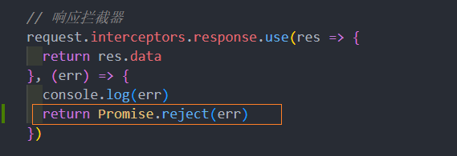
## 6. 关于正文的样式
文章正文包括各种数据：段落、标题、列表、链接、图片、视频等资源。

- 将 [github-markdown-css](https://github.com/sindresorhus/github-markdown-css) 样式文件下载到项目中
- 配置不要转换样式文件中的字号


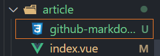

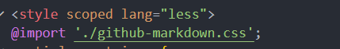
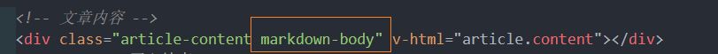
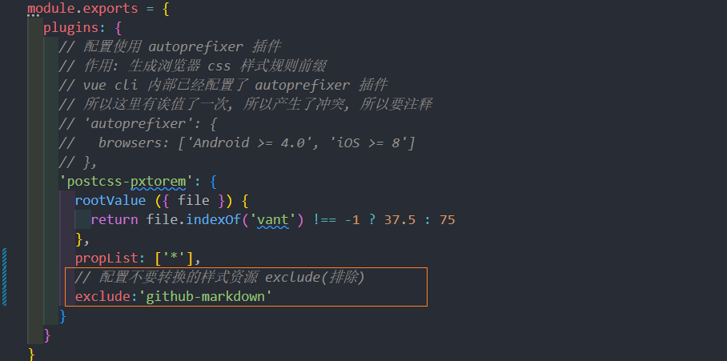
## 7. 点击图片预览

一、[ImagePreview 图片预览](https://youzan.github.io/vant/#/zh-CN/image-preview) 的使用

二、处理图片点击预览

思路：

1、从文章内容中**获取到所有的 img DOM 节点**

2、获取文章内容中**所有的图片地址**

3、**遍历**所有 img 节点，给每个节点**注册点击事件**

4、在 img 点击事件处理函数中，**调用 ImagePreview 预览**

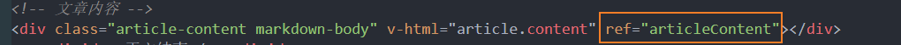

上面使用到了ref , 拿到 dom 节点, 所以要确保数据已经更新, 所以使用到了异步 setTimeout 
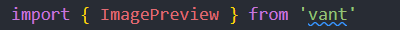
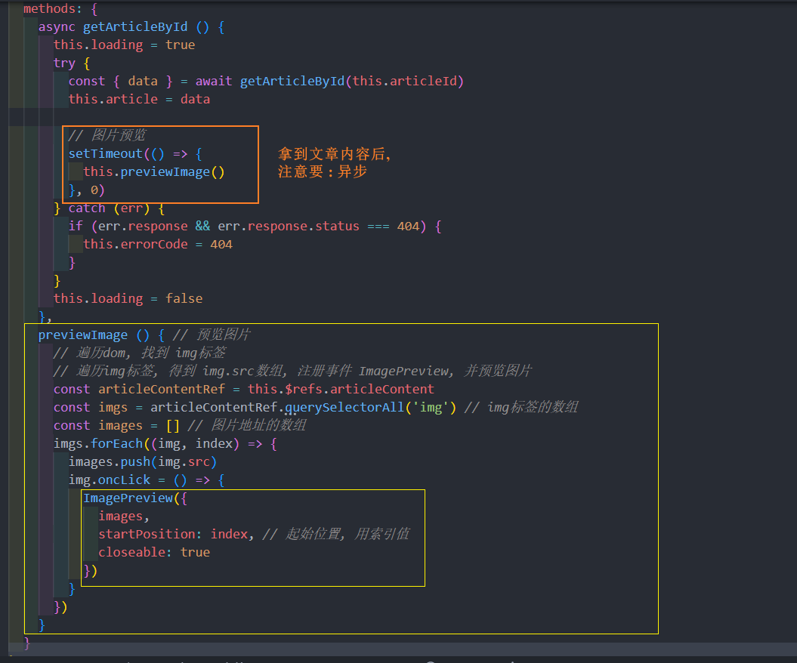

## 8. 关注用户 
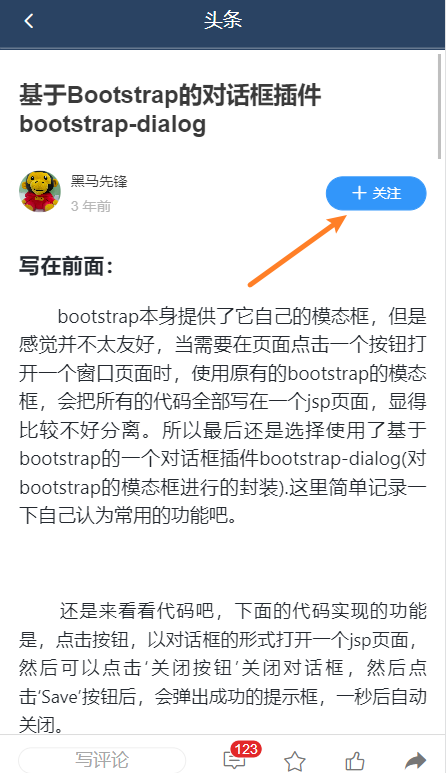
### 8.1 视图处理 
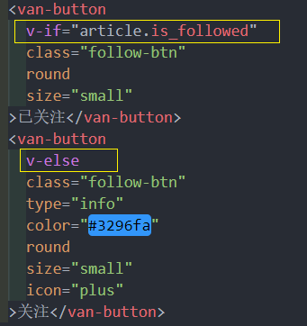
### 8.2 功能处理
- 找到数据接口
- 封装请求方法
- 请求调用
- 视图更新

1、在 `api/user.js` 中添加封装请求方法
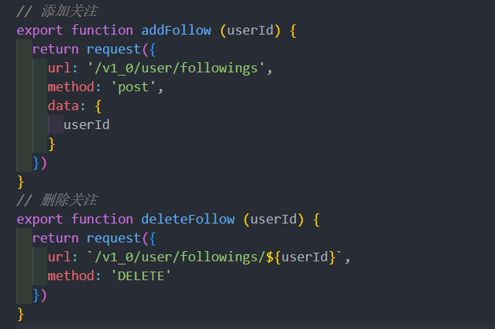

2、在事件处理函数中
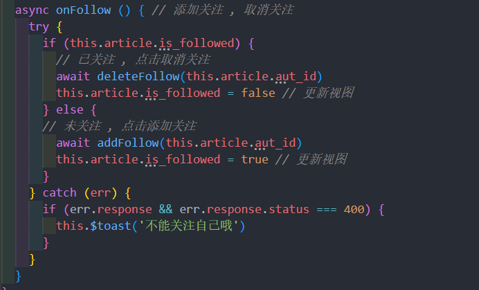

2、给关注/取消关注按钮注册点击事件
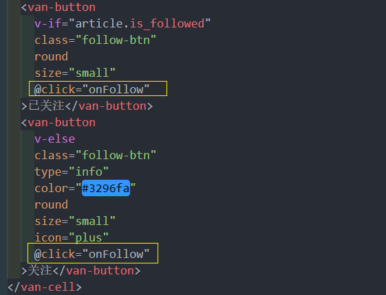


### 8.3 按钮 loading 效果
两个作用：

- 交互反馈
- 防止网络慢用户多次点击按钮导致重复触发点击事件

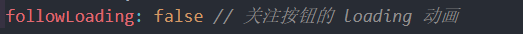
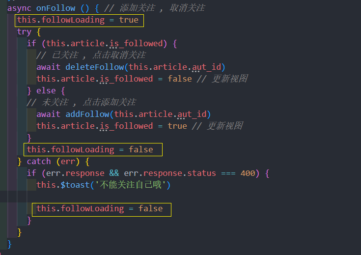
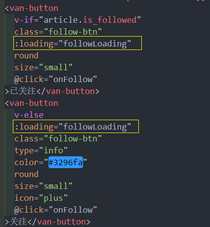
### 8.4 封装成组件
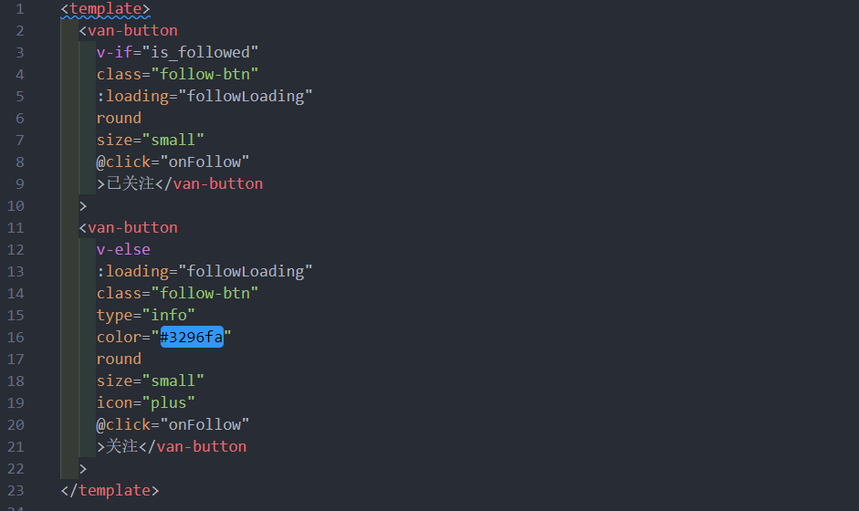
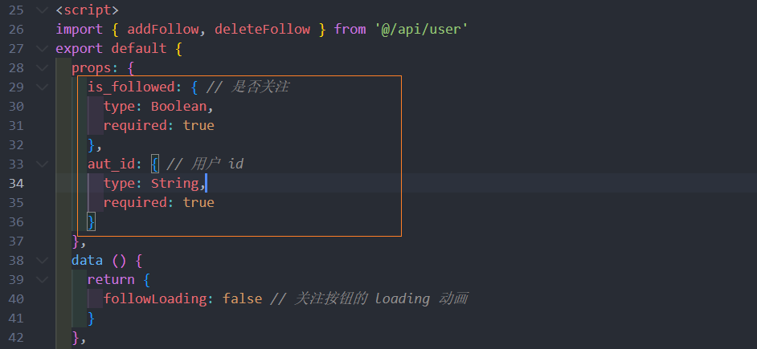
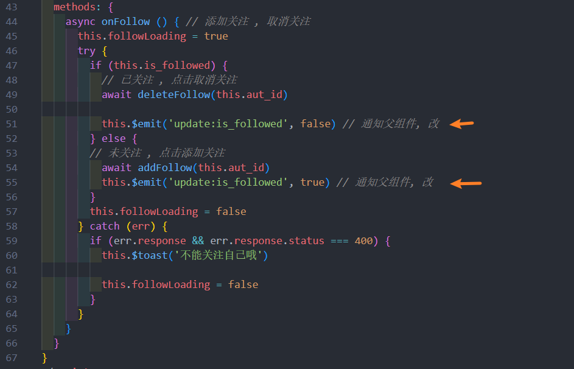
注意组组件中药添加 **.sync** 操作符
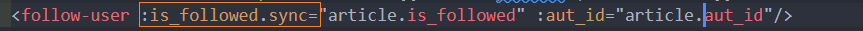

## 9. 文章收藏 
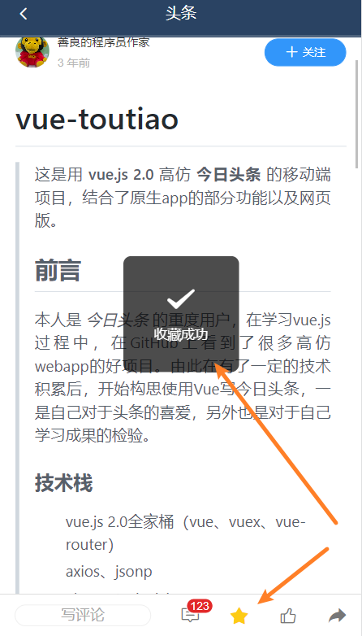 
点击收藏功能也封装成一个组件
### 9.1 准备组件 
创建组件 **src/components/collect-article.vue**
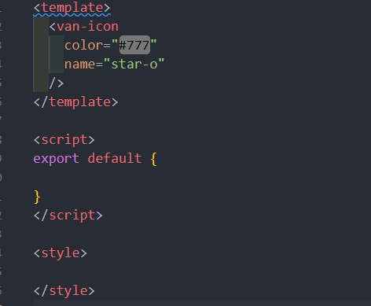

### 9.2 完成功能
封装 文章收藏/取消收藏 接口 src/api/article.js 
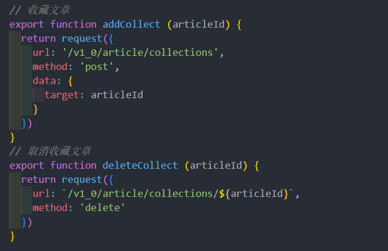 

处理视口
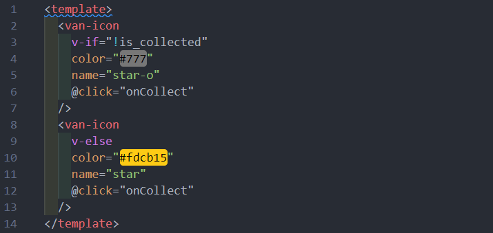 
props 要传进来 is_collected 状态和 articleId 文章的 id

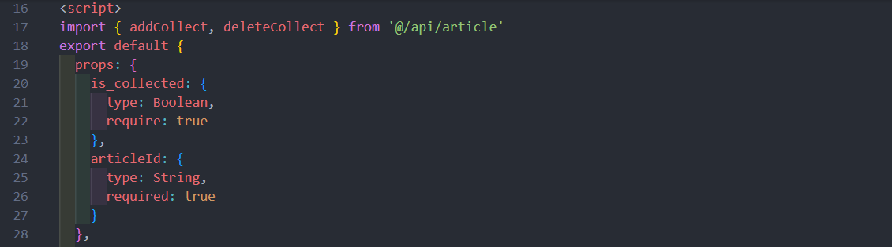 
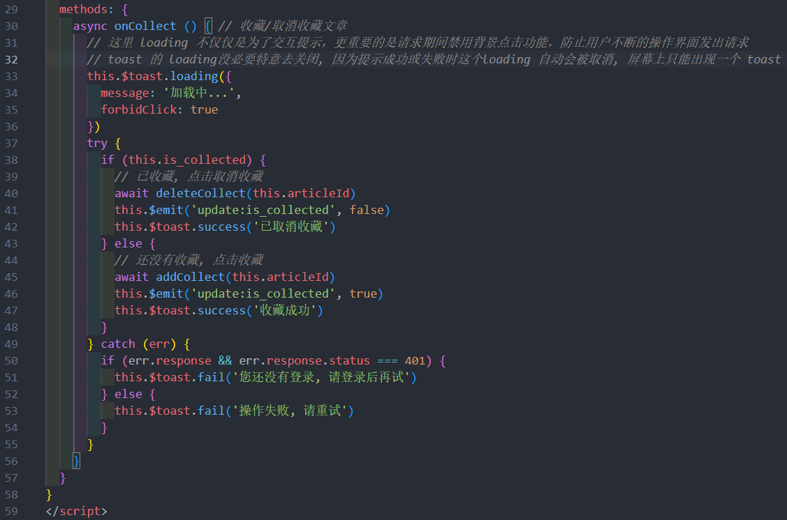 
注意: 父组件上用 .sync 修饰符
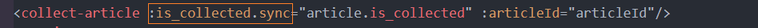 

## 10. 文章点赞
> 跟上面逻辑一样, 封装一个组件, 直接写完代码 

article 中的 `attitude` 表示用户对文章的态度

- `-1` 无态度
- `0` 不喜欢
- `1` 已点赞

思路：

- 给点赞按钮注册点击事件
- 如果已经点赞，则请求取消点赞
- 如果没有点赞，则请求点赞


1. 封装接口
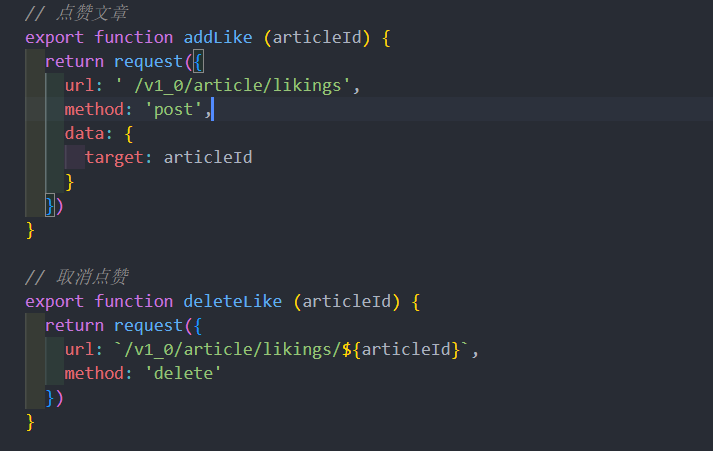
2.

3.

4.
