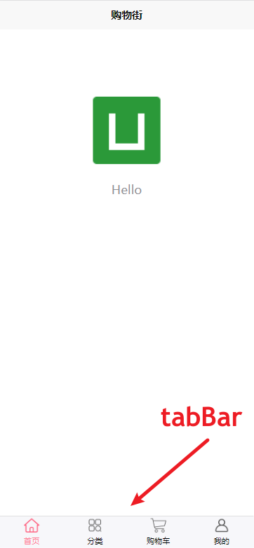
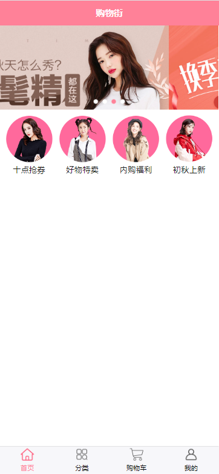
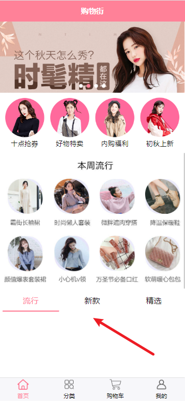
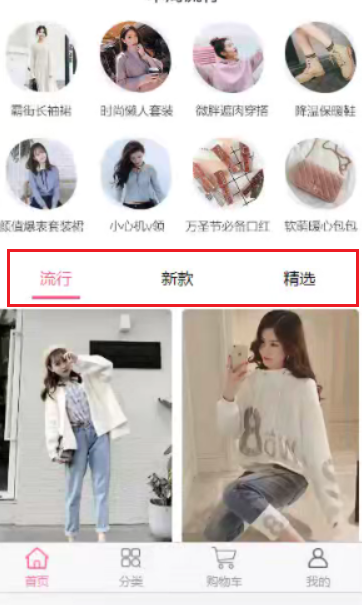
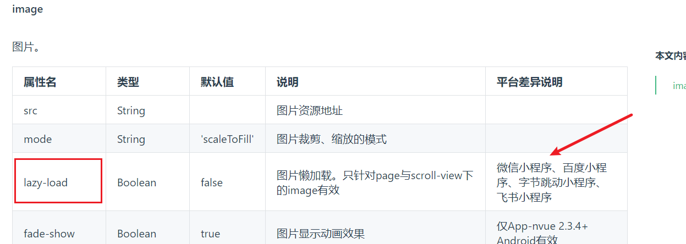

# 购物街项目
## 创建项目 
```
static
  |-- images 图片文件
style
  |-- global.scss 自定义的变量
```
在 `uni.scss` 文件中 引入一下 `global.scss`
```scss
@import '@/static/styles/global.scss'
```

### **配置 `tabBar`**

`pages.json`
```json
...
{
  "tabBar": {
    "color": "black",
    "selectedColor": "#ff8198",
    "list": [
       {
         "text": "首页",
          "pagePath": "pages/home/home",
          "iconPath": "static/images/tabbar/home.png",
          "selectedIconPath": "static/images/tabbar/home_active.png"
       },
       {
         "text": "分类",
          "pagePath": "pages/category/category",
          "iconPath": "static/images/tabbar/category.png",
          "selectedIconPath": "static/images/tabbar/category_active.png"
       },
       {
         "text": "购物车",
          "pagePath": "pages/cart/cart",
          "iconPath": "static/images/tabbar/cart.png",
          "selectedIconPath": "static/images/tabbar/cart_active.png"
       },
       {
         "text": "我的",
          "pagePath": "pages/profile/profile",
          "iconPath": "static/images/tabbar/profile.png",
          "selectedIconPath": "static/images/tabbar/profile_active.png"
       }
    ]
    }
}
```


### 封装网络请求\
创建 `service` 目录

`index.js`
```js
const baseURL = 'http://152.136.185.210:7878/api/hy66'
const TIME_OUT = 60000
class HYRequest {
  request(url, method, data){
    return new Promise((resolve, reject) => {
      uni.request({
        url:baseURL + url,
        method: method || 'GET',
        data,
        timeout: TIME_OUT,
        success(res){
          resolve(res.data)
        },
        fail(err){
          reject(err)
        }
      })
    })
  }
  get(url,params){
    return this.request(url, "GET", params)
  }
  post(url, data){
    return this.request(url, "POST", data)
  }
}

export default new HYRequest()
```
`home.js`
```js
import request from './index.js'

export const getHomeMultiData = () => {
  return request.get('/home/multidata')
} 
```

### 配置 Pinia
`main.js` 注册一下 `Pinia`
```js
import { createSSRApp } from 'vue'
import * as Pinia from 'pinia'

export function createApp() {
  const app = createSSRApp(App)
  app.use(Pinia.createPinia())
  return {
    app,
    Pinia
  }
}
```
## 获取首页的数据存储在 Pinia
创建 `store` 目录, 并创建 `home.js` 模块

```
store
  |-- home.js
```
`home.js`
```js
import { defineStore } from 'pinia'
import { getHomeMultiData } from '@/service/home.js'
export const useHome = defineStore('home', {
  state: () =>{
    return {
      // 轮播图列表
      banners:[],
      // 推荐列表
      recommends:[]
    }
  },
  actions:{
    async fetchHomeData(){
      const res = await  getHomeMultiData()
      this.banners = res.data.banner.list || []
      this.recommends = res.data.recommend.list || []
      // console.log(res.data.banner.list)
      // console.log(res.data.recommend.list)
    }
  }
}) 
```
在首页 `onLoad()` 页面的生命周期函数中, 调用对应的获取数据的 `actions`

`home.vue`
```vue
<script setup>
import { onLoad } from '@dcloudio/uni-app'
import {  useHome } from '@/store/home.js'
import { storeToRefs } from 'pinia'

const homeStore = useHome()
const { banners, recommends } = storeToRefs(homeStore)
onLoad(()=>{
  homeStore.fetchHomeData()
})
</script>
```
## 封装轮播图的组件
单独封装一个轮播图组件, 创建轮播图组件 `home-banner.vue`
```
pages 
  |-- home
    |--components
      |-- home-banner.vue
```

`home-banner.vue`
```vue
<template>
  <swiper class="swiper" :indicator-dots="true" indicator-active-color="#ff8198" indicator-color="white"      :autoplay="true" :interval="3000" :duration="1000">
    <template v-for="item in banners" :key="item">
        <swiper-item @click="handleItemClick(item)">
          <image class="image" :src="item.image" mode="widthFix"></image>
        </swiper-item>
    </template>
  </swiper>
</template>

<script setup>
  const props = defineProps({
    banners:{  // 轮播图数据(从首页中传递进来)
      type:Array,
      default:() => ([])
    }
  })

  // 关于轮播图的点击事件不在组件里面处理, 最好统一地在首页中去处理
  // 所以可以触发一个点击事件到首页
  const emits = defineEmits(['itemClick'])
  const handleItemClick = (item) =>{
    emits('itemClick', item.link) // 轮博图 item 的点击事件
  }
</script>
<style lang="scss">
  .swiper {
      .image {
        width:100%;
      }
  }
</style>
```
[swiper](https://uniapp.dcloud.net.cn/component/swiper.html#swiper)

轮播图组件每个 item 项的点击事件并没有直接在当前组件内部去进行了处理, 关于点击事件的话统一地去首页去处理比较好, 方便与维护

所以在点击轮播图项的时候向首页触发了点击事件, 让首页去处理了具体的点击的动作

`home.vue`: 首页中注册引用上面创建的轮播图组件 `home-banner`
```vue
<template>
<view class="content">
  <home-banner :banners="banners" @itemClick="handleItemClick"></home-banner>
</view>
</template>
<script setup>
import { onLoad } from '@dcloudio/uni-app'
import {  useHome } from '@/store/home.js'
import { storeToRefs } from 'pinia'
// 组件
import HomeBanner from './components/home-banner.vue'

const homeStore = useHome()
const { banners, recommends } = storeToRefs(homeStore)
onLoad(()=>{
  homeStore.fetchHomeData()
})

// 监听轮播图项的点击事件
const handleItemClick = (link) => {
  uni.navigateTo({
    url:'/pages/webView/webView?link=' + link // url 拼接字符串传递数据(页面间通讯)
  })
}
</script>
```
在首页监听了轮播图组件内部触发的 `itemClick` 事件, 并点击时跳转到新的 `webView` 页面(处理的是轮播图的点击时跳转页面的事件)

所以创建新的页面 `webView` 
```
pages
  |-- webView
    |-- webView.vue
```
`webView.vue`
```vue
<template>
  <view>
    <web-view :src="link"></web-view>
  </view>
</template>

<script setup>
  defineProps({  // 页面的数据传递, 通过 url 字符串拼接传递过来的 link 数据
    link:{
      type:String,
      default:''
    }
  })
</script>
```
[webView 组件](https://uniapp.dcloud.net.cn/component/web-view.html#web-view): 可以用来承载网页的容器，会自动铺满整个页面

在 `setup`语法中页面间数据传递, 使用了 `url` 拼接字符串传递的形式, 所以组件内部可以直接使用 `props` 接受传递过来的数据, 这属于是基本的语法

这时轮播图组件已处理完成


## 封装推荐栏组件


思路跟上面的轮播图组件相同, 组件内部接受从首页传递过来的推荐列表的数据并渲染视图

创建 `home-recommend.vue` 组件
```vue
<template>
  <view class="recommend">
    <template v-for="item in recommends" :key="item">
      <view class="recommend-item" @click="itemClick(item)"> 
        <image :src="item.image" class="image"></image>
        <view class="title">{{ item.title }}</view>
      </view>
    </template>
  </view>
</template>

<script setup>
  const props = defineProps({
    recommends:{
      type:Array,
      default:() => []
    }
  })
  const emits = defineEmits(['itemClick'])
  function itemClick(item){
    emits('itemClick', item.link)
  }
</script>

<style lang="scss">
  .recommend {
      display:flex;
      justify-content: space-between;
      padding:20rpx;
    &-item {
      .image {
        width:160rpx;
        height:160rpx;
      }
      .title {
        text-align: center;
        font-size: 28rpx;
      }
    }
  }
</style>
```

然后在首页处理一下推荐列表项的点击事件

`home.vue`
```vue
<template>
<view class="content">
  <!--轮播图-->
  <home-banner :banners="banners" @itemClick="handleItemClick"></home-banner>
  <!--推荐列表-->
  <home-recommend :recommends="recommends" @itemClick="handleRecommendItemClick"></home-recommend>
</view>
</template>
<script setup>
import { onLoad } from '@dcloudio/uni-app'
import {  useHome } from '@/store/home.js'
import { storeToRefs } from 'pinia'
// 组件
import HomeBanner from './components/home-banner.vue'
import HomeRecommend from './components/home-recommend.vue'
const homeStore = useHome()
const { banners, recommends } = storeToRefs(homeStore)
onLoad(()=>{
  homeStore.fetchHomeData()
})
// 轮播图项的点击事件
const handleItemClick = (link) => {
  uni.navigateTo({
    url:'/pages/webView/webView?link=' + link
  })
}
// 推荐列表的点击事件
function handleRecommendItemClick(link) {
  uni.navigateTo({
    url:'/pages/webView/webView?link=' + link
  })
}
</script>
```

## 封装 tab-control tab切换组件


创建 `tab-control.vue` 组件

主要思路 : 组件里面自己维护了**当前激活项的索引 currentIndex**, 并在点击 tab 项的时候触发事件把激活项索引传递到了首页中, 让后续的操作给首页进行处理
```
components
 |-- tab-control
    |-- tab-control.vue
```

```vue
<template>
  <view class="tab-control">
    <template v-for="item,index in titles" :key="index">
      <view class="title" @click="itemClick(index)" :class="{active: currentIndex === index}">{{item}}</view>
    </template>
  </view>
</template>

<script setup>
import { ref } from 'vue'
const props = defineProps({
  titles:{
    type:Array,
    default:()=> []
  }
})
// 当前激活项
const currentIndex = ref(0)
const emits = defineEmits(['tabItemClick'])
// item 项的点击事件
function itemClick(index){ 
  currentIndex.value = index
  emits('tabItemClick', index)
}
</script>

<style lang="scss">
.tab-control{
  display: flex;
  .title{
    flex:1;
    text-align: center;
    padding: 20rpx;
    font-size: 32rpx;
    margin: 0 10rpx;
    &.active {
      color: #ff8198;
      border-bottom: 6rpx solid #ff8198 ;
    }
  }
}
</style>
```

在首页监听 tab 项的点击事件

`home.vue`
```vue
<template>
<view class="content">
  ...
  <!--tab 切换-->
  <tab-control :titles="['流行', '新款', '精选']" @tabItemClick="handleTabItemClick"></tab-control>
</view>
</template>
<script setup>
..
// 监听 tab-control 点击事件
const handleTabItemClick= (index) =>{
  console.log(index)
}
</script>
```


## 获取首页 商品列表数据


先封装接口

`service/home.js`
```js
// 获取首页商品列表数据
// type 的取值 : cell  精选,  new 新款 , pop 流行  
// page 页码
// http://152.136.185.210:7878/api/hy66/home/data?type=cell&page=1
export const getHomeData = (type, page) =>{
  return request.get('/home/data', {
    type,
    page
  })
}
```

当然 `store/home.js` 在 pinia 存储商品的数据

关于 goodsList 需要先有这样的数据解构的数据
```js
goodsList:{
  'pop':{
    page: 0,
    list:[]
  },
  'new':{
    page: 0,
    list:[]
  },
  'sell':{
    page: 0,
    list:[]
  }
}
```

所以编写函数先创建初始的 `goodsList` 的数据
```js{4-15,24,34-37}
import { defineStore } from 'pinia'
import { getHomeMultiData , getHomeData} from '@/service/home.js'\

// state 中的 goodsList 初始数据不能写死
export const types = ['pop', 'new','sell']
function getDefaultGoodsListData(){
  const goodsListOriginData = {}
  types.forEach((type)=>{
    goodsListOriginData[type] = {
      list:[],
      page:0
    }
  })
  return goodsListOriginData
}
export const useHome = defineStore('home', {
  state: () =>{
    return {
      // 轮播图数据
      banners:[],
      // 推荐列表
      recommends:[],
      // 商品数据
      goodsList: getDefaultGoodsListData()
    }
  },
  actions:{
    async fetchHomeMultiData(){
      const res = await  getHomeMultiData()
      this.banners = res.data.banner.list || []
      this.recommends = res.data.recommend.list || []
    },
    async fetchHomeData(type , page){
      const res = await getHomeData(type, page)
      this.goodsList[type].page = page
      this.goodsList[type].list = [...this.goodsList[type].list , ...res.data.list]
   }
  }
}) 
```
## 九宫格组件展示数据


[uni-grid](https://uniapp.dcloud.net.cn/component/uniui/uni-grid.html#%E4%BB%8B%E7%BB%8D)
```html
  <!--九宫格组件-->
  <uni-grid :column="2" :square="false" :highlight="false" :showBorder="false">
    <template v-for="item in goodsList['pop'].list" :key="item">
        <uni-grid-item>
          <grid-view-item :item="item"></grid-view-item>
        </uni-grid-item>
    </template>
  </uni-grid>
```
里面的所有 item 项也单独封装成一个组件叫 `grid-view-item` 并通过 `props` 传递数据并在组件内部去展示数据


`grid-view-item.vue`
```vue
<template>
  <view class="item-container">
      <image class="image" :src="item.show.img" mode="widthFix" :lazy-load="true"></image>
    <view class="info">
      <view class="title">{{item.title}}</view>
      <view class="other">
        <text class="price">¥{{item.price}}</text>
        <image class="icon" src="../../static/images/common/favor.png" mode="widthFix"></image>
        <text class="cfav">{{item.cfav}}</text>
      </view>
    </view>
  </view>
</template>

<script setup>
  const props = defineProps({
    item:{
      type:Object,
      default: () => {}
    }
  })
</script>
```

## 图片的懒加载 (条件编译的运用)


小程序实现懒加载非常简单, 只需要开启 `lazy-load` 配置

那 `H5` 端怎么实现图片的懒加载 ?

这就需要用到第三方库

```shell
npm init 
npm install vue3-lazy
```

`main.js` 进行**条件编译**, 在 `H5` 端引入并使用懒加载插件
```js{3-5,9-14}
import { createSSRApp } from 'vue'
import * as Pinia from 'pinia'
// #ifdef H5
import lazyPlugin from 'vue3-lazy' // 懒加载插件
// #endif
export function createApp() {
  const app = createSSRApp(App)
  app.use(Pinia.createPinia())
  // #ifdef H5
  lazyPlugin.install(app, {
    loading: '加载站位图路径',
    error: '出错站位图路径'
  })
  // #endif
  return {
    app,
    Pinia
  }
}
```

也进行模板的条件编译
```html
    <!-- #ifndef H5 -->
      <image class="image" :src="item.show.img" mode="widthFix" :lazy-load="true"></image>
    <!-- #endif -->
    <!-- #ifdef H5 -->
      
    <!-- #endif -->
```

## 跳转到详情页面和页面传递参数
关于点击事件的话**推荐统一在首页中**进行处理, 所以组件的点击事件就要在里面触发一个自定义事件, 并在首页进行监听此事件

所以跳转到详情页的事件会在首页中进行处理

跳转到详情页面需要传递 `id` , 这个 `id` 当然可以使用 `url` 字符串拼接传递
`home.vue`
```vue
<template>
   <grid-view-item :item="item" @itemClick="onGoodsItemClick"></grid-view-item>
</template>

<script setup>
  function onGoodsItemClick(item){
    uni.navigateTo({
      url:'/pages/detail/detail?id=', item.iid
    })
  }
</script>
```

然后在组件内部接受传递过来的 `id` , 怎么接受? 通常使用两种方法

1. 在 `setup` 语法中 , 可以在组件内部直接使用 `props` 接受
2. 也可以在页面生命周期 `onLoad(options)` 接受传递过来的 `id`

然后在组件内部拿到 id, 并根据 id 发起获取详情页面的网络请求拿到详情的数据


