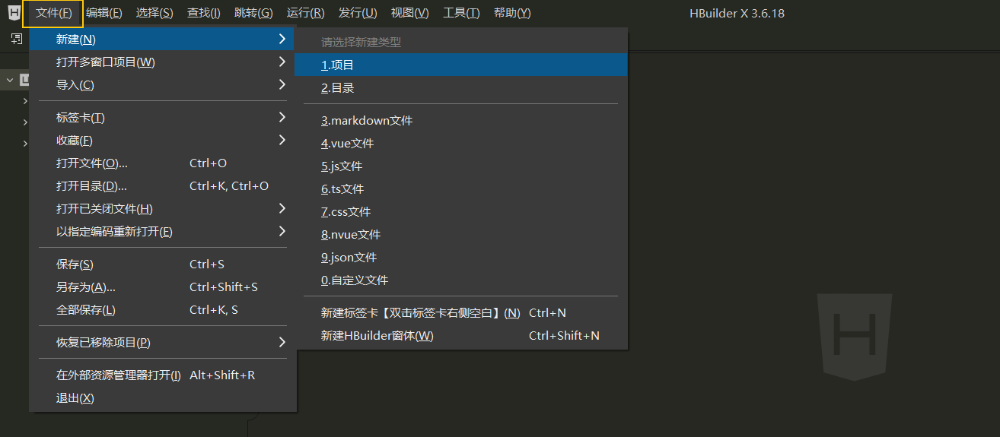
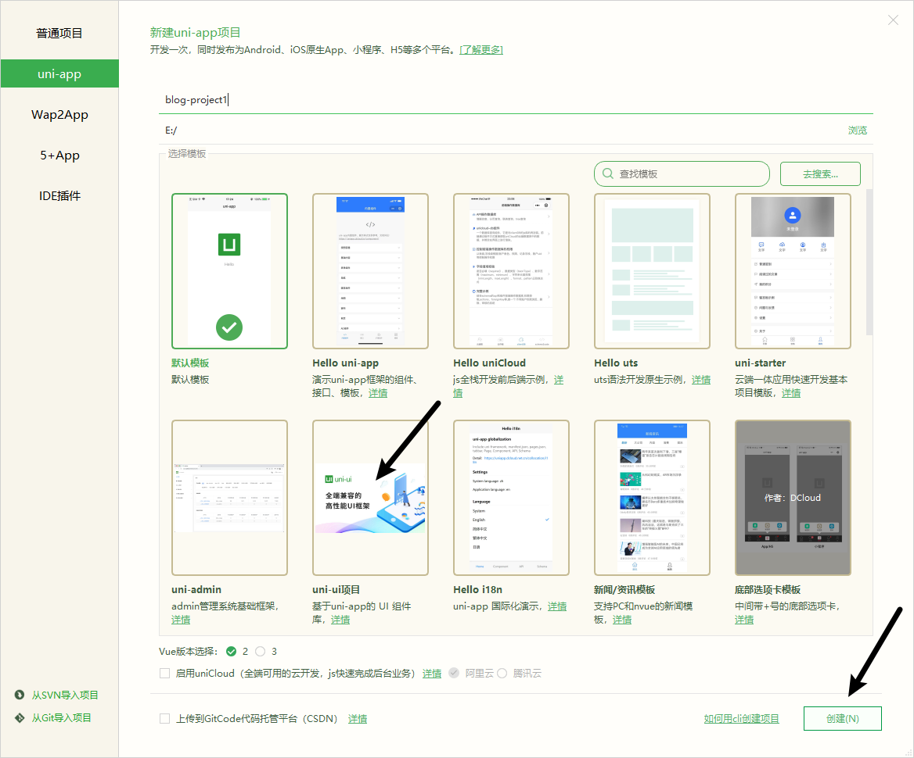
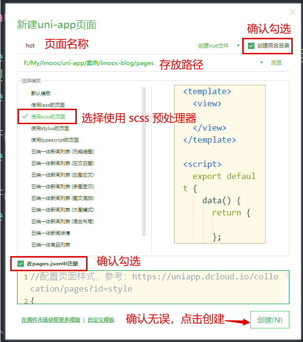
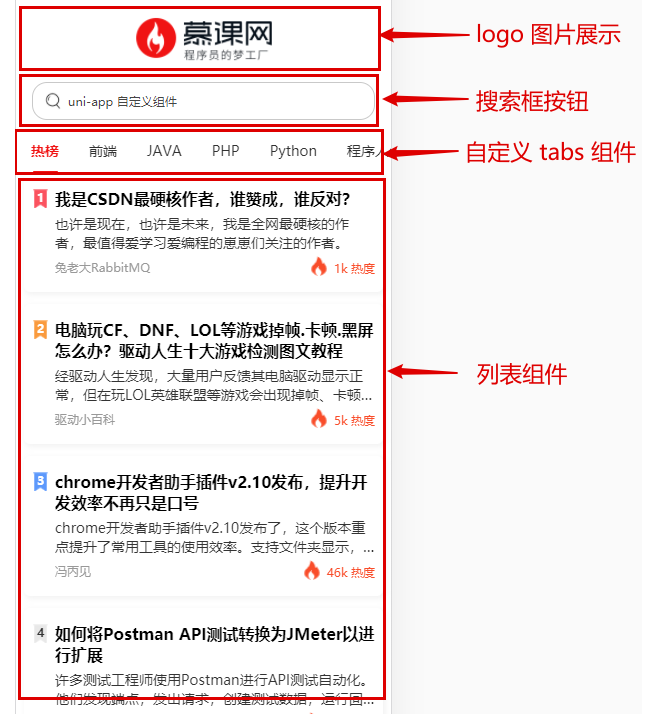
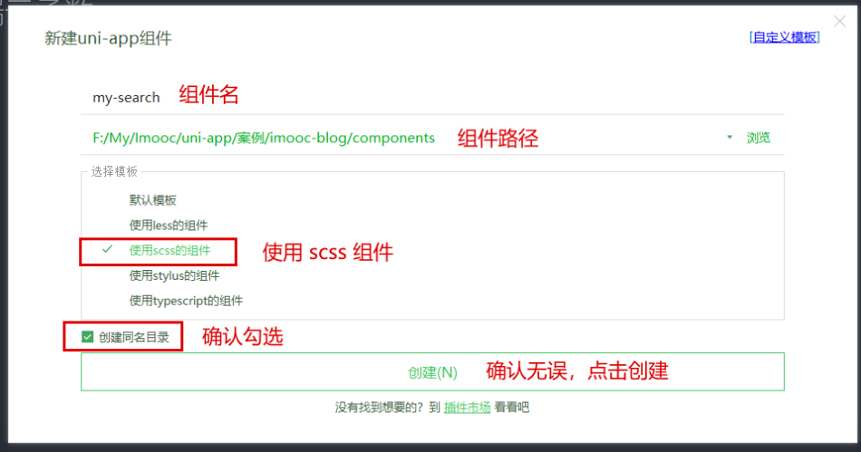
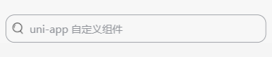
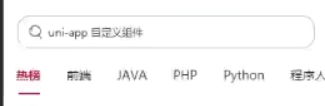
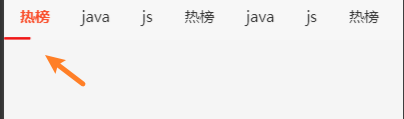
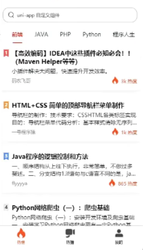

# 创建项目
## 创建 uni-app 项目



```
├─pages			    // 页面存放文件夹，等同于 微信小程序中的 pages
│  └─index			// 默认生成的页面
├─static			// 静态资源存放文件夹
└─uni_modules		// uni-app组件目录
│  └─uni-xxx		// uni-app 所提供的业务组件，等同于 微信小程序中的组件
├─App.vue			// 应用配置文件，用来配置全局样式、生命周期函数等，等同于 微信小程序中的app.js
└─main.js			// 项目入口文件
├─mainfest.json		 // 配置应用名称、appid、logo、版本等打包信息，
└─pages.json		// 配置页面路径、窗口样式、tabBar 等页面类信息，等同于 微信小程序中的app.json
└─uni.scss			// uni-app内置的常用样式变量
```
## 创建与配置 tabbar 
### 创建页面
1. 删除 `pages` 下的 `index` 文件夹
2. 在 `pages` 文件夹处，右键 -> 选择新建页面
3. 确认新建页面的信息

4. 点击创建按钮完成新建
5. 循环以上顺序，依次完成 `hot`、`hot-video`、`my` 三个页面的创建
### 配置 pages.json
1. 删除 `index` 路径
2. 新建 `tabbar` 节点
3. 最终代码如下：
```json
{
	 "pages": [
	    {
	      "path": "pages/hot/hot",
	      "style": {
	        "navigationBarTitleText": "热搜",
	        "enablePullDownRefresh": false
	      }
	    },
	    {
	      "path": "pages/hot-video/hot-video",
	      "style": {
	        "navigationBarTitleText": "热播",
	        "enablePullDownRefresh": false
	      }
	    },
	    {
	      "path": "pages/my/my",
	      "style": {
	        "navigationBarTitleText": "个人中心",
	        "enablePullDownRefresh": false
	      }
	    }
	  ],
    "tabBar": {
    "selectedColor": "#f94d2a",
    "list": [
      {
        "pagePath": "pages/hot/hot",
        "text": "热榜",
        "iconPath": "static/tab-icons/hot.png",
        "selectedIconPath": "static/tab-icons/hot-active.png"
      },
      {
        "pagePath": "pages/hot-video/hot-video",
        "text": "热播",
        "iconPath": "static/tab-icons/hot-video.png",
        "selectedIconPath": "static/tab-icons/hot-video-active.png"
      },
      {
        "pagePath": "pages/my/my",
        "text": "我的",
        "iconPath": "static/tab-icons/my.png",
        "selectedIconPath": "static/tab-icons/my-active.png"
      }
    ]
  },
	"globalStyle": {
		"navigationBarTextStyle": "black",
		"navigationBarTitleText": "uni-app",
		"navigationBarBackgroundColor": "#F8F8F8",
		"backgroundColor": "#F8F8F8",
		"app-plus": {
			"background": "#efeff4"
		}
	}
}
```
## 警告与错误处理
### 解决 【sitemap索引情况提示】的警告问题
微信小程序默认开启了索引功能，但是因为我们没有配置索引策略，导致出现了这么一个警告的问题。具体情况可以参考：https://developers.weixin.qq.com/miniprogram/dev/framework/sitemap.html

而如果想要解决这个警告也非常简单，因为一般情况项目不需要被微信索引，所以只需要 **关闭** 默认索引功能即可

1. 双击打开 `manifest.json`
2. 点击 源码试图
3. 下翻找到 `mp-weixin` 配置节点
4. 在 `settings` 下新增 `"checkSiteMap" : false`
### 解决 ` Cannot read property 'forceUpdate' of undefined` 的错误
这个错误的原因非常简单，是因为没有为项目配置 `appID` 的原因，所以只需要完成 `APPID` 配置即可。

1. 双击打开 `manifest.json`
2. 找到【微信小程序配置】
3. 添加 `APPID` 即可


## 热搜页面分析

### logo 的展示
```vue
<template>
  <view class="hot-container">
    <image class="logo" src="@/static/images/logo.png" mode="aspectFit"></image>
  </view>
</template>

<style lang="scss" scoped>
.hot-container {
  background-color: $uni-bg-color;
  .logo {
    // 给了具体的宽高
    width: 100%;
    height: 80px;
  }
}
</style>
```

## 创建搜索框组件
1. 创建 `components` 文件夹
2. 点击右键新建组件

3. 明确当前 `my-search` 组件的能力
   1. 具备输入框的样式
   2. 不可进行输入
   3. `placeholder` 内容可以在父组件定义
   4. `config` 传入一些额外的配置项 


```vue
<template>
  <view class="my-search-container">
    <image class="img" src="@/static/images/search.png" mode="aspectFit"></image>
    <text class="text" :style="{color: config.textColor}">{{placeholderText}}</text>
  </view>
</template>

<script>
  export default {
    name:"my-search",
    data() {
      return {
      }
    },
    props:{
      placeholderText:{
        type:String,
        default:'搜索'
      },
      config: { // 配置项, 如 文字颜色 textColor ...
        type:Object
      }
    },
  }
</script>
<style lang="scss" scoped>
.my-search-container {
  display: flex;
  align-items: center;
  border: 1px solid $uni-secondary-color;
  border-radius: 12px;
  margin:0 10px;
  height:36px;
  .img {
    height: 20px;
    width:20px;
    margin:0 6px;
  }
  .text {
    color:$uni-secondary-color;
    font-size:14px;
  }
}
</style>
```

## tabs 组件
1. 创建组件
2. 分析需求
   1. 可以在父组件定制 `my-tabs` 的样式
   2. 父组件中传入要展示的数据
   3. 可在父组件中传入激活项

```vue
<script>
  export default {
    name:"my-tabs",
    ...
    props:{
      config:{ // 配置项
        type:Object,
        default:() => {}
      },
      tabsData:{ // 传入的 tabs 数据
        type:Array,
        default:() => []
      },
      defaultIndex:{ // 当前激活项
        type:Number,
        default: 0
      }
    }
  }
</script>
```
### 封装网络请求
1. 创建 `utils` 文件夹
2. 创建 `request.js` ，封装请求对象
```js
const BASE_URL = 'https://api.imooc-blog.lgdsunday.club/api';

function request({ url, data, method }) {
  return new Promise((resolve, reject) => {
    uni.request({
      url: BASE_URL + url, // 拼接 url
      data,
      method,
      success: ({ data }) => {
        if (data.success) {
          resolve(data);
        } else {
          uni.showToast({
            title: data.message,
            icon: 'none',
            mask: true,
            duration: 3000
          });
          reject(data.message);
        }
      },
      fail: (error) => {
        reject(error);
      }
    });
  });
}

export default request;
```

1. 创建 `api` 文件夹
2. 创建 `hot` 文件，封装 `hot` 相关的请求方法
```js
// hot 相关的请求接口
import request from '@/utils/request.js'
// 获取 tabs 数据
export function getHotTabs() { 
  return request({
    method:'GET',
    url:'/hot/tabs'
  })
}
```
### 进行基本的数据展示
`uni-app` 支持 `async` 和 `await`

1. 在 `hot` 中调用接口, 获取数据
```vue
<template>
  <view class="hot-container">
    ...
    <!--tabs 标签页-->
    <my-tabs :tabsData="tabsData" :defaultIndex="currentIndex"></my-tabs>
  </view>
</template>

<script>
  import mySearch from '@/components/my-search/my-search.vue'
  import myTabs from '@/components/my-tabs/my-tabs.vue'
  import { getHotTabs } from '@/api/hot.js'
  export default {
    components:{
      mySearch
    },
    data() {
      return {
        tabsData:[], // 传递给 my-tabs 组件的数据
        currentIndex: 0 // 传递给 my-tabs 组件的激活项
      };
    },
    created(){ // 在实例创建完成后被立即调用方法
      this.getTabsData()
    },
    method:{
      async getTabsData() {
        // uniapp 支持 async await
        const { data : res}  = await getHotTabs() 
        this.tabsData = res.list
      }
    }
  }
</script>
```

2. 在 `tabs` 中展示渲染数据

`my-tabs.vue`

```vue
<template>
  <view class="tab-container">
    <view class="tab-box">
      <scroll-view id="_scroll" scroll-x class="scroll-view" scroll-with-animation>
        <view class="scroll-content">
          <view class="tab-item-box">
            <block v-for="(item, index) in tabData" :key="index">
              <view class="tab-item">{{ item.label || item }}</view>
            </block>
          </view>
        </view>
      </scroll-view>
    </view>
  </view>
</template>
```

```vue
<style lang="scss" scoped>
.tab-container {
  font-size: $uni-font-size-base;
  height: 45px;
  line-height: 45px;
  background-color: $uni-bg-color;
  .tab-box {
    width: 100%;
    height: 45px;
    display: flex;
    position: relative;
    .scroll-view {
      white-space: nowrap;
      width: 100%;
      height: 100%;
      box-sizing: border-box;
      .scroll-content {
        width: 100%;
        height: 100%;
        position: relative;

        .tab-item-box {
          height: 100%;
          .tab-item {
            height: 100%;
            display: inline-block;
            text-align: center;
            padding: 0 15px;
            position: relative;
            text-align: center;
            color: $uni-text-color;
          }
        }
      }
    }
  }
}
</style>
```
### 设置激活项 (组件内维护一个 props 的自己的数据 - 套路! 使用 watch)
子组件不可以随便修改父组件传递过来的的数据 , 如果想改, 那么通知父组件让他自己去修改

```vue
<script>
export default {  
    data: () => {
        return {
          // 当前激活项的 index
          activeIndex: -1
        };
      },
        // 侦听器
      watch: {
        // 监听激活项目的变化
        defaultIndex: {
          handler(val) {
            this.activeIndex = val;
          },
          // 该回调将会在侦听开始之后被立即调用
          immediate: true
        }
      },
	}
</script>
```
整点激活项的样式
```
&-active {
    color: $uni-text-color-hot;
    font-weight: bold;
}

$uni-text-color-hot: #f94d2a; // 热点颜色
```
然后**父组件监听** 内部触发的事件
```html
  <!--tabs 标签页-->
  <my-tabs :tabsData="tabsData" :defaultIndex="currentIndex" @tabClick="currentIndex = $event"></my-tabs>
```



### 实现滑块的滚动 01 - 定义滑块
```html
 <!--滑块-->
  <view class="underline" :style="{transform:`translateX(${slider.left}px)` }">
```

```js
 data() {
      return {
        // 滑块
        slider:{
          // 距离左侧的位置
          left:0
        }
      }
    },
```

```css
.underLine {
    position:absolute; 
    bottom: 0;
    height: 2px;
    width: 25px;
    background-color: #f01414;
    border-radius: 3px;
    transition: 0.5s;
}
```
当前效果图:


### 实现滑块的滚动 02
1. 明确一下滑块滚动的时机 

点击某一个 `tab` 项的时候

2. 滑块是如何做滚动的(根本原因) ?  

会根据 `this.slider.left` 发生变化

```js
    data() {
      return {
        slider:{    // 滑块
            left:0   // 滑块离页面最左侧的距离 
        },
        underlineDefaultConfig: { // 滑块的默认配置
              // 下划线宽度 px
              underLineWidth: 24,
              // 下划线高度 px
              underLineHeight: 2,
              // 下划线颜色
              underLineColor: '#f94d2a'
          }
      }
    },

 methods:{
      tabToIndex() {  // 根据 defaultIndex 下标 , 计算滑块的移动位置
        // 滑块的宽度
        const underlineWidth = this.underlineDefaultConfig.underLineWidth
        // 对 slider.left 赋值
        this.slider = {
          left: ???  // TODO : 这里的 left 怎么计算 ? 
        }
      },
      tabClick(index) { // 点击了 tab 项
        // 发送通知
        this.$emit('tabClick' , index) 
        
        tabToIndex() 
      },
    }
```

### 实现滑块的滚动  03

1. 确定滚动的时机
2. 计算滚动的距离
   1. 维护一个单独的数据对象 `tabList`
   2. 在 `tabList`  的每一个 tab 项中维护一个 `_slider` 对象属性
   3. 该属性保存了 【当前 `item` 下 的滑块位置, 如 left】
      1. 计算公式：`slider.left` = `点击的 tab 项的 left 值 + ( tab 项的宽度 + 滑块的宽度 ) / 2  `

```js
data: () => {
    return {
      // 内部维护的数据对象，为每个 item 单独额外维护一个 slider 的滑块对象
      tabsList: []
    };
  },
      
 // 侦听器
  watch: {
    // 侦听数据的变化
    tabsData: {
      handler(val) {
        this.tabsList = val;
        setTimeout(() => { 
          this.updateTabWidth();
        }, 0);
      },
      // 该回调将会在侦听开始之后被立即调用
      immediate: true
    },
  },
      
      /**
     * 更新 tab item 的宽度
     */
       updateTabWidth(){ // 给新的 tabList 的每一个 tab 项维护一个 _slider 对象( 让_silder对象中保存当前 tab 的 left)
        // 为 tabList 的每个 item 单独额外维护一个 _slider 的滑块对象
        if(this.tabsList.length === 0) return  
        const query = uni.createSelectorQuery().in(this);
          // 循环数据源
        this.tabsList.forEach((item,index) => {
          // 获取 dom 的固定写法
          query
            .select('#_tab_' + index)
            .boundingClientRect((res) => {
            // 为数据对象中每一个 item 都维护一个 _slider（滑动条） 对象
            item._slider = {
                // 当前的 tab 距离左侧的距离
                left: res.left + (res.width - this.underlineDefaultConfig.underLineWidth) / 2
            };
            // 运算完成之后，执行一次 【滑块】位置运算
            if (this.tabsList.length - 1 === index) {
                this.tabToIndex();
            }
        })
            .exec();
        })
      },
     tabToIndex() {  // 根据 defaultIndex 下标 , 计算滑块的移动位置
        // 滑块的宽度
        const underlineWidth = this.underlineDefaultConfig.underLineWidth
        this.slider = {
          left: this.tabsList[this.activeIndex]._slider.left  // TODO : 这里的 left 怎么计算 ? 
        }
      },
      tabClick(index) { // 点击了 tab 项
        this.activeIndex = index
        // 发送通知
        this.$emit('tabClick' , this.activeIndex) 
        
        this.tabToIndex()
      }
```

###  scroll View 的位移
```html
 <scroll-view ...  :scroll-left="scrollLeft">
```
当 【选中项】发生变化时，希望 `scrollView` 也进行对应的位移。
```js
computed:{
      scrollLeft(){
        return this.activeIndex * this.underlineDefaultConfig.underLineWidth
      }
    },
```

### 增加可配置项

```html{5-8}
    <view class="tab-item" 
      :id="'_tab_'+ index"
      @click="tabClick(index)"
      :class="{ 'tab-item-active': defaultIndex === index }"
        :style="{
          color:
          activeIndex === index ? underlineDefaultConfig.activeTextColor : underlineDefaultConfig.textColor
          }"
    >{{ item.label || item }}</view>
```
又是 `watch + immediate` 那个套路
```js
 props: {
    // 配置对象
    config: {
      type: Object,
      default: () => {
        return {};
      }
    }
  },
  data: () => {
    return {
      // 默认配置
      underlineDefaultConfig: {
        // 默认的字体颜色
        textColor: '#333333',
        // 高亮字体颜色
        activeTextColor: '#f94d2a',
        // 下划线宽度 px
        underLineWidth: 24,
        // 下划线高度 px
        underLineHeight: 2,
        // 下划线颜色
        underLineColor: '#f94d2a'
      }
    };
  },
  // 侦听器
  watch: {
    // 监听 config
    config: {
      handler(val) {
        this.underlineDefaultConfig = { ...this.underlineDefaultConfig, ...val };
      },
      // 该回调将会在侦听开始之后被立即调用
      immediate: true
    }
  },
```

## List 组件
1. 使用 `mock` 数据，构建 List 的基本结构
2. 美化 `item` 样式
3. 根据 `tab` 的切换，获取真实数据
4. 渲染真实数据
5. 通过 `swiper` 改造 List, 让 list 具备左右切换的能力
6. 完成 `swiper` 和 `tabs` 的**联动**效果


### 构建基本结构


创建 `hot-list-item` 组件

**hot.vue**

```html
<template>
 	...
    <!-- list -->
    <view>
      <hot-list-item v-for="(item, index) in 50" :key="index"></hot-list-item>
    </view>
  </view>
</template>
```

**hot-list-item.vue**

```vue
<template>
  <view class="item-container">
    <view class="item-box">
      <view class="item-box-left">
        <hot-ranking />
      </view>
      <view class="item-box-right">
        <!-- 标题 -->
        <view class="item-title line-clamp-2">标题</view>
        <!-- 简介 -->
        <view class="item-desc line-clamp-2">简介</view>
        <view class="item-bottom-box">
          <!-- 作者 -->
          <text class="item-author">作者</text>
          <!-- 热度 -->
          <view class="hot-box">
            <image class="hot-icon" src="@/static/images/hot-icon.png" />
            <text class="hot-text">1000 热度</text>
          </view>
        </view>
      </view>
    </view>
  </view>
</template>

<script>
export default {
  name: 'hot-list-item',
  data() {
    return {};
  }
};
</script>

<style lang="scss" scoped></style>

```

**hot-ranking.vue**

```vue
<template>
  <view class="ranking">
    <image class="ranking-bg" :src="getRankingBg" />
    <text class="ranking-text">1</text>
  </view>
</template>

<script>
export default {
  name: 'hot-ranking'
};
</script>

<style lang="scss" scoped></style>

```

## 美化 item 样式
**hot-list-item.vue**

```css
<style lang="scss" scoped>
.item-container {
  padding-bottom: $uni-spacing-col-lg;
  .item-box {
    display: flex;
    margin: 0 $uni-spacing-col-base;
    padding: $uni-spacing-row-lg $uni-spacing-col-base;
    background-color: $uni-bg-color;
    border-radius: $uni-border-radius-lg;
    box-shadow: 2px 2px 5px 1px rgba(143, 143, 143, 0.1);
    .item-box-left {
      margin-right: $uni-spacing-row-sm;
    }
    .item-box-right {
      width: 100%;
      .item-title {
        font-size: $uni-font-size-lg;
        font-weight: bold;
        color: $uni-text-color-title;
      }
      .item-desc {
        padding-top: $uni-spacing-row-sm;
        font-size: $uni-font-size-base;
        color: $uni-text-color;
      }
      .item-bottom-box {
        margin-top: $uni-spacing-col-sm;
        display: flex;
        justify-content: space-between;
        align-items: center;
        .item-author {
          font-size: $uni-font-size-sm;
          color: $uni-text-color-grey;
        }
        .hot-box {
          .hot-icon {
            width: $uni-img-size-sm;
            height: $uni-img-size-sm;
            vertical-align: top;
          }
          .hot-text {
            margin-left: $uni-spacing-row-sm;
            font-size: $uni-font-size-sm;
            color: $uni-text-color-hot;
          }
        }
      }
    }
  }
}
</style>

```

**hot-ranking.vue**

```vue
<style lang="scss" scoped>
.ranking {
  position: relative;
  text-align: center;
  width: 18px;
  height: 20px;
  .ranking-bg {
    width: 100%;
    height: 100%;
  }
  .ranking-text {
    position: absolute;
    left: 50%;
    top: 50%;
    transform: translate(-55%, -55%);
    font-size: $uni-font-size-sm;
    font-weight: bold;
    color: $uni-text-color;
  }
  .text-white {
    color: white;
  }
}
</style>
```

### 根据 tab 的切换，渲染对应的 list 数据

**hot.js** 封装接口

```js
/**
 * 热搜文章列表
 */
export function getHotListFromTabType(type) {
  return request({
    url: '/hot/list',
    data: {
      type
    }
  });
}
```

**hot.vue**
```vue
<template>
    <!-- tabs -->
    <my-tabs
      ...
      @tabClick="tabClick"    监听了子组件触发的 'tabClick' 事件
    ></my-tabs>
	<!-- list -->
    <view>
      <!-- 加载动画 -->="loading" v-if="isLoading"></uni-load-more>
      <!-- 列表 -->
      <uni-load-more status
      <block v-else>
        <hot-list-item v-for="(item, index) in 50" :key="index"></hot-list-item>
      </block>
    </view>
  </view>
</template>

<script>
import { getHotTabs, getHotListFromTabType } from 'api/hot';
export default {
  data() {
    return {
      ...
      // 当前激活项
      currentIndex: 0
      // list 列表数据加载过程
      isLoading: true,
      // 一个对象 , 以 index 为 key，对应的 list 为 val , 切换时往里面塞数据
      listData: {}
    };
  },
  // 定义方法
  methods: {
    /**
     * 获取热搜标题数据
     */
    async getHotTabs() {
      ...
      // 获取列表数据 ,    // 第一次获取 tabs 的数据之后, 要再获取 list 的数据, 所以这里在调一遍
      this.getHotListFromTab();
    },
    /**
     * 获取 list 列表数据
     */
    async getHotListFromTab() {
      // 展示 loading
      this.isLoading = true;
      // 判断缓存是否有数据，不存在则重新获取数据    
      if (!this.listData[this.currentIndex]) { 
        // 获取列表数据
        const id = this.tabData[this.currentIndex].id;
        const { data: res } = await getHotListFromTabType(id);
        // 放入数据缓存
        this.listData[this.currentIndex] = res.list;
      }

      // 隐藏 loading
      this.isLoading = false;
    },
    /**
     * tab item 的点击事件
     */
    tabClick(index) {
      this.currentIndex = index;
      // 每次切换 tab 的时候, 获取列表数据
      this.getHotListFromTab();
    }
  }
};
</script>
```

### 渲染真实数据
**hot.vue**

```html
<hot-list-item
    v-for="(item, index) in listData[currentIndex]"
    :key="index"
    :data="item"
    :ranking="index + 1"
></hot-list-item>
```

**hot-list-item.vue**

```vue
<template>
  <view class="item-container" @click="$emit('click')">
    <view class="item-box">
      <view class="item-box-left">
        <hot-ranking :ranking="ranking" />
      </view>
      <view class="item-box-right">
        <!-- 标题 -->
        <view class="item-title line-clamp-2">{{ data.title }}</view>
        <!-- 简介 -->
        <view class="item-desc line-clamp-2">{{ data.desc }}</view>
        <view class="item-bottom-box">
          <!-- 作者 -->
          <text class="item-author">{{ data.nickname }}</text>
          <!-- 热度 -->
          <view class="hot-box">
            <image class="hot-icon" src="@/static/images/hot-icon.png" />
            <text class="hot-text">{{ data.views }} 热度</text>
          </view>
        </view>
      </view>
    </view>
  </view>
</template>

<script>
export default {
  name: 'hot-list-item',
  props: {
    data: {
      type: Object,
      required: true
    },
    ranking: {
      type: Number,
      required: true
    }
  },
  data() {
    return {};
  }
};
</script>
```

**hot-ranking.vue**

```vue
<template>
  <view class="ranking">
    <image class="ranking-bg" :src="getRankingBg" />
    <text class="ranking-text" :class="{ 'text-white': ranking <= 3 }">{{ ranking }}</text>
  </view>
</template>

<script>
export default {
  name: 'hot-ranking',
  props: {
    ranking: {
      type: Number,
      required: true
    }
  },
  /**
   * 当依赖值发生变化时，会重新计算
   */
  computed: {
    getRankingBg() {
      if (this.ranking <= 3) {
        return require(`@/static/images/ranking-${this.ranking}.png`);
      }
      return require('@/static/images/ranking-other.png');
    }
  }
};
</script>
```

**style/global.scss**

```scss
/**
 * 这里是共用样式的定义位置
 */

.line-clamp-2 {
  overflow: hidden;
  text-overflow: ellipsis;
  display: -webkit-box;
  -webkit-box-orient: vertical;
  -webkit-line-clamp: 2;
}

```

**main.js**

```js
// 通用样式
import './styles/global.scss';
```
### 通过 swiper 改造List
想要让 `list` 具备【**横向翻页**】的效果，那么可以使用 `swiper` 对其进行改造

```html
    <!-- 基于 swiper 的 list 列表 -->
    <!--current 表示当前想要展示哪一个 swiperItem-->
    <swiper class="swiper" :current="currentIndex">
      <swiper-item class="swiper-item" v-for="(tabItem, tabIndex) in tabData" :key="tabIndex">
        <view>
          <!-- 加载动画 -->
          <uni-load-more status="loading" v-if="isLoading"></uni-load-more>
          <!-- 列表 -->
          <block v-else>
            <!-- 列表循环数据更改为 listData[tabIndex] -->
            <hot-list-item
              v-for="(item, index) in listData[tabIndex]"
              :key="index"
              :data="item"
              :ranking="index + 1"
            ></hot-list-item>
          </block>
        </view>
      </swiper-item>
    </swiper>
```

**当前的问题：**

1. 列表高度展示错误
2. 切换 `tab` 时的 `list` 的卡顿问题
### 解决列表高度展示错误的问题
**原因：**

没有给 `swiper` 指定高度

**解决方案：**

指定高度即可
```vue
<template>
  <view class="hot-container">
    <!-- 基于 swiper 的 list 列表 -->
    <swiper class="swiper" :current="currentIndex" :style="{ height: currentSwiperHeight + 'px' }">
     ...
            <hot-list-item
              :class="'hot-list-item-' + tabIndex"
              v-for="(item, index) in listData[tabIndex]"
              :key="index"
              :data="item"
              :ranking="index + 1"
            ></hot-list-item>
         ...
    </swiper>
  </view>
</template>

<script>
export default {
  data() {
    return {
      // 当前 swiper 的高度
      currentSwiperHeight: 0,
      // 以 index 为 key，对应的 swiper 的高度 为 val
      swiperHeightData: {}
    };
  },
  // 定义方法
  methods: {
    /**
     * list 列表数据
     */
    async getHotListFromTab() {
      ...
      // 因为 this.$nextTick 存在一定的兼容性问题，所以更加推荐使用 setTimeout
      setTimeout(async () => {
        // 获取当前 swiper 的高度
        this.currentSwiperHeight = await this.getCurrentSwiperHeight();
        // 放入缓存
        this.swiperHeightData[this.currentIndex] = this.currentSwiperHeight;
      }, 0);
    },
    /**
     * 计算当前 swiper 的高度
     */
    getCurrentSwiperHeight() {
      return new Promise((resolve, reject) => {
        let sum = 0;
        const query = uni.createSelectorQuery().in(this);
        query
          .selectAll(`.hot-list-item-${this.currentIndex}`)
          .boundingClientRect((res) => {
            res.forEach((item) => {
              sum += item.height;
            });
            resolve(sum);
          })
          .exec();
      });
    }
  }
};
</script>
```
### 解决切换 `tab` 时的 `list` 的卡顿问题

**原因：**

动画未执行完成，`DOM` 未渲染完成，即获取数据，执行了新的渲染逻辑。
**解决方案：**

等待 动画执行完成， `DOM` 渲染完成。之后再获取数据，渲染列表。
```vue
<template>
 <swiper
      class="swiper"
      :current="currentIndex"
      :style="{ height: currentSwiperHeight + 'px' }"
      @animationfinish="onSwiperEnd"
    >
</template>

<script>
import { getHotTabs, getHotListFromTabType } from 'api/hot';
export default {
  // 定义方法
  methods: 
    /**
     * list 列表数据
     */
    async getHotListFromTab() {
      // 在 onSwiperEnd 中进行判断。【判断缓存是否有数据，不存在则重新获取数据】
    },
    /**
     * tab item 的点击事件
     */
    tabClick(index) {
      this.currentIndex = index;
      // 获取列表数据
      // this.getHotListFromTab();
    },
    /**
     * 解决卡顿问题；等待 swiper 动画完成之后，获取数据
     */
    onSwiperEnd() {
      // 判断缓存是否有数据，不存在则重新获取数据
      if (!this.listData[this.currentIndex]) {
        this.getHotListFromTab();
        return;
      }
      // 未 return ，则证明存在缓存数据，即同时存在 height 的缓存数据
      this.currentSwiperHeight = this.swiperHeightData[this.currentIndex];
    }
};
</script>
```
### swiper` 和 `tabs` 联动

**目前状态：**

`tabs` 切换时，`swiper` 可以联动。

`swiper` 切换时，`tabs` 无法联动。

**解决：**

让`swiper` 切换时，`tabs` 进行联动。
```vue
<template>
	<swiper
      class="swiper"
      :current="currentIndex"
      :style="{ height: currentSwiperHeight + 'px' }"
      @animationfinish="onSwiperEnd"
      @change="onSwiperChange"
    >
</template>
<script>
    export default {
    	methods: {
            // 监听 swiper 的切换事件
            onSwiperChange(e) {
              this.currentIndex = e.detail.current;
            },
        }
    }
</script>
```
###  tabs 中滑块跟随滚动

```js
watch: {
        // 监听激活项目的变化
    defaultIndex: {
      handler(val) {
        this.activeIndex = val;
        // 定义滑块的位置
        this.tabToIndex();
      },
      // 该回调将会在侦听开始之后被立即调用
      immediate: true
    },
    
}

tabToIndex() {
      if (this.tabList.length === 0) return;
}
```
### 完成 `tabs` 的吸顶效果
```vue
<template>
	<!-- tabs -->
    <view class="tab-sticky">
      <my-tabs
        :tabData="tabData"
        :defaultIndex="currentIndex"
        :config="{ textColor: '#333333' }"
        @tabClick="tabClick"
      ></my-tabs>
    </view>
</template>

<style lang="scss" scoped>
  .tab-sticky {
    position: -webkit-sticky;
    position: sticky;
    z-index: 99;
    top: 0;
  }
</style>
```

## 控制列表滚动位置
```js
// 当前的滚动距离
currentPageScrollTop: 0 

/**
   * 监听页面的滚动
   */
  onPageScroll(res) {
    this.currentPageScrollTop = res.scrollTop;
  },   

	// 监听 swiper 的切换事件
    onSwiperChange(e) {
      if (this.currentPageScrollTop > 130) {
        // 控制列表滚动位置
        uni.pageScrollTo({
          scrollTop: 130
        });
      }	
      this.currentIndex = e.detail.current;
    },
```

### 处理热度的显示
通过 `filters 过滤器` 进行处理：创建 `filters` 文件夹，创建 `index.js` 文件： 

**filters/index.js**

```js
/**
 * 将字符转化为以千为单位的字符
 * @param {*} val 待转换字符
 * @returns
 */
export function hotNumber(val) {
  const num = parseInt(val);
  if (num < 1000) return val;

  // 将 val 转为字符串
  val = val + '';
  // 获取以 千 为单位的值
  return val.substring(0, val.length - 3) + 'k';
}

```

**main.js**

```js
import * as filters from './filters';

// 注册过滤器
Object.keys(filters).forEach((key) => {
  Vue.filter(key, filters[key]);
});

```

**hot-list-item.vue**

```html
 <text class="hot-text">{{ data.views | hotNumber }} 热度</text>

```

## 总结:
1. 封装 `request` `API` 请求模块
2. [dom 操作](https://uniapp.dcloud.net.cn/api/ui/nodes-info.html#selectorqueryexec)
```js
const query = uni.createSelectorQuery().in(this);
query
  .select('#id' + ???)
  .boundingClientRect((res) => {
    ...
})
  .exec();
```
3. [swiper 组件](https://uniapp.dcloud.net.cn/component/swiper.html#swiper)